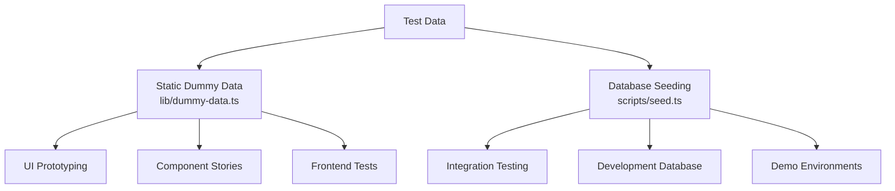
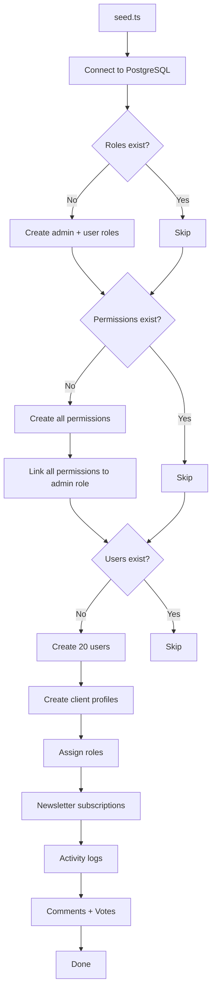
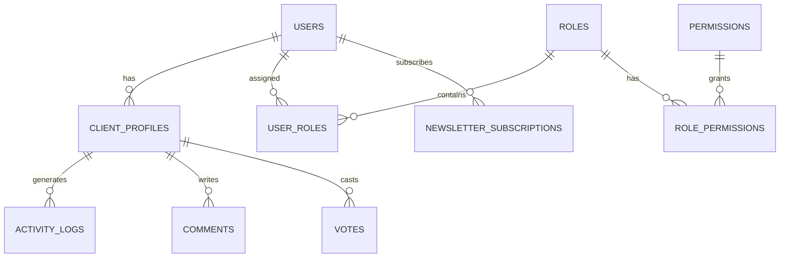

# Sistema de dados fictício

O modelo fornece duas abordagens para testar dados: dados fictícios estáticos para desenvolvimento e prototipagem de UI e um sistema de propagação de banco de dados para gerar registros realistas no PostgreSQL. Juntos, eles cobrem todo o ciclo de vida de desenvolvimento, desde modelos até testes de integração.

## Visão geral



## Dados fictícios estáticos

O módulo `lib/dummy-data.ts` exporta dados de amostra digitados para uso em componentes durante o desenvolvimento.

### Interface de envio

```typescript
export interface Submission {
  id: string;
  title: string;
  description: string;
  status: "approved" | "pending" | "rejected";
  submittedAt: string | null;
  approvedAt?: string;
  rejectedAt?: string;
  rejectionReason?: string;
  category: string;
  tags: string[];
  views: number;
  likes: number;
}
```

### manequimSubmissões

Seis amostras de envios cobrindo todos os estados de status:

|ID|Título|Estado|Categoria|Visualizações|Curtidas|
|---|---|---|---|---|---|
| 1 |Plataforma moderna de comércio eletrônico|aprovado|Desenvolvimento Web| 1250 | 89 |
| 2 |Aplicativo de gerenciamento de tarefas|pendente|Desenvolvimento Móvel| 567 | 23 |
| 3 |Painel meteorológico|rejeitado|Desenvolvimento Web| 890 | 45 |
| 4 |Assistente de bate-papo com IA|aprovado|IA/ML| 2100 | 156 |
| 5 |Aplicativo de monitoramento de condicionamento físico|pendente|Desenvolvimento Móvel| 432 | 18 |
| 6 |Plataforma de blogs|pendente|Desenvolvimento Web| 0 | 0 |

Uso em componentes:

```typescript
import { dummySubmissions } from '@/lib/dummy-data';

export function SubmissionList() {
  return (
    <div>
      {dummySubmissions.map((submission) => (
        <SubmissionCard key={submission.id} submission={submission} />
      ))}
    </div>
  );
}
```

### fictícioPortfólio

Três exemplos de itens de portfólio para apresentar cartões de projeto:

|ID|Título|Destaque|Etiquetas|
|---|---|---|---|
| 1 |Plataforma de comércio eletrônico|Sim|Next.js, Stripe, Comércio eletrônico|
| 2 |Aplicativo de gerenciamento de tarefas|Sim|React, Firebase, tempo real|
| 3 |Painel meteorológico|Não|Vue.js, API meteorológica, painel|

Cada item do portfólio inclui:

```typescript
{
  id: string;
  title: string;
  description: string;
  imageUrl: string;      // Unsplash placeholder image
  externalUrl: string;   // Demo link
  tags: string[];
  isFeatured: boolean;
}
```

## Sementeira de banco de dados

O script `scripts/seed.ts` gera dados realistas diretamente no PostgreSQL usando Drizzle ORM.

### Semeando Arquitetura



### Relacionamentos de dados



### Perfis de usuário gerados

O semeador cria perfis com variação determinística:

```typescript
// Plan distribution
plan: i % 5 === 0 ? 'premium'    // 20% premium
    : i % 3 === 0 ? 'standard'   // ~13% standard
    : 'free';                     // ~67% free

// Job titles alternate
jobTitle: i % 2 === 0 ? 'Developer' : 'Designer';

// Companies alternate
company: i % 2 === 0 ? 'Acme Inc.' : 'Globex';

// Bios for every 3rd user
bio: i % 3 === 0 ? 'Power user' : null;
```

### Padrões de registro de atividades

Os logs de atividades percorrem quatro tipos de ação:

|Padrão de índice|Ação|Descrição|
|---|---|---|
|`i % 4 === 0`|`SIGN_UP`|Criação de conta|
|`i % 4 === 1`|`SIGN_IN`|Evento de login|
|`i % 4 === 2`|`COMMENT`|Comentário postado|
|`i % 4 === 3`|`VOTE`|Elenco de votação|

Os carimbos de data e hora são randomizados nos últimos 7 dias.

### Distribuição de votos

Os votos usam uma divisão 75/25 favorecendo votos positivos:

```typescript
voteType: i % 4 === 0 ? VoteType.DOWNVOTE : VoteType.UPVOTE
```

### Configuração de conexão

O semeador usa configurações de conexão conservadoras adequadas para scripts:

```typescript
const conn = postgres(databaseUrl, {
  max: 1,              // Single connection (no pool needed)
  idle_timeout: 20,    // Close idle connections after 20s
  connect_timeout: 10, // 10-second connection timeout
  prepare: false,      // Disable prepared statements
});
```

## Semeadura de produto listrado

O script `scripts/seed-stripe-products.ts` cria o catálogo de faturamento no Stripe. Consulte a documentação [Database Scripts](../development/database-scripts.md) para obter a listagem completa do produto.

## Idempotência

Ambas as abordagens de propagação são projetadas para serem seguras para execução repetida:

|Tipo de dados|Condição de guarda|Comportamento na nova execução|
|---|---|---|
|Funções|`SELECT * FROM roles LIMIT 1`|Ignorar se existir algum|
|Permissões|`SELECT * FROM permissions LIMIT 1`|Ignorar se existir algum|
|Usuários|`SELECT count(*) FROM users`|Ignorar se contagem > 0|
|Boletim informativo|Incluído no bloco de criação de usuário|Ignorado com usuários|

## Usando dados fictícios no desenvolvimento

### Padrão 1: Prototipagem de Componentes

Use dados fictícios estáticos para criar componentes de UI antes que o back-end esteja pronto:

```typescript
import { dummySubmissions, type Submission } from '@/lib/dummy-data';

interface SubmissionCardProps {
  submission: Submission;
}

export function SubmissionCard({ submission }: SubmissionCardProps) {
  const statusColors = {
    approved: 'bg-green-100 text-green-800',
    pending: 'bg-yellow-100 text-yellow-800',
    rejected: 'bg-red-100 text-red-800',
  };

  return (
    <div className="p-4 border rounded-lg">
      <h3>{submission.title}</h3>
      <span className={statusColors[submission.status]}>
        {submission.status}
      </span>
      <p>{submission.description}</p>
      <div className="flex gap-2">
        {submission.tags.map(tag => (
          <span key={tag} className="badge">{tag}</span>
        ))}
      </div>
    </div>
  );
}
```

### Padrão 2: modelos de painel

```typescript
import { dummySubmissions } from '@/lib/dummy-data';

// Derive stats from dummy data
const stats = {
  total: dummySubmissions.length,
  approved: dummySubmissions.filter(s => s.status === 'approved').length,
  pending: dummySubmissions.filter(s => s.status === 'pending').length,
  rejected: dummySubmissions.filter(s => s.status === 'rejected').length,
  totalViews: dummySubmissions.reduce((sum, s) => sum + s.views, 0),
};
```

### Padrão 3: Substitua por Dados Reais

Quando a integração de back-end estiver pronta, troque a importação:

```typescript
// Before (dummy data)
import { dummySubmissions } from '@/lib/dummy-data';
const submissions = dummySubmissions;

// After (real data)
const submissions = await getSubmissions();
```

## Adicionando novos dados fictícios

Ao adicionar novos recursos, estenda `lib/dummy-data.ts` com dados de amostra digitados:

1. Defina a interface TypeScript para o formato de dados
2. Exporte-o para uso em componentes
3. Crie entradas de amostra cobrindo casos extremos (campos vazios, strings de comprimento máximo, todos os valores de status)
4. Use valores realistas (nomes próprios, URLs válidos, números razoáveis)
5. Inclua itens em destaque e não em destaque, quando aplicável

```typescript
// Example: adding dummy reviews
export interface DummyReview {
  id: string;
  authorName: string;
  rating: number;
  comment: string;
  createdAt: string;
}

export const dummyReviews: DummyReview[] = [
  {
    id: "1",
    authorName: "Jane Developer",
    rating: 5,
    comment: "Excellent tool for rapid prototyping",
    createdAt: "2024-02-01T10:00:00Z"
  },
  // ... more entries covering 1-star, no comment, etc.
];
```
