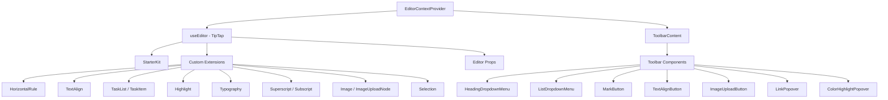

# Sistema Editor

O modelo inclui um editor de rich text construído em TipTap (ProseMirror) com uma arquitetura modular de extensões, componentes da barra de ferramentas, ganchos e funções utilitárias. O editor oferece suporte a títulos, listas, listas de tarefas, imagens, blocos de código, formatação de texto e muito mais.

## Visão geral da arquitetura



## Arquivos de origem

|Diretório|Conteúdo|
|-----------|----------|
|`lib/editor/extensions/`|Reexportações e configuração da extensão TipTap|
|`lib/editor/components/`|Componentes da UI (botões da barra de ferramentas, popovers, ícones)|
|`lib/editor/hooks/`|Ganchos React para gerenciamento de estado do editor|
|`lib/editor/providers/`|Provedor de contexto do editor com configuração de extensão|
|`lib/editor/contents/`|Layout da barra de ferramentas e componentes de conteúdo do editor|
|`lib/editor/utils/`|Funções utilitárias (atalhos, validação, upload)|

## Configuração de extensão

As extensões são registradas no `EditorContextProvider`. O `StarterKit` fornece funcionalidade básica, com extensões adicionais em camadas na parte superior:

```typescript
const extensions = useMemo(() => [
  StarterKit.configure({
    horizontalRule: false,
    link: { openOnClick: false, enableClickSelection: true },
  }),
  HorizontalRule,
  TextAlign.configure({ types: ['heading', 'paragraph'] }),
  ImageUploadNode.configure({
    accept: 'image/*',
    maxSize: MAX_FILE_SIZE, // 5MB
    limit: 3,
    upload: handleImageUpload,
    onError: (error) => console.error('Upload failed:', error),
  }),
  TaskList,
  TaskItem.configure({ nested: true }),
  Highlight.configure({ multicolor: true }),
  Image,
  Typography,
  Superscript,
  Subscript,
  Selection,
], []);
```

### Resumo da extensão

|Extensão|Fonte|Objetivo|
|-----------|--------|---------|
|`StarterKit`|`@tiptap/starter-kit`|Parágrafos, negrito, itálico, listas, código, citação|
|`HorizontalRule`|`@tiptap/extension-horizontal-rule`|Divisórias horizontais|
|`TextAlign`|`@tiptap/extension-text-align`|Esquerda, centro, direita, alinhamento justificado|
|`TaskList` / `TaskItem`|`@tiptap/extension-list`|Listas de caixas de seleção interativas|
|`Highlight`|`@tiptap/extension-highlight`|Destaque de texto multicolorido|
|`Typography`|`@tiptap/extension-typography`|Citações inteligentes, travessões, reticências|
|`Superscript`|`@tiptap/extension-superscript`|Texto sobrescrito|
|`Subscript`|`@tiptap/extension-subscript`|Texto subscrito|
|`Selection`|`@tiptap/extensions`|Tratamento de seleção aprimorado|
|`Image`|`@tiptap/extension-image`|Exibição de imagem estática|
|`ImageUploadNode`|Personalizado|Carregamento de imagem arrastar e soltar com progresso|

## Provedor de contexto do editor

O editor é fornecido via React Context para acesso em toda a árvore:

```typescript
export const EditorContext = createContext<Editor | null>(null);

export function EditorContextProvider({ children }: { children: React.ReactNode }) {
  const editor = useEditor({
    immediatelyRender: false,
    shouldRerenderOnTransaction: false,
    editorProps: {
      attributes: {
        autocomplete: 'on',
        autocorrect: 'on',
        autocapitalize: 'off',
        'aria-label': 'Main content area, start typing to enter text.',
        class: cn('min-h-96'),
      },
    },
    extensions,
  });

  return <EditorContext.Provider value={editor}>{children}</EditorContext.Provider>;
}
```

Principais opções de configuração:
- `immediatelyRender: false` evita incompatibilidades de hidratação SSR
- `shouldRerenderOnTransaction: false` otimiza o desempenho evitando novas renderizações desnecessárias

## Configuração da barra de ferramentas

O componente `ToolbarContent` define o layout completo da barra de ferramentas organizada em grupos:

|Grupo|Componentes|
|-------|------------|
|História|Desfazer, refazer|
|Tipos de bloco|Menu suspenso de título (H1-H4), menu suspenso de lista (marcador, ordenado, tarefa), citação de bloco, bloco de código|
|Marcas embutidas|Negrito, Itálico, Tachado, Código, Sublinhado, Destaque de cor, Link|
|Roteiro|Sobrescrito, Subscrito|
|Alinhamento|Esquerda, Centro, Direita, Justificar|
|Mídia|Carregamento de imagem|

Os grupos são separados por componentes `ToolbarSeparator` com elementos `Spacer` para posicionamento.

## Ganchos do Editor

### `useTiptapEditor`

Fornece acesso flexível à instância do editor por meio de props ou contexto:

```typescript
export function useTiptapEditor(providedEditor?: Editor | null): {
  editor: Editor | null;
  editorState?: Editor["state"];
  canCommand?: Editor["can"];
}
```

Este gancho mescla um editor fornecido diretamente com o editor de contexto, permitindo que os componentes funcionem de forma independente e dentro da árvore do provedor.

### Ganchos Adicionais

|Gancho|Objetivo|
|------|---------|
|`use-editor.ts`|Gerenciamento de estado do editor principal|
|`use-editor-sync.ts`|Sincronização entre instâncias do editor|
|`use-cursor-visibility.ts`|Posição do cursor e rastreamento de visibilidade|
|`use-element-rect.ts`|Rastreamento de retângulo delimitador de elemento|
|`use-scrolling.ts`|Posição e comportamento da rolagem|
|`use-throttled-callback.ts`|Execução de retorno de chamada limitada|
|`use-window-size.ts`|Rastreamento de tamanho de janela responsivo|
|`use-unmount.ts`|Limpeza na desmontagem do componente|

## Funções utilitárias

### Formatação de teclas de atalho

O sistema lida com atalhos de teclado específicos da plataforma:

```typescript
export const MAC_SYMBOLS: Record<string, string> = {
  mod: "Command", command: "Command", meta: "Command",
  ctrl: "Ctrl", alt: "Option", shift: "Shift",
  // ... additional mappings
};

export const formatShortcutKey = (key: string, isMac: boolean, capitalize?: boolean) => {
  // Returns Mac symbols or formatted key names
};

export const parseShortcutKeys = (props: {
  shortcutKeys: string | undefined;
  delimiter?: string;
  capitalize?: boolean;
}) => string[];
```

### Validação de esquema

```typescript
// Check if a mark type exists in the editor schema
export const isMarkInSchema = (markName: string, editor: Editor | null): boolean;

// Check if a node type exists in the editor schema
export const isNodeInSchema = (nodeName: string, editor: Editor | null): boolean;

// Check if extensions are registered
export function isExtensionAvailable(editor: Editor | null, extensionNames: string | string[]): boolean;
```

### Navegação de nós

```typescript
// Find a node at a specific document position
export function findNodeAtPosition(editor: Editor, position: number): TiptapNode | null;

// Find a node by reference or position
export function findNodePosition(props: {
  editor: Editor | null;
  node?: TiptapNode | null;
  nodePos?: number | null;
}): { pos: number; node: TiptapNode } | null;

// Move focus to the next node
export function focusNextNode(editor: Editor): boolean;
```

### Carregamento de imagem

```typescript
export const MAX_FILE_SIZE = 5 * 1024 * 1024; // 5MB

export const handleImageUpload = async (
  file: File,
  onProgress?: (event: { progress: number }) => void,
  abortSignal?: AbortSignal
): Promise<string>;
```

O manipulador de upload valida o tamanho do arquivo, oferece suporte ao rastreamento do progresso e trata do cancelamento via `AbortSignal`.

### Limpeza de URL

```typescript
export function isAllowedUri(uri: string | undefined, protocols?: ProtocolConfig): boolean;
export function sanitizeUrl(inputUrl: string, baseUrl: string, protocols?: ProtocolConfig): string;
```

Garante que apenas protocolos seguros (`http`, `https`, `ftp`, `mailto`, etc.) sejam permitidos em links. URLs inseguros são substituídos por `"#"`.
