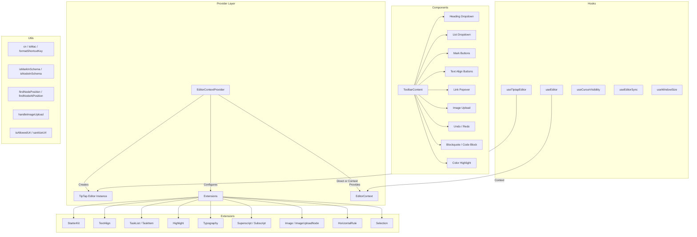

# Módulo de utilitários do editor

O módulo de utilitários do editor (`template/lib/editor/`) fornece uma solução completa de edição de rich text construída em **TipTap** (ProseMirror). Inclui um provedor de editor pré-configurado, extensões TipTap, uma biblioteca completa de componentes da barra de ferramentas, funções utilitárias para manipulação de DOM e ganchos React personalizados para gerenciamento de estado do editor.

## Visão geral da arquitetura



## Arquivos de origem

|Diretório|Descrição|
|-----------|-------------|
|`lib/editor/index.ts`|Exportação de barril para todos os submódulos|
|`lib/editor/providers/`|`EditorContextProvider` e `EditorContext`|
|`lib/editor/extensions/`|Reexportações de extensão TipTap|
|`lib/editor/hooks/`|Ganchos React personalizados|
|`lib/editor/utils/`|Funções utilitárias|
|`lib/editor/contents/`|Componentes `ToolbarContent` e `EditorContent`|
|`lib/editor/components/`|Primitivos de UI, botões da barra de ferramentas, ícones, nós|
|`lib/editor/styles/`|Estilos CSS do editor|

## Provedor de editores

### `EditorContextProvider`

Envolve filhos com uma instância do editor TipTap pré-configurada:

```tsx
import { EditorContextProvider } from '@/lib/editor';

function MyEditor() {
  return (
    <EditorContextProvider>
      <ToolbarContent editor={null} />
      <EditorContent />
    </EditorContextProvider>
  );
}
```

### Configuração

O provedor configura o TipTap com estas configurações:

```typescript
const editor = useEditor({
  immediatelyRender: false,
  shouldRerenderOnTransaction: false,
  editorProps: {
    attributes: {
      autocomplete: 'on',
      autocorrect: 'on',
      autocapitalize: 'off',
      'aria-label': 'Main content area, start typing to enter text.',
      class: 'min-h-96',
    },
  },
  extensions: [/* ... */],
});
```

### Extensões pré-configuradas

|Extensão|Configuração|
|-----------|--------------|
|`StarterKit`|`horizontalRule: false`, `link.openOnClick: false`|
|`HorizontalRule`|Padrão|
|`TextAlign`|Aplica-se aos nós `heading` e `paragraph`|
|`ImageUploadNode`|Aceitar: `image/*`, máximo de 5 MB, limite de 3 imagens|
|`TaskList` / `TaskItem`|Tarefas aninhadas ativadas|
|`Highlight`|Multicolorido ativado|
|`Image`|Padrão|
|`Typography`|Citações e travessões inteligentes|
|`Superscript` / `Subscript`|Padrão|
|`Selection`|Padrão|

## Ganchos

### `useEditor(): Editor`

Recupera a instância do editor do `EditorContext`. Deve ser usado dentro de um `EditorContextProvider`.

```typescript
import { useEditor } from '@/lib/editor';

function MyComponent() {
  const editor = useEditor();
  // editor is the TipTap Editor instance
}
```

### `useTiptapEditor(providedEditor?): { editor, editorState?, canCommand? }`

Gancho flexível que aceita uma instância de editor opcional ou retorna ao contexto TipTap:

```typescript
import { useTiptapEditor } from '@/lib/editor/hooks';

function ToolbarButton({ editor: externalEditor }) {
  const { editor, editorState, canCommand } = useTiptapEditor(externalEditor);

  const isBold = editorState ? editor?.isActive('bold') : false;
  const canBold = canCommand ? canCommand().toggleBold() : false;
}
```

### Outros ganchos

|Gancho|Objetivo|
|------|---------|
|`useCursorVisibility`|Rastreia a visibilidade da posição do cursor na viewport|
|`useEditorSync`|Sincroniza o conteúdo do editor com o estado externo|
|`useElementRect`|Rastreia o retângulo delimitador do elemento|
|`useScrolling`|Detecta o estado de rolagem|
|`useThrottledCallback`|Acelera uma função de retorno de chamada|
|`useUnmount`|Executa a limpeza na desmontagem do componente|
|`useWindowSize`|Rastreia as dimensões da janela|

## Funções utilitárias

### Auxiliar de nome de classe

```typescript
function cn(...classes: (string | boolean | undefined | null)[]): string;
// Filters falsy values and joins with space
cn('min-h-96', isActive && 'bg-blue-500', undefined); // 'min-h-96 bg-blue-500'
```

### Detecção de plataforma

```typescript
function isMac(): boolean;
// Returns true if navigator.platform includes 'mac'
```

### Formatação de teclas de atalho

```typescript
function formatShortcutKey(key: string, isMac: boolean, capitalize?: boolean): string;
// Mac: 'ctrl' -> '???', 'alt' -> '???', 'shift' -> '???', 'meta' -> '???'
// Windows: 'ctrl' -> 'Ctrl'

function parseShortcutKeys(props: {
  shortcutKeys: string | undefined;
  delimiter?: string;    // default: '+'
  capitalize?: boolean;  // default: true
}): string[];
// 'ctrl+shift+b' -> ['???', '???', 'B'] (Mac) or ['Ctrl', 'Shift', 'B'] (Windows)
```

### Inspeção de esquema

```typescript
function isMarkInSchema(markName: string, editor: Editor | null): boolean;
// Checks if a mark type exists in the editor schema

function isNodeInSchema(nodeName: string, editor: Editor | null): boolean;
// Checks if a node type exists in the editor schema

function isExtensionAvailable(editor: Editor | null, extensionNames: string | string[]): boolean;
// Checks if one or more extensions are registered
// Logs a warning if none found
```

### Operações de nó

```typescript
function findNodeAtPosition(editor: Editor, position: number): TiptapNode | null;
// Returns the node at the given document position

function findNodePosition(props: {
  editor: Editor | null;
  node?: TiptapNode | null;
  nodePos?: number | null;
}): { pos: number; node: TiptapNode } | null;
// Finds position by node reference or position number

function focusNextNode(editor: Editor): boolean;
// Moves cursor to the next node, creating a paragraph if at end

function isNodeTypeSelected(editor: Editor | null, types: string[]): boolean;
// Checks if current selection is a NodeSelection matching any type

function isValidPosition(pos: number | null | undefined): pos is number;
// Type guard for valid document positions (>= 0)
```

### Carregamento de imagem

```typescript
const MAX_FILE_SIZE = 5 * 1024 * 1024; // 5MB

async function handleImageUpload(
  file: File,
  onProgress?: (event: { progress: number }) => void,
  abortSignal?: AbortSignal,
): Promise<string>;
// Returns the URL of the uploaded image
// Default implementation is a demo stub -- replace with actual upload logic
```

### Validação de URL

```typescript
function isAllowedUri(uri: string | undefined, protocols?: ProtocolConfig): boolean;
// Checks URI against allowed protocols:
// http, https, ftp, ftps, mailto, tel, callto, sms, cid, xmpp
// Plus any custom protocols passed in

function sanitizeUrl(inputUrl: string, baseUrl: string, protocols?: ProtocolConfig): string;
// Returns sanitized URL or '#' if not allowed
```

## Conteúdo da barra de ferramentas

O componente `ToolbarContent` fornece uma barra de ferramentas completa e pré-configurada:

```tsx
import { ToolbarContent } from '@/lib/editor/contents';

<ToolbarContent editor={editor} />
```

### Grupos da barra de ferramentas

|Grupo|Componentes|
|-------|-----------|
|Desfazer/Refazer|`UndoRedoButton` (desfazer, refazer)|
|Formatação de bloco|`HeadingDropdownMenu` (H1-H4), `ListDropdownMenu` (marcador, ordenado, tarefa), `BlockquoteButton`, `CodeBlockButton`|
|Formatação embutida|`MarkButton` (negrito, itálico, riscado, código, sublinhado), `ColorHighlightPopover`, `LinkPopover`|
|Sobrescrito|`MarkButton` (sobrescrito, subscrito)|
|Alinhamento de Texto|`TextAlignButton` (esquerda, centro, direita, justificar)|
|Mídia|`ImageUploadButton`|

## Biblioteca de Componentes

### Componentes Primitivos

Componentes básicos da UI usados pelos botões da barra de ferramentas:

- `Badge`, `Button`, `Card`, `DropdownMenu`, `Input`, `Popover`, `Separator`, `Spacer`, `Toolbar`, `Tooltip`

### Componentes do nó

Visualizações personalizadas do nó TipTap:

- `HorizontalRuleNode` -- extensão de regra horizontal personalizada
- `ImageUploadNode` - nó de upload de arquivo com arrastar e soltar

### Componentes de ícone

Ícones SVG para todas as ações da barra de ferramentas (negrito, itálico, níveis de título, listas, alinhamento, etc.).
