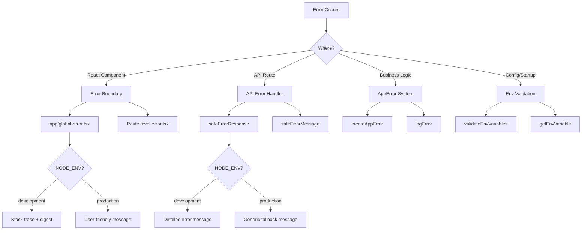

# Padrões de tratamento de erros

## Visão geral

O modelo Ever Works implementa uma estratégia de tratamento de erros em várias camadas que cobre limites de erro React, respostas de erro de rota de API, erros de aplicativo digitados e validação de variável de ambiente. O design prioriza a segurança (sem vazamento de informações na produção), ao mesmo tempo que mantém a depuração amigável ao desenvolvedor no desenvolvimento.

## Arquitetura



## Arquivos de origem

|Arquivo|Objetivo|
|------|---------|
|`template/app/global-error.tsx`|Limite de erro React em nível raiz|
|`template/app/not-found.tsx`|Página 404 não encontrada|
|`template/lib/utils/api-error.ts`|Utilitários de erro de rota da API|
|`template/lib/utils/error-handler.ts`|Tipos de erro de aplicativo e registro em log|
|`template/lib/auth/error-handler.ts`|Tratamento de erros específicos de autenticação|

## Limites de erro de reação

### Limite de erro global

O arquivo `global-error.tsx` captura erros não tratados na raiz do aplicativo:

```typescript
'use client';

export default function GlobalError({
    error,
    reset,
}: {
    error: Error & { digest?: string };
    reset: () => void;
}) {
    useEffect(() => {
        console.error(error);
    }, [error]);

    return (
        <html lang="en">
            <body>
                <h1>Something went wrong!</h1>
                {process.env.NODE_ENV !== 'production' && (
                    <div>
                        <p className="text-red-600">{error.message}</p>
                        {error.stack && <pre>{error.stack}</pre>}
                        {error.digest && <p>Error ID: {error.digest}</p>}
                    </div>
                )}
                <Button onPress={() => reset()}>Refresh</Button>
                <Link href="/">Go Home</Link>
            </body>
        </html>
    );
}
```

Comportamentos principais:
- **Desenvolvimento**: mostra mensagem de erro, rastreamento de pilha e resumo de erros
- **Produção**: mostra apenas uma mensagem genérica
- **Resumo do erro**: um ID exclusivo gerado pelo Next.js para correlação de erros do lado do servidor
- **Função de redefinição**: renderiza novamente a subárvore do limite de erro
- **HTML independente**: inclui suas próprias tags `<html>` e `<body>`, pois substitui a página inteira

### Página não encontrada

```typescript
'use client';

export default function NotFound() {
    const router = useRouter();
    return (
        <div>
            <h1>404</h1>
            <h2>Page Not Found</h2>
            <Button onClick={() => router.back()}>Go Back</Button>
            <Button onClick={() => router.push('/')}>Back to Home</Button>
        </div>
    );
}
```

## Tratamento de erros de API

### safeErrorResponse

O principal utilitário para respostas de erro de rota da API:

```typescript
export function safeErrorResponse(
    error: unknown,
    fallbackMessage: string,
    status: number = 500
): NextResponse {
    const detail = error instanceof Error ? error.message : String(error);

    // Always log full details server-side
    console.error(`[API Error] ${fallbackMessage}:`, detail);

    const message = process.env.NODE_ENV === "development" ? detail : fallbackMessage;

    return NextResponse.json({ success: false, error: message }, { status });
}
```

Uso em rotas API:

```typescript
export async function GET(request: NextRequest) {
    try {
        const result = await someOperation();
        return NextResponse.json(result);
    } catch (error) {
        return safeErrorResponse(error, 'Failed to process request');
    }
}
```

### mensagem de erro segura

Para casos em que você precisa da string de erro sem criar uma resposta:

```typescript
export function safeErrorMessage(error: unknown, fallbackMessage: string): string {
    if (process.env.NODE_ENV === "development") {
        return error instanceof Error ? error.message : String(error);
    }
    return fallbackMessage;
}
```

## Sistema de erro de aplicativo

### Tipos de erro

```typescript
export enum ErrorType {
    AUTH = 'auth',
    CONFIG = 'config',
    DATABASE = 'database',
    NETWORK = 'network',
    VALIDATION = 'validation',
    UNKNOWN = 'unknown'
}

export interface AppError {
    message: string;
    type: ErrorType;
    code?: string;
    originalError?: unknown;
}
```

### Criando Erros Digitados

```typescript
import { createAppError, ErrorType } from '@/lib/utils/error-handler';

const error = createAppError(
    'Failed to configure OAuth providers',
    ErrorType.CONFIG,
    'OAUTH_CONFIG_FAILED',
    originalError
);
```

### Registro de erros estruturado

```typescript
import { logError } from '@/lib/utils/error-handler';

// Logs: [CONFIG] [Auth Config]: Failed to configure OAuth providers
// Logs: Error code: OAUTH_CONFIG_FAILED
// Logs: Original error: <original error details>
logError(error, 'Auth Config');
```

A função `logError` lida com três formas de erro:
1. **AppError** – log estruturado com tipo, código e erro original
2. **Erro** – log padrão com mensagem e rastreamento de pilha
3. **Desconhecido** – log de fallback com coerção de string

### Validação de Variável de Ambiente

```typescript
import { validateEnvVariables, getEnvVariable } from '@/lib/utils/error-handler';

// Validate multiple variables at once
const validationError = validateEnvVariables([
    'DATABASE_URL', 'AUTH_SECRET', 'CRON_SECRET'
]);
if (validationError) {
    logError(validationError, 'Startup');
}

// Get a single required variable (throws if missing)
const dbUrl = getEnvVariable('DATABASE_URL');

// Get an optional variable
const optional = getEnvVariable('OPTIONAL_VAR', false);
```

## Tratamento de erros no Auth

A configuração de autenticação usa degradação elegante:

```typescript
const configureProviders = () => {
    try {
        const oauthProviders = configureOAuthProviders();
        return createNextAuthProviders({ /* full config */ });
    } catch (error) {
        const appError = createAppError(
            'Failed to configure OAuth providers. Falling back to credentials only.',
            ErrorType.CONFIG,
            'OAUTH_CONFIG_FAILED',
            error
        );
        logError(appError, 'Auth Config');

        // Fallback to credentials only
        return createNextAuthProviders({
            credentials: { enabled: true },
            google: { enabled: false },
            github: { enabled: false },
            facebook: { enabled: false },
            twitter: { enabled: false },
        });
    }
};
```

Se a configuração do provedor OAuth falhar, o sistema retornará à autenticação somente com credenciais, em vez de travar.

## Tratamento de erros de fluxo por camada

|Camada|Estratégia|Comportamento de produção|
|-------|----------|-------------------|
|Componentes de reação|Limite de erro (`global-error.tsx`)|Mensagem genérica, sem rastreamento de pilha|
|Rotas de API|`safeErrorResponse()`|Mensagem substituta genérica|
|Ações do servidor|`validatedAction()` detecta erros do Zod|Primeira mensagem de erro de validação|
|Configuração de autenticação|Experimente/pegue com `createAppError()`|Degradação elegante das credenciais|
|Cron Jobs|Try/catch + registro estruturado|Erro registrado, resposta retornada|
|Webhooks|Try/catch + 400 respostas|Mensagem genérica de falha para o provedor|

## Melhores práticas

1. **Nunca exponha componentes internos na produção** -- sempre use `safeErrorResponse` para rotas de API
2. **Registre tudo no lado do servidor** – detalhes completos do erro vão para o console/registro, independentemente do ambiente
3. **Use erros digitados** -- `createAppError` com `ErrorType` para categorização consistente
4. **Degradação suave** – volte para funcionalidade reduzida em vez de travar
5. **Resumos de erros para correlação** - use o campo `digest` dos erros do Next.js para rastrear problemas no lado do servidor
6. **Validar nos limites** – verifique variáveis de ambiente na inicialização, valide a entrada nos limites da API
