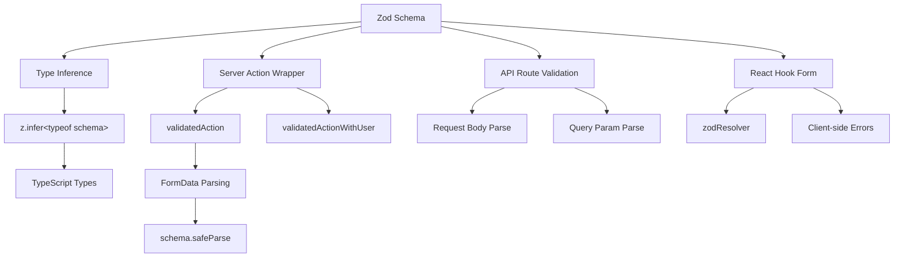

# Padrões de validação de formulário

## Visão geral

O modelo Ever Works usa **Zod** como a única fonte de verdade para validação de dados entre clientes e servidores. Os esquemas de validação são organizados em `lib/validations/` e são consumidos por:

- **Ações do servidor** via wrappers `validatedAction()` e `validatedActionWithUser()`
- **Manipuladores de rota de API** para validação do corpo da solicitação/parâmetro de consulta
- **React Hook Form** integração para validação de formulário do lado do cliente
- **Inferência de tipo** via `z.infer<>` para segurança de ponta a ponta

## Arquitetura



## Arquivos de origem

|Arquivo|Objetivo|
|------|---------|
|`template/lib/validations/auth.ts`|Esquema de validação de senha|
|`template/lib/validations/company.ts`|Esquemas CRUD da empresa|
|`template/lib/validations/client-item.ts`|Esquemas de envio/atualização de item do cliente|
|`template/lib/validations/client-dashboard.ts`|Esquemas de consulta do painel|
|`template/lib/validations/sponsor-ad.ts`|Esquemas de ciclo de vida do anúncio patrocinador|
|`template/lib/validations/item.ts`|Esquema de dados de localização|
|`template/lib/validations/user-location.ts`|Esquema de configurações de localização do usuário|
|`template/lib/auth/middleware.ts`|`validatedAction` / `validatedActionWithUser` utilitários|

## Padrões de esquema de validação

### Padrão 1: Validação de senha com regras encadeadas

```typescript
import { z } from "zod";

export const passwordSchema = z
    .string()
    .min(8, "Password must be at least 8 characters")
    .regex(/[A-Z]/, "Password must contain at least one uppercase letter")
    .regex(/[a-z]/, "Password must contain at least one lowercase letter")
    .regex(/[0-9]/, "Password must contain at least one number")
    .regex(/[^A-Za-z0-9]/, "Password must contain at least one special character");
```

Este esquema impõe requisitos de senha fortes por meio de refinamentos encadeados. Cada `.regex()` fornece uma mensagem de erro específica que a IU pode exibir inline.

### Padrão 2: Criar/Atualizar Pares de Esquema

A validação da empresa demonstra o padrão de criação/atualização:

```typescript
export const createCompanySchema = z.object({
    name: z.string().min(1, "Company name is required").max(255),
    website: z.string().url("Invalid URL format").optional().or(z.literal("")),
    domain: z.string().max(255).optional()
        .transform((val) => val?.toLowerCase().trim() || undefined),
    slug: z.string().max(255).optional()
        .transform((val) => val?.toLowerCase().trim() || undefined)
        .refine(
            (val) => !val || /^[a-z0-9-]+$/.test(val),
            { message: "Slug must contain only lowercase letters, numbers, and hyphens" }
        ),
    status: z.enum(companyStatus).default("active"),
});

export const updateCompanySchema = z.object({
    id: z.string().uuid(),
    name: z.string().min(1).max(255).optional(),  // Optional for updates
    // ... other fields also optional
    status: z.enum(companyStatus).optional(),
});
```

Principais diferenças:
- **Criar esquemas** tem campos obrigatórios com padrões
- **Esquemas de atualização** exigem `id` e tornam todos os outros campos opcionais
- Ambos compartilham a lógica `.transform()` para normalização (por exemplo, slugs em letras minúsculas)

### Padrão 3: campos de status baseados em enum

```typescript
export const companyStatus = ["active", "inactive"] as const;
export const itemStatus = ['pending', 'approved', 'rejected'] as const;
export const sponsorAdStatuses = [
    "pending_payment", "pending", "rejected",
    "active", "expired", "cancelled",
] as const;

// Usage in schemas
status: z.enum(companyStatus).default("active"),
status: z.enum(sponsorAdStatuses).optional(),
```

Usar matrizes `as const` com `z.enum()` fornece validação de tempo de execução e segurança de tipo em tempo de compilação.

### Padrão 4: esquemas de parâmetros de consulta com transformações

```typescript
export const clientItemsListQuerySchema = z.object({
    page: z.string().optional()
        .transform(val => (val ? parseInt(val, 10) : 1))
        .refine(val => !Number.isNaN(val), { message: 'Page must be a valid number' })
        .refine(val => val >= 1, { message: 'Page must be at least 1' }),
    limit: z.string().optional()
        .transform(val => (val ? parseInt(val, 10) : 10))
        .refine(val => val >= 1 && val <= 100, { message: 'Limit must be between 1 and 100' }),
    status: z.enum(clientStatusFilter).optional().default('all'),
    search: z.string().max(100, 'Search query is too long').optional(),
    sortBy: z.enum(['name', 'updated_at', 'status', 'submitted_at']).optional().default('updated_at'),
    sortOrder: z.enum(['asc', 'desc']).optional().default('desc'),
    deleted: z.string().optional().transform(val => val === 'true'),
});
```

Os parâmetros de consulta chegam como strings. O esquema usa `.transform()` para convertê-los nos tipos corretos (números, booleanos) ao aplicar validação e padrões.

### Padrão 5: esquemas de objetos aninhados com validação entre campos

```typescript
export const updateLocationSchema = z
    .object({
        defaultLatitude: z.number().min(-90).max(90).nullable().optional(),
        defaultLongitude: z.number().min(-180).max(180).nullable().optional(),
        defaultCity: z.string().max(200).nullable().optional(),
        defaultCountry: z.string().max(100).nullable().optional(),
        locationPrivacy: locationPrivacySchema.optional(),
    })
    .refine(
        (data) => {
            const hasLat = data.defaultLatitude != null;
            const hasLng = data.defaultLongitude != null;
            return hasLat === hasLng;  // Both or neither
        },
        { message: 'Both latitude and longitude must be provided together' }
    );
```

O `.refine()` no nível do objeto valida dependências entre campos - latitude e longitude devem estar presentes ou ambas ausentes.

### Padrão 6: Tipos de união para entradas flexíveis

```typescript
category: z.union([
    z.string().min(1, 'Category is required'),
    z.array(z.string().min(1)).min(1, 'At least one category is required'),
]).optional().nullable(),
```

Isto aceita uma única string e uma matriz de strings para o campo de categoria, acomodando diferentes tipos de entrada de formulário.

## Validação do lado do servidor

### ValidadoAction Wrapper

```typescript
export function validatedAction<S extends z.ZodType<any, any>, T>(
    schema: S,
    action: ValidatedActionFunction<S, T>
) {
    return async (prevState: ActionState, formData: FormData): Promise<T> => {
        const result = schema.safeParse(Object.fromEntries(formData));
        if (!result.success) {
            return { error: result.error.issues[0].message } as T;
        }
        return action(result.data, formData);
    };
}
```

Esta função de ordem superior:
1. Converte `FormData` em um objeto simples
2. Valida no esquema Zod usando `safeParse()`
3. Retorna o primeiro erro de validação se for inválido
4. Chama a função de ação com dados digitados e analisados, se válidos

### ValidadoActionWithUser Wrapper

```typescript
export function validatedActionWithUser<S extends z.ZodType<any, any>, T>(
    schema: S,
    action: ValidatedActionWithUserFunction<S, T>
) {
    return async (prevState: ActionState, formData: FormData): Promise<T> => {
        const session = await auth();
        if (!session?.user) {
            throw new Error("User is not authenticated");
        }
        const result = schema.safeParse(Object.fromEntries(formData));
        if (!result.success) {
            return { error: result.error.issues[0].message } as T;
        }
        return action(result.data, formData, session.user);
    };
}
```

Isso adiciona uma verificação de autenticação antes da validação, passando o objeto `user` autenticado para a função de ação.

## Inferência de tipo

Cada esquema exporta tipos TypeScript inferidos:

```typescript
export type CreateCompanyInput = z.infer<typeof createCompanySchema>;
export type UpdateCompanyInput = z.infer<typeof updateCompanySchema>;
export type ClientUpdateItemInput = z.infer<typeof clientUpdateItemSchema>;
export type ClientCreateItemInput = z.infer<typeof clientCreateItemSchema>;
```

Esses tipos são usados em toda a camada de serviço e rotas de API, garantindo que o formato dos dados validados corresponda ao que a lógica de negócios espera.

## Melhores práticas

1. **Esquema único, vários consumidores** -- defina uma vez em `lib/validations/`, use em qualquer lugar
2. **Transformar no limite** -- use `.transform()` para converter strings em tipos adequados
3. **Mensagens de erro personalizadas** – cada regra de validação inclui uma mensagem amigável
4. **Subesquemas compartilhados** – reutiliza esquemas como `locationSchema` e `passwordSchema` em formulários
5. **Inferir tipos de esquemas** – nunca defina manualmente tipos que dupliquem definições de esquema
6. **Validação entre campos** -- use `.refine()` no nível do objeto para regras de vários campos
7. **Padrões sensatos** -- use `.default()` para campos opcionais com valores padrão
