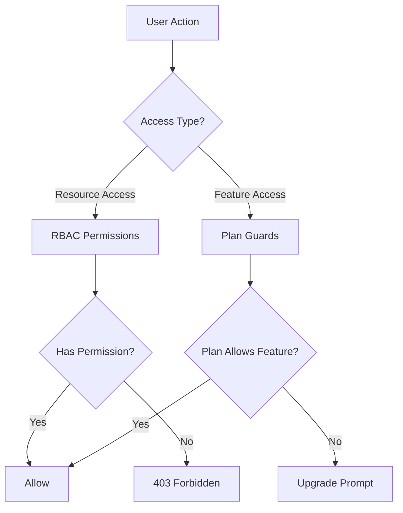
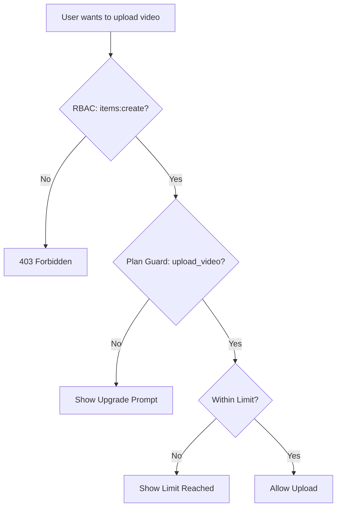

# Sistema de guardas e permissões

O modelo Ever Works implementa um sistema de controle de acesso de camada dupla: **permissões RBAC** para acesso a recursos baseado em função e **guardas de plano** para controle de recursos baseado em assinatura. Juntos, esses sistemas controlam o que os usuários podem fazer e quais recursos eles podem acessar.

## Arquitetura do sistema



## Sistema de permissão RBAC

### Definições de permissão

Todas as permissões são definidas em `lib/permissions/definitions.ts` usando um formato `resource:action`:

```typescript
const PERMISSIONS = {
  items: {
    read: 'items:read',
    create: 'items:create',
    update: 'items:update',
    delete: 'items:delete',
    review: 'items:review',
    approve: 'items:approve',
    reject: 'items:reject',
  },
  categories: { read, create, update, delete },
  tags: { read, create, update, delete },
  roles: { read, create, update, delete },
  users: { read, create, update, delete, assignRoles },
  analytics: { read, export },
  system: { settings },
} as const;
```

### Tipo de permissão

O tipo `Permission` é derivado do objeto `PERMISSIONS` const, garantindo a segurança do tipo:

```typescript
type Permission = 'items:read' | 'items:create' | ... | 'system:settings';
```

### Funções padrão

Duas funções padrão são pré-configuradas:

|Função|ID|Permissões|
|---|---|---|
|Superadministrador|`super-admin`|Todas as permissões do sistema|
|Gerenciador de conteúdo|`content-manager`|Itens + Categorias + Tags (CRUD completo + revisão)|

### Grupos de permissão

As permissões são organizadas em grupos amigáveis à UI em `lib/permissions/groups.ts`:

|Grupo|Ícone|Recursos incluídos|
|---|---|---|
|Gerenciamento de conteúdo|`FileText`|Itens, categorias, tags|
|Gerenciamento de usuários|`Users`|Usuários, funções|
|Sistema e análise|`Settings`|Análise, Sistema|

### Funções utilitárias

O módulo `lib/permissions/utils.ts` fornece utilitários de gerenciamento de estado para a UI de permissões:

```typescript
// Create a permission state map for checkboxes
const state = createPermissionState(currentPermissions);
// { 'items:read': true, 'items:create': true, ... }

// Get selected permissions from state
const selected = getSelectedPermissions(state);

// Calculate changes between old and new permissions
const changes = calculatePermissionChanges(original, updated);
// { added: ['items:delete'], removed: ['tags:create'] }

// Compare two permission sets
const equal = arePermissionsEqual(perms1, perms2);

// Filter permissions by search term
const filtered = filterPermissions(allPerms, 'items');
```

## Planejar Sistema de Guardas

Os protetores de plano controlam o acesso aos recursos com base no plano de assinatura do usuário. O sistema é definido em `lib/guards/plan-features.guard.ts`.

### Hierarquia do plano

```typescript
const PLAN_LEVELS: Record<string, number> = {
  free: 1,
  standard: 2,
  premium: 3,
};
```

### Definições de recursos

Todos os recursos bloqueados são enumerados em `FEATURES`:

|Categoria|Recursos|
|---|---|
|Envio|`submit_product`, `extended_description`, `unlimited_description`, `upload_images`, `upload_video`|
|Emblemas|`verified_badge`, `sponsored_badge`|
|Revisão|`priority_review`, `instant_review`|
|Visibilidade|`search_visibility`, `category_placement`, `sponsored_position`, `homepage_featured`, `newsletter_mention`|
|Análise|`view_statistics`, `advanced_analytics`|
|Suporte|`email_support`, `priority_email_support`, `phone_support`|
|Sociais|`social_sharing`, `learn_more_button`|
|Outro|`free_modifications`, `unlimited_submissions`|

### Matriz de acesso a recursos

Cada recurso é mapeado para uma regra de acesso:

|Tipo de acesso|Sintaxe|Exemplo|
|---|---|---|
|Todos os planos|`'all'`|`submit_product`, `upload_images`|
|Plano único|`PaymentPlan.PREMIUM`|`upload_video`, `instant_review`|
|Plano mínimo|`{ minPlan: PaymentPlan.STANDARD }`|`verified_badge`, `priority_review`|
|Planos específicos|`[PaymentPlan.STANDARD, PaymentPlan.PREMIUM]`|(recursos personalizados)|

### Limites do plano

Os limites numéricos variam de acordo com o plano:

|Limite|Grátis|Padrão|Prêmio|
|---|---|---|---|
|`max_images`| 1 | 5 |Ilimitado|
|`max_description_words`| 200 | 500 |Ilimitado|
|`max_submissions`| 1 | 10 |Ilimitado|
|`review_days`| 7 | 3 | 1 |
|`free_modification_days`| 0 | 30 | 365 |

### Uso do Server-Side Guard

```typescript
import { canAccessFeature, createPlanGuard, FEATURES } from '@/lib/guards';

// Simple check
const allowed = canAccessFeature(FEATURES.UPLOAD_VIDEO, userPlan);

// Guard factory for multiple checks
const guard = createPlanGuard(userPlan);
guard.canAccess(FEATURES.VERIFIED_BADGE);       // boolean
guard.requireFeature(FEATURES.UPLOAD_VIDEO);     // throws PlanGuardError
guard.getLimit('max_images');                    // number | null
guard.isWithinLimit('max_submissions', count);   // boolean
guard.getAccessibleFeatures();                   // Feature[]
```

### Erro PlanGuard

Quando `requireFeature` falha, ocorre um erro de digitação:

```typescript
class PlanGuardError extends Error {
  feature: Feature;      // e.g., 'upload_video'
  userPlan: string;      // e.g., 'free'
  requiredPlan: PaymentPlan; // e.g., 'premium'
}
```

### Gancho de proteção do lado do cliente

O gancho `usePlanGuard` em `hooks/use-plan-guard.ts` envolve o sistema de proteção para componentes React:

```typescript
import { usePlanGuard, FEATURES } from '@/hooks/use-plan-guard';

function VideoUploadButton() {
  const { canAccess, requireUpgrade, isLoading } = usePlanGuard();

  if (isLoading) return <Spinner />;

  const upgradePlan = requireUpgrade(FEATURES.UPLOAD_VIDEO);
  if (upgradePlan) {
    return <UpgradePrompt plan={upgradePlan} />;
  }

  return <Button>Upload Video</Button>;
}
```

### Ganchos especializados

#### `useFeatureAccess`

Verifique o acesso a um único recurso:

```typescript
const { hasAccess, requiredPlan, isLoading } = useFeatureAccess(FEATURES.VERIFIED_BADGE);
```

#### `useFeatureLimit`

Verifique os limites numéricos com a contagem restante:

```typescript
const { limit, isUnlimited, remaining, isWithinLimit } = useFeatureLimit('max_images', currentCount);

if (!isUnlimited && remaining <= 0) {
  return <LimitReached />;
}
```

## Compondo Guardas

Os guardas compõem naturalmente cenários complexos de controle de acesso:

```typescript
// Server: Combine RBAC + plan check
function canCreateItem(userPermissions: UserPermissions, userPlan: string): boolean {
  const hasRBACAccess = hasPermission(userPermissions, 'items:create');
  const hasPlanAccess = canAccessFeature(FEATURES.SUBMIT_PRODUCT, userPlan);
  return hasRBACAccess && hasPlanAccess;
}

// Client: Combine hooks
function CreateItemButton() {
  const { canAccess } = usePlanGuard();
  const { permissions } = useRolePermissions();

  const canCreate =
    hasPermission(permissions, 'items:create') &&
    canAccess(FEATURES.SUBMIT_PRODUCT);

  if (!canCreate) return null;
  return <Button>Create Item</Button>;
}
```

## Diagrama de Fluxo de Guarda



## Adicionando novos guardas

### Adicionando uma nova permissão

1. Adicione a `PERMISSIONS` em `lib/permissions/definitions.ts`:

```typescript
billing: {
  read: 'billing:read',
  manage: 'billing:manage',
},
```

2. Adicionar a um grupo de permissão em `lib/permissions/groups.ts`
3. Atribuir funções padrão apropriadas

### Adicionando um novo recurso de plano

1. Adicione a constante de recurso a `FEATURES` em `lib/guards/plan-features.guard.ts`
2. Defina a regra de acesso em `FEATURE_ACCESS`
3. Opcionalmente, adicione limites numéricos a `PLAN_LIMITS`

## Melhores práticas

1. **Prefira protetores de plano para controle de recursos** e RBAC para controle de acesso a recursos – não os misture.
2. **Sempre verifique o servidor** mesmo se o cliente ocultar elementos da UI – as verificações do lado do cliente são apenas para UX.
3. **Use `createPlanGuard`** para múltiplas verificações na mesma solicitação para evitar pesquisas repetidas de plano.
4. **Tratar estados de carregamento** em ganchos – os dados do plano podem ser carregados de forma assíncrona a partir do serviço de assinatura.
5. **Mantenha os nomes dos recursos descritivos** -- use `upload_video` e não `feature_3` para maior clareza em logs e mensagens de erro.
