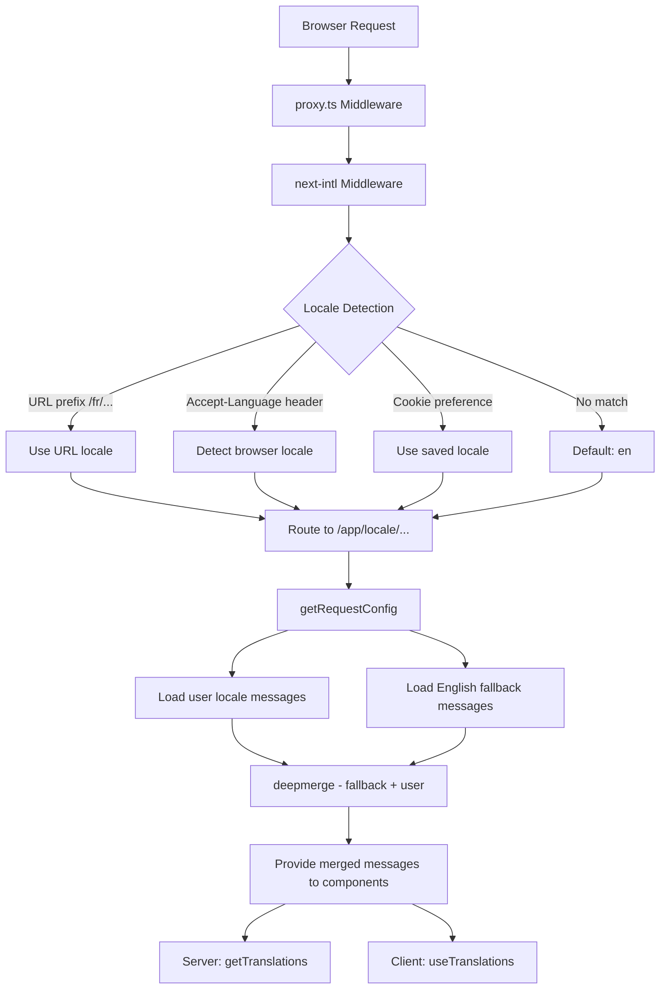

# Implementação i18n

## Visão geral

O modelo Ever Works implementa internacionalização usando **next-intl** com suporte para mais de 20 localidades, direção de texto RTL (da direita para a esquerda), fallbacks de mensagens de mesclagem profunda e navegação com reconhecimento de localidade. O sistema é construído em torno de três camadas: configuração de roteamento, carregamento de mensagens com fallback e auxiliares de navegação com reconhecimento de localidade.

## Arquitetura



## Arquivos de origem

|Arquivo|Objetivo|
|------|---------|
|`template/i18n/routing.ts`|Configuração de roteamento local|
|`template/i18n/request.ts`|Carregamento de mensagens com escopo de solicitação|
|`template/i18n/navigation.ts`|Exportações de navegação com reconhecimento de localidade|
|`template/lib/constants.ts`|Definições de localidade e RTL|
|`template/messages/*.json`|Arquivos de mensagens de tradução|
|`template/proxy.ts`|Middleware com resolução de prefixo de localidade|

## Locais suportados

```typescript
// lib/constants.ts
export const DEFAULT_LOCALE = 'en';
export const LOCALES = [
    'en', 'fr', 'es', 'de', 'zh', 'ar', 'he',
    'ru', 'uk', 'pt', 'it', 'ja', 'ko', 'nl',
    'pl', 'tr', 'vi', 'th', 'hi', 'id', 'bg'
] as const;

export type Locale = (typeof LOCALES)[number];

/** Locales that use right-to-left text direction */
export const RTL_LOCALES: readonly Locale[] = ['ar', 'he'] as const;
```

O modelo oferece suporte a 20 localidades, incluindo duas localidades RTL (árabe e hebraico).

## Configuração de roteamento

```typescript
// i18n/routing.ts
import { defineRouting } from "next-intl/routing";
import { DEFAULT_LOCALE, LOCALES } from "@/lib/constants";

export const routing = defineRouting({
    locales: LOCALES,
    defaultLocale: DEFAULT_LOCALE,
    localeDetection: true,
    localePrefix: "as-needed",
});
```

|Configuração|Valor|Efeito|
|---------|-------|--------|
|`locales`|20 códigos de localidade|Conjunto de idiomas suportados|
|`defaultLocale`|`'en'`|Fallback quando nenhuma localidade corresponde|
|`localeDetection`|`true`|Detecção automática do cabeçalho `Accept-Language`|
|`localePrefix`|`"as-needed"`|A localidade padrão não tem prefixo; outros fazem|

Com `localePrefix: "as-needed"`:
- Inglês (padrão): `https://example.com/about`
- Francês: `https://example.com/fr/about`
- Árabe: `https://example.com/ar/about`

## Carregamento de mensagem com substituto

```typescript
// i18n/request.ts
import deepmerge from "deepmerge";
import { getRequestConfig } from "next-intl/server";

export default getRequestConfig(async ({ requestLocale }) => {
    let locale = await requestLocale;

    if (!locale || !routing.locales.includes(locale as any)) {
        locale = routing.defaultLocale;
    }

    const userMessages = (await import(`../messages/${locale}.json`)).default;
    const defaultMessages = (await import(`../messages/en.json`)).default;
    const messages = deepmerge(defaultMessages, userMessages) as any;

    return { locale, messages };
});
```

A estratégia de fusão profunda garante que:
1. Mensagens em inglês servem como conjunto substituto completo
2. Mensagens específicas de localidade substituem o inglês onde existem traduções
3. As traduções ausentes voltam normalmente para o inglês em vez de mostrar as chaves

### Estrutura do arquivo de mensagens

```
messages/
  en.json        # Complete English messages (base)
  fr.json        # French translations
  es.json        # Spanish translations
  de.json        # German translations
  ar.json        # Arabic translations
  he.json        # Hebrew translations
  zh.json        # Chinese translations
  ...            # 13+ more locales
```

### Formatos de data/número

```typescript
// i18n/request.ts
export const formats = {
    dateTime: {
        short: {
            day: "numeric",
            month: "short",
            year: "numeric",
        },
    },
    number: {
        precise: {
            maximumFractionDigits: 5,
        },
    },
    list: {
        enumeration: {
            style: "long",
            type: "conjunction",
        },
    },
} satisfies Formats;
```

## Auxiliares de navegação

```typescript
// i18n/navigation.ts
import { createNavigation } from "next-intl/navigation";
import { routing } from "./routing";

export const { Link, redirect, usePathname, useRouter, getPathname } =
    createNavigation(routing);
```

Essas exportações substituem os utilitários de navegação Next.js padrão por versões com reconhecimento de localidade:

|Exportar|Next.js padrão|Comportamento com reconhecimento de localidade|
|--------|-----------------|----------------------|
|`Link`|`next/link`|Adiciona prefixo de localidade a `href`|
|`redirect`|`next/navigation`|Preserva a localidade atual no redirecionamento|
|`usePathname`|`next/navigation`|Retorna caminho sem prefixo de localidade|
|`useRouter`|`next/navigation`|`push()` / `replace()` adicionar prefixo de localidade|
|`getPathname`| -- |Caminho do lado do servidor com localidade|

### Uso em componentes de servidor

```typescript
import { getTranslations } from 'next-intl/server';

export default async function Page({ params }: { params: Promise<{ locale: string }> }) {
    const { locale } = await params;
    const t = await getTranslations({ locale, namespace: 'common' });

    return <h1>{t('WELCOME')}</h1>;
}
```

### Uso em componentes do cliente

```typescript
'use client';
import { useTranslations } from 'next-intl';
import { Link } from '@/i18n/navigation';

export function NavLink() {
    const t = useTranslations('navigation');
    return <Link href="/about">{t('ABOUT')}</Link>;
}
```

## Resolução de localidade de middleware

O middleware em `proxy.ts` resolve informações de localidade para decisões de proteção de autenticação:

```typescript
function resolveLocalePrefix(pathname: string): {
    prefix: string;           // "/fr" or ""
    hasLocale: boolean;
    locale?: string;
    pathWithoutLocale: string; // "/admin/items"
} {
    const segments = pathname.split('/').filter(Boolean);
    const maybeLocale = segments[0];
    const hasLocale = routing.locales.includes(maybeLocale as any);
    const pathWithoutLocale = hasLocale
        ? `/${segments.slice(1).join('/')}`
        : pathname;
    return {
        prefix: hasLocale ? `/${maybeLocale}` : '',
        hasLocale,
        locale: hasLocale ? maybeLocale : undefined,
        pathWithoutLocale
    };
}
```

Isso é usado para construir URLs de redirecionamento com reconhecimento de localidade em proteções de autenticação:

```typescript
url.pathname = `${localePrefix}/auth/signin`;
```

## Suporte RTL

As localidades RTL são definidas em `lib/constants.ts`:

```typescript
export const RTL_LOCALES: readonly Locale[] = ['ar', 'he'] as const;
```

O componente de layout raiz deve aplicar o atributo `dir` com base na localidade atual:

```typescript
// app/[locale]/layout.tsx
const isRTL = RTL_LOCALES.includes(locale as Locale);

return (
    <html lang={locale} dir={isRTL ? 'rtl' : 'ltr'}>
        {/* ... */}
    </html>
);
```

## SEO: alternativas de Hreflang

O utilitário `lib/seo/hreflang.ts` gera links de idiomas alternativos para SEO:

```typescript
import { generateHreflangAlternates } from '@/lib/seo/hreflang';

export async function generateMetadata(): Promise<Metadata> {
    return {
        alternates: {
            languages: generateHreflangAlternates('/about')
        }
    };
}
```

Isso gera tags `<link rel="alternate" hreflang="fr" href="...">` para todas as localidades suportadas, além de uma entrada `x-default` apontando para a versão em inglês.

## Integração do plug-in Next.js

```typescript
// next.config.ts
import createNextIntlPlugin from "next-intl/plugin";

const withNextIntl = createNextIntlPlugin('./i18n/request.ts');
const configWithIntl = withNextIntl(nextConfig);
```

O plugin `next-intl` é aplicado à configuração Next.js com um caminho explícito para o arquivo de configuração da solicitação.

## Melhores práticas

1. **Sempre use `getTranslations` em componentes de servidor** - carrega traduções sem custo de pacote de cliente
2. **Importar navegação de `@/i18n/navigation`** – garante vinculação com reconhecimento de localidade
3. **Mantenha o inglês completo** – ele serve como substituto para todas as outras localidades
4. **Use traduções com namespace** - organize por recurso (`common`, `footer`, `pages`, etc.)
5. **Verifique RTL com `RTL_LOCALES`** -- aplique `dir="rtl"` no nível do layout
6. **Gere tags hreflang** -- use `generateHreflangAlternates()` em funções de metadados
