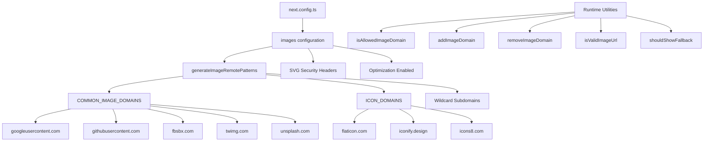

# Otimização de imagem

## Visão geral

O modelo Ever Works configura a otimização de imagem Next.js com padrões remotos dinâmicos, suporte SVG e uma camada de utilitário para gerenciamento de domínio. O sistema lida com imagens de provedores OAuth (Google, GitHub, Facebook, Twitter), serviços de banco de imagens (Unsplash) e bibliotecas de ícones, ao mesmo tempo em que impõe cabeçalhos de segurança para conteúdo SVG.

## Arquitetura



## Arquivos de origem

|Arquivo|Objetivo|
|------|---------|
|`template/next.config.ts`|Configuração da imagem Next.js|
|`template/lib/utils/image-domains.ts`|Utilitários de gerenciamento de domínio|

## Configuração

### Configurações de imagem Next.js

```typescript
// next.config.ts
images: {
    remotePatterns: generateImageRemotePatterns(),
    dangerouslyAllowSVG: true,
    contentDispositionType: 'attachment',
    contentSecurityPolicy: "default-src 'self'; script-src 'none'; sandbox;",
    unoptimized: false,
},
```

|Configuração|Valor|Objetivo|
|---------|-------|---------|
|`remotePatterns`|Dinâmico via `generateImageRemotePatterns()`|Colocar domínios de imagens externas na lista de permissões|
|`dangerouslyAllowSVG`|`true`|Permitir imagens SVG através do otimizador|
|`contentDispositionType`|`'attachment'`|Forçar download em vez de renderização in-line para acesso bruto|
|`contentSecurityPolicy`|Caixa de areia estrita|Evite ataques XSS baseados em SVG|
|`unoptimized`|`false`|Mantenha a otimização de imagens ativada|

### Segurança SVG

Arquivos SVG podem conter JavaScript incorporado. O modelo atenua isso com:
- **Política de segurança de conteúdo**: `script-src 'none'; sandbox;` impede a execução de scripts em SVGs
- **Disposição de conteúdo**: `attachment` garante que os SVGs sejam baixados, e não executados, quando acessados diretamente

## Geração remota de padrões

A função `generateImageRemotePatterns()` cria a lista de permissões dinamicamente:

```typescript
export function generateImageRemotePatterns() {
    const patterns = [
        {
            protocol: 'https' as const,
            hostname: 'lh3.googleusercontent.com',
            pathname: '/a/**'
        },
        {
            protocol: 'https' as const,
            hostname: 'avatars.githubusercontent.com',
            pathname: '/u/**'
        },
        {
            protocol: 'https' as const,
            hostname: 'platform-lookaside.fbsbx.com',
            pathname: '/platform/**'
        },
        // ... more specific patterns
    ];

    // Add wildcard subdomain patterns
    [...COMMON_IMAGE_DOMAINS, ...ICON_DOMAINS].forEach((domain) => {
        patterns.push({
            protocol: 'https' as const,
            hostname: `*.${domain}`,
            pathname: '/**'
        });
    });

    return patterns;
}
```

### Domínios permitidos

**Domínios de imagem comuns** (avatares OAuth, banco de imagens):

|Domínio|Fonte|
|--------|--------|
|`lh3.googleusercontent.com`|Avatares do Google OAuth|
|`avatars.githubusercontent.com`|Avatares OAuth do GitHub|
|`platform-lookaside.fbsbx.com`|Avatares OAuth do Facebook|
|`pbs.twimg.com`|Avatares do Twitter/X|
|`images.unsplash.com`|Fotos de banco de imagens do Unsplash|

**Domínios de ícones** (ícones de itens):

|Domínio|Fonte|
|--------|--------|
|`flaticon.com`|Ícones de ícones planos|
|`iconify.design`|Iconificar ícones|
|`icons8.com`|Ícones8 ícones|
|`feathericons.com`|Ícones de penas|
|`heroicons.com`|Ícones de herói|
|`tabler-icons.io`|Ícones da tabela|

## Gerenciamento de domínio em tempo de execução

### Verificando domínios permitidos

```typescript
import { isAllowedImageDomain } from '@/lib/utils/image-domains';

// Returns true for whitelisted domains
isAllowedImageDomain('https://lh3.googleusercontent.com/a/photo.jpg'); // true
isAllowedImageDomain('https://cdn.flaticon.com/icons/svg/123.svg');    // true
isAllowedImageDomain('https://evil-site.com/image.jpg');               // false

// Relative URLs are always allowed
isAllowedImageDomain('/images/logo.png'); // true
```

### Adição de domínio dinâmico

```typescript
import { addImageDomain, removeImageDomain } from '@/lib/utils/image-domains';

// Add a new domain at runtime
addImageDomain('cdn.example.com');

// Add as an icon domain
addImageDomain('my-icons.com', true);

// Remove a domain
removeImageDomain('old-cdn.com');
```

Nota: As adições de tempo de execução afetam as funções do utilitário, mas não modificam os padrões remotos Next.js `next.config.ts` (esses requerem uma reconstrução).

### Validação de URL

```typescript
import { isValidImageUrl, isProblematicUrl, shouldShowFallback } from '@/lib/utils/image-domains';

// Check URL format validity
isValidImageUrl('https://example.com/photo.jpg'); // true
isValidImageUrl('/images/local.png');              // true (relative)
isValidImageUrl('not-a-url');                      // false

// Check for problematic URLs (non-image pages, redirect URLs)
isProblematicUrl('https://flaticon.com/icone-gratuite/search'); // true (not a direct image)
isProblematicUrl('https://cdn.flaticon.com/icon.svg');          // false (has image extension)

// Determine if fallback icon should be shown
shouldShowFallback('');                                          // true (empty)
shouldShowFallback('https://flaticon.com/icone-gratuite/123');   // true (problematic)
shouldShowFallback('https://cdn.flaticon.com/icon.svg');         // false
```

## Cabeçalhos de segurança

O `next.config.ts` aplica cabeçalhos de segurança a todas as rotas:

```typescript
async headers() {
    return [{
        source: "/(.*)",
        headers: [
            { key: "X-Content-Type-Options", value: "nosniff" },
            { key: "X-Frame-Options", value: "DENY" },
            { key: "Referrer-Policy", value: "strict-origin-when-cross-origin" },
            { key: "X-DNS-Prefetch-Control", value: "on" },
            { key: "Strict-Transport-Security", value: "max-age=63072000; includeSubDomains; preload" },
            {
                key: "Content-Security-Policy",
                value: "default-src 'self'; script-src 'self' 'unsafe-inline' https://assets.lemonsqueezy.com; style-src 'self' 'unsafe-inline'; img-src 'self' data: https:; font-src 'self'; connect-src 'self' https:; frame-ancestors 'none';"
            },
        ],
    }];
},
```

A diretiva `img-src 'self' data: https:` permite imagens da mesma origem, URIs de dados e qualquer fonte HTTPS. Isso é intencionalmente permissivo para `img-src` porque o componente Next.js Image lida com a validação de domínio no nível do aplicativo.

## Melhores práticas

1. **Use `next/image`** para todas as imagens externas - ele lida com otimização, carregamento lento e conversão de formato
2. **Adicione novos domínios a `image-domains.ts`** -- não inline em `next.config.ts`
3. **Verifique `shouldShowFallback()`** antes de renderizar - mostra um ícone padrão para URLs inválidos/ausentes
4. **Mantenha os cabeçalhos de segurança SVG** -- nunca remova as configurações `contentSecurityPolicy` ou `contentDispositionType`
5. **Prefira restrições de nome de caminho** -- use padrões `pathname` específicos (por exemplo, `/a/**`) em vez de curingas amplos, quando possível
