# Visão geral dos utilitários Lib

O diretório `template/lib/` é o utilitário principal e a camada de lógica de negócios do modelo Ever Works. Ele contém módulos compartilhados para análise, comunicação API, autenticação, trabalhos em segundo plano, cache, configuração, acesso ao banco de dados, pagamentos, ferramentas de edição, guardas e muito mais. Toda a lógica sem componente e sem rota vive aqui seguindo o princípio de manter a apresentação dos componentes e delegar lógica pesada para `lib/`.

## Mapa do Módulo

```mermaid
graph TD
    subgraph Core Infrastructure
        A[config/] --> B[config.ts / config-manager.ts]
        C[db/] --> D[drizzle.ts / queries/ / migrate.ts]
        E[cache-config.ts] --> F[cache-invalidation.ts]
    end

    subgraph Auth & Security
        G[auth/] --> H[NextAuth / Supabase / Guards / Caching]
        I[guards/] --> J[Plan Feature Access Control]
        K[permissions/] --> L[Role-Based Permissions]
    end

    subgraph API Layer
        M[api/] --> N[ApiClient / ServerClient / Error Handling]
    end

    subgraph Analytics & Tracking
        O[analytics/] --> P[PostHog + Sentry Singleton]
    end

    subgraph Background Processing
        Q[background-jobs/] --> R[Trigger.dev / Local / NoOp]
    end

    subgraph Content & Editor
        S[content.ts] --> T[Git CMS Content Loader]
        U[editor/] --> V[TipTap Rich Text Editor]
        W[lib.ts] --> X[Content Path / File Utilities]
    end

    subgraph Business Logic
        Y[services/] --> Z[20+ Domain Services]
        AA[repositories/] --> AB[Data Access Layer]
        AC[payment/] --> AD[Stripe / LemonSqueezy / Polar]
    end

    subgraph Shared Utilities
        AE[constants.ts + constants/]
        AF[utils.ts + utils/]
        AG[types.ts + types/]
        AH[validations/]
        AI[helpers.ts]
    end
```



## Estrutura de diretório

|Diretório/Arquivo|Descrição|
|-----------------|-------------|
|`lib/analytics/`|Singleton de análise PostHog + Sentry ([docs](./analytics-module))|
|`lib/api/`|Clientes HTTP para navegador e servidor ([docs](./api-client-module))|
|`lib/auth/`|Autenticação com NextAuth.js + Supabase ([docs](./auth-utilities-module))|
|`lib/background-jobs/`|Agendamento de trabalho com Trigger.dev / local / no-op ([docs](./background-jobs-module))|
|`lib/cache-config.ts`|TTL de cache e definições de tags ([docs](./cache-invalidation-module))|
|`lib/cache-invalidation.ts`|Funções de invalidação de cache ([docs](./cache-invalidation-module))|
|`lib/config/`|Serviço de configuração centralizado com esquemas Zod|
|`lib/config.ts`|Configuração do site (`siteConfig`)|
|`lib/config-manager.ts`|Gerenciador de configuração de tempo de execução|
|`lib/constants.ts`|Barril de constantes de aplicativo ([docs](./constants-reference-module))|
|`lib/constants/`|Constantes específicas do domínio (pagamento, análise)|
|`lib/content.ts`|Carregamento e cache de conteúdo CMS baseado em Git|
|`lib/db/`|Conexão de banco de dados, migrações, propagação, consultas ([docs](./db-utilities-module))|
|`lib/editor/`|Componentes e utilitários do editor de rich text TipTap ([docs](./editor-utilities-module))|
|`lib/guards/`|Controle de acesso a recursos baseado em plano ([docs](./guards-module))|
|`lib/helpers.ts`|Mapeamento de código de idioma para código de país|
|`lib/lib.ts`|Resolução de caminho de conteúdo, utilitários de sistema de arquivos|
|`lib/logger.ts`|Utilitário de registro estruturado|
|`lib/mail/`|Envio de e-mail com suporte a modelos|
|`lib/mappers/`|Mapeadores de transformação de dados|
|`lib/maps/`|Integrações de provedores de mapas (Google Maps, Mapbox)|
|`lib/middleware/`|Utilitários de middleware Next.js|
|`lib/newsletter/`|Provedores de assinatura de boletins informativos|
|`lib/paginate.ts`|Função auxiliar de paginação|
|`lib/payment/`|Processamento de pagamentos (Stripe, LemonSqueezy, Solidgate, Polar)|
|`lib/permissions/`|Definições de permissão baseadas em função|
|`lib/query-client.ts`|Configuração do cliente React Query|
|`lib/react-query-config.ts`|Opções padrão do React Query|
|`lib/repositories/`|Camada de acesso a dados (padrão de repositório)|
|`lib/repository.ts`|Operações do repositório Git (clonar, puxar, sincronizar)|
|`lib/seo/`|Metadados de SEO e geradores de dados estruturados|
|`lib/services/`|Serviços de lógica de negócios (mais de 20 serviços de domínio)|
|`lib/stripe-helpers.ts`|Utilitários específicos do Stripe|
|`lib/swagger/`|Anotações Swagger/OpenAPI|
|`lib/theme-color-manager.ts`|Gerenciamento dinâmico de cores de tema|
|`lib/theme-utils.ts`|Funções utilitárias de tema|
|`lib/themes.tsx`|Definições de tema|
|`lib/types.ts`|Definições de tipo compartilhado|
|`lib/types/`|Definições de tipo específico de domínio|
|`lib/utils.ts`|Funções de utilidade geral|
|`lib/utils/`|Utilitários específicos de domínio (mais de 15 módulos)|
|`lib/validations/`|Esquemas de validação Zod|

## Principais módulos autônomos

### `lib/helpers.ts` -- Mapeamento de código de idioma/país

```typescript
type LanguageCode = 'en' | 'fr' | 'es' | 'zh' | 'de' | 'ar' | ... ;

const LANGUAGE_COUNTRY_CODES: Record<LanguageCode, string>;
// { en: 'US', fr: 'FR', es: 'ES', zh: 'CN', ... }

const appLocales: string[];
// All supported locale codes

function getCountryCode(languageCode?: LanguageCode): string;
// 'en' -> 'US', 'fr' -> 'FR'
```

### `lib/lib.ts` -- Caminho de conteúdo e sistema de arquivos

Utilitários somente de servidor para gerenciamento de diretório de conteúdo:

```typescript
function getContentPath(): string;
// Returns '.content' path (local) or '/tmp/.content' (Vercel runtime)

async function ensureContentAvailable(): Promise<string>;
// Ensures content is available, triggering Git clone if needed

async function fsExists(filepath: string): Promise<boolean>;
async function dirExists(dirpath: string): Promise<boolean>;
```

### `lib/paginate.ts` -- Auxiliar de paginação

```typescript
function paginate<T>(items: T[], page: number, limit: number): T[];
```

### `lib/logger.ts` -- Registro Estruturado

```typescript
const logger = {
  info(message: string, context?: Record<string, any>): void;
  warn(message: string, context?: Record<string, any>): void;
  error(message: string, context?: Record<string, any>): void;
  debug(message: string, context?: Record<string, any>): void;
};
```

### `lib/color-generator.ts` -- Geração Determinística de Cores

Gera cores consistentes a partir de strings (usadas para avatares, tags, etc.).

### `lib/theme-color-manager.ts` -- Cores dinâmicas do tema

Gerencia atualizações de propriedades personalizadas CSS para troca de tema.

## Camada de serviços (`lib/services/`)

O diretório de serviços contém serviços de lógica de negócios organizados por domínio:

|Serviço|Responsabilidade|
|---------|---------------|
|`analytics-background-processor.ts`|Processamento de análise em segundo plano|
|`analytics-export.service.ts`|Exportação de dados analíticos|
|`analytics-scheduled-reports.service.ts`|Relatórios analíticos programados|
|`category-file.service.ts`|Operações de arquivo de categoria|
|`category-git.service.ts`|Categoria Operações Git|
|`collection-git.service.ts`|Operações de coleta Git|
|`company.service.ts`|Gerenciamento de perfil da empresa|
|`currency-detection.service.ts`|Detecção de moeda do usuário|
|`currency.service.ts`|Conversão de moeda|
|`email-notification.service.ts`|Notificações por e-mail|
|`engagement.service.ts`|Ver/votar/rastreamento favorito|
|`file.service.ts`|Upload/gerenciamento de arquivos|
|`geocoding/`|Geocodificação com provedores Google/Mapbox|
|`item-audit.service.ts`|Trilha de auditoria de item|
|`item-git.service.ts`|Operações de item Git|
|`location/`|Indexação e gerenciamento de localização|
|`moderation.service.ts`|Moderação de conteúdo|
|`notification.service.ts`|Notificações push|
|`posthog-api.service.ts`|API PostHog do lado do servidor|
|`role-db.service.ts`|Gerenciamento de funções|
|`settings.service.ts`|Configurações do aplicativo|
|`sponsor-ad.service.ts`|Gerenciamento de anúncios do patrocinador|
|`stripe-products.service.ts`|Sincronização de produto Stripe|
|`subscription-jobs.ts`|Jobs em segundo plano de assinatura|
|`subscription.service.ts`|Ciclo de vida da assinatura|
|`survey.service.ts`|Gerenciamento de pesquisas|
|`sync-service.ts`|Sincronização de repositório Git|
|`tag-git.service.ts`|Marcar operações do Git|
|`twenty-crm-*.ts`|Integração de vinte CRM (5 arquivos)|
|`user-db.service.ts`|Operações de banco de dados do usuário|
|`webhook-subscription.service.ts`|Gerenciamento de webhook|

## Camada de utilitários (`lib/utils/`)

Módulos utilitários para questões específicas:

|Módulo|Objetivo|
|--------|---------|
|`api-error.ts`|Classe de erro da API|
|`bot-detection.ts`|Detecção de agente de usuário de bot|
|`checkout-utils.ts`|Ajudantes de pagamento|
|`client-auth.ts`|Utilitários de autenticação do lado do cliente|
|`currency-format.ts`|Formatação de moeda|
|`custom-navigation.ts`|Navegação personalizada do roteador|
|`database-check.ts`|Verificação de integridade do banco de dados|
|`email-validation.ts`|Validação de formato de e-mail|
|`error-handler.ts`|Manipulador de erros global|
|`featured-items.ts`|Seleção de itens em destaque|
|`footer-utils.ts`|Utilitários de link de rodapé|
|`image-domains.ts`|Domínios de imagem permitidos|
|`pagination-validation.ts`|Validação de parâmetro de paginação|
|`payment-provider.ts`|Detecção de provedor de pagamento|
|`plan-expiration.utils.ts`|Cálculos de expiração do plano|
|`rate-limit.ts`|Limitação de taxa de API|
|`request-body.ts`|Solicitar análise do corpo|
|`server-url.ts`|Resolução de URL do servidor|
|`settings.ts`|Funções auxiliares de configurações|
|`slug.ts`|Geração de slug de URL|
|`url-cleaner.ts`|Limpeza de URL|
|`url-filter-sync.ts`|Sincronização de estado do filtro de URL|

## Princípios de Design

1. **Separação de preocupações** -- Lógica de negócios em `services/`, acesso a dados em `repositories/` e `db/queries/`, apresentação em `components/`.

2. **Segurança de script** – Módulos usados por scripts de migração/seed (como `constants/payment.ts` e `db/config.ts`) evitam a importação de código específico do Next.js.

3. **Inicialização lenta** – Conexões de banco de dados, clientes de API e gerenciadores de tarefas usam padrões singleton com inicialização lenta para evitar erros durante o tempo de construção.

4. **Importações dinâmicas** – Módulos específicos do Node.js usam importações dinâmicas em trabalhos em segundo plano e autenticação para evitar problemas de empacotamento de webpack.

5. **Limite de servidor/cliente** -- Módulos somente de servidor usam o pacote `server-only`. Módulos seguros para o cliente evitam importações de servidores. A diretiva `'use client'` é usada com moderação.
