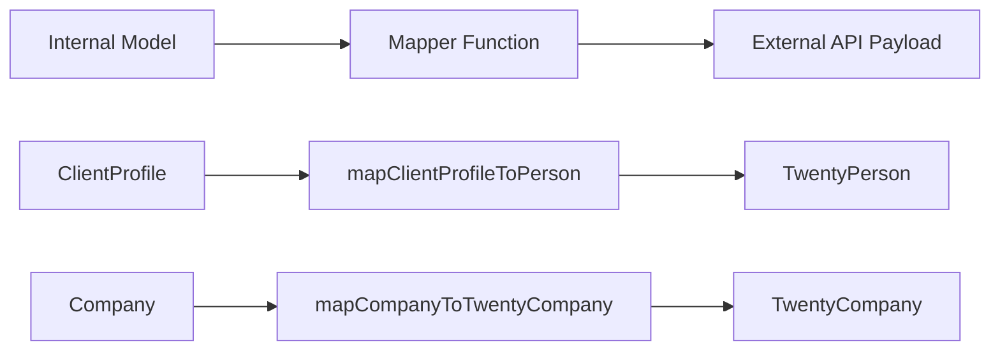

# Padrões de mapeador

O modelo usa funções de mapeador puras para transformar dados entre modelos internos e cargas externas de API. Os mapeadores são livres de efeitos colaterais, seguros para nulos e validam os campos obrigatórios antes da transformação.

## Visão geral da arquitetura



## Arquivos de origem

|Arquivo|Objetivo|
|------|---------|
|`lib/mappers/twenty-crm.mapper.ts`|Mapeia entidades locais para cargas úteis da API Twenty CRM|

## Princípios de Design

O módulo mapeador segue convenções estritas de programação funcional:

1. **Funções puras** – sem efeitos colaterais, sem mutações, sem chamadas de banco de dados
2. **Null-safe** – todos os campos opcionais usam verificações nulas/indefinidas explícitas
3. **Validação antes do mapeamento** – os campos obrigatórios são validados com erros descritivos
4. **Aplicação de ID externo** – cada entidade mapeada deve ter um `external_id` válido

## Validação de ID Externa

Cada entidade mapeada para um sistema externo requer um identificador válido:

```typescript
export function ensureExternalId(id: string | undefined | null, entityType: string): string {
  if (!id || id.trim() === '') {
    throw new Error(`${entityType} ID is required for external_id mapping`);
  }
  return id.trim();
}
```

Esta função é chamada no início de cada mapeador para garantir que o campo `external_id` nunca fique vazio.

## Extração de localização

Uma função utilitária analisa nomes de cidades a partir de strings de localização em texto livre:

```typescript
export function extractCityFromLocation(location: string | undefined | null): string | null {
  if (!location || location.trim() === '') return null;
  const parts = location.split(',');
  const city = parts[0]?.trim();
  return city || null;
}
```

Lida com formatos como `"San Francisco"`, `"San Francisco, CA"` e `"San Francisco, CA, USA"`.

## ClientProfile para vinte pessoas do CRM

Mapeia registros internos `ClientProfile` para a carga útil Twenty CRM `TwentyPerson`:

```typescript
export function mapClientProfileToPerson(clientProfile: ClientProfile): TwentyPerson {
  const external_id = ensureExternalId(clientProfile.id, 'ClientProfile');

  const person: TwentyPerson = {
    external_id,
    name: clientProfile.name,
    email: clientProfile.email,
  };

  // Optional field mapping (null-safe)
  if (clientProfile.phone)     person.phone = clientProfile.phone;
  if (clientProfile.jobTitle)  person.job_title = clientProfile.jobTitle;
  if (clientProfile.company)   person.company_name = clientProfile.company;
  if (clientProfile.website)   person.website = clientProfile.website;

  const city = extractCityFromLocation(clientProfile.location);
  if (city) person.city = city;

  // Custom fields
  if (clientProfile.accountType) person.account_type = clientProfile.accountType;
  if (clientProfile.plan)        person.plan = clientProfile.plan;
  if (clientProfile.totalSubmissions !== null && clientProfile.totalSubmissions !== undefined) {
    person.total_submissions = clientProfile.totalSubmissions;
  }

  return person;
}
```

### Tabela de mapeamento de campos

|Campo Perfil do Cliente|Campo TwentyPerson|Obrigatório|Notas|
|--------------------|--------------------|----------|-------|
|`id`|`external_id`|Sim|Validado e cortado|
|`name`|`name`|Sim|Mapeamento direto|
|`email`|`email`|Sim|Mapeamento direto|
|`phone`|`phone`|Não|Somente se presente|
|`jobTitle`|`job_title`|Não|camelCase para cobra_case|
|`company`|`company_name`|Não|Campo renomeado|
|`website`|`website`|Não|Mapeamento direto|
|`location`|`city`|Não|Extraído via `extractCityFromLocation`|
|`accountType`|`account_type`|Não|Campo personalizado|
|`plan`|`plan`|Não|Campo personalizado|
|`totalSubmissions`|`total_submissions`|Não|Verificação nula explícita necessária|

## Empresa para Vinte Empresa CRM

Mapeia entidades `Company` internas para a carga útil do Twenty CRM `TwentyCompany`:

```typescript
export function mapCompanyToTwentyCompany(company: Company): TwentyCompany {
  const external_id = ensureExternalId(company.id, 'Company');

  const twentyCompany: TwentyCompany = {
    external_id,
    name: company.name,
  };

  if (company.domain)  twentyCompany.domain_name = company.domain;
  if (company.website) twentyCompany.website = company.website;
  if (company.status)  twentyCompany.status = company.status;

  return twentyCompany;
}
```

### Tabela de mapeamento de campos

|Campo da empresa|Campo TwentyCompany|Obrigatório|Notas|
|--------------|---------------------|----------|-------|
|`id`|`external_id`|Sim|Validado e cortado|
|`name`|`name`|Sim|Mapeamento direto|
|`domain`|`domain_name`|Não|Campo renomeado|
|`website`|`website`|Não|Mapeamento direto|
|`status`|`status`|Não|`'active'` ou `'inactive'`|

## Adicionando novos mapeadores

Ao criar mapeadores para novas integrações, siga os padrões estabelecidos:

```typescript
// 1. Always validate external_id first
const external_id = ensureExternalId(entity.id, 'EntityName');

// 2. Build the required fields object
const payload: ExternalType = {
  external_id,
  // ... required fields
};

// 3. Conditionally add optional fields (null-safe)
if (entity.optionalField) {
  payload.optional_field = entity.optionalField;
}

// 4. Return the payload -- never mutate the input
return payload;
```

## Considerações de teste

Como os mapeadores são funções puras, eles são simples de testar por unidade:

- Teste com todos os campos opcionais preenchidos
- Teste com todos os campos opcionais como `null` ou `undefined`
- Teste se a falta de IDs obrigatórios gera erros descritivos
- Extração de localização de teste com vários formatos de string
- Verifique se o objeto de entrada nunca sofreu mutação
