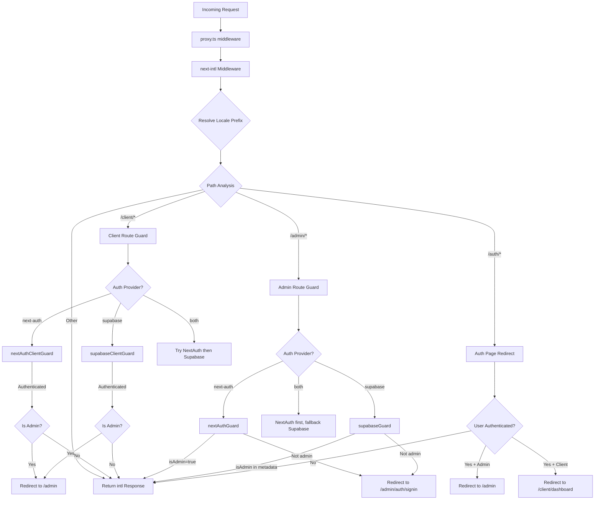

# Cadeia de middleware e processamento de solicitações

## Visão geral

O modelo Ever Works usa uma arquitetura **middleware unificada** definida em `proxy.ts` na raiz do projeto. Este middleware orquestra três preocupações críticas para cada solicitação recebida:

1. **Internacionalização** – detecção de localidade, inserção de prefixo e roteamento via `next-intl`
2. **Protetores de autenticação** - protegendo rotas `/admin/*` e `/client/*` usando NextAuth, Supabase ou ambos
3. **Redirecionamento baseado em função** – afastando usuários autenticados de páginas de autenticação públicas e redirecionando administradores/clientes para seus respectivos painéis

O design suporta um modelo de **provedor de autenticação conectável**: o middleware lê o `AuthProviderType` (`'next-auth'`, `'supabase'` ou `'both'` atual) da configuração de autenticação centralizada e seleciona as funções de proteção apropriadas de acordo.

## Diagrama de Arquitetura



## Arquivos de origem

|Arquivo|Objetivo|
|------|---------|
|`template/proxy.ts`|Principal ponto de entrada do middleware|
|`template/lib/auth/config.ts`|Configuração do provedor de autenticação (`getAuthConfig()`)|
|`template/lib/auth/supabase/middleware.ts`|Auxiliar de atualização de sessão Supabase|
|`template/lib/auth/validate-callback-url.ts`|Construção segura de URL de retorno de chamada|
|`template/i18n/routing.ts`|Configuração de roteamento local|

## Solicitar ordem de processamento

### Passo 1: Internacionalização

Cada solicitação passa primeiro pelo middleware `next-intl` criado com `createIntlMiddleware(routing)`:

```typescript
import createIntlMiddleware from 'next-intl/middleware';
import { routing } from './i18n/routing';

const intl = createIntlMiddleware(routing);
```

Isso lida com a detecção de localidade por meio do cabeçalho `Accept-Language`, preferências de cookies e prefixo de URL. A configuração de roteamento usa `localePrefix: "as-needed"`, o que significa que a localidade padrão (`en`) não requer um prefixo de URL.

### Etapa 2: Resolução de localidade

O auxiliar `resolveLocalePrefix` extrai informações de localidade do nome do caminho:

```typescript
function resolveLocalePrefix(pathname: string): {
    prefix: string;       // e.g., "/fr" or ""
    hasLocale: boolean;
    locale?: string;
    pathWithoutLocale: string;  // e.g., "/admin/items"
}
```

Isso é crítico porque todas as correspondências de caminho subsequentes (por exemplo, verificação de `/admin` ou `/client`) devem operar no caminho **sem** o prefixo de localidade.

### Passo 3: Seleção de Guarda Baseada em Rota

O middleware avalia `pathWithoutLocale` para determinar qual cadeia de proteção aplicar:

|Padrão de caminho|Proteção Aplicada|Objetivo|
|-------------|--------------|---------|
|`/client` ou `/client/*`|Proteção de autenticação do cliente|Requer autenticação; redireciona administradores para `/admin`|
|`/admin/*` (exceto `/admin/auth/signin`)|Proteção de autenticação do administrador|Requer autenticação + sinalizador `isAdmin`|
|`/auth/*`|Redirecionamento da página de autenticação|Redireciona usuários autenticados para fora do login/registro|
|Todo o resto|Sem guarda|Passa com resposta i18n|

### Etapa 4: verificação de autenticação

#### NextAuth Guard (baseado em JWT)

```typescript
const token = await getToken({ req, secret: process.env.AUTH_SECRET });
if (token?.isAdmin === true) {
    return baseRes; // Admin access granted
}
```

Os guardas NextAuth usam `getToken()` de `next-auth/jwt` para ler o token JWT dos cookies. Isso é compatível com o Edge Runtime e não requer uma pesquisa no banco de dados.

#### Guarda Supabase

```typescript
const supRes = await supabaseUpdate(req);
// Merge cookies...
const { data: { user } } = await supabase.auth.getUser();
const isAdmin = user?.user_metadata?.isAdmin === true
    || user?.user_metadata?.role === 'admin';
```

O guarda Supabase primeiro atualiza a sessão usando `updateSession()` e, em seguida, verifica os metadados do usuário em busca de sinalizadores de administrador.

### Etapa 5: propagação de cookies

Um detalhe crítico de implementação: quando um guarda produz uma resposta de redirecionamento, todos os cookies do `intlResponse` devem ser propagados:

```typescript
const redirectRes = NextResponse.redirect(url);
baseRes.cookies.getAll().forEach((c) => redirectRes.cookies.set(c));
return redirectRes;
```

Isso garante que as preferências de localidade e os cookies da sessão de autenticação sobrevivam aos redirecionamentos.

## Configuração

### Seleção de provedor de autenticação

O provedor de autenticação é determinado por `getAuthConfig()` em `lib/auth/config.ts`:

```typescript
export type AuthProviderType = 'supabase' | 'next-auth' | 'both';

export function getAuthConfig(): AuthConfig {
    // Priority 1: Global override via configureAuth()
    // Priority 2: Environment-based (detects Supabase env vars)
    // Priority 3: Default ('next-auth')
}
```

### Correspondente de middleware

```typescript
export const config = {
    matcher: ['/((?!api|trpc|_next|_vercel|.*\\..*).*)']
};
```

Este regex exclui:
- Rotas `/api/*` (tratadas pela camada API Next.js)
- `/trpc/*` rotas
- `/_next/*` (internos do Next.js)
- `/_vercel/*` (internos da Vercel)
- Qualquer caminho com extensão de arquivo (ativos estáticos)

### Segurança de URL de retorno de chamada

O middleware usa `createSafeCallbackUrl()` para evitar ataques de redirecionamento aberto:

```typescript
export function createSafeCallbackUrl(pathname: string, search?: string): string {
    // Limits URL length to 2048 characters
    // Validates relative-only paths
}

export function isValidCallbackUrl(url: string | null): boolean {
    return url?.startsWith('/') && !url.startsWith('//');
}
```

## Modo de provedor duplo ("ambos")

Quando `provider === 'both'`, o middleware implementa uma cadeia de fallback:

1. **Rotas de cliente**: experimente NextAuth primeiro; se não for autenticado, tente Supabase
2. **Rotas administrativas**: experimente o NextAuth primeiro; se produzir um redirecionamento (negado), tente Supabase
3. **Páginas de autenticação**: verifique primeiro o token NextAuth e depois verifique a sessão Supabase

Isso permite que as organizações migrem entre provedores de autenticação sem interromper os usuários existentes.

## Principais detalhes de implementação

### Compatibilidade de tempo de execução do Edge

O middleware é executado no Next.js Edge Runtime. Todas as verificações de autenticação usam APIs compatíveis com Edge:
- NextAuth: `getToken()` (baseado em JWT, sem necessidade de banco de dados)
- Supabase: `createServerClient()` com sessão baseada em cookie

### Registro de Desenvolvimento vs. Produção

O registro de depuração é protegido por `NODE_ENV === 'development'`:

```typescript
if (process.env.NODE_ENV === 'development') {
    console.log('[Middleware] Admin access granted via token');
}
```

### Atualização da Sessão Supabase

O auxiliar de middleware Supabase (`updateSession`) é chamado antes de cada verificação de autenticação para garantir que os tokens sejam atualizados:

```typescript
export async function updateSession(request: NextRequest) {
    const supabase = createServerClient(url, anonKey, {
        cookies: { getAll, setAll }
    });
    // IMPORTANT: DO NOT REMOVE auth.getUser()
    await supabase.auth.getUser();
    return supabaseResponse;
}
```

O comentário no código-fonte enfatiza que `auth.getUser()` não deve ser removido - ele aciona o ciclo de atualização do token que evita logouts aleatórios.
