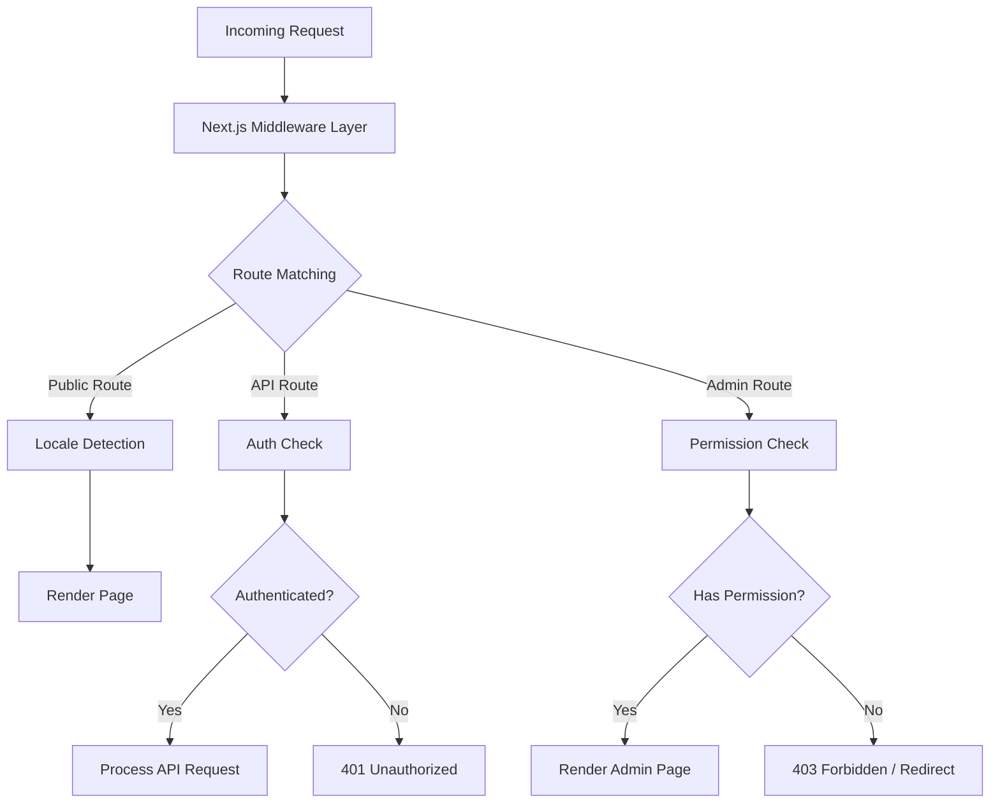
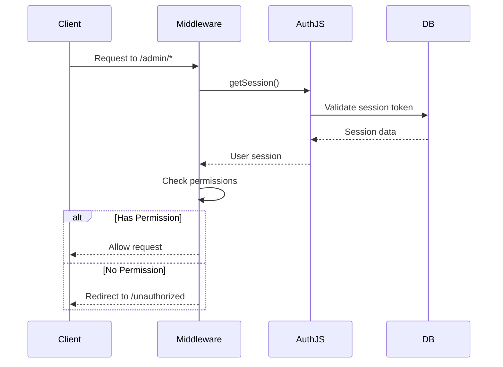
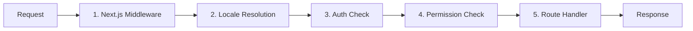

# Aprofundamento do Middleware

O modelo Ever Works usa uma arquitetura de middleware em camadas construída nas convenções do Next.js App Router e na lógica personalizada de verificação de permissão. Este documento cobre todo o pipeline de processamento de solicitações, verificações de permissão, middleware de autenticação, manipulação de localidade e pedido de middleware.

## Visão geral da arquitetura



## Middleware de verificação de permissão

O sistema de verificação de permissão reside em `lib/middleware/permission-check.ts` e fornece controle de acesso granular para rotas de API e páginas de administração.

### Interface principal

```typescript
interface UserPermissions {
  userId: string;
  roles: string[];
  permissions: Permission[];
}
```

### Funções de verificação de permissão

|Função|Objetivo|Devoluções|
|---|---|---|
|`hasPermission(user, permission)`|Verifique a permissão única|`boolean`|
|`hasAnyPermission(user, permissions)`|Verifique se o usuário possui pelo menos um|`boolean`|
|`hasAllPermissions(user, permissions)`|Verifique se o usuário tem todos listados|`boolean`|
|`hasResourcePermission(user, resource, action)`|Verifique o formato `resource:action`|`boolean`|
|`getResourcePermissions(user, resource)`|Obtenha todas as permissões para um recurso|`Permission[]`|
|`canManageResource(user, resource)`|Verifique o acesso de criação/atualização/exclusão|`boolean`|
|`isSuperAdmin(user)`|Verifique a função de superadministrador ou todas as permissões|`boolean`|

### Uso em rotas API

```typescript
import { hasPermission, hasAnyPermission } from '@/lib/middleware/permission-check';

export async function GET(request: Request) {
  const userPermissions = await getUserPermissions(session);

  // Single permission check
  if (!hasPermission(userPermissions, 'items:read')) {
    return new Response('Forbidden', { status: 403 });
  }

  // Multiple permission check (any)
  if (!hasAnyPermission(userPermissions, ['items:review', 'items:approve'])) {
    return new Response('Forbidden', { status: 403 });
  }
}
```

### Verificações em nível de recurso

```typescript
// Check specific resource and action
const canEdit = hasResourcePermission(userPermissions, 'items', 'update');

// Get all permissions for a resource
const itemPerms = getResourcePermissions(userPermissions, 'items');
// Returns: ['items:read', 'items:create', 'items:update']

// Check management capability (create, update, or delete)
const canManage = canManageResource(userPermissions, 'categories');
```

### Auxiliares de permissão especializados

O middleware fornece auxiliares específicos de domínio que combinam várias verificações de permissão:

```typescript
// Can the user review, approve, or reject items?
const canReview = canReviewItems(userPermissions);

// Can the user manage users (read, create, update, delete, assignRoles)?
const canAdmin = canManageUsers(userPermissions);

// Can the user view analytics data?
const canView = canViewAnalytics(userPermissions);

// Is the user a super admin?
const isAdmin = isSuperAdmin(userPermissions);
```

### Detecção de superadministrador

A função `isSuperAdmin` usa uma abordagem de duas camadas:

1. **Verificação de função** (primário): verifica se o usuário tem a função `super-admin`
2. **Verificação de permissão** (substituição): verifica se o usuário tem todas as permissões do sistema

```typescript
function isSuperAdmin(userPermissions: UserPermissions): boolean {
  // Fast path: check role
  if (userPermissions.roles.includes('super-admin')) {
    return true;
  }
  // Exhaustive check: verify all permissions
  return hasAllPermissions(userPermissions, allSystemPermissions);
}
```

## Middleware de autenticação

A autenticação é feita por meio de NextAuth.js (Auth.js v5) configurado em `auth.config.ts`. O middleware é executado em todas as solicitações para rotas protegidas.

### Configuração do provedor

A configuração de autenticação configura dinamicamente os provedores OAuth com um substituto elegante:

|Provedor|Fonte de configuração|
|---|---|
|Google|`authConfig.google.clientId/clientSecret`|
|GitHub|`authConfig.github.clientId/clientSecret`|
|Facebook|`authConfig.facebook.clientId/clientSecret`|
|Twitter/X|`authConfig.twitter.clientId/clientSecret`|
|Credenciais|Sempre ativado|

Se a configuração do OAuth falhar, o sistema retornará à autenticação somente com credenciais.

### Fluxo da sessão de autenticação



## Middleware local

O modelo suporta mais de 20 localidades por meio da integração de middleware `next-intl`. A detecção de localidade segue o padrão de prefixo "conforme necessário":

- Localidade padrão (`en`): Sem prefixo de URL -- `/items/my-app`
- Outras localidades: prefixo de localidade -- `/fr/items/my-app`

### Locais suportados

|Local|Idioma|Local|Idioma|
|---|---|---|---|
|`en`|Inglês (padrão)|`ja`|Japonês|
|`fr`|Francês|`ko`|Coreano|
|`es`|Espanhol|`nl`|Holandês|
|`de`|Alemão|`pl`|Polonês|
|`zh`|Chinês|`tr`|Turco|
|`ar`|Árabe|`vi`|Vietnamita|
|`he`|Hebraico|`th`|Tailandês|
|`ru`|Russo|`hi`|Hindi|
|`uk`|Ucraniano|`id`|Indonésio|
|`pt`|Português|`bg`|Búlgaro|
|`it`|Italiano| | |

## Pipeline de processamento de solicitações

O pipeline completo de processamento de solicitações segue esta ordem:



### Etapas do pipeline

1. **Next.js Middleware** (`middleware.ts`): é executado em todas as solicitações que correspondem aos matchers configurados. Lida com redirecionamentos, reescritas e injeção de cabeçalho.

2. **Resolução de localidade**: detecta a localidade preferida do usuário no caminho da URL, no cabeçalho `Accept-Language` ou no cookie. Define a localidade do contexto da solicitação.

3. **Verificação de autenticação**: Para rotas protegidas (`/admin/*`, `/dashboard/*`, `/api/admin/*`), valida o token de sessão do usuário.

4. **Verificação de permissão**: após a autenticação, verifica se o usuário tem as permissões necessárias para o recurso e a ação específicos.

5. **Route Handler**: o componente de página real ou o manipulador de rota da API processa a solicitação.

### Garantias de pedidos de middleware

O sistema impõe uma ordem estrita:

- A detecção de localidade sempre é executada primeiro (necessária para páginas de erro)
- As verificações de autenticação são executadas antes das verificações de permissão (precisa de um usuário para verificar as permissões)
- As verificações de permissão são a porta final antes dos manipuladores de rota
- As rotas de API usam verificações de permissão em nível de função (não em nível de middleware)

## Utilitários de validação de permissão

O middleware inclui auxiliares de validação para trabalhar com strings de permissão:

```typescript
// Validate a permission string
validatePermission('items:read');     // true
validatePermission('invalid:perm');   // false

// Parse a permission into parts
parsePermission('items:update');
// Returns: { resource: 'items', action: 'update' }

// Get summary grouped by resource
getPermissionSummary(userPermissions);
// Returns: { items: ['read', 'create'], categories: ['read'] }
```

## Tratamento de erros

O sistema de middleware lida com erros em cada camada:

|Camada|Erro|Resposta|
|---|---|---|
|Local|Local inválido|Redirecionar para localidade padrão|
|Autenticação|Nenhuma sessão|401 ou redirecionar para login|
|Autenticação|Sessão expirada|401 com dica de atualização|
|Permissão|Permissão ausente|403 Proibido|
|Permissão|String de permissão inválida|Aviso registrado, acesso negado|

## Melhores práticas

1. **Use a verificação mais específica** - prefira `hasPermission` com uma única permissão em vez de `isSuperAdmin` para controle de recurso regular.

2. **Verifique as permissões nas rotas da API** – não confie apenas no middleware; sempre valide no manipulador de rotas para defesa em profundidade.

3. **Use importações dinâmicas** em middleware para evitar agrupar módulos somente de servidor no tempo de execução de borda.

4. **Mantenha as verificações de permissão rapidamente** – a pesquisa do conjunto de permissões `O(1)` garante sobrecarga mínima por solicitação.

5. **Falhas de permissão de log** – use o log estruturado com o ID do usuário e a tentativa de permissão para auditoria de segurança.
