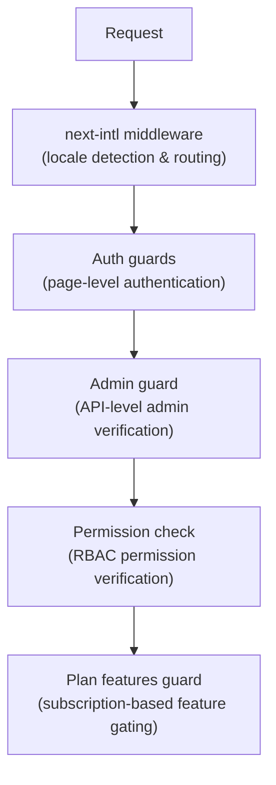

# Middleware e guardas

O modelo Ever Works usa um sistema de proteção em camadas que consiste em middleware Next.js para roteamento, protetores de autenticação para proteção de página e API, verificações de permissão para RBAC e protetores de recursos baseados em plano para controle de assinatura.

## Camadas de Middleware



## Middleware de localidade (next-intl)

O middleware raiz lida com o roteamento de internacionalização via `next-intl`. Ele é configurado por meio de `i18n/routing.ts` e `i18n/request.ts`.

Responsabilidades:
- Detecte a localidade do usuário a partir do caminho da URL, cookies ou cabeçalho `Accept-Language`
- Redirecionar solicitações sem um prefixo de localidade para a localidade apropriada
- O padrão é inglês (`en`) quando nenhuma preferência é detectada
- Suporta 6 localidades: `en`, `fr`, `es`, `de`, `ar`, `zh`

## Protetores de autenticação

### Protetores de nível de página (`lib/auth/guards.ts`)

O módulo guards fornece verificações de autenticação do lado do servidor para páginas. Eles são chamados na parte superior dos componentes do servidor para proteger o acesso à página.

**`requireAuth()`** -- Requer que o usuário seja autenticado:

```typescript
import { requireAuth } from '@/lib/auth/guards';

export default async function ProtectedPage() {
  const session = await requireAuth();
  // session.user is guaranteed to exist here
  return <div>Welcome {session.user.email}</div>;
}
```

Caso o usuário não esteja autenticado, ele será redirecionado para `/auth/signin`.

**`requireAdmin()`** -- Requer que o usuário seja autenticado E tenha função de administrador:

```typescript
import { requireAdmin } from '@/lib/auth/guards';

export default async function AdminPage() {
  const session = await requireAdmin();
  return <div>Admin: {session.user.email}</div>;
}
```

Caso o usuário não esteja autenticado, ele será redirecionado para `/admin/auth/signin`. Se autenticados, mas não administradores, eles serão redirecionados para `/unauthorized`.

**`getSession()`** -- Obtém a sessão sem redirecionar:

```typescript
const session = await getSession();
if (session) {
  // Authenticated
} else {
  // Guest
}
```

**`checkIsAdmin()`** -- Verifica o status do administrador sem redirecionar:

```typescript
const isAdmin = await checkIsAdmin();
// Returns true or false
```

### Ações validadas (`lib/auth/guards.ts`)

O módulo guards também fornece wrappers de ação validados para ações do servidor Next.js:

**`validatedAction(schema, action)`** -- Valida os dados do formulário em um esquema Zod:

```typescript
export const myAction = validatedAction(mySchema, async (data, formData) => {
  // data is validated and typed
});
```

**`validatedActionWithUser(schema, action)`** -- Valida e requer autenticação:

```typescript
export const myAction = validatedActionWithUser(mySchema, async (data, formData, user) => {
  // data is validated, user is authenticated
});
```

## Guarda Administrativa (`lib/auth/admin-guard.ts`)

O admin guard fornece proteção de rota de API especificamente para endpoints administrativos.

**`checkAdminAuth()`** -- Função de middleware para rotas de API:

```typescript
import { checkAdminAuth } from '@/lib/auth/admin-guard';

export async function GET(request: NextRequest) {
  const authError = await checkAdminAuth();
  if (authError) return authError;

  // User is verified admin, proceed with handler
}
```

Retorna `null` se autorizado ou `NextResponse` com o status de erro apropriado (401 ou 403).

**`withAdminAuth(handler)`** -- Wrapper de função de ordem superior:

```typescript
import { withAdminAuth } from '@/lib/auth/admin-guard';

export const GET = withAdminAuth(async (request) => {
  // Already verified as admin
  return NextResponse.json({ data: 'admin only' });
});
```

O guarda administrativo verifica a autenticação (a sessão existe) e a autorização (o usuário tem função de administrador no banco de dados por meio da verificação `isAdmin()`).

## Sistema de verificação de permissão (`lib/middleware/permission-check.ts`)

O sistema de permissões implementa Controle de Acesso Baseado em Função (RBAC) com permissões granulares.

### Estrutura de permissão

As permissões seguem um formato `resource:action`:

```typescript
// Examples of permission keys
'items:read'
'items:create'
'items:update'
'items:delete'
'items:review'
'items:approve'
'items:reject'
'categories:read'
'categories:create'
'users:assignRoles'
'analytics:read'
'system:settings'
```

### Funções de verificação de permissão

```typescript
import {
  hasPermission,
  hasAnyPermission,
  hasAllPermissions,
  hasResourcePermission,
  canManageResource,
  canReviewItems,
  canManageUsers,
  canManageRoles,
  canViewAnalytics,
  isSuperAdmin,
} from '@/lib/middleware/permission-check';

// Single permission check
hasPermission(userPermissions, 'items:create');

// Any of multiple permissions
hasAnyPermission(userPermissions, ['items:create', 'items:update']);

// All permissions required
hasAllPermissions(userPermissions, ['items:read', 'items:update']);

// Resource-level check
hasResourcePermission(userPermissions, 'items', 'create');

// Domain-specific helpers
canManageResource(userPermissions, 'categories'); // create, update, or delete
canReviewItems(userPermissions);                  // review, approve, or reject
canManageUsers(userPermissions);                  // user CRUD + assignRoles
isSuperAdmin(userPermissions);                    // all system permissions
```

### Detecção de superadministrador

A função `isSuperAdmin()` verifica duas condições:
1. Se o usuário tem a função `super-admin` (preferencial)
2. Como alternativa, se o usuário tem TODAS as permissões do sistema

### Validação de permissão

```typescript
// Validate a permission string is defined in the system
validatePermission('items:create'); // true
validatePermission('invalid:perm'); // false

// Parse permission into resource and action
parsePermission('items:create'); // { resource: 'items', action: 'create' }
```

## Guarda de recursos do plano (`lib/guards/plan-features.guard.ts`)

O plano apresenta controles de segurança e acesso com base em planos de assinatura (Gratuito, Padrão, Premium).

### Hierarquia do plano

```typescript
const PLAN_LEVELS = {
  free: 1,
  standard: 2,
  premium: 3,
};
```

### Matriz de acesso a recursos

Cada recurso é mapeado para os planos que podem acessá-lo:

|Recurso|Grátis|Padrão|Prêmio|
|---------|------|----------|---------|
|Enviar produto|Sim|Sim|Sim|
|Carregar imagens|Sim|Sim|Sim|
|Suporte por e-mail|Sim|Sim|Sim|
|Descrição estendida| - |Sim|Sim|
|Selo verificado| - |Sim|Sim|
|Revisão Prioritária| - |Sim|Sim|
|Ver estatísticas| - |Sim|Sim|
|Enviar vídeo| - | - |Sim|
|Selo patrocinado| - | - |Sim|
|Página inicial em destaque| - | - |Sim|
|Análise Avançada| - | - |Sim|
|Envios Ilimitados| - | - |Sim|

### Limites do plano

Cada plano tem limites numéricos para determinados recursos:

|Limite|Grátis|Padrão|Prêmio|
|-------|------|----------|---------|
|Máximo de imagens| 1 | 5 |Ilimitado|
|Palavras de descrição máxima| 200 | 500 |Ilimitado|
|Máximo de envios| 1 | 10 |Ilimitado|
|Dias de revisão| 7 | 3 | 1 |
|Dias de modificação grátis| 0 | 30 | 365 |

### Usando o Plan Guard

**Chamadas de função diretas:**

```typescript
import { canAccessFeature, getFeatureLimit, isWithinLimit } from '@/lib/guards';

canAccessFeature('upload_video', 'free');    // false
canAccessFeature('upload_video', 'premium'); // true
getFeatureLimit('max_images', 'standard');   // 5
isWithinLimit('max_submissions', 3, 'free'); // false (limit is 1)
```

**Fábrica de proteção (para verificações múltiplas):**

```typescript
import { createPlanGuard } from '@/lib/guards';

const guard = createPlanGuard('standard');
guard.canAccess('verified_badge');     // true
guard.canAccess('upload_video');       // false
guard.getLimit('max_images');          // 5
guard.requireFeature('upload_video');  // throws PlanGuardError
```

**Integração do gancho React:**

```typescript
import { createPlanGuardResult } from '@/lib/guards';

// In a hook or component
const guardResult = createPlanGuardResult(userPlan);
guardResult.canAccess('verified_badge');
guardResult.accessibleFeatures; // array of all accessible features
```

O `PlanGuardError` lançado por `requireFeature()` inclui o nome do recurso, o plano atual do usuário e o plano necessário, permitindo prompts informativos de atualização na IU.
