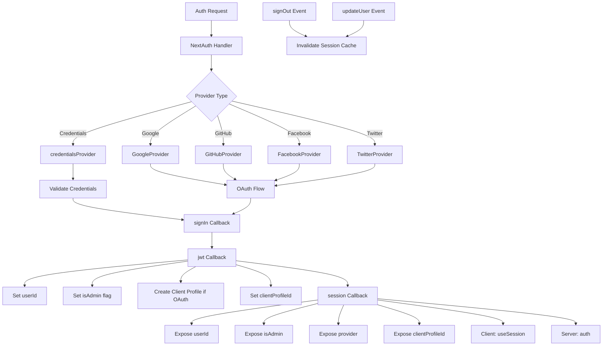

# Configuração NextAuth

## Visão geral

O modelo Ever Works configura NextAuth.js (Auth.js v5) com sessões baseadas em JWT, um adaptador Drizzle ORM, vários provedores OAuth (Google, GitHub, Facebook, Twitter), autenticação baseada em credenciais e retornos de chamada personalizados para gerenciamento de função de administrador/cliente. O sistema suporta a criação automática de perfis de cliente para usuários OAuth e armazenamento em cache de sessão com invalidação de cache.

## Arquitetura



## Arquivos de origem

|Arquivo|Objetivo|
|------|---------|
|`template/lib/auth/index.ts`|Configuração e exportações principais do NextAuth|
|`template/auth.config.ts`|Configuração do provedor (compatível com Edge)|
|`template/lib/auth/config.ts`|Seleção do tipo de provedor de autenticação|
|`template/lib/auth/providers.ts`|Funções de fábrica do provedor OAuth|
|`template/lib/auth/credentials.ts`|Implementação do provedor de credenciais|
|`template/lib/auth/guards.ts`|Utilitários de proteção de autenticação do lado do servidor|
|`template/lib/auth/middleware.ts`|Wrappers de ação validados|
|`template/lib/auth/setup.ts`|Auxiliar de inicialização de autenticação|
|`template/lib/auth/cached-session.ts`|Gerenciamento de cache de sessão|
|`template/lib/auth/session-cache.ts`|Implementação de cache de sessão|
|`template/lib/auth/admin-guard.ts`|Lógica de proteção específica do administrador|

## Inicialização NextAuth

```typescript
// lib/auth/index.ts
export const { handlers, auth, signIn, signOut, unstable_update } = NextAuth({
    adapter: drizzle,
    session: {
        strategy: 'jwt',
        maxAge: 30 * 24 * 60 * 60,    // 30 days
        updateAge: 24 * 60 * 60        // Refresh every 24 hours
    },
    jwt: {
        maxAge: 30 * 24 * 60 * 60      // 30 days
    },
    callbacks: { authorized, redirect, signIn, jwt, session },
    events: { signOut, updateUser },
    pages: {
        signIn: '/auth/signin',
        signOut: '/auth/signout',
        error: '/auth/error',
        verifyRequest: '/auth/verify-request',
        newUser: '/auth/register'
    },
    ...authConfig  // Merges providers from auth.config.ts
});
```

### Estratégia de Sessão

O modelo usa **sessões JWT** (`strategy: 'jwt'`), não sessões de banco de dados. Isso significa:
- As sessões são armazenadas em cookies criptografados, não no banco de dados
- Nenhuma consulta ao banco de dados é necessária para validar uma sessão
- Compatível com Edge Runtime (middleware)
- Os dados da sessão são limitados ao que cabe em um token JWT

## Adaptador de banco de dados

```typescript
const isDatabaseAvailable = !!coreConfig.DATABASE_URL && typeof db !== 'undefined';

const drizzle = isDatabaseAvailable
    ? DrizzleAdapter(getDrizzleInstance(), {
        usersTable: users,
        accountsTable: accounts,
        sessionsTable: sessions,
        verificationTokensTable: verificationTokens
    })
    : undefined;
```

O adaptador é criado condicionalmente com base na disponibilidade do banco de dados. Isto permite que o modelo seja iniciado mesmo sem um banco de dados (por exemplo, durante a configuração inicial), embora a autenticação seja limitada.

## Configuração do provedor

### auth.config.ts (compatível com Edge)

```typescript
// auth.config.ts
const configureProviders = () => {
    try {
        const oauthProviders = configureOAuthProviders();
        return createNextAuthProviders({
            google: oauthProviders.find((p) => p.id === 'google')
                ? { enabled: true, clientId: '...', clientSecret: '...' }
                : { enabled: false },
            github: { /* ... */ },
            facebook: { /* ... */ },
            twitter: { /* ... */ },
            credentials: { enabled: true },
        });
    } catch (error) {
        // Fallback to credentials only
        return createNextAuthProviders({
            credentials: { enabled: true },
            google: { enabled: false },
            github: { enabled: false },
            facebook: { enabled: false },
            twitter: { enabled: false },
        });
    }
};

export default {
    trustHost: true,
    providers: configureProviders(),
} satisfies NextAuthConfig;
```

### Fábrica de Provedores

```typescript
// lib/auth/providers.ts
export function createNextAuthProviders(config: OAuthProvidersConfig) {
    const providers = [];

    if (config.google?.enabled && config.google.clientId && config.google.clientSecret) {
        providers.push(GoogleProvider({
            clientId: config.google.clientId,
            clientSecret: config.google.clientSecret,
            ...config.google.options,
        }));
    }
    // GitHub, Facebook, Twitter follow the same pattern...

    if (config.credentials?.enabled) {
        providers.push(credentialsProvider);
    }

    return providers;
}
```

Os provedores só são adicionados quando possuem credenciais válidas, evitando erros de configuração na inicialização.

## Retornos de chamada

### retorno de chamada de login

```typescript
signIn: async ({ user, account, profile }) => {
    const isCredentials = account?.provider === 'credentials';

    if (!user?.email) {
        return !isCredentials; // Allow OAuth without email
    }

    if (!isDatabaseAvailable) {
        return !isCredentials; // Skip DB validation if no DB
    }

    // For OAuth providers, allow account linking
    if (!isCredentials && account?.provider) {
        return true;
    }

    return true;
}
```

### Retorno de chamada jwt

O retorno de chamada JWT é o núcleo do pipeline de autenticação. Ele é executado em todas as solicitações e gerencia:

```typescript
jwt: async ({ token, user, account }) => {
    // 1. Set userId from user object or token.sub
    if (user?.id) token.userId = user.id;
    if (!token.userId && token.sub) token.userId = token.sub;

    // 2. Set clientProfileId
    if (user?.clientProfileId) token.clientProfileId = user.clientProfileId;

    // 3. Record provider
    if (account?.provider) token.provider = account.provider;

    // 4. Auto-create client profile for OAuth users
    if (isOAuthProvider && !token.clientProfileId && token.userId) {
        let clientProfile = await getClientProfileByUserId(token.userId);
        if (!clientProfile) {
            clientProfile = await createClientProfile({
                userId: token.userId,
                email: token.email,
                name: token.name || token.email?.split('@')[0],
            });
        }
        token.clientProfileId = clientProfile?.id;
    }

    // 5. Set isAdmin flag
    if (user?.isClient !== undefined) {
        token.isAdmin = !user.isClient;
    } else if (user?.isAdmin !== undefined) {
        token.isAdmin = user.isAdmin;
    } else if (token.isAdmin === undefined) {
        token.isAdmin = false; // Default: non-admin
    }

    return token;
}
```

### retorno de chamada da sessão

Mapeia campos de token JWT para o objeto de sessão exposto aos componentes do cliente:

```typescript
session: async ({ session, token }) => {
    if (token && session.user) {
        session.user.id = token.userId;
        session.user.clientProfileId = token.clientProfileId;
        session.user.provider = token.provider || 'credentials';
        session.user.isAdmin = token.isAdmin;
    }
    return session;
}
```

## Eventos

### Invalidação de cache de sessão

```typescript
events: {
    signOut: async (event) => {
        const token = 'token' in event ? event.token : undefined;
        if (token?.userId) {
            await invalidateSessionCache(undefined, token.userId);
        }
    },
    updateUser: async ({ user }) => {
        if (user?.id) {
            await invalidateSessionCache(undefined, user.id);
        }
    }
}
```

Os eventos `signOut` e `updateUser` acionam a invalidação do cache da sessão, garantindo que dados de sessão obsoletos não sejam servidos após alterações no estado de autenticação.

## Protetores do lado do servidor

### requer Auth

```typescript
export async function requireAuth() {
    const session = await auth();
    if (!session?.user) {
        redirect('/auth/signin');
    }
    return session;
}
```

### requerAdmin

```typescript
export async function requireAdmin() {
    const session = await auth();
    if (!session?.user) {
        redirect('/admin/auth/signin');
    }
    if (!session.user.isAdmin) {
        redirect('/unauthorized');
    }
    return session;
}
```

### Guardas Utilitários

```typescript
// Check without redirecting
export async function getSession() {
    return await auth();
}

export async function checkIsAdmin() {
    const session = await auth();
    return session?.user?.isAdmin === true;
}
```

## Páginas personalizadas

|Página|Caminho|Objetivo|
|------|------|---------|
|Entrar|`/auth/signin`|Formulário de login|
|Sair|`/auth/signout`|Confirmação de logout|
|Erro|`/auth/error`|Exibição de erro de autenticação|
|Verificar solicitação|`/auth/verify-request`|Solicitação de verificação de e-mail|
|Cadastre-se|`/auth/register`|Cadastro de novo usuário|

## Variáveis de ambiente

|Variável|Obrigatório|Objetivo|
|----------|----------|---------|
|`AUTH_SECRET`|Sim|Segredo de criptografia JWT|
|`AUTH_GOOGLE_ID`|Não|ID do cliente Google OAuth|
|`AUTH_GOOGLE_SECRET`|Não|Segredo do cliente Google OAuth|
|`AUTH_GITHUB_ID`|Não|ID do cliente GitHub OAuth|
|`AUTH_GITHUB_SECRET`|Não|Segredo do cliente GitHub OAuth|
|`AUTH_FACEBOOK_ID`|Não|ID do cliente OAuth do Facebook|
|`AUTH_FACEBOOK_SECRET`|Não|Segredo do cliente OAuth do Facebook|
|`AUTH_TWITTER_ID`|Não|ID do cliente Twitter/X OAuth|
|`AUTH_TWITTER_SECRET`|Não|Segredo do cliente Twitter/X OAuth|
|`DATABASE_URL`|Para adaptador|Cadeia de conexão do banco de dados|

## Melhores práticas

1. **Use a estratégia JWT** para compatibilidade do Edge Runtime em middleware
2. **Criar perfis de cliente automaticamente** para usuários OAuth no retorno de chamada JWT
3. **Degradação normal** – se a configuração do OAuth falhar, retorne apenas às credenciais
4. **Invalidar cache em eventos de autenticação** – sair e atualização do usuário limpam sessões em cache
5. **Adaptador condicional** – permite inicialização sem um banco de dados para configuração inicial
6. **Funções de proteção** -- use `requireAuth()` / `requireAdmin()` em componentes do servidor, não em verificações manuais de sessão
7. **Páginas personalizadas** – substitui páginas NextAuth padrão para uma interface de usuário consistente com o design do modelo
