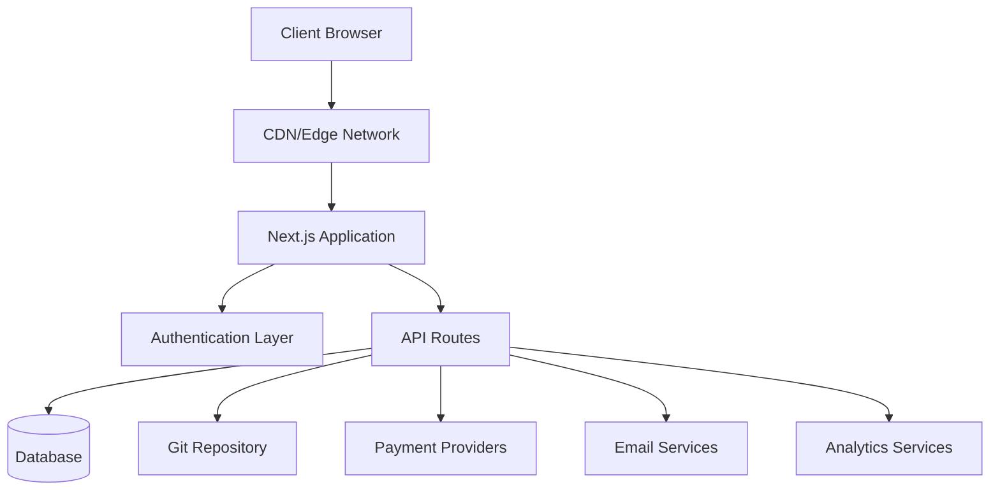
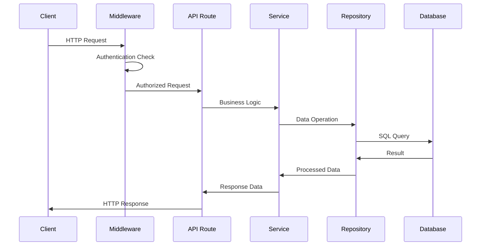
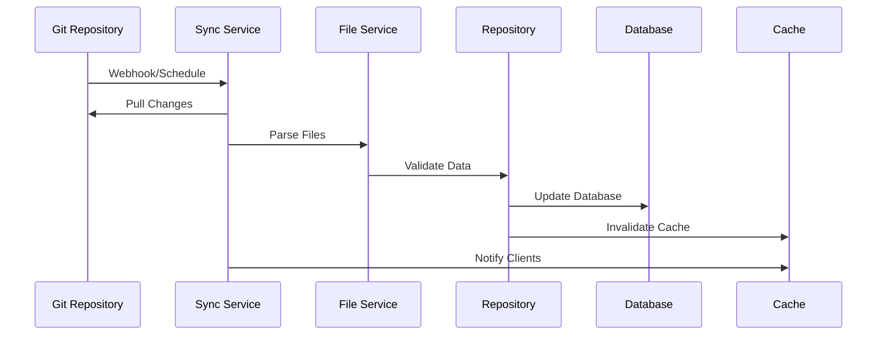
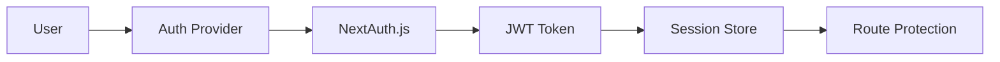

# Visão geral da arquitetura

O Ever Works segue uma arquitetura moderna e escalável projetada para desempenho, facilidade de manutenção e experiência do desenvolvedor.

## Arquitetura de alto nível



## Princípios Fundamentais

### 1. Separação de Preocupações
- **Camada de apresentação**: componentes React e lógica de UI
- **Camada de Negócios**: Serviços e repositórios
- **Camada de dados**: banco de dados e APIs externas

### 2. Projeto Modular
- Organização baseada em recursos
- Componentes reutilizáveis
- Integrações semelhantes a plug-ins

### 3. Digite Segurança
- TypeScript por toda parte
- Verificação estrita de tipo
- Validação de tempo de execução com Zod

### 4. Desempenho em primeiro lugar
- Renderização do lado do servidor
- Geração estática sempre que possível
- Estratégias de cache otimizadas

## Camadas de aplicação

### Camada de front-end

**Tecnologia**: React 19 + Next.js 15
**Responsabilidades**:
- Renderização da interface do usuário
- Gerenciamento de estado do lado do cliente
- Interações do usuário
- Manipulação de rota

**Componentes principais**:
- Componentes da página (`app/[locale]/`)
- Componentes de UI reutilizáveis (`components/`)
- Ganchos personalizados (`hooks/`)
- Provedores de contexto (`components/providers/`)

### Camada API

**Tecnologia**: Rotas da API Next.js
**Responsabilidades**:
- Execução de lógica de negócios
- Validação de dados
- Integração de serviços externos
- Tratamento de autenticação

**Estrutura**:
```
app/api/
├── auth/           # Authentication endpoints
├── admin/          # Admin-only endpoints
├── items/          # Item management
└── webhooks/       # External service webhooks
```

### Camada de dados

**Tecnologias**: Drizzle ORM + PostgreSQL
**Responsabilidades**:
- Persistência de dados
- Otimização de consulta
- Gerenciamento de transações
- Migrações de esquema

**Componentes**:
- Esquema do banco de dados (`lib/db/schema.ts`)
- Repositórios (`lib/repositories/`)
- Arquivos de migração (`lib/db/migrations/`)

### Camada de conteúdo

**Tecnologia**: CMS baseado em Git
**Responsabilidades**:
- Sincronização de conteúdo
- Controle de versão
- Edição colaborativa
- Validação de conteúdo

**Estrutura**:
```
.content/
├── config.yml      # Site configuration
├── items/          # Item definitions
├── categories/     # Category definitions
└── tags/           # Tag definitions
```

## Padrões de projeto

### 1. Padrão de repositório

Lógica de acesso a dados abstrata:

```typescript
interface ItemRepository {
  findById(id: string): Promise<Item | null>;
  findBySlug(slug: string): Promise<Item | null>;
  findWithFilters(filters: ItemFilters): Promise<Item[]>;
  create(item: CreateItemRequest): Promise<Item>;
  update(id: string, updates: UpdateItemRequest): Promise<Item>;
  delete(id: string): Promise<void>;
}
```

### 2. Padrão de camada de serviço

Encapsula a lógica de negócios:

```typescript
class ItemService {
  constructor(
    private itemRepository: ItemRepository,
    private gitService: GitService,
    private notificationService: NotificationService
  ) {}

  async submitItem(data: SubmitItemRequest): Promise<SubmissionResult> {
    // Business logic here
  }
}
```

### 3. Padrão de fábrica

Cria instâncias de serviço:

```typescript
class PaymentProviderFactory {
  static create(provider: PaymentProvider): PaymentService {
    switch (provider) {
      case 'stripe':
        return new StripePaymentService();
      case 'lemonsqueezy':
        return new LemonSqueezyPaymentService();
      default:
        throw new Error(`Unsupported provider: ${provider}`);
    }
  }
}
```

### 4. Padrão Observador

Atualizações orientadas por eventos:

```typescript
class ContentSyncService {
  private observers: ContentObserver[] = [];

  addObserver(observer: ContentObserver): void {
    this.observers.push(observer);
  }

  notifyObservers(event: ContentEvent): void {
    this.observers.forEach(observer => observer.update(event));
  }
}
```

## Fluxo de dados

### 1. Fluxo de solicitação



### 2. Fluxo de sincronização de conteúdo



## Arquitetura de Segurança

### 1. Fluxo de autenticação



### 2. Camadas de autorização

- **Nível de rota**: proteção de middleware
- **Nível de API**: protetores de endpoint
- **Nível de dados**: segurança em nível de linha
- **Nível de UI**: controle de acesso baseado em componentes

### 3. Medidas de segurança

- **Validação de entrada**: esquemas Zod
- **Injeção SQL**: consultas parametrizadas
- **Proteção XSS**: limpeza de conteúdo
- **Proteção CSRF**: validação de token
- **Limitação de taxa**: limitação de solicitações

## Estratégia de cache

### 1. Cache de aplicativos

- **Consulta React**: cache de dados do lado do cliente
- **Cache Next.js**: cache de rota de página e API
- **Geração estática**: páginas pré-construídas

### 2. Cache de banco de dados

- **Pooling de conexões**: conexões de banco de dados eficientes
- **Otimização de consulta**: consultas indexadas
- **Réplicas de leitura**: operações de leitura distribuídas

### 3. Cache CDN

- **Ativos estáticos**: imagens, CSS, JS
- **Respostas de API**: endpoints armazenáveis em cache
- **Locais de presença**: distribuição global

## Considerações sobre escalabilidade

### 1. Escala horizontal

- **Design sem estado**: sem sessões no servidor
- **Escalonamento de banco de dados**: leitura de réplicas e fragmentos
- **Distribuição CDN**: cache de borda global

### 2. Otimização de desempenho

- **Divisão de código**: importações dinâmicas
- **Otimização de imagem**: componente de imagem Next.js
- **Otimização de pacotes**: agitação e minificação de árvores

### 3. Monitoramento e Observabilidade

- **Rastreamento de erros**: integração do Sentry
- **Monitoramento de desempenho**: principais sinais vitais da Web
- **Análise**: integração PostHog
- **Registro**: registro estruturado

## Decisões tecnológicas

### Por que Next.js?
- **Estrutura full-stack**: rotas de API + frontend
- **Desempenho**: SSR, SSG e ISR
- **Experiência do desenvolvedor**: recarga dinâmica, suporte a TypeScript
- **Ecossistema**: Rico ecossistema de plugins

### Por que regar ORM?
- **Segurança de digitação**: suporte completo a TypeScript
- **Desempenho**: sobrecarga mínima
- **Flexibilidade**: SQL bruto quando necessário
- **Sistema de migração**: alterações de esquema controladas por versão

### Por que CMS baseado em Git?
- **Controle de versão**: rastreamento completo do histórico
- **Colaboração**: fluxo de trabalho de solicitação pull
- **Backup**: distribuído por natureza
- **Flexibilidade**: Qualquer provedor Git

### Por que reagir à consulta?
- **Cache**: gerenciamento inteligente de cache
- **Sincronização**: atualizações em segundo plano
- **Atualizações otimistas**: Melhor UX
- **Tratamento de erros**: lógica de nova tentativa

## Pontos de Extensão

A arquitetura fornece vários pontos de extensão:

### 1. Provedores de autenticação personalizados
```typescript
// lib/auth/providers/custom-provider.ts
export function CustomProvider(options: CustomProviderOptions) {
  return {
    id: "custom",
    name: "Custom Provider",
    type: "oauth",
    // Implementation
  }
}
```

### 3. Integração da fonte de conteúdo
```typescript
// lib/content/sources/custom-source.ts
export class CustomContentSource implements ContentSource {
  async sync(): Promise<SyncResult> {
    // Implementation
  }
}
```

## Próximas etapas

- [Explore a pilha de tecnologia](./tech-stack) em detalhes
