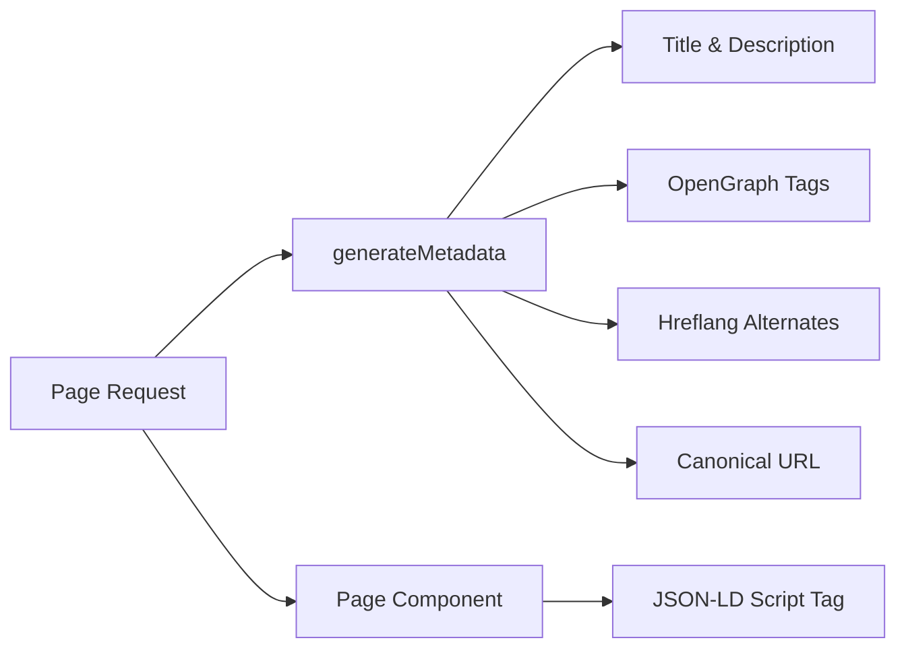

# Sistema SEO

O modelo Ever Works inclui um sistema SEO abrangente que gera dados estruturados (JSON-LD), tags hreflang, metadados OpenGraph e mapas de sites dinâmicos. Todos os utilitários de SEO residem em `lib/seo/` e integram-se à API de metadados Next.js.

## Visão geral da arquitetura



### Arquivos de origem

|Arquivo|Objetivo|
|---|---|
|`lib/seo/schema.ts`|Geradores de dados estruturados JSON-LD|
|`lib/seo/hreflang.ts`|Geradores de URL alternativos de idioma|
|`lib/seo/listing-metadata.ts`|Listagem da fábrica de metadados da página|

## Dados estruturados JSON-LD

O módulo `lib/seo/schema.ts` gera dados estruturados do Schema.org para resultados aprimorados de mecanismos de pesquisa.

### Esquema do Produto

Para páginas de detalhes do item, gera um esquema `Product`:

```typescript
import { generateProductSchema } from '@/lib/seo/schema';

const schema = generateProductSchema({
  name: 'My App',
  description: 'A productivity tool',
  image: 'https://example.com/icon.png',
  url: 'https://example.com/items/my-app',
  category: 'Productivity',
  sourceUrl: 'https://myapp.com',
  brandName: 'MyApp Inc.',
});
```

Saída gerada:

```json
{
  "@context": "https://schema.org",
  "@type": "Product",
  "name": "My App",
  "description": "A productivity tool",
  "image": "https://example.com/icon.png",
  "url": "https://example.com/items/my-app",
  "category": "Productivity",
  "brand": {
    "@type": "Brand",
    "name": "MyApp Inc."
  },
  "offers": {
    "@type": "Offer",
    "url": "https://myapp.com",
    "availability": "https://schema.org/InStock"
  }
}
```

### Esquema da Organização

Gera um esquema `Organization` em todo o site para visibilidade do Painel de conhecimento:

```typescript
import { generateOrganizationSchema } from '@/lib/seo/schema';

const schema = generateOrganizationSchema();
```

Este esquema inclui:
- Nome da marca, URL e logotipo
- Links de perfis sociais (`sameAs` array) de `siteConfig.social`
- Ponto de contato com email (quando configurado)

### Esquema de site com SearchAction

Ativa a caixa de pesquisa de Sitelinks do Google:

```typescript
import { generateWebSiteSchema } from '@/lib/seo/schema';

const schema = generateWebSiteSchema('en');
// Includes potentialAction with SearchAction targeting /?q={search_term_string}
```

O esquema respeita os prefixos de localidade:
- Localidade padrão: `https://example.com`
- Outras localidades: `https://example.com/fr`

### Esquema de localização atual

Gera `BreadcrumbList` para resultados de pesquisa com reconhecimento de navegação:

```typescript
import { generateBreadcrumbSchema } from '@/lib/seo/schema';

const schema = generateBreadcrumbSchema([
  { name: 'Home', url: 'https://example.com' },
  { name: 'Productivity', url: 'https://example.com/categories/productivity' },
  { name: 'My App', url: 'https://example.com/items/my-app' },
]);
```

### Incorporação em páginas

JSON-LD é incorporado usando uma tag `<script>` no componente da página:

```tsx
export default function ItemDetailPage({ item }) {
  const schema = generateProductSchema({ ... });

  return (
    <>
      <script
        type="application/ld+json"
        dangerouslySetInnerHTML={{ __html: JSON.stringify(schema) }}
      />
      <ItemDetail item={item} />
    </>
  );
}
```

## Hreflang Tags

O módulo `lib/seo/hreflang.ts` gera URLs alternativos de idioma para SEO multilocale.

### Padrão de URL

O modelo usa o padrão de prefixo de localidade "conforme necessário":

|Local|Padrão de URL|
|---|---|
|`en` (padrão)|`https://example.com/items/my-app`|
|`fr`|`https://example.com/fr/items/my-app`|
|`es`|`https://example.com/es/items/my-app`|
|`x-default`|Igual a `en` (localidade padrão)|

### Gerando Alternativas

```typescript
import { generateHreflangAlternates } from '@/lib/seo/hreflang';

// For any page path
const alternates = generateHreflangAlternates('/about');
// Returns: { en: 'https://example.com/about', fr: 'https://example.com/fr/about', ... }

// Convenience functions for common page types
import { generateItemHreflangAlternates } from '@/lib/seo/hreflang';
const itemAlternates = generateItemHreflangAlternates('my-app');

import { generatePageHreflangAlternates } from '@/lib/seo/hreflang';
const pageAlternates = generatePageHreflangAlternates('about');
```

### Integração com metadados Next.js

```typescript
export async function generateMetadata({ params }) {
  const { locale, slug } = await params;
  return {
    alternates: {
      canonical: `https://example.com/${locale}/items/${slug}`,
      languages: generateItemHreflangAlternates(slug),
    },
  };
}
```

### Mapeamentos de localidade suportados

Todas as mais de 20 localidades são mapeadas em `LOCALE_TO_HREFLANG`:

```
en -> en, fr -> fr, es -> es, de -> de, zh -> zh,
ar -> ar, he -> he, ru -> ru, uk -> uk, pt -> pt,
it -> it, ja -> ja, ko -> ko, nl -> nl, pl -> pl,
tr -> tr, vi -> vi, th -> th, hi -> hi, id -> id, bg -> bg
```

## Listagem de metadados da página

O módulo `lib/seo/listing-metadata.ts` gera objetos `Metadata` completos para páginas de listagem e categoria.

### Uso

```typescript
import { generateListingMetadata } from '@/lib/seo/listing-metadata';

export async function generateMetadata({ params }) {
  const { locale } = await params;
  return generateListingMetadata({
    title: 'Time Tracking Tools',
    description: 'Browse the best time tracking tools',
    path: '/categories/time-tracking',
    locale,
    itemCount: 42,
    keywords: ['time tracking', 'productivity', 'tools'],
    imageUrl: 'https://example.com/og/time-tracking.png',
  });
}
```

### Estrutura de metadados gerada

A função produz um objeto Next.js `Metadata` completo:

|Campo|Fonte|
|---|---|
|`title`|`{título} \|{siteName}`|
|`description`|Personalizado ou gerado automaticamente a partir do título + contagem de itens|
|`keywords`|Matriz de palavras-chave unidas|
|`openGraph.type`|`'website'`|
|`openGraph.siteName`|De `siteConfig.name`|
|`openGraph.url`|URL canônico com localidade|
|`openGraph.images`|URL de imagem opcional|
|`twitter.card`|`'summary_large_image'`|
|`alternates.canonical`|URL canônico completo|
|`alternates.languages`|Alternativas Hreflang para todas as localidades|

## Geração de imagens OpenGraph

Imagens OG dinâmicas são geradas usando Next.js `ImageResponse` em dois níveis:

|Arquivo|Rota|Objetivo|
|---|---|---|
|`app/opengraph-image.tsx`|`/opengraph-image`|Imagem OG padrão para todo o site|
|`app/[locale]/items/[slug]/opengraph-image.tsx`|`/items/{slug}/opengraph-image`|Imagem OG dinâmica por item|

Esses arquivos usam o módulo `next/og` para renderizar componentes do React como imagens no momento da solicitação, permitindo texto dinâmico, logotipos e marcas.

## Lista de verificação de SEO

Ao adicionar um novo tipo de página, certifique-se de que os seguintes elementos de SEO estejam implementados:

|Elemento|Implementação|
|---|---|
|Título da página|`generateMetadata` com título descritivo|
|Meta descrição|Descrição personalizada ou gerada automaticamente|
|URL canônico|Definido em `alternates.canonical`|
|Etiquetas Hreflang|Utilize `generateHreflangAlternates`|
|Etiquetas OpenGraph|Incluído via `generateListingMetadata` ou manualmente|
|Cartão do Twitter|Defina `twitter.card` como `summary_large_image`|
|JSON-LD|Adicionar esquema via `<script type="application/ld+json">`|
|Pão ralado|Use `generateBreadcrumbSchema` para páginas aninhadas|

## Melhores práticas

1. **Sempre defina URLs canônicos** – evita problemas de conteúdo duplicado entre localidades.
2. **Inclua hreflang para todas as localidades** -- mesmo que o conteúdo ainda não esteja traduzido, a estrutura do URL ajuda os mecanismos de pesquisa.
3. **Use títulos descritivos e exclusivos** – evite títulos genéricos como "Home" sem o nome do site.
4. **Mantenha as descrições com menos de 160 caracteres**. Descrições mais longas ficam truncadas nos resultados da pesquisa.
5. **Teste os dados estruturados** com a ferramenta de teste de pesquisa aprimorada do Google antes da implantação.
6. **Gere imagens OG dinamicamente** – imagens estáticas de fallback perdem oportunidades de branding específicas de itens.
