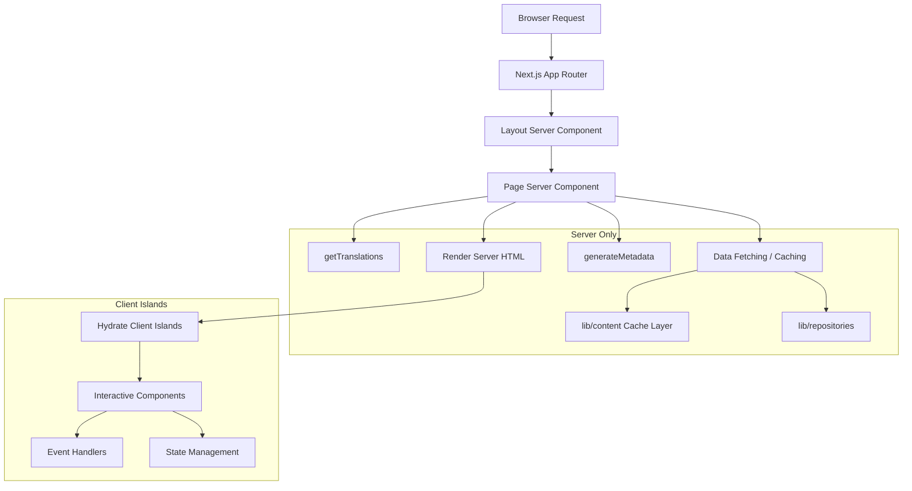

# Padrões de componentes de servidor

## Visão geral

O modelo Ever Works aproveita React Server Components (RSC) como estratégia de renderização padrão em todo o Next.js App Router. Os componentes do servidor lidam com a busca de dados, carregamento de tradução, geração de metadados e composição de layout no servidor, enviando apenas o HTML renderizado para o cliente.

## Arquitetura



## Arquivos de origem

|Arquivo|Padrão demonstrado|
|------|---------------------|
|`template/app/[locale]/about/page.tsx`|Busca de dados, i18n, metadados, renderização MDX|
|`template/app/[locale]/layout.tsx`|Layout raiz com provedor de localidade|
|`template/app/layout.tsx`|Layout global, fontes, provedores|
|`template/app/sitemap.ts`|Geração de rota somente servidor|
|`template/app/robots.ts`|Configuração somente servidor|

## Padrões principais

### Padrão 1: componentes de página assíncrona com i18n

Cada página localizada segue este padrão:

```typescript
// Server Component -- no "use client" directive
export const revalidate = 3600; // ISR: revalidate every hour

interface PageProps {
    params: Promise<{ locale: string }>;
}

export async function generateMetadata({ params }: PageProps): Promise<Metadata> {
    const { locale } = await params;
    const t = await getTranslations({ locale, namespace: 'footer' });
    return {
        title: t('ABOUT_US'),
        description: t('ABOUT_PAGE_META_DESCRIPTION'),
        alternates: {
            languages: generateHreflangAlternates('/about')
        }
    };
}

export default async function AboutPage({ params }: PageProps) {
    const { locale } = await params;
    const pageData = await getCachedPageContent('about', locale);
    const tCommon = await getTranslations({ locale, namespace: 'common' });

    return (
        <PageContainer>
            <MDX source={pageData?.content || DEFAULT_CONTENT} />
        </PageContainer>
    );
}
```

Características principais:
- `params` é um `Promise` (convenção Next.js 15+ App Router)
- Várias chamadas `getTranslations()` para diferentes namespaces
- Busca de conteúdo em cache via `getCachedPageContent()`
- Intervalo de revalidação estática com `export const revalidate`

### Padrão 2: Geração de Metadados

Os componentes do servidor geram metadados de SEO no nível da rota:

```typescript
export async function generateMetadata({ params }: PageProps): Promise<Metadata> {
    const { locale } = await params;
    const t = await getTranslations({ locale, namespace: 'pages' });

    return {
        metadataBase: new URL(appUrl),
        title: t('PAGE_TITLE'),
        description: t('PAGE_DESCRIPTION'),
        alternates: {
            languages: generateHreflangAlternates('/path')
        }
    };
}
```

O utilitário `generateHreflangAlternates()` de `lib/seo/hreflang.ts` gera automaticamente links de idiomas alternativos para todas as localidades suportadas.

### Padrão 3: ISR com cache de conteúdo

```typescript
export const revalidate = 3600; // Revalidate every hour

export default async function Page({ params }: PageProps) {
    const data = await getCachedPageContent('page-name', locale);
    // Render with cached data...
}
```

A função `getCachedPageContent()` fornece uma camada de cache do lado do servidor sobre o conteúdo CMS baseado em Git em `.content/`. Combinado com `revalidate`, isso cria um padrão ISR (Regeneração Estática Incremental) onde as páginas são geradas estaticamente e atualizadas periodicamente.

### Padrão 4: verificações de autenticação do lado do servidor

As páginas protegidas usam proteções do lado do servidor de `lib/auth/guards.ts`:

```typescript
import { requireAuth, requireAdmin } from '@/lib/auth/guards';

export default async function ProtectedPage() {
    const session = await requireAuth();
    // session.user is guaranteed to exist here
    return <div>Welcome {session.user.email}</div>;
}

export default async function AdminPage() {
    const session = await requireAdmin();
    // session.user.isAdmin is guaranteed true here
    return <AdminDashboard />;
}
```

Esses guardas ligam para `auth()` internamente e usam `redirect()` de `next/navigation` para enviar usuários não autenticados para a página de login. O redirecionamento ocorre no lado do servidor, portanto, nenhum JavaScript do cliente é necessário.

### Padrão 5: Composição de componentes de servidor e cliente

Os componentes do servidor delegam interatividade às "ilhas" dos componentes do cliente:

```typescript
// Server Component (page.tsx)
export default async function Page({ params }: PageProps) {
    const { locale } = await params;
    const data = await fetchData();
    const t = await getTranslations({ locale, namespace: 'page' });

    return (
        <div>
            <h1>{t('TITLE')}</h1>
            {/* Server-rendered static content */}
            <StaticContent data={data} />
            {/* Client island for interactivity */}
            <InteractiveFilter initialData={data} />
        </div>
    );
}
```

Os dados fluem do servidor para o cliente como acessórios serializáveis. Os componentes do cliente recebem dados pré-buscados e lidam com as interações do usuário.

## Estratégias de busca de dados

### Acesso direto ao repositório

Os componentes do servidor podem importar e chamar funções do repositório diretamente:

```typescript
import { getItemBySlug } from '@/lib/repositories/item-repository';

export default async function ItemPage({ params }) {
    const item = await getItemBySlug(params.slug);
    // ...
}
```

### Camada de conteúdo em cache

Para conteúdo CMS baseado em Git:

```typescript
import { getCachedPageContent } from '@/lib/content';

const pageData = await getCachedPageContent('about', locale);
```

### Chamadas de API externas

As funções de serviço em `lib/services/` encapsulam interações de API externas:

```typescript
import { triggerManualSync } from '@/lib/services/sync-service';
```

## Streaming e Suspense

Os componentes do servidor suportam streaming através dos limites do React Suspense. Páginas grandes podem mostrar estados de carregamento para seções individuais:

```typescript
import { Suspense } from 'react';

export default async function Page() {
    return (
        <div>
            <Header /> {/* Renders immediately */}
            <Suspense fallback={<LoadingSkeleton />}>
                <SlowDataSection /> {/* Streams when ready */}
            </Suspense>
        </div>
    );
}
```

## Melhores práticas no modelo

1. **Não `"use client"`, a menos que seja necessário** - os componentes são componentes do servidor por padrão
2. **Traduções carregadas no lado do servidor** -- `getTranslations()` é executado apenas no servidor
3. **Metadados co-localizados com páginas** -- `generateMetadata` são exportados do mesmo arquivo
4. **Revalidação no nível da rota** -- `export const revalidate` controla o tempo do ISR
5. **Funções de proteção para autenticação** – redirecionamentos do lado do servidor sem custo de pacote do cliente
6. **Acessórios desativados, eventos ativados** – os componentes do servidor passam dados para ilhas clientes como adereços
