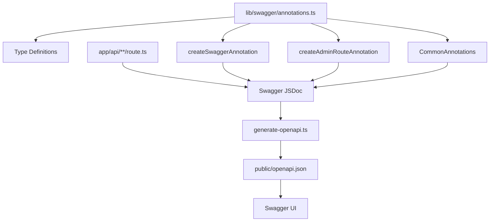
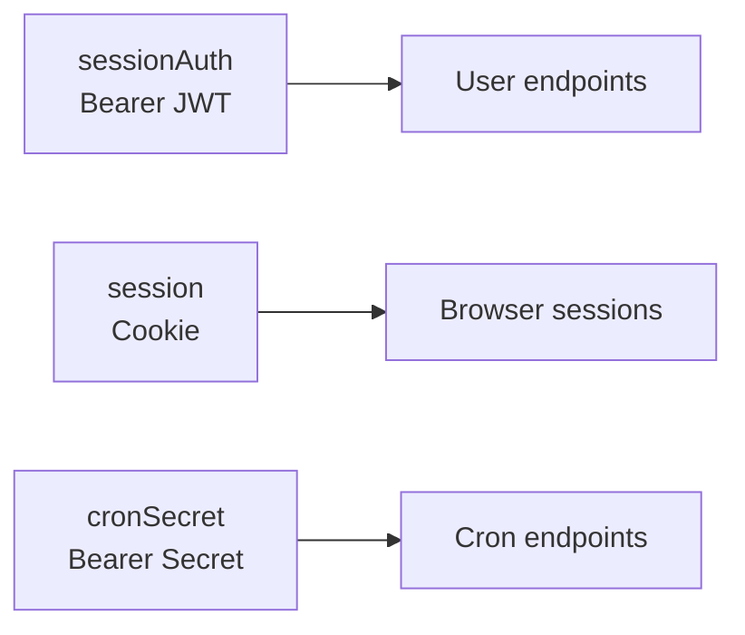

# Sistema de arrogância

O modelo fornece um sistema completo de documentação Swagger/OpenAPI construído em `swagger-jsdoc`. Inclui auxiliares de anotação em `lib/swagger/annotations.ts` para padronizar a documentação da API em todos os manipuladores de rota.

## Arquitetura



## Sistema de tipo de anotação

O módulo `lib/swagger/annotations.ts` define interfaces TypeScript que espelham a especificação OpenAPI 3.0:

### SwaggerRouteConfig

O principal objeto de configuração para documentar uma rota de API:

```typescript
interface SwaggerRouteConfig {
  tags: string[];                              // API grouping tags
  summary: string;                             // Brief description
  description: string;                         // Detailed description
  security?: Array<Record<string, string[]>>;  // Security requirements
  parameters?: SwaggerParameter[];             // Query/path/header params
  requestBody?: SwaggerRequestBody;            // Request body schema
  responses: Record<string, SwaggerResponse>;  // Response definitions
}
```

### SwaggerParâmetro

Define parâmetros de consulta, caminho ou cabeçalho:

```typescript
interface SwaggerParameter {
  name: string;
  in: 'query' | 'path' | 'header';
  required?: boolean;
  schema: {
    type: string;
    format?: string;
    minimum?: number;
    maximum?: number;
    default?: any;
    enum?: string[];
  };
  description?: string;
  example?: any;
}
```

### SwaggerRequestBody

Define a estrutura do corpo da solicitação:

```typescript
interface SwaggerRequestBody {
  required: boolean;
  content: {
    'application/json': {
      schema: {
        $ref?: string;       // Reference to a component schema
        type?: string;       // Inline type definition
        properties?: Record<string, any>;
      };
      example?: any;
    };
  };
}
```

### Resposta Swagger

Define códigos de status de resposta e seus esquemas:

```typescript
interface SwaggerResponse {
  description: string;
  content?: {
    'application/json': {
      schema: {
        $ref?: string;
        type?: string;
        properties?: Record<string, any>;
      };
      example?: any;
      examples?: Record<string, any>;
    };
  };
}
```

## Anotações Comuns

O objeto `CommonAnnotations` fornece blocos de construção reutilizáveis:

### Respostas de erro padrão

```typescript
CommonAnnotations.responses.unauthorized
// { description: 'Authentication required', ... }

CommonAnnotations.responses.forbidden
// { description: 'Forbidden - Admin access required', ... }

CommonAnnotations.responses.notFound
// { description: 'Resource not found', ... }

CommonAnnotations.responses.serverError
// { description: 'Internal server error', ... }
```

Cada resposta de erro inclui um exemplo padrão:

```json
{
  "success": false,
  "error": "Error message"
}
```

### Parâmetros de paginação

```typescript
CommonAnnotations.paginationParameters
// [
//   { name: 'page', in: 'query', schema: { type: 'integer', minimum: 1, default: 1 } },
//   { name: 'limit', in: 'query', schema: { type: 'integer', minimum: 1, maximum: 100, default: 10 } }
// ]
```

### Segurança administrativa

```typescript
CommonAnnotations.adminSecurity
// [{ sessionAuth: [] }]
```

## Criando anotações

### criarSwaggerAnnotation()

Gera uma string de comentário JSDoc `@swagger` completa:

```typescript
import { createSwaggerAnnotation, CommonAnnotations } from '@/lib/swagger/annotations';

const annotation = createSwaggerAnnotation('/api/items', 'GET', {
  tags: ['Items'],
  summary: 'List all items',
  description: 'Returns a paginated list of items with filtering support',
  parameters: [
    ...CommonAnnotations.paginationParameters,
    {
      name: 'category',
      in: 'query',
      required: false,
      schema: { type: 'string' },
      description: 'Filter by category',
      example: 'Web Development'
    }
  ],
  responses: {
    '200': {
      description: 'Paginated list of items',
      content: {
        'application/json': {
          schema: { $ref: '#/components/schemas/Pagination' },
          example: {
            items: [{ id: '1', title: 'Sample Item' }],
            pagination: { page: 1, pageSize: 10, total: 50, totalPages: 5 }
          }
        }
      }
    },
    '500': CommonAnnotations.responses.serverError
  }
});
```

### createAdminRouteAnnotation()

Abreviação para rotas protegidas pelo administrador. Adiciona automaticamente segurança `sessionAuth`:

```typescript
import { createAdminRouteAnnotation, CommonAnnotations } from '@/lib/swagger/annotations';

const annotation = createAdminRouteAnnotation('/api/admin/users', 'GET', {
  tags: ['Admin'],
  summary: 'List all users',
  description: 'Returns all registered users with their profiles and roles',
  parameters: CommonAnnotations.paginationParameters,
  responses: {
    '200': {
      description: 'User list with pagination',
      content: {
        'application/json': {
          schema: { type: 'object' },
          example: {
            items: [{ id: '1', email: 'admin@example.com', role: 'admin' }],
            pagination: { page: 1, pageSize: 10, total: 100, totalPages: 10 }
          }
        }
      }
    },
    '401': CommonAnnotations.responses.unauthorized,
    '403': CommonAnnotations.responses.forbidden,
    '500': CommonAnnotations.responses.serverError
  }
});
```

## Escrevendo documentação de rota

### Padrão de anotação direta

A abordagem mais comum é escrever comentários `@swagger` diretamente nos arquivos de rota:

```typescript
// app/api/items/route.ts

/**
 * @swagger
 * /api/items:
 *   get:
 *     tags: ["Items"]
 *     summary: "Get all items"
 *     description: "Returns paginated items list with optional category filter"
 *     parameters:
 *       - name: "page"
 *         in: query
 *         schema:
 *           type: integer
 *           default: 1
 *       - name: "limit"
 *         in: query
 *         schema:
 *           type: integer
 *           default: 10
 *     responses:
 *       200:
 *         description: "Success"
 *       500:
 *         description: "Server error"
 */
export async function GET(request: Request) {
  // implementation
}
```

### Rota POST com corpo de solicitação

```typescript
/**
 * @swagger
 * /api/items:
 *   post:
 *     tags: ["Items"]
 *     summary: "Create a new item"
 *     security:
 *       - sessionAuth: []
 *     requestBody:
 *       required: true
 *       content:
 *         application/json:
 *           schema:
 *             type: object
 *             properties:
 *               title:
 *                 type: string
 *               description:
 *                 type: string
 *               category:
 *                 type: string
 *           example:
 *             title: "My New Item"
 *             description: "Item description"
 *             category: "Web Development"
 *     responses:
 *       201:
 *         description: "Item created"
 *       400:
 *         description: "Validation error"
 *       401:
 *         description: "Unauthorized"
 */
export async function POST(request: Request) {
  // implementation
}
```

## Organização de tags

Organize rotas de API em grupos lógicos usando tags:

|Etiqueta|Rotas|Descrição|
|---|---|---|
|`Items`|`/api/items/*`|Listagem e detalhes de itens públicos|
|`Admin`|`/api/admin/*`|Operações do painel de administração|
|`Auth`|`/api/auth/*`|Fluxos de autenticação|
|`Profile`|`/api/profile/*`|Gerenciamento de perfil de usuário|
|`Newsletter`|`/api/newsletter/*`|Assinaturas de boletins informativos|
|`Comments`|`/api/comments/*`|Comente operações CRUD|
|`Payments`|`/api/payments/*`|Processamento de pagamento|
|`Cron`|`/api/cron/*`|Terminais de trabalho agendados|

## Esquemas de Segurança

Três esquemas de segurança são definidos na configuração OpenAPI:



### Uso em anotações

```yaml
# JWT Bearer authentication
security:
  - sessionAuth: []

# Cookie-based session
security:
  - session: []

# Cron job secret
security:
  - cronSecret: []
```

## Saída gerada

O script `generate-openapi.ts` produz `public/openapi.json` com esta estrutura:

```json
{
  "openapi": "3.0.0",
  "info": { "title": "Ever Works API", "version": "1.0.0" },
  "servers": [{ "url": "/" }],
  "paths": {
    "/api/items": { "get": { ... }, "post": { ... } },
    "/api/admin/users": { "get": { ... } }
  },
  "components": {
    "securitySchemes": { ... },
    "schemas": {
      "ErrorResponse": { ... },
      "PaginationMeta": { ... },
      "Pagination": { ... }
    }
  },
  "tags": [
    { "name": "Items" },
    { "name": "Admin" }
  ]
}
```

## Melhores práticas

1. **Documente todas as rotas públicas** -- Todas as rotas em `app/api/` devem ter anotações `@swagger`
2. **Use `$ref` para esquemas compartilhados** - Faça referência a esquemas de componentes em vez de duplicar definições
3. **Incluir exemplos** -- Sempre forneça valores `example` para corpos de solicitação e resposta
4. **Use CommonAnnotations** – Aproveite as respostas de erro compartilhadas e os parâmetros de paginação
5. **Etiquete consistentemente** – Agrupe endpoints relacionados sob o mesmo nome de tag
6. **Descrever parâmetros** -- Incluir `description` e `example` para cada parâmetro
7. **Documente todos os códigos de status** – Cubra casos de sucesso, erro de validação, erro de autenticação e erro de servidor
8. **Mantenha as anotações perto dos manipuladores** - Coloque os comentários `@swagger` diretamente acima da função do manipulador de rota
