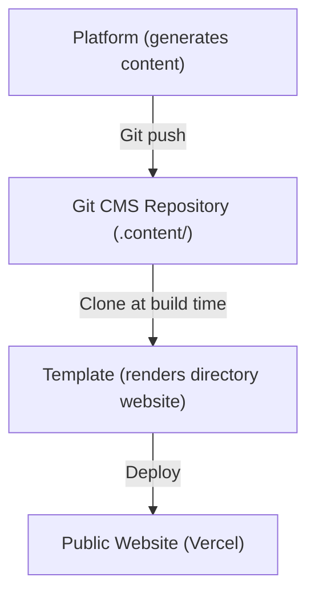
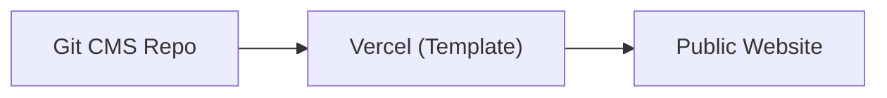
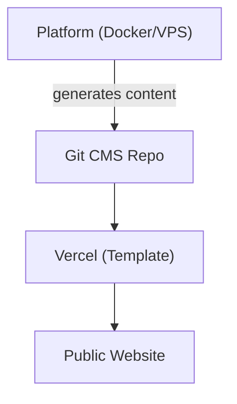
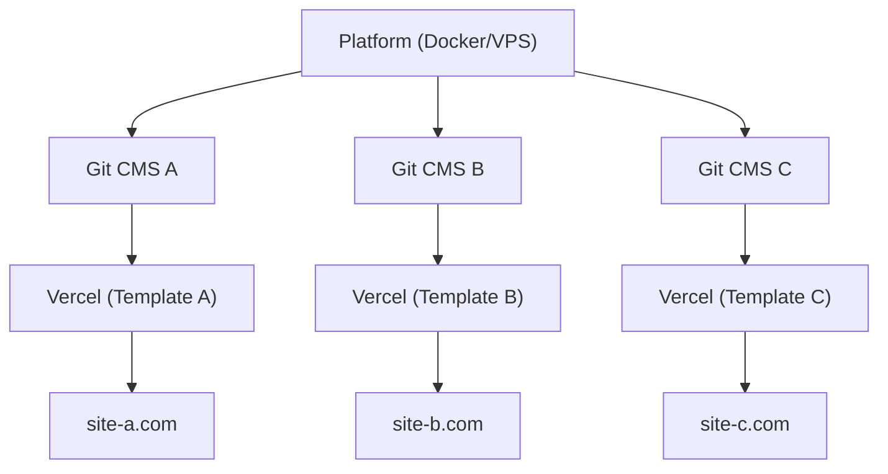

# Plataforma vs Template

Ever Works consiste em dois produtos principais que servem propósitos diferentes, mas trabalham juntos como um ecossistema unificado. Esta página explica a diferença e quando usar cada um.

## Ever Works Platform

A **Ever Works Platform** é a infraestrutura backend para construir e gerenciar sites de diretório em escala. Ela fornece uma API REST, pipelines de geração de conteúdo alimentados por IA, um sistema de plugins e orquestração de implantação.

Para documentação completa da plataforma, visite [docs.ever.works](https://docs.ever.works).

## Directory Web Template

O **Directory Web Template** (este projeto) é um site de diretório full-stack pronto para produção que você pode clonar, personalizar e implantar como uma aplicação autônoma.

### O que ele faz

- Fornece um **site de diretório** completo com listagens de itens, busca, filtragem, categorias, tags e coleções
- Inclui **autenticação** via NextAuth.js v5 com provedores OAuth (Google, GitHub, Facebook, Twitter, Microsoft) e Supabase Auth
- Suporta **pagamentos** através de Stripe, LemonSqueezy e Polar com gerenciamento de assinatura
- Oferece **internacionalização** com múltiplos idiomas e suporte RTL via next-intl
- Usa um **CMS baseado em Git** para sincronizar conteúdo de diretório de repositórios Git
- Inclui um **sistema de temas** com temas integrados e geração dinâmica de cores
- Fornece **análises e monitoramento** através de PostHog e Sentry
- Vem com **otimização SEO**, geração de sitemap e dados estruturados (JSON-LD)
- Inclui um **painel administrativo** com gerenciamento de conteúdo, gerenciamento de usuários e análises

### Stack Tecnológico

- **Framework:** Next.js 15, React 19
- **Linguagem:** TypeScript 5
- **ORM:** Drizzle ORM (PostgreSQL)
- **UI:** Tailwind CSS 4, HeroUI React, Radix UI
- **Auth:** NextAuth.js v5, Supabase Auth
- **Pagamentos:** Stripe, LemonSqueezy, Polar
- **Testes:** Playwright (E2E)
- **Implantação:** Vercel (primário), Docker (alternativo)

## Comparação Lado a Lado

| Aspecto             | Plataforma                                 | Template                               |
| ------------------- | ------------------------------------------ | -------------------------------------- |
| **Propósito**       | Infraestrutura backend e pipeline de IA    | Site de diretório frontend             |
| **Arquitetura**     | Monorepo (Turborepo + pnpm)                | Aplicação Next.js autônoma             |
| **Backend**         | NestJS 11 API                              | Rotas de API do Next.js                |
| **ORM de Banco**    | TypeORM                                    | Drizzle ORM                            |
| **Autenticação**    | JWT + OAuth (NestJS Guards)                | NextAuth.js v5 + Supabase Auth         |
| **Pagamentos**      | Não incluído                               | Stripe, LemonSqueezy, Polar            |
| **Recursos de IA**  | Agentes LangChain, 7 provedores LLM        | Nenhum (consome conteúdo gerado por IA) |
| **Conteúdo**        | Gera conteúdo via pipelines de IA          | Lê conteúdo do CMS baseado em Git      |
| **Implantação**     | Docker em qualquer VPS                     | Vercel (ou Docker)                     |
| **Testes**          | Jest + Vitest                              | Playwright                             |
| **Público**         | Operadores de plataforma, devs de IA       | Construtores de sites, criadores de diretório |

## Como Eles se Conectam

A Plataforma e o Template trabalham juntos através do padrão **CMS baseado em Git**:

### Operação Independente

- **Template sem Plataforma:** Mantenha o conteúdo do diretório manualmente editando arquivos YAML e Markdown no repositório Git CMS. O Template funciona como um site de diretório totalmente funcional sem geração de IA.
- **Plataforma sem Template:** Use a API da Plataforma para gerar dados de diretório e exportá-los para qualquer frontend.

## Quando Usar Qual

### Use o Template quando...

- Você quer lançar um site de diretório rapidamente com configuração mínima de backend
- O conteúdo do seu diretório é curado manualmente ou vem de uma fonte de dados estática
- Você precisa de um site pronto para produção com autenticação, pagamentos e SEO out of the box
- Você prefere implantar no Vercel sem gerenciamento de servidor

### Use a Plataforma quando...

- Você precisa de geração de conteúdo alimentada por IA para diretórios grandes
- Você quer pipelines automatizados que descobrem, enriquecem e atualizam itens do diretório
- Você precisa gerenciar múltiplos diretórios de um único backend
- Você quer usar o sistema de plugins para integrações personalizadas

### Use Ambos quando...

- Você quer conteúdo gerado por IA fluindo em um site de produção
- Você está construindo um produto SaaS sobre Ever Works
- Você precisa de geração automatizada de conteúdo E um frontend refinado

## Arquiteturas de Implantação

### Apenas Template (Mais Simples)

Gerenciamento manual de conteúdo via Git. Implantação única no Vercel.

### Plataforma + Template (Full Stack)

Geração automatizada de conteúdo via Plataforma. Conectado através do Git.

### Plataforma + Múltiplos Templates

Uma única instância da Plataforma gerenciando múltiplos sites de diretório.
