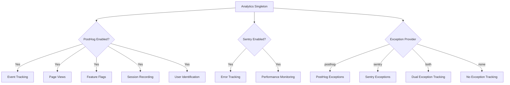
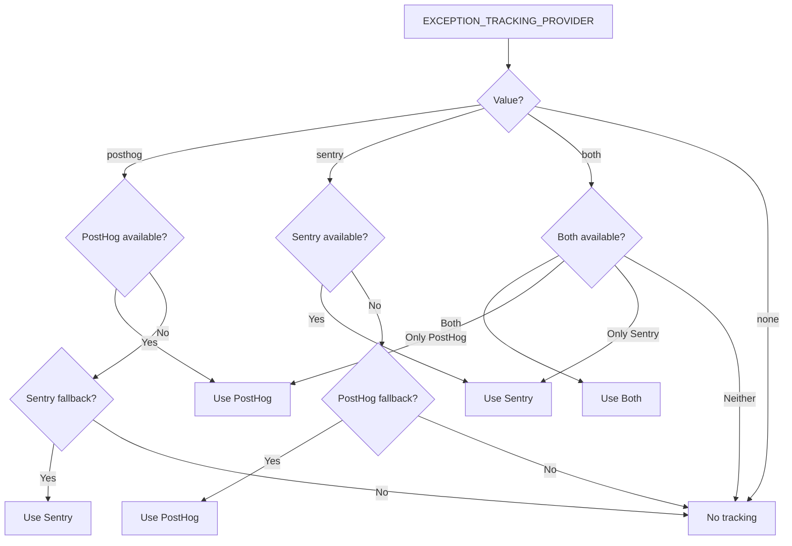

# Configuração de Análise

O template fornece um sistema de análise unificado que integra o PostHog para análise de produto e o Sentry para rastreamento de erros. Ambos os provedores são gerenciados por meio de uma classe singleton `Analytics` com comportamento de fallback automático.

## Arquitetura



## Variáveis de Ambiente

### Configuração do PostHog

| Variable | Obrigatório | Padrão | Descrição |
|---|---|---|---|
| `NEXT_PUBLIC_POSTHOG_KEY` | Sim (para análise) | -- | Chave API do projeto PostHog |
| `NEXT_PUBLIC_POSTHOG_HOST` | Sim (para análise) | -- | URL da instância PostHog |
| `POSTHOG_DEBUG` | Não | `false` | Habilitar log de depuração |
| `POSTHOG_SESSION_RECORDING_ENABLED` | Não | `true` | Habilitar gravações de sessão |
| `POSTHOG_AUTO_CAPTURE` | Não | `false` | Capturar visualizações de página automaticamente |
| `POSTHOG_EXCEPTION_TRACKING` | Não | `true` | Habilitar rastreamento de exceções PostHog |

### Configuração do Sentry

| Variable | Obrigatório | Padrão | Descrição |
|---|---|---|---|
| `NEXT_PUBLIC_SENTRY_DSN` | Sim (para erros) | -- | Sentry Data Source Name |
| `SENTRY_ENABLE_DEV` | Não | `false` | Habilitar Sentry em desenvolvimento |
| `SENTRY_DEBUG` | Não | `false` | Habilitar modo de depuração do Sentry |
| `SENTRY_EXCEPTION_TRACKING` | Não | `true` | Habilitar rastreamento de exceções Sentry |

### Rastreamento Unificado de Exceções

| Variable | Obrigatório | Padrão | Descrição |
|---|---|---|---|
| `EXCEPTION_TRACKING_PROVIDER` | Não | `both` | Provedor a usar: `posthog`, `sentry`, `both` ou `none` |

## Configuração do PostHog

### Passo 1: Obter Credenciais

1. Cadastre-se em [posthog.com](https://posthog.com) ou hospede o PostHog por conta própria
2. Crie um projeto
3. Copie a chave API do projeto e a URL do host

### Passo 2: Configurar o Ambiente

```env
NEXT_PUBLIC_POSTHOG_KEY=phc_your_project_key_here
NEXT_PUBLIC_POSTHOG_HOST=https://app.posthog.com
```

O PostHog é habilitado automaticamente quando tanto `NEXT_PUBLIC_POSTHOG_KEY` quanto `NEXT_PUBLIC_POSTHOG_HOST` estão definidos.

### Passo 3: Taxas de Amostragem

As taxas de amostragem são ajustadas automaticamente por ambiente:

| Ambiente | Taxa de Amostragem de Eventos | Taxa de Amostragem de Gravação de Sessão |
|---|---|---|
| Produção | 10% (`0.1`) | 10% (`0.1`) |
| Desenvolvimento | 100% (`1.0`) | 100% (`1.0`) |

## Configuração do Sentry

### Passo 1: Obter DSN

1. Crie um projeto em [sentry.io](https://sentry.io)
2. Copie o DSN nas configurações do projeto

### Passo 2: Configurar o Ambiente

```env
NEXT_PUBLIC_SENTRY_DSN=https://examplePublicKey@o0.ingest.sentry.io/0
SENTRY_ENABLE_DEV=true  # Opcional: habilitar em desenvolvimento
```

O Sentry é habilitado automaticamente em produção quando o DSN está definido. Para desenvolvimento, defina explicitamente `SENTRY_ENABLE_DEV=true`.

## API da Classe Analytics

A classe `Analytics` é um singleton acessível em toda a aplicação:

```typescript
import { analytics } from '@/lib/analytics';
```

### Inicialização

```typescript
// Inicializar analytics (chamar uma vez na raiz do app)
analytics.init();
```

O método `init()` é somente para o cliente e pode ser chamado com segurança em contextos do servidor (não fará nada).

### Rastreamento de Eventos

```typescript
// Rastrear um evento personalizado
analytics.track('button_clicked', {
  buttonName: 'signup',
  page: '/landing'
});

// Rastrear uma visualização de página
analytics.trackPageView('/dashboard', {
  referrer: document.referrer
});
```

### Identificação do Usuário

```typescript
// Identificar um usuário (após login)
analytics.identify('user-123', {
  email: 'user@example.com',
  plan: 'premium',
  company: 'Acme Inc.'
});

// Redefinir identidade (após logout)
analytics.reset();

// Definir propriedades persistentes do usuário
analytics.setUserProperties({
  subscription_tier: 'premium',
  signup_date: '2024-01-15'
});

// Definir super propriedades (enviadas com cada evento)
analytics.setSuperProperties({
  app_version: '2.0.0',
  platform: 'web'
});
```

### Flags de Funcionalidade

```typescript
// Verificar se um flag de funcionalidade está habilitado
const isEnabled = analytics.isFeatureEnabled('new-dashboard', false);

// Recarregar flags de funcionalidade do servidor
await analytics.reloadFeatureFlags();
```

### Rastreamento de Exceções

```typescript
// Capturar uma exceção (roteada para o provedor configurado)
analytics.captureException(error, {
  component: 'PaymentForm',
  action: 'submit'
});

// Capturar com mensagem de texto
analytics.captureException('Payment processing failed', {
  orderId: 'ord-123'
});
```

## Seleção do Provedor de Rastreamento de Exceções



## Gravação de Sessão

Quando `POSTHOG_SESSION_RECORDING_ENABLED=true`, o PostHog grava sessões de usuários com estas configurações de privacidade:

```typescript
session_recording: {
  maskAllInputs: true,        // Mascarar valores de entrada de formulário
  maskTextSelector: "[data-mask]",  // Mascarar elementos com data-mask
  sampleRate: 0.1,            // 10% em produção
}
```

Adicione `data-mask` a qualquer elemento cujo conteúdo de texto deve ser ocultado nas gravações.

## Rastreamento de Exceções com PostHog

Quando o rastreamento de exceções PostHog está habilitado, o sistema instala manipuladores de erros globais:

- **`window.onerror`** -- Captura erros JavaScript não tratados
- **`unhandledrejection`** -- Captura rejeições de Promise não tratadas

Estes são encaminhados ao PostHog como eventos `$exception` com rastreamentos de pilha.

## Integração Sentry-PostHog

Quando ambos os provedores estão ativos (`EXCEPTION_TRACKING_PROVIDER=both`), o sistema cria um vínculo bidirecional:

1. A propriedade `sentry` do PostHog é definida como o SDK Sentry
2. Um processador de eventos Sentry personalizado encaminha erros ao PostHog como eventos `sentry_error`
3. Isso permite correlacionar sessões de usuários (PostHog) com detalhes de erros (Sentry)

## Constantes de Rastreamento de Visitantes

O arquivo `lib/constants/analytics.ts` fornece constantes para rastreamento anônimo de visitantes:

```typescript
// Nome do cookie para ID de visitante anônimo
```
