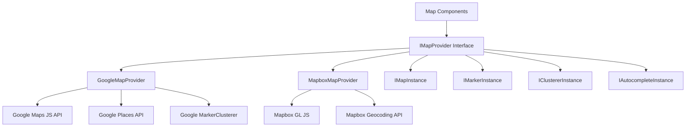
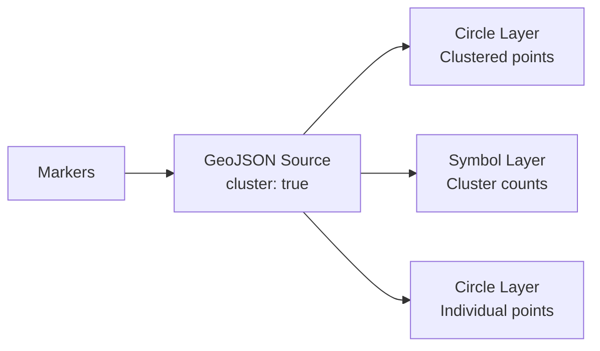

# Configuração de Mapa

O template inclui um sistema de mapas independente de provedor com suporte a Google Maps e Mapbox GL JS. Uma camada de interface compartilhada permite alternar entre provedores sem alterar o código dos componentes.

## Arquitetura



## Seleção de Provedor

O provedor de mapas é determinado pelas chaves de API configuradas:

| Provedor | Variável de Ambiente Necessária |
|---|---|
| Google Maps | `NEXT_PUBLIC_GOOGLE_MAPS_API_KEY` |
| Mapbox | `NEXT_PUBLIC_MAPBOX_ACCESS_TOKEN` |

Se ambos estiverem configurados, o provedor é selecionado através das configurações de mapa da aplicação.

## Configuração do Google Maps

### Passo 1: Obter Chave de API

1. Acesse o [Google Cloud Console](https://console.cloud.google.com)
2. Ative as seguintes APIs:
   - Maps JavaScript API
   - Places API
   - Geocoding API
3. Crie uma chave de API com restrições de referenciador HTTP

### Passo 2: Configurar Ambiente

```env
NEXT_PUBLIC_GOOGLE_MAPS_API_KEY=AIzaSy...your-api-key
NEXT_PUBLIC_GOOGLE_MAPS_MAP_ID=your-map-id        # Optional: for styled maps
```

### Passo 3: Segurança

O provedor do Google Maps restringe o uso de chaves apenas no navegador:

```typescript
// @security Uses NEXT_PUBLIC_GOOGLE_MAPS_API_KEY (browser-exposed).
// Only use HTTP referrer-restricted keys, never unrestricted or server keys.
```

**Restrições necessárias para a chave de API:**
- Restrição de aplicativo: referenciadores HTTP
- Adicione seus padrões de domínio (ex.: `https://seudominio.com/*`)
- Restrição de API: Limitar a Maps JavaScript, Places e Geocoding APIs

## Configuração do Mapbox

### Passo 1: Obter Token de Acesso

1. Registre-se em [mapbox.com](https://www.mapbox.com)
2. Copie seu token de acesso público (começa com `pk.`)

### Passo 2: Configurar Ambiente

```env
NEXT_PUBLIC_MAPBOX_ACCESS_TOKEN=pk.eyJ1Ijoi...your-token
```

### Passo 3: Segurança

```typescript
// @security Uses NEXT_PUBLIC_MAPBOX_ACCESS_TOKEN (browser-exposed).
// Only use public tokens (pk.*) with URL restrictions, never secret tokens (sk.*).
```

**Restrições necessárias para o token:**
- Use um token **público** (prefixo `pk.`)
- Adicione restrições de URL para seus domínios
- Nunca use tokens secretos (`sk.*`) em código do lado do cliente

## Interface do Provedor

Ambos os provedores implementam a interface `IMapProvider` com capacidades idênticas:

### Métodos do IMapProvider

| Método | Descrição |
|---|---|
| `isLoaded()` | Verificar se o script do provedor está carregado |
| `loadScript()` | Carregar a biblioteca do provedor (idempotente) |
| `createMap(container, options)` | Criar uma instância de mapa em um elemento DOM |
| `createMarker(map, options)` | Adicionar um marcador ao mapa |
| `createClusterer(map, options, onClick)` | Agrupar marcadores próximos em clusters |
| `createAutocomplete(input, onSelect)` | Anexar preenchimento automático de endereço a uma entrada |
| `getStyleUrl(style)` | Obter a URL de estilo para vista de ruas ou satélite |
| `isConfigured()` | Verificar se as chaves de API estão presentes |

### Estilos de Mapa

| Estilo | Google Maps | Mapbox |
|---|---|---|
| `streets` | `roadmap` | `mapbox://styles/mapbox/streets-v12` |
| `satellite` | `satellite` | `mapbox://styles/mapbox/satellite-streets-v12` |

## Sistema de Tipos

A biblioteca de mapas define tipos abrangentes em `lib/maps/types.ts`:

### Tipos Principais

```typescript
interface Coordinates {
  latitude: number;
  longitude: number;
}

interface MapBounds {
  north: number;
  south: number;
  east: number;
  west: number;
}

interface MapViewport {
  center: Coordinates;
  zoom: number;
  bounds?: MapBounds;
}
```

### Tipos de Marcadores

```typescript
interface MapMarkerData {
  id: string;
  coordinates: Coordinates;
  title: string;
  icon?: string;
  category?: string;
  slug: string;
  description?: string;
}

interface MapMarkerWithDistance extends MapMarkerData {
  distanceKm?: number;
}
```

### Configuração de Cluster

```typescript
interface ClusterOptions {
  radius?: number;     // Cluster radius in pixels (default: 60)
  maxZoom?: number;    // Max zoom for clustering (default: 16)
  minZoom?: number;    // Min zoom for clustering (default: 0)
  minPoints?: number;  // Min points to form cluster (default: 2)
}
```

### Manipuladores de Eventos

```typescript
interface MapEventHandlers {
  onMarkerClick?: (marker: MapMarkerData) => void;
  onClusterClick?: (cluster: MapClusterData) => void;
  onViewportChange?: (viewport: MapViewport) => void;
  onMapReady?: () => void;
  onMapError?: (error: Error) => void;
}
```

## Props do Componente de Mapa

A interface `MapComponentProps` define o conjunto completo de props para o componente principal de mapa:

| Prop | Tipo | Padrão | Descrição |
|---|---|---|---|
| `markers` | `MapMarkerData[]` | `[]` | Marcadores a exibir |
| `center` | `Coordinates` | -- | Posição central inicial |
| `zoom` | `number` | -- | Nível de zoom inicial (1-20) |
| `style` | `MapStyle` | `streets` | Estilo do mapa (ruas/satélite) |
| `height` | `string \| number` | -- | Altura do contêiner |
| `width` | `string \| number` | -- | Largura do contêiner |
| `enableClustering` | `boolean` | `false` | Ativar clustering de marcadores |
| `clusterOptions` | `ClusterOptions` | -- | Configuração de clustering |
| `controls` | `MapControlsConfig` | -- | Configurações de controles de UI |
| `isLoading` | `boolean` | `false` | Estado de carregamento externo |
| `isDisabled` | `boolean` | `false` | Desativar interação |
| `onMarkerClick` | `function` | -- | Manipulador de clique em marcador |
| `onClusterClick` | `function` | -- | Manipulador de clique em cluster |
| `onViewportChange` | `function` | -- | Manipulador de mudança de viewport |

## Preenchimento Automático de Endereço

Ambos os provedores suportam preenchimento automático de endereço com uma interface unificada:

```typescript
interface AddressSuggestion {
  id: string;
  mainText: string;       // Street address
  secondaryText: string;  // City, state
  fullAddress: string;    // Complete formatted address
  coordinates?: Coordinates;
}
```

**Google Maps:** Usa a API Place Autocomplete com os campos `formatted_address`, `geometry`, `name` e `address_components`.

**Mapbox:** Usa a API Geocoding (`/geocoding/v5/mapbox.places/`) com entrada com debounce (300ms) e um menu suspenso personalizado.

## Seletor de Localização

A interface `LocationPickerProps` suporta uma experiência completa de seleção de localização:

```typescript
interface LocationPickerValue {
  address?: string;
  city?: string;
  state?: string;
  country?: string;
  postalCode?: string;
  latitude?: number;
  longitude?: number;
  serviceArea?: 'local' | 'regional' | 'national' | 'global';
  isRemote?: boolean;
}
```

## Serviços de Geocodificação

A geocodificação do lado do servidor está disponível através de `lib/services/geocoding/`:

| Arquivo | Propósito |
|---|---|
| `geocoding-provider.interface.ts` | Interface de geocodificação compartilhada |
| `google-geocoding.provider.ts` | Implementação da API Geocoding do Google |
| `mapbox-geocoding.provider.ts` | Implementação da API Geocoding do Mapbox |
| `geocoding.service.ts` | Serviço de geocodificação unificado |

## Implementação de Clustering

### Clustering do Google Maps

Usa `@googlemaps/markerclusterer` com `AdvancedMarkerElement`:

- Importa dinamicamente a biblioteca clusterer
- Cria elementos de conteúdo de marcadores personalizados com ícones
- Comportamento padrão: zoom para os limites do cluster ao clicar

### Clustering do Mapbox

Usa clustering nativo no nível de fonte do Mapbox GL:

- Fonte GeoJSON com `cluster: true`
- Três camadas: círculos de cluster, rótulos de contagem, pontos não agrupados
- Codificados por cor pelo tamanho do cluster (pequeno: ciano, médio: amarelo, grande: rosa)



## Configuração de Controles

```typescript
interface MapControlsConfig {
  showZoomControls?: boolean;        // Zoom in/out buttons
  showFullscreenControl?: boolean;   // Fullscreen toggle
  showNavigationControl?: boolean;   // Compass/navigation
  showScaleControl?: boolean;        // Distance scale
}
```

## Solução de Problemas

| Problema | Solução |
|---|---|
| Mapa não renderizando | Verifique se a chave de API está definida e correta |
| "Google Maps API key not configured" | Defina `NEXT_PUBLIC_GOOGLE_MAPS_API_KEY` |
| Mapa Mapbox em branco | Certifique-se de que o token começa com `pk.` (público) |
| Marcadores não agrupados | Defina `enableClustering={true}` no componente de mapa |
| Preenchimento automático não funcionando | Verifique se a Places API está ativa (Google) |
| Erros de CORS | Verifique as restrições de domínio da chave de API |
| Limite de taxa | Monitore o uso de API no painel do provedor |
