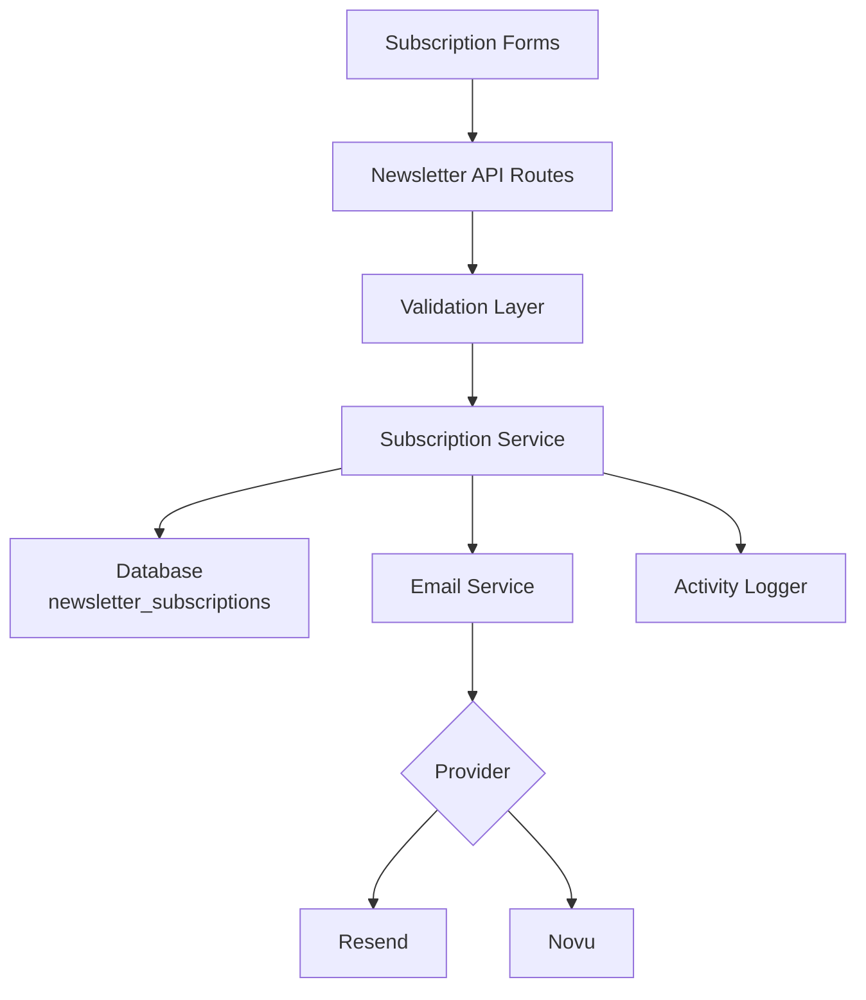
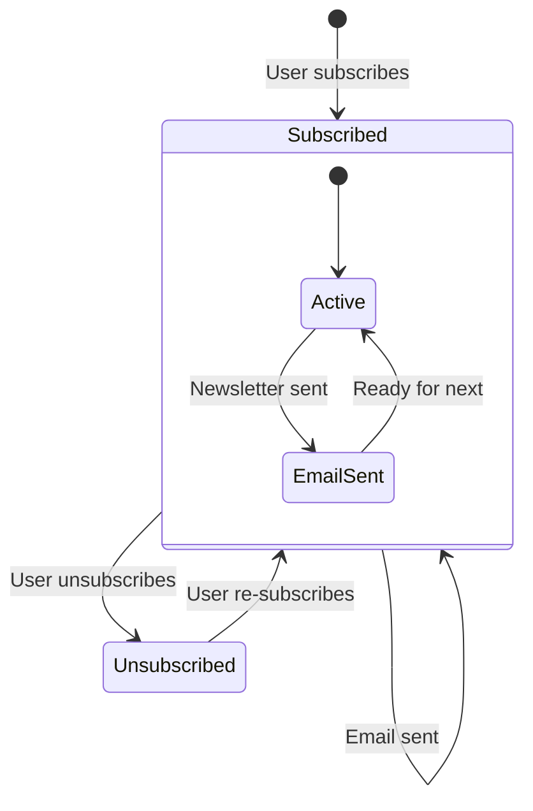

# Configuração de Newsletter

O template inclui um sistema completo de assinatura de newsletter com integração de provedor de email, validação, gerenciamento do ciclo de vida de assinaturas e registro de atividades. A configuração é centralizada em `lib/newsletter/`.

## Arquitetura



## Estrutura de Arquivos

```
lib/newsletter/
├── config.ts    # Configuration, types, validation schemas
└── utils.ts     # Email sending, subscription validation, logging
```

## Constantes de Configuração

O objeto `NEWSLETTER_CONFIG` em `config.ts` define todos os padrões e mensagens:

```typescript
export const NEWSLETTER_CONFIG = {
  DEFAULT_PROVIDER: "resend",
  DEFAULT_FROM: "onboarding@resend.dev",
  DEFAULT_COMPANY_NAME: "Ever Works",

  SOURCES: {
    FOOTER: "footer",
    POPUP: "popup",
    SIGNUP: "signup",
  },

  ERRORS: {
    INVALID_EMAIL: "Please enter a valid email address",
    ALREADY_SUBSCRIBED: "Email is already subscribed to the newsletter",
    NOT_SUBSCRIBED: "Email is not subscribed to the newsletter",
    SUBSCRIPTION_FAILED: "Failed to create subscription. Please try again.",
    UNSUBSCRIPTION_FAILED: "Failed to unsubscribe. Please try again.",
    EMAIL_SEND_FAILED: "Failed to send email. Please try again.",
    STATS_FAILED: "Failed to get newsletter statistics",
  },

  SUCCESS: {
    SUBSCRIBED: "Successfully subscribed to newsletter",
    UNSUBSCRIBED: "Successfully unsubscribed from newsletter",
  },
};
```

## Configuração do Provedor de Email

### Resend (Padrão)

```env
RESEND_API_KEY=re_your_api_key_here
```

1. Registre-se em [resend.com](https://resend.com)
2. Crie uma chave de API
3. Verifique seu domínio de envio (ou use `onboarding@resend.dev` para testes)

### Novu

```env
NOVU_API_KEY=your_novu_api_key
```

Para o Novu, configuração adicional está disponível na configuração do site:

```yaml
mail:
  provider: "novu"
  template_id: "your-template-id"
  backend_url: "https://api.novu.co"
```

## Configuração de Email

A função `createEmailConfig()` constrói a configuração de email a partir da configuração da aplicação:

```typescript
interface EmailConfig {
  provider: string;      // "resend" or "novu"
  defaultFrom: string;   // Sender email address
  domain: string;        // Application domain URL
  apiKeys: {
    resend: string;
    novu: string;
  };
  novu?: {
    templateId?: string;
    backendUrl?: string;
  };
}
```

Prioridade de configuração:

| Configuração      | Fonte                          | Fallback                   |
|---|---|---|
| Provedor          | `config.mail.provider`         | `"resend"`                 |
| Endereço remetente| `config.mail.default_from`     | `"onboarding@resend.dev"`  |
| Domínio           | `config.app_url`               | `coreConfig.APP_URL`       |
| Chave Resend      | Var. de ambiente `RESEND_API_KEY` | String vazia            |
| Chave Novu        | Var. de ambiente `NOVU_API_KEY`  | String vazia             |

## Schemas de Validação

O sistema de newsletter usa schemas Zod para validação de entrada:

### Schema de Email

```typescript
const emailSchema = z.object({
  email: z
    .string()
    .email("Please enter a valid email address")
    .transform((email) => email.toLowerCase().trim()),
});
```

### Schema de Assinatura

```typescript
const newsletterSubscriptionSchema = z.object({
  email: z
    .string()
    .email("Please enter a valid email address")
    .transform((email) => email.toLowerCase().trim()),
  source: z
    .enum(["footer", "popup", "signup"])
    .default("footer"),
});
```

## Origens de Assinatura

Rastrear de onde as assinaturas se originam:

| Origem   | Descrição                                      |
|---|---|
| `footer` | Formulário de assinatura no rodapé do site     |
| `popup`  | Popup/modal de newsletter                      |
| `signup` | Fluxo de registro de conta                     |

## Utilitários de Newsletter

### Envio de Email

```typescript
import { sendEmailSafely, createEmailService } from '@/lib/newsletter/utils';

// Create email service
const { service, config } = await createEmailService();

// Send email with error handling
const result = await sendEmailSafely(
  service,
  config,
  {
    subject: "Welcome to our newsletter!",
    html: "<h1>Welcome!</h1>",
    text: "Welcome!"
  },
  "user@example.com",
  "welcome"
);

if (!result.success) {
  console.error(result.error);
}
```

### Validação de Assinatura

```typescript
import { canSubscribe, canUnsubscribe } from '@/lib/newsletter/utils';

// Check if email can be subscribed
const { canSubscribe: allowed, error } = await canSubscribe("user@example.com");
if (!allowed) {
  // Email is already subscribed
}

// Check if email can be unsubscribed
const { canUnsubscribe: allowed, error } = await canUnsubscribe("user@example.com");
if (!allowed) {
  // Email is not currently subscribed
}
```

### Registro de Atividades

```typescript
import { logNewsletterActivity, trackNewsletterMetric } from '@/lib/newsletter/utils';

// Log newsletter activity
logNewsletterActivity("subscribe", "user@example.com", "footer", {
  ip: "192.168.1.1"
});

// Track newsletter metrics
trackNewsletterMetric("subscription", "user@example.com", "popup");
```

Tipos de atividade:

| Ação           | Quando Registrada                                  |
|---|---|
| `subscribe`    | Usuário assina a newsletter                        |
| `unsubscribe`  | Usuário cancela a assinatura                       |
| `email_sent`   | Email de newsletter enviado com sucesso            |
| `email_failed` | Falha no envio de email de newsletter              |

### Utilitários de Template

```typescript
import { getTemplateWithCompany } from '@/lib/newsletter/utils';

// Generate email template with company name
const template = await getTemplateWithCompany(
  (email, companyName) => ({
    subject: `Welcome to ${companyName}`,
    html: `<p>Thanks for subscribing, ${email}!</p>`,
    text: `Thanks for subscribing, ${email}!`
  }),
  "user@example.com"
);
```

### Helpers de Resposta

```typescript
import { createErrorResponse, createSuccessResponse } from '@/lib/newsletter/utils';

// Standardized error response
const error = createErrorResponse(
  "Subscription failed",
  "user@example.com",
  "subscribe"
);
// { error: "Subscription failed", email: "user@example.com", context: "subscribe" }

// Standardized success response
const success = createSuccessResponse("user@example.com", "subscribe");
// { success: true, email: "user@example.com", context: "subscribe" }
```

## Schema do Banco de Dados

As assinaturas de newsletter são armazenadas na tabela `newsletter_subscriptions`:

| Coluna           | Tipo      | Descrição                                        |
|---|---|---|
| `id`             | UUID      | Chave primária                                   |
| `email`          | String    | Email do assinante (único)                       |
| `isActive`       | Boolean   | Status atual da assinatura                       |
| `subscribedAt`   | Timestamp | Quando a assinatura começou                      |
| `unsubscribedAt` | Timestamp | Quando foi cancelada (nullable)                  |
| `lastEmailSent`  | Timestamp | Último email enviado ao assinante                |
| `source`         | String    | Origem da assinatura (footer, popup, signup)     |

## Ciclo de Vida da Assinatura



## Tipos

```typescript
type NewsletterSource = "footer" | "popup" | "signup";

interface NewsletterActionResult {
  success?: boolean;
  error?: string;
  email?: string;
}

interface NewsletterStats {
  totalActive: number;
  recentSubscriptions: number;
}
```

## Segurança

- Os endereços de email são normalizados para minúsculas e aparados antes do armazenamento
- A validação de email usa uma regex segura que previne ataques ReDoS (de `lib/utils/email-validation.ts`)
- A função `sendEmailSafely` envolve todas as operações de email em blocos try-catch
- As chaves de API nunca são expostas ao cliente — todas as operações de email acontecem no servidor

## Solução de Problemas

| Problema                          | Solução                                                                        |
|---|---|
| Emails não sendo enviados         | Verifique se `RESEND_API_KEY` ou `NOVU_API_KEY` está definido                  |
| Erro "já assinado"                | Verifique a tabela `newsletter_subscriptions` por assinatura ativa existente   |
| Endereço de remetente errado      | Atualize `mail.default_from` na configuração do site                           |
| Template não carregando           | Certifique-se de que `getCompanyName()` possa acessar a configuração do site   |
| Origem não rastreada              | Passe o parâmetro `source` nas requisições de assinatura                       |
