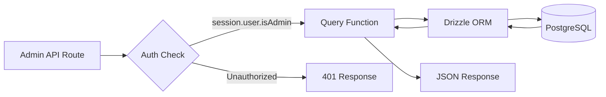
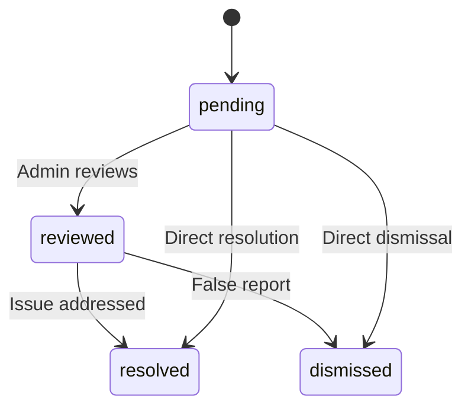

# Consultas de banco de dados de administrador

As consultas administrativas tratam do gerenciamento de itens, gerenciamento de usuários/clientes, acesso baseado em função, estatísticas do painel, moderação de relatórios e configurações. Essas funções são consumidas principalmente por rotas de API em `app/api/admin/`.

## Fluxo de consulta do administrador



## Gerenciamento de usuários (`user.queries.ts`)

### Funções principais

|Função|Parâmetros|Devoluções|Descrição|
|----------|-----------|---------|-------------|
|`getUserByEmail`|`email: string`|`Usuário \|nulo`|Encontrar usuário por endereço de e-mail|
|`getUserById`|`id: string`|`Usuário \|nulo`|Encontre usuário por chave primária|
|`insertNewUser`|`user: NewUser`|`User[]`|Crie um novo registro de usuário|
|`updateUserPassword`|`hash, userId`|`void`|Atualizar hash de senha|
|`updateUserVerification`|`email, verified`|`void`|Definir status de verificação de e-mail|
|`softDeleteUser`|`userId: string`|`void`|Exclusão reversível (anexa `-deleted` ao e-mail)|
|`isUserAdmin`|`userId: string`|`boolean`|Verifique a função de administrador por meio de ingresso|

### Verificação da função administrativa

A função `isUserAdmin` executa uma junção de múltiplas mesas para verificar o status do administrador:

```typescript
export async function isUserAdmin(userId: string): Promise<boolean> {
  const result = await db
    .select({ isAdmin: roles.isAdmin })
    .from(userRoles)
    .innerJoin(roles, eq(userRoles.roleId, roles.id))
    .where(and(
      eq(userRoles.userId, userId),
      eq(roles.isAdmin, true),
      eq(roles.status, 'active')
    ))
    .limit(1);

  return result.length > 0;
}
```

### Padrão de exclusão suave

Os usuários nunca são excluídos fisicamente. A exclusão reversível concatena o ID do usuário ao e-mail para liberar o endereço de e-mail para novo registro:

```typescript
export async function softDeleteUser(userId: string) {
  return db
    .update(users)
    .set({
      deletedAt: sql`CURRENT_TIMESTAMP`,
      email: sql`CONCAT(email, '-', id, '-deleted')`
    })
    .where(eq(users.id, userId));
}
```

## Gerenciamento de clientes (`client.queries.ts`)

### Perfil CRUD

|Função|Descrição|
|----------|-------------|
|`createClientProfile(data)`|Crie um perfil com nome de usuário exclusivo gerado automaticamente|
|`getClientProfileById(id)`|Recuperar por ID de perfil|
|`getClientProfileByUserId(userId)`|Recuperar por referência do usuário|
|`getClientProfileByEmail(email)`|Recuperar por meio de pesquisa na tabela de contas|
|`updateClientProfile(id, data)`|Atualização parcial com carimbo de data/hora|
|`deleteClientProfile(id)`|Exclusão forçada do registro do perfil|

### Dados do painel de administração

A função `getAdminDashboardData` é otimizada para o painel de administração, retornando lista de clientes paginada e estatísticas abrangentes em um número mínimo de consultas:

```typescript
export async function getAdminDashboardData(params: {
  page: number;
  limit: number;
  search?: string;
  status?: string;
  plan?: string;
  accountType?: string;
  provider?: string;
  createdAfter?: Date;
  createdBefore?: Date;
}): Promise<{
  clients: ClientProfileWithAuth[];
  stats: { overview, byProvider, byPlan, byAccountType, activity, growth };
  pagination: { page, totalPages, total, limit };
}>
```

A função exclui usuários administradores das listagens de clientes usando um padrão LEFT JOIN + IS NULL:

```typescript
// Exclude admin users from client listing
.leftJoin(userRoles, eq(userRoles.userId, clientProfiles.userId))
.leftJoin(roles, and(eq(userRoles.roleId, roles.id), eq(roles.isAdmin, true)))
.where(isNull(roles.id))  // Only non-admin users
```

### Pesquisa avançada de clientes

`advancedClientSearch` suporta filtragem multicritério complexa:

|Categoria de filtro|Parâmetros|
|----------------|------------|
|**Pesquisa de texto**|`search` (nome, e-mail, nome de usuário, empresa, biografia, cargo, setor, localização)|
|**Filtros de enumeração**|`status`, `plan`, `accountType`, `provider`|
|**Períodos**|`createdAfter`, `createdBefore`, `updatedAfter`, `updatedBefore`, `dateRange`|
|**Específico do campo**|`emailDomain`, `companySearch`, `locationSearch`, `industrySearch`|
|**Numérico**|`minSubmissions`, `maxSubmissions`|
|**Booleano**|`hasAvatar`, `hasWebsite`, `hasPhone`, `emailVerified`, `twoFactorEnabled`|
|**Classificação**|`sortBy` (criadoAt, atualizadoAt, nome, email, empresa, totalSubmissões), `sortOrder`|

### Estatísticas do cliente

`getEnhancedClientStats` retorna uma análise abrangente:

```typescript
{
  overview: { total, active, inactive, suspended, trial },
  byProvider: { credentials, google, github, facebook, twitter, linkedin, other },
  byPlan: { free: number, standard: number, premium: number },
  byAccountType: { individual, business, enterprise },
  activity: { newThisWeek, newThisMonth, activeThisWeek, activeThisMonth },
  growth: { weeklyGrowth, monthlyGrowth },
}
```

## Gerenciamento de relatórios (`report.queries.ts`)

### Reportar CRUD

|Função|Descrição|
|----------|-------------|
|`createReport(data)`|Crie um relatório de conteúdo (item ou comentário)|
|`getReportById(id)`|Obtenha relatório com detalhes do repórter e revisor|
|`getReports(params)`|Listagem de relatórios paginados com filtros|
|`updateReport(id, data)`|Atualizar status, resolução, adicionar notas de revisão|
|`getReportStats()`|Estatísticas por status, tipo de conteúdo, motivo|
|`hasUserReportedContent(reportedBy, contentType, contentId)`|Verificação de relatório duplicado|

### Fluxo de status do relatório



### Filtragem de relatórios

Os relatórios suportam filtragem por status, tipo de conteúdo (item/comentário) e motivo (spam, assédio, impróprio, outro):

```typescript
export async function getReports(params: {
  page?: number;
  limit?: number;
  search?: string;
  status?: ReportStatusValues;
  contentType?: ReportContentTypeValues;
  reason?: ReportReasonValues;
}): Promise<{
  reports: ReportWithReporter[];
  total: number;
  page: number;
  totalPages: number;
  limit: number;
}>
```

## Estatísticas do painel (`dashboard.queries.ts`)

### Métricas Disponíveis

|Função|Objetivo|Usado em|
|----------|---------|---------|
|`getVotesReceivedCount(itemSlugs)`|Total de votos em itens|Resumo do painel|
|`getCommentsReceivedCount(itemSlugs)`|Total de comentários em itens|Resumo do painel|
|`getUniqueItemsInteractedCount(clientId)`|Itens com os quais o usuário interagiu|Painel de atividades|
|`getUserTotalActivityCount(clientId)`|Total de votos + comentários por usuário|Painel de atividades|
|`getWeeklyEngagementData(itemSlugs, weeks)`|Gráfico semanal de votos/comentários|Gráfico de engajamento|
|`getDailyActivityData(clientId, itemSlugs, days)`|Detalhamento da atividade diária|Gráfico de atividades|
|`getTopItemsEngagement(itemSlugs, limit)`|Principais itens por engajamento|Painel de itens principais|

### Dados de engajamento semanal

Retorna dados de engajamento agregados por semana ISO, correspondendo ao formato `to_char(date, 'IYYY-IW')` do PostgreSQL:

```typescript
const weeklyVotes = await db
  .select({
    week: sql<string>`to_char(${votes.createdAt}, 'IYYY-IW')`.as('week'),
    count: count(),
  })
  .from(votes)
  .where(and(inArray(votes.itemId, itemSlugs), gte(votes.createdAt, startDate)))
  .groupBy(sql`to_char(${votes.createdAt}, 'IYYY-IW')`)
  .orderBy(sql`to_char(${votes.createdAt}, 'IYYY-IW')`);
```

## Gerenciamento de token de autenticação (`auth.queries.ts`)

|Função|Descrição|
|----------|-------------|
|`getPasswordResetTokenByEmail(email)`|Encontre o token de redefinição por e-mail|
|`getPasswordResetTokenByToken(token)`|Encontre o token de redefinição por string de token|
|`deletePasswordResetToken(token)`|Remover token usado/expirado|
|`getVerificationTokenByEmail(email)`|Encontre token de verificação por e-mail|
|`getVerificationTokenByToken(token)`|Encontre o token de verificação por string de token|
|`deleteVerificationToken(token)`|Remover token usado/expirado|

Todas as funções de token seguem o mesmo padrão simples de seleção por campo com `.limit(1)`.
