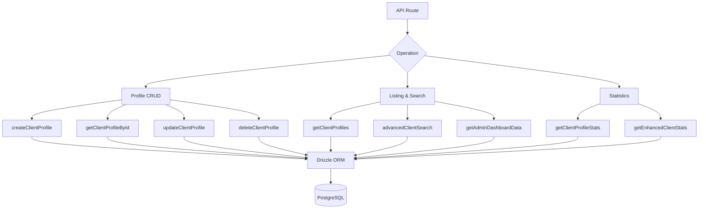

# Consultas voltadas para o cliente

As consultas dos clientes tratam do gerenciamento de perfis, listagem com metadados de autenticação, pesquisa avançada multicritério e estatísticas abrangentes. Todas as funções residem em `client.queries.ts` e são consumidas por rotas de API administrativas e voltadas para o cliente.

## Arquitetura de consulta do cliente



## Perfil CRUD

### Criar perfil

Novos perfis geram automaticamente nomes de usuário exclusivos a partir do endereço de e-mail quando nenhum nome de usuário é fornecido:

```typescript
export async function createClientProfile(data: {
  userId: string;
  email: string;
  name: string;
  displayName?: string;
  username?: string;
  bio?: string;
  jobTitle?: string;
  company?: string;
  status?: string;
  plan?: string;
  accountType?: string;
}): Promise<ClientProfile>
```

Lógica de geração de nome de usuário:

1. Se `username` for fornecido, normalize e garanta a exclusividade
2. Caso contrário, extraia o nome de usuário do e-mail via `extractUsernameFromEmail()`
3. Fallback: gerar prefixo `user<timestamp>`
4. Todos os caminhos passam por `ensureUniqueUsername()` que acrescenta sufixos numéricos, se necessário

Valores padrão aplicados durante a criação:

|Campo|Padrão|
|-------|---------|
|`displayName`|O mesmo que `name`|
|`bio`|`"Welcome! I'm a new user on this platform."`|
|`jobTitle`|`"User"`|
|`company`|`"Unknown"`|
|`status`|`"active"`|
|`plan`|`"free"`|
|`accountType`|`"individual"`|

### Ler operações

|Função|Campo de pesquisa|Devoluções|
|----------|-------------|---------|
|`getClientProfileById(id)`|`clientProfiles.id`|`Perfil do Cliente\|nulo`|
|`getClientProfileByUserId(userId)`|`clientProfiles.userId`|`Perfil do Cliente\|nulo`|
|`getClientProfileByEmail(email)`|Através da tabela `accounts`|`Perfil do Cliente\|nulo`|

A pesquisa baseada em e-mail é resolvida por meio da tabela `accounts` para encontrar o `userId` associado e, em seguida, consulta `clientProfiles`:

```typescript
export async function getClientProfileByEmail(email: string): Promise<ClientProfile | null> {
  const account = await getClientAccountByEmail(email);
  if (!account) return null;
  const [profile] = await db
    .select()
    .from(clientProfiles)
    .where(eq(clientProfiles.userId, account.userId))
    .limit(1);
  return profile || null;
}
```

### Atualizar e excluir

- **`updateClientProfile(id, data)`** -- Atualização parcial com carimbo de data/hora automático `updatedAt`
- **`deleteClientProfile(id)`** -- Exclusão forçada (retorna sucesso booleano)

## Listagem paginada

`getClientProfiles` retorna resultados paginados com dados do provedor de autenticação, excluindo usuários administradores:

```typescript
export async function getClientProfiles(params: {
  page?: number;
  limit?: number;
  search?: string;
  status?: string;
  plan?: string;
  accountType?: string;
  provider?: string;
}): Promise<{
  profiles: ClientProfileWithAuth[];
  total: number;
  page: number;
  totalPages: number;
  limit: number;
}>
```

### Padrão de exclusão de administrador

Tanto a consulta de contagem quanto a consulta de dados usam um padrão LEFT JOIN + IS NULL para excluir usuários administradores:

```typescript
.leftJoin(userRoles, eq(userRoles.userId, clientProfiles.userId))
.leftJoin(roles, and(eq(userRoles.roleId, roles.id), eq(roles.isAdmin, true)))
.where(isNull(roles.id))  // Only non-admin users
```

### Subconsulta do provedor

Para evitar linhas duplicadas quando um usuário possui várias contas de autenticação, o provedor é resolvido por meio de uma subconsulta escalar:

```typescript
accountProvider: sql<string>`coalesce(
  (SELECT provider FROM ${accounts}
   WHERE ${accounts.userId} = ${clientProfiles.userId}
   LIMIT 1),
  'unknown'
)`
```

### Filtro de pesquisa

A pesquisa de texto usa `ILIKE` em vários campos com prevenção de injeção de SQL:

```typescript
const escapedSearch = search
  .replace(/\\/g, '\\\\')
  .replace(/[%_]/g, '\\$&');

whereConditions.push(
  sql`(${clientProfiles.username} ILIKE ${`%${escapedSearch}%`} OR
       ${clientProfiles.displayName} ILIKE ${`%${escapedSearch}%`} OR
       ${clientProfiles.company} ILIKE ${`%${escapedSearch}%`} OR
       ${clientProfiles.name} ILIKE ${`%${escapedSearch}%`} OR
       ${clientProfiles.email} ILIKE ${`%${escapedSearch}%`})`
);
```

## Pesquisa avançada de clientes

`advancedClientSearch` suporta mais de 20 critérios de filtro em várias categorias:

|Categoria de filtro|Parâmetros|
|----------------|------------|
|**Pesquisa de texto**|`search` (nome, e-mail, nome de usuário, empresa, biografia, cargo, setor, localização)|
|**Filtros de enumeração**|`status`, `plan`, `accountType`, `provider`|
|**Períodos**|`createdAfter`, `createdBefore`, `updatedAfter`, `updatedBefore`, `dateRange`|
|**Específico do campo**|`emailDomain`, `companySearch`, `locationSearch`, `industrySearch`|
|**Numérico**|`minSubmissions`, `maxSubmissions`|
|**Booleano**|`hasAvatar`, `hasWebsite`, `hasPhone`, `emailVerified`, `twoFactorEnabled`|
|**Classificação**|`sortBy`, `sortOrder`|

## Estatísticas do cliente

### Estatísticas Básicas

`getClientProfileStats` retorna contagens simples:

```typescript
{
  total: number;
  active: number;
  inactive: number;
  byPlan: Record<string, number>;
  byAccountType: Record<string, number>;
}
```

### Estatísticas aprimoradas

`getEnhancedClientStats` fornece uma análise multidimensional abrangente:

```typescript
{
  overview: { total, active, inactive, suspended, trial },
  byProvider: { credentials, google, github, facebook, twitter, linkedin, other },
  byPlan: { free: number, standard: number, premium: number },
  byAccountType: { individual, business, enterprise },
  activity: { newThisWeek, newThisMonth, activeThisWeek, activeThisMonth },
  growth: { weeklyGrowth, monthlyGrowth },
}
```

As estatísticas aprimoradas usam `countDistinct` com junções de múltiplas mesas para produzir contagens precisas mesmo quando os usuários têm vários provedores de conta:

```typescript
const statsResult = await db
  .select({
    status: clientProfiles.status,
    plan: clientProfiles.plan,
    accountType: clientProfiles.accountType,
    provider: accounts.provider,
    count: countDistinct(clientProfiles.id)
  })
  .from(clientProfiles)
  .leftJoin(accounts, eq(clientProfiles.userId, accounts.userId))
  .leftJoin(userRoles, eq(userRoles.userId, clientProfiles.userId))
  .leftJoin(roles, and(eq(userRoles.roleId, roles.id), eq(roles.isAdmin, true)))
  .where(isNull(roles.id))
  .groupBy(
    clientProfiles.status,
    clientProfiles.plan,
    clientProfiles.accountType,
    accounts.provider
  );
```

### Métricas de atividade

As janelas de atividades são calculadas usando aritmética de data:

```typescript
const oneWeekAgo = new Date(now.getTime() - 7 * 24 * 60 * 60 * 1000);
const oneMonthAgo = new Date(now.getTime() - 30 * 24 * 60 * 60 * 1000);
```

As taxas de crescimento são percentagens simplificadas de novos registos em relação ao total:

```typescript
const weeklyGrowth = total > 0 ? Math.round((newThisWeek / total) * 100) : 0;
```

## Tipos

Todos os tipos de consulta do cliente são definidos em `lib/db/queries/types.ts`:

```typescript
export type ClientProfileWithAuth = ClientProfile & {
  accountProvider: string;
  isActive: boolean;
};

export type ClientStatus = "active" | "inactive" | "suspended" | "trial";
export type ClientPlan = "free" | "standard" | "premium";
export type ClientAccountType = "individual" | "business" | "enterprise";
```
