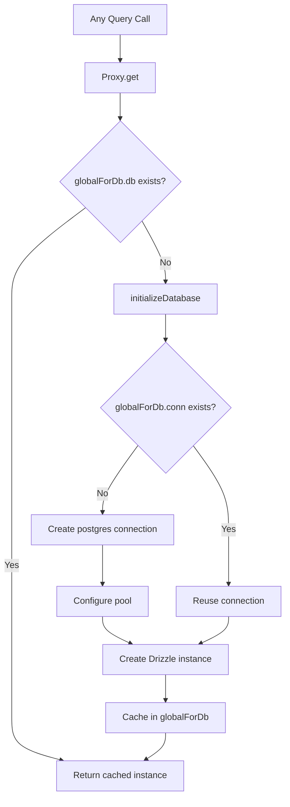

# Conexão e pool de banco de dados

O modelo usa `postgres.js` (o pacote `postgres` npm) como o driver PostgreSQL com Drizzle ORM. O gerenciamento de conexão é feito por meio de um padrão de inicialização lenta com cache singleton global para sobreviver à substituição de módulo quente (HMR) do Next.js no desenvolvimento.

## Arquitetura de conexão



## Configuração do banco de dados (`lib/db/drizzle.ts`)

### Inicialização lenta com proxy

A instância do banco de dados é exportada como `Proxy` que inicializa a conexão no primeiro acesso:

```typescript
export const db = new Proxy({} as ReturnType<typeof drizzle>, {
  get(target, prop) {
    const database = initializeDatabase();
    return database[prop as keyof typeof database];
  },
});
```

Isso garante:
- Nenhuma conexão é criada no momento da importação
- Scripts que importam o módulo, mas não consultam o banco de dados, não geram sobrecarga de conexão
- A primeira operação real do banco de dados aciona a inicialização

### Função de inicialização

```typescript
function initializeDatabase(): ReturnType<typeof drizzle> {
  if (!getDatabaseUrl()) {
    throw new Error('DATABASE_URL environment variable is required');
  }

  if (globalForDb.db) {
    return globalForDb.db;
  }

  const poolSize = getPoolSize();
  const conn = postgres(getDatabaseUrl()!, {
    max: poolSize,
    idle_timeout: 20,
    connect_timeout: 30,
    prepare: false,
    onnotice: getNodeEnv() === 'development' ? console.log : undefined,
  });

  globalForDb.conn = conn;
  globalForDb.db = drizzle(conn, { schema });
  return globalForDb.db;
}
```

### Opções de conexão

|Opção|Valor|Objetivo|
|--------|-------|---------|
|`max`|Configurável (ver dimensionamento da piscina)|Máximo de conexões no pool|
|`idle_timeout`|`20` segundos|Fechar conexões inativas após esse período|
|`connect_timeout`|`30` segundos|Tempo máximo para estabelecer uma conexão|
|`prepare`|`false`|Desabilitar instruções preparadas (obrigatório para alguns ambientes PaaS)|
|`onnotice`|`console.log` (somente desenvolvedor)|Registrar mensagens de AVISO do PostgreSQL em desenvolvimento|

## Dimensionamento da piscina

### Configuração

O tamanho do pool é configurável por meio da variável de ambiente `DB_POOL_SIZE`, com padrões de reconhecimento de ambiente:

```typescript
const getPoolSize = (): number => {
  const envPoolSize = process.env.DB_POOL_SIZE;
  if (envPoolSize) {
    const parsed = parseInt(envPoolSize, 10);
    return isNaN(parsed) ? 20 : Math.max(1, Math.min(parsed, 50));
  }
  return getNodeEnv() === 'production' ? 20 : 10;
};
```

### Padrões

|Meio Ambiente|Tamanho padrão do pool|Alcance|
|-------------|------------------|-------|
|Produção| 20 | 1 - 50 |
|Desenvolvimento| 10 | 1 - 50 |

O tamanho do pool é fixado entre 1 e 50, independentemente do valor configurado.

### Diretrizes de tamanho de piscina

- **Desenvolvimento (10):** Suficiente para um único desenvolvedor com HMR. Mantém baixo o uso de recursos.
- **Produção (20):** Lida com solicitações de API simultâneas. Aumento para implantações de alto tráfego.
- **Sem servidor (1-5):** Use pools pequenos quando implantados em plataformas sem servidor, onde cada instância obtém seu próprio pool.

## Padrão Global Singleton

### Segurança HMR

O modo de desenvolvimento Next.js reexecuta os módulos nas alterações do arquivo. Sem proteção, cada ciclo de HMR criaria um novo pool de conexões, esgotando rapidamente as conexões de banco de dados.

O modelo anexa a conexão a `globalThis` para sobreviver ao HMR:

```typescript
const globalForDb = globalThis as unknown as {
  conn: postgres.Sql | undefined;
  db: ReturnType<typeof drizzle> | undefined;
};
```

Quando um módulo é executado novamente:
1. `initializeDatabase()` verifica `globalForDb.db`
2. Se a instância existir, ela será retornada imediatamente
3. Se a conexão existir, mas a instância do Drizzle não, a conexão existente será reutilizada

O log de desenvolvimento indica se uma conexão foi reutilizada:

```
Reusing existing database connection; pool size is unchanged
```

ou recém-criado:

```
Database connection established successfully with pool size: 10
```

### Acesso direto à instância

Para bibliotecas que requerem uma instância concreta do Drizzle (por exemplo, o adaptador Auth.js), uma função getter é fornecida:

```typescript
export function getDrizzleInstance(): ReturnType<typeof drizzle> {
  return initializeDatabase();
}
```

## Módulo de configuração (`lib/db/config.ts`)

Um módulo de configuração seguro para script que **não** importa `server-only`, permitindo que ele seja usado por scripts de migração e propagação:

```typescript
export function getDatabaseUrl(): string | undefined {
  return process.env.DATABASE_URL;
}

export function getNodeEnv(): 'development' | 'production' | 'test' {
  const env = process.env.NODE_ENV;
  if (env === 'production' || env === 'test') return env;
  return 'development';
}

export function isProduction(): boolean {
  return getNodeEnv() === 'production';
}
```

## Corredor de migração (`lib/db/migrate.ts`)

O executor de migração é idempotente e seguro para ser chamado em cada inicialização do aplicativo:

```typescript
export async function runMigrations(): Promise<boolean> {
  const { db } = await import('./drizzle');
  await migrate(db, { migrationsFolder: './lib/db/migrations' });
  return true;
}
```

Comportamentos principais:
- Drizzle rastreia migrações aplicadas em `drizzle.__drizzle_migrations`
- As migrações já aplicadas são ignoradas automaticamente
- Retorna `true` em caso de sucesso, `false` em caso de falha (não lança)
- Registra o estado da migração antes e depois da execução

## Variáveis de ambiente

|Variável|Obrigatório|Padrão|Descrição|
|----------|----------|---------|-------------|
|`DATABASE_URL`|Sim| -- |Cadeia de conexão PostgreSQL|
|`DB_POOL_SIZE`|Não|`20` (produção) / `10` (desenvolvimento)|Tamanho do pool de conexões (1-50)|
|`NODE_ENV`|Não|`development`|Ambiente (desenvolvimento/produção/teste)|

## Configuração do kit de chuvisco

A configuração do Drizzle Kit para geração de esquema e gerenciamento de migração:

```typescript
// drizzle.config.ts
export default {
  schema: "./lib/db/schema.ts",
  out: "./lib/db/migrations",
  dialect: "postgresql",
  dbCredentials: {
    url: process.env.DATABASE_URL,
  },
} satisfies Config;
```

## Solução de problemas

|Problema|Causa|Solução|
|-------|-------|----------|
|`DATABASE_URL is required`|Variável de ambiente ausente|Defina `DATABASE_URL` em `.env.local`|
|Tempo limite de conexão|Rede lenta ou banco de dados sobrecarregado|Aumente `connect_timeout` ou verifique a integridade do banco de dados|
|Esgotamento da piscina no desenvolvimento|HMR criando vários pools|Certifique-se de que o padrão `globalForDb` esteja intacto|
|Esgotamento da piscina em produção|Muitas solicitações simultâneas|Aumente `DB_POOL_SIZE` (máx. 50)|
|Erros `prepare` em PaaS|PaaS pgBouncer em modo de transação|Mantenha `prepare: false`|
