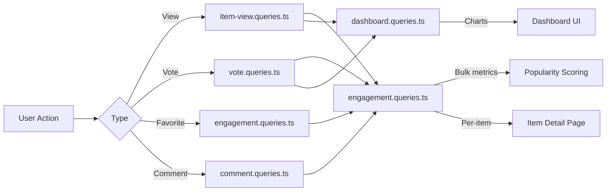

# Consultas de engajamento e interação

As consultas de engajamento agregam as interações do usuário (visualizações, votos, favoritos, comentários) entre os itens. Essas consultas potencializam a classificação de popularidade, gráficos de painel e painéis de engajamento por item. Os módulos relevantes são `engagement.queries.ts`, `vote.queries.ts`, `comment.queries.ts`, `item-view.queries.ts` e `dashboard.queries.ts`.

## Fluxo de dados de engajamento



## Métricas de engajamento em massa (`engagement.queries.ts`)

### `getEngagementMetricsPerItem`

A principal função para pontuação de popularidade. Retorna todas as dimensões de engajamento para vários itens em um único lote de consultas paralelas:

```typescript
export async function getEngagementMetricsPerItem(
  itemSlugs: string[]
): Promise<Map<string, ItemEngagementMetrics>>
```

Tipo de retorno:

```typescript
export interface ItemEngagementMetrics {
  views: number;
  votes: number;       // Net votes (upvotes - downvotes)
  favorites: number;
  comments: number;
  avgRating: number;   // Average rating from comments (0-5)
}
```

### Estratégia de consulta paralela

Quatro consultas independentes são executadas via `Promise.all` para rendimento máximo:

```typescript
const [viewsData, votesData, favoritesData, commentsData] = await Promise.all([
  // 1. Views per item
  db.select({ itemId: itemViews.itemId, count: count() })
    .from(itemViews)
    .where(inArray(itemViews.itemId, itemSlugs))
    .groupBy(itemViews.itemId),

  // 2. Net votes per item (upvotes - downvotes)
  db.select({
      itemId: votes.itemId,
      netScore: sql<number>`SUM(CASE
        WHEN vote_type = 'upvote' THEN 1
        WHEN vote_type = 'downvote' THEN -1
        ELSE 0 END)`.as('netScore'),
    })
    .from(votes)
    .where(inArray(votes.itemId, itemSlugs))
    .groupBy(votes.itemId),

  // 3. Favorites per item
  db.select({ itemSlug: favorites.itemSlug, count: count() })
    .from(favorites)
    .where(inArray(favorites.itemSlug, itemSlugs))
    .groupBy(favorites.itemSlug),

  // 4. Comments count + average rating (excluding soft-deleted)
  db.select({
      itemId: comments.itemId,
      count: count(),
      avgRating: sql<number>`COALESCE(AVG(${comments.rating}), 0)`.as('avgRating'),
    })
    .from(comments)
    .where(and(inArray(comments.itemId, itemSlugs), isNull(comments.deletedAt)))
    .groupBy(comments.itemId),
]);
```

### Normalização de resultados

Cada resultado de consulta é convertido em uma pesquisa `Map` para O(1) e depois combinado no mapa de métricas final:

```typescript
const viewsMap = new Map<string, number>(
  viewsData.map(v => [v.itemId, Number(v.count)])
);
// ... same for votesMap, favoritesMap, commentsMap

for (const slug of itemSlugs) {
  metricsMap.set(slug, {
    views: viewsMap.get(slug) ?? 0,
    votes: votesMap.get(slug) ?? 0,
    favorites: favoritesMap.get(slug) ?? 0,
    comments: commentsMap.get(slug)?.count ?? 0,
    avgRating: commentsMap.get(slug)?.avgRating ?? 0,
  });
}
```

### Funções métricas independentes

|Função|Devoluções|Descrição|
|----------|---------|-------------|
|`getFavoritesPerItem(itemSlugs)`|`Map<string, number>`|Contagem de favoritos por item|
|`getCommentsPerItem(itemSlugs)`|`Map<string, { count, avgRating }>`|Contagem de comentários e classificações médias|

Ambas as funções usam o mesmo padrão: retorno antecipado para matrizes vazias, `groupBy` agregação, `Map` construção.

## Consultas de votação (`vote.queries.ts`)

### Vote CRUD

|Função|Descrição|
|----------|-------------|
|`createVote(vote)`|Criar votação com normalização de slug|
|`getVoteByUserIdAndItemId(userId, itemSlug)`|Verifique o voto existente|
|`deleteVote(voteId)`|Excluir um voto|

Todas as funções de votação normalizam slugs de itens por meio de `getItemIdFromSlug()` antes da consulta.

### Cálculo da pontuação líquida

Pontuação de item individual usando `SUM` condicional:

```typescript
export async function getVoteCountForItem(itemSlug: string): Promise<number> {
  const itemId = getItemIdFromSlug(itemSlug);
  const [result] = await db
    .select({
      netScore: sql<number>`
        SUM(CASE
          WHEN vote_type = 'upvote' THEN 1
          WHEN vote_type = 'downvote' THEN -1
          ELSE 0
        END)`.as('netScore')
    })
    .from(votes)
    .where(eq(votes.itemId, itemId));
  return Number(result?.netScore ?? 0);
}
```

### Pontuações de votação em massa

`getVotesPerItem` retorna `Map<string, number>` de pontuações líquidas para vários itens usando `inArray` e `groupBy`.

### Itens classificados por votação

```typescript
export async function getItemsSortedByVotes(limit = 10, offset = 0) {
  return db
    .select({
      itemId: votes.itemId,
      voteCount: sql<number>`count(${votes.id})`.as('vote_count')
    })
    .from(votes)
    .groupBy(votes.itemId)
    .orderBy(sql`vote_count DESC`)
    .limit(limit)
    .offset(offset);
}
```

## Consultas de comentários (`comment.queries.ts`)

### Comente CRUD

|Função|Descrição|
|----------|-------------|
|`createComment(data)`|Criar com normalização de slug|
|`getCommentById(id)`|Registro de comentário bruto|
|`getCommentWithUserById(id)`|Comente com perfil de usuário junte-se|
|`updateComment(id, { content?, rating? })`|Atualizar com carimbo de data/hora `editedAt`|
|`updateCommentRating(id, rating)`|Atualização apenas de classificação|
|`deleteComment(id)`|Exclusão suave (`deletedAt = new Date()`)|

### Comentários com dados do usuário

`getCommentsByItemId` usa `innerJoin` com `clientProfiles` para enriquecer cada comentário com informações do autor:

```typescript
export async function getCommentsByItemId(itemSlug: string): Promise<CommentWithUser[]> {
  const itemId = getItemIdFromSlug(itemSlug);
  return db
    .select({
      id: comments.id,
      content: comments.content,
      rating: comments.rating,
      userId: comments.userId,
      itemId: comments.itemId,
      createdAt: comments.createdAt,
      updatedAt: comments.updatedAt,
      editedAt: comments.editedAt,
      deletedAt: comments.deletedAt,
      user: {
        id: clientProfiles.id,
        name: clientProfiles.name,
        email: clientProfiles.email,
        image: clientProfiles.avatar
      }
    })
    .from(comments)
    .innerJoin(clientProfiles, eq(comments.userId, clientProfiles.id))
    .where(and(eq(comments.itemId, itemId), isNull(comments.deletedAt)))
    .orderBy(desc(comments.createdAt));
}
```

## Ver rastreamento (`item-view.queries.ts`)

### Deduplicação diária

As visualizações são desduplicadas por visualizador, por item, por dia UTC, usando o padrão de upsert `onConflictDoNothing`:

```typescript
export async function recordItemView(
  view: Pick<NewItemView, 'itemId' | 'viewerId' | 'viewedDateUtc'>
): Promise<boolean> {
  const result = await db
    .insert(itemViews)
    .values(view)
    .onConflictDoNothing()
    .returning({ id: itemViews.id });
  return result.length > 0; // true = new view, false = duplicate
}
```

### Ver funções de agregação

|Função|Parâmetros|Devoluções|Descrição|
|----------|-----------|---------|-------------|
|`getTotalViewsCount(itemSlugs)`|`string[]`|`number`|Total de visualizações de itens|
|`getRecentViewsCount(itemSlugs, days)`|`string[], number`|`number`|Visualizações nos últimos N dias|
|`getDailyViewsData(itemSlugs, days)`|`string[], number`|`Map<string, number>`|Contagens de visualizações diárias|
|`getViewsPerItem(itemSlugs)`|`string[]`|`Map<string, number>`|Contagens de visualizações por item|

### Auxiliar de data UTC

Todos os cálculos de data usam UTC para evitar erros de intervalo relacionado ao fuso horário:

```typescript
function getUtcDateString(daysAgo: number = 0): string {
  const date = new Date();
  date.setUTCDate(date.getUTCDate() - daysAgo);
  return date.toISOString().split('T')[0]; // "YYYY-MM-DD"
}
```

## Estatísticas do painel (`dashboard.queries.ts`)

### Métricas Disponíveis

|Função|Objetivo|
|----------|---------|
|`getVotesReceivedCount(itemSlugs)`|Total de votos nos itens do usuário|
|`getCommentsReceivedCount(itemSlugs)`|Total de comentários nos itens do usuário|
|`getUniqueItemsInteractedCount(clientId)`|Itens com os quais o usuário interagiu|
|`getUserTotalActivityCount(clientId)`|Total de votos + comentários por usuário|
|`getWeeklyEngagementData(itemSlugs, weeks)`|Dados gráficos agregados semanais|
|`getDailyActivityData(clientId, itemSlugs, days)`|Detalhamento da atividade diária|
|`getTopItemsEngagement(itemSlugs, limit)`|Principais itens por pontuação de engajamento|

### Agregação de engajamento semanal

Usa `to_char` do PostgreSQL com formato de semana ISO para intervalos semanais consistentes:

```typescript
const weeklyVotes = await db
  .select({
    week: sql<string>`to_char(${votes.createdAt}, 'IYYY-IW')`.as('week'),
    count: count(),
  })
  .from(votes)
  .where(and(inArray(votes.itemId, itemSlugs), gte(votes.createdAt, startDate)))
  .groupBy(sql`to_char(${votes.createdAt}, 'IYYY-IW')`)
  .orderBy(sql`to_char(${votes.createdAt}, 'IYYY-IW')`);
```

## Considerações de desempenho

- Todas as funções em massa aceitam matrizes e usam `inArray` para processamento em lote
- Entradas de array vazias retornam antecipadamente sem atingir o banco de dados
- `Promise.all` executa agregações independentes simultaneamente
- As estruturas de dados `Map` fornecem pesquisa O(1) durante a montagem do resultado
- Comentários excluídos de forma reversível são excluídos via `isNull(comments.deletedAt)` em todas as agregações
