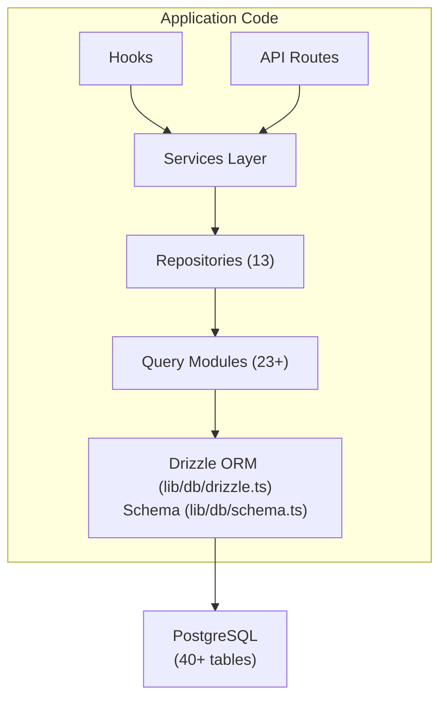

# Visão geral do banco de dados

O modelo Ever Works usa **Drizzle ORM** com **PostgreSQL** como camada de banco de dados. O banco de dados é opcional – o aplicativo pode ser executado sem ele para implantações somente de conteúdo – mas ele potencializa todos os recursos de usuário, assinatura, engajamento e administração.

## Pilha de tecnologia

|Componente|Tecnologia|Objetivo|
|-----------|-----------|---------|
|ORM|Regue ORM|Construtor de consultas e gerenciamento de esquema com segurança de tipo|
|Banco de dados|PostgreSQL|Banco de dados relacional primário|
|Motorista|`postgres` (postgres.js)|Cliente PostgreSQL para Node.js|
|Migrações|Kit Chuvisco|Geração e execução de migração de esquema|
|Semeando|`drizzle-seed` + scripts personalizados|Inicialização do banco de dados com dados padrão|

## Arquitetura de banco de dados



## Configuração

### Configuração de chuvisco (`drizzle.config.ts`)

```typescript
export default {
  schema: "./lib/db/schema.ts",
  out: "./lib/db/migrations",
  dialect: "postgresql",
  dbCredentials: {
    url: process.env.DATABASE_URL,
  },
} satisfies Config;
```

A configuração aponta para:
- **Arquivo de esquema**: `lib/db/schema.ts` -- a única fonte de verdade para todas as definições de tabela
- **Saída de migrações**: `lib/db/migrations/` -- onde os arquivos de migração SQL gerados são armazenados
- **Dialeto**: PostgreSQL
- **Conexão**: Via variável de ambiente `DATABASE_URL`

### Gerenciamento de conexão (`lib/db/drizzle.ts`)

A conexão do banco de dados é inicializada lentamente no primeiro uso e reutiliza conexões em recarregamentos a quente no desenvolvimento por meio de um padrão singleton global.

Principais recursos:
- **Inicialização lenta**: A conexão com o banco de dados não é criada até que a primeira consulta seja executada
- **Acesso baseado em proxy**: O objeto `db` exportado usa um JavaScript `Proxy` para inicializar a conexão de forma transparente
- **Pooling de conexões**: Tamanho do pool configurável por meio da variável de ambiente `DB_POOL_SIZE` (padrão: 20 em produção, 10 em desenvolvimento, limitado de 1 a 50)
- **Tempo limite de inatividade**: as conexões são liberadas após 20 segundos de inatividade
- **Tempo limite de conexão**: tempo limite de 30 segundos para estabelecer novas conexões
- **Padrão Singleton**: usa `globalThis` para persistir conexões em recarregamentos a quente do Next.js

```typescript
// Usage - just import and use
import { db } from '@/lib/db/drizzle';

const users = await db.select().from(schema.users);
```

### Variáveis de ambiente

|Variável|Obrigatório|Padrão|Descrição|
|----------|----------|---------|-------------|
|`DATABASE_URL`|Não| - |Cadeia de conexão PostgreSQL|
|`DB_POOL_SIZE`|Não| 10/20 |Tamanho do pool de conexões (dev/prod)|

Quando `DATABASE_URL` não está definido, os recursos do banco de dados são desativados silenciosamente, permitindo que o aplicativo seja executado no modo somente conteúdo.

## Visão geral do esquema

O esquema do banco de dados é definido em um único arquivo (`lib/db/schema.ts`) contendo mais de 40 tabelas organizadas por domínio:

|Domínio|Tabelas|Descrição|
|--------|--------|-------------|
|Usuários e autenticação| 8 |Usuários, contas, sessões, tokens, autenticadores|
|Funções e permissões| 3 |RBAC com funções, permissões e mapeamentos de permissão de função|
|Perfis de clientes| 1 |Perfis de usuário estendidos para contas de clientes|
|Engajamento de conteúdo| 4 |Comentários, votos, favoritos, visualizações de itens|
|Assinaturas| 4 |Planos, histórico de assinaturas, provedores de pagamento, contas de pagamento|
|Notificações| 1 |Sistema de notificação no aplicativo|
|Administração e Moderação| 4 |Relatórios, histórico de moderação, registros de auditoria de itens, registros de atividades|
|Integrações| 2 |Configuração de CRM, mapeamentos de integração|
|Empresas| 2 |Empresas e associações de empresas de itens|
|Anúncios de patrocinadores| 1 |Anúncios de itens patrocinados|
|Pesquisas| 2 |Pesquisas e respostas de pesquisas|
|Boletim informativo| 1 |Assinaturas de boletins informativos|
|Sistema| 1 |Rastreamento do status da semente|

## Inicialização do banco de dados

Na inicialização do aplicativo (via `instrumentation.ts`), o modelo automaticamente:

1. **Executa migrações**: a função `migrate()` do Drizzle aplica quaisquer migrações pendentes (idempotente – migrações já aplicadas são ignoradas)
2. **Sementes de dados**: se o banco de dados não tiver sido propagado, o script de semente será executado com proteção de bloqueio consultivo para evitar condições de corrida em implantações de vários processos

Isso é tratado por `lib/db/initialize.ts`. Consulte o [Guia de Migrações](./migrations-guide) e [Propagação de banco de dados](./seeding) para obter detalhes.

## Comandos principais

```bash
# Generate a migration from schema changes
pnpm db:generate

# Run pending migrations
pnpm db:migrate

# Seed the database
pnpm db:seed

# Open Drizzle Studio (database GUI)
pnpm db:studio
```
