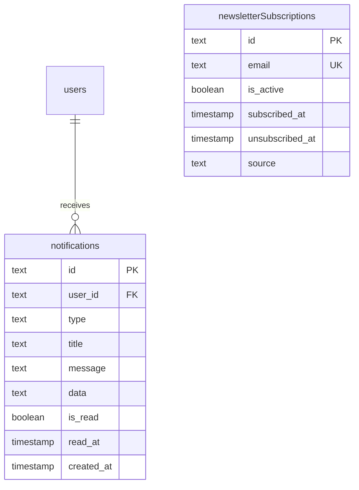
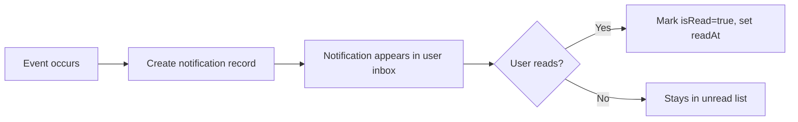

# Aprofundamento do esquema de notificações

## Visão geral

O módulo de notificações fornece um sistema de notificação no aplicativo para os usuários. As notificações são digitadas, suportam rastreamento de leitura/não lida e podem transportar cargas de dados arbitrárias. O sistema também inclui uma tabela `newsletterSubscriptions` para gerenciamento de assinaturas de e-mail.

**Arquivo fonte:** `template/lib/db/schema.ts`
**Arquivo de relações:** `template/lib/db/migrations/relations.ts`

---

## Table: `notifications`

In-app notification records delivered to users.

### Columns

| Column | DB Name | Type | Nullable | Default | Constraints |
|---|---|---|---|---|---|
| `id` | `id` | `text` | No | `crypto.randomUUID()` | Primary Key |
| `userId` | `user_id` | `text` | No | - | FK -> `users.id` (CASCADE) |
| `type` | `type` | `text (enum)` | No | - | See notification types |
| `title` | `title` | `text` | No | - | Notification headline |
| `message` | `message` | `text` | No | - | Notification body |
| `data` | `data` | `text` | Yes | - | JSON payload |
| `isRead` | `is_read` | `boolean` | No | `false` | Read status |
| `readAt` | `read_at` | `timestamp` | Yes | - | When marked as read |
| `createdAt` | `created_at` | `timestamp` | No | `now()` | - |
| `updatedAt` | `updated_at` | `timestamp` | No | `now()` | - |

### Foreign Keys

| Column | References | On Delete |
|---|---|---|
| `user_id` | `users.id` | CASCADE |

### Indexes

| Name | Columns | Type |
|---|---|---|
| `notifications_user_idx` | `userId` | B-tree |
| `notifications_type_idx` | `type` | B-tree |
| `notifications_is_read_idx` | `isRead` | B-tree |
| `notifications_created_at_idx` | `createdAt` | B-tree |

---

## Enum do tipo de notificação

```typescript
// Defined inline in the schema
type: text('type', {
    enum: [
        'item_submission',    // A new item was submitted
        'comment_reported',   // A comment was reported
        'item_reported',      // An item was reported
        'user_registered',    // A new user registered
        'payment_failed',     // A payment attempt failed
        'system_alert'        // System-level notification
    ]
}).notNull()
```

|Tipo|Descrição|Destinatário típico|
|---|---|---|
|`item_submission`|Novo item enviado para revisão|Usuários administradores|
|`comment_reported`|Um comentário foi sinalizado por um usuário|Usuários administradores|
|`item_reported`|Um item foi sinalizado por um usuário|Usuários administradores|
|`user_registered`|Novo usuário criou uma conta|Usuários administradores|
|`payment_failed`|Uma tentativa de pagamento falhou|Usuário afetado|
|`system_alert`|Alertas e anúncios em nível de sistema|Todos os usuários ou usuários específicos|

---

## TypeScript Types

```typescript
export type Notification = typeof notifications.$inferSelect;
export type NewNotification = typeof notifications.$inferInsert;
```

---

## Relações

```typescript
// From relations.ts
export const notificationsRelations = relations(notifications, ({ one }) => ({
    user: one(users, {
        fields: [notifications.userId],
        references: [users.id]
    }),
}));

// Users have many notifications
export const usersRelations = relations(users, ({ many }) => ({
    // ... other relations
    notifications: many(notifications),
}));
```

---

## Table: `newsletterSubscriptions`

Email newsletter subscription management, separate from in-app notifications.

### Columns

| Column | DB Name | Type | Nullable | Default | Constraints |
|---|---|---|---|---|---|
| `id` | `id` | `text` | No | `crypto.randomUUID()` | Primary Key |
| `email` | `email` | `text` | No | - | Unique |
| `isActive` | `is_active` | `boolean` | No | `true` | Active subscription flag |
| `subscribedAt` | `subscribed_at` | `timestamp` | No | `now()` | - |
| `unsubscribedAt` | `unsubscribed_at` | `timestamp` | Yes | - | - |
| `lastEmailSent` | `last_email_sent` | `timestamp` | Yes | - | - |
| `source` | `source` | `text` | Yes | `'footer'` | `footer`, `popup`, etc. |

### Constraints

| Name | Columns | Type |
|---|---|---|
| `newsletterSubscriptions_email_unique` | `email` | Unique |

### TypeScript Types

```typescript
export type NewsletterSubscription = typeof newsletterSubscriptions.$inferSelect;
export type NewNewsletterSubscription = typeof newsletterSubscriptions.$inferInsert;
```

---

## Diagrama de Relações



---

## Notification Flow



---

## A coluna `data`

A coluna `data` armazena uma string JSON (não JSONB) com contexto arbitrário para a notificação. A estrutura varia de acordo com o tipo de notificação:

```typescript
// item_submission
{ "itemSlug": "new-tool", "itemName": "New Tool", "submittedBy": "user-id" }

// comment_reported
{ "commentId": "comment-uuid", "itemSlug": "my-item", "reportId": "report-uuid" }

// payment_failed
{ "subscriptionId": "sub-uuid", "amount": 1999, "currency": "usd" }

// system_alert
{ "severity": "info", "actionUrl": "/admin/settings" }
```

---

## Query Examples

### Create a notification

```typescript
import { db } from '@/lib/db/drizzle';
import { notifications } from '@/lib/db/schema';

await db.insert(notifications).values({
    userId: targetUserId,
    type: 'item_submission',
    title: 'Novo item enviado',
    message: 'A new tool "Acme Editor" has been submitted for review.',
    data: JSON.stringify({
        itemSlug: 'acme-editor',
        itemName: 'Acme Editor',
        submittedBy: submitterUserId,
    }),
});
```

### Get unread notifications for a user

```typescript
import { eq, and, desc } from 'drizzle-orm';

const unread = await db
    .select()
    .from(notifications)
    .where(
        and(
            eq(notifications.userId, userId),
            eq(notifications.isRead, false)
        )
    )
    .orderBy(desc(notifications.createdAt));
```

### Get unread count

```typescript
import { sql } from 'drizzle-orm';

const [{ count }] = await db
    .select({ count: sql<number>`count(*)` })
    .from(notifications)
    .where(
        and(
            eq(notifications.userId, userId),
            eq(notifications.isRead, false)
        )
    );
```

### Mark notification as read

```typescript
await db
    .update(notifications)
    .set({
        isRead: true,
        readAt: new Date(),
        updatedAt: new Date(),
    })
    .where(eq(notifications.id, notificationId));
```

### Mark all notifications as read

```typescript
await db
    .update(notifications)
    .set({
        isRead: true,
        readAt: new Date(),
        updatedAt: new Date(),
    })
    .where(
        and(
            eq(notifications.userId, userId),
            eq(notifications.isRead, false)
        )
    );
```

### Get paginated notification history

```typescript
const page = 1;
const limit = 20;

const history = await db
    .select()
    .from(notifications)
    .where(eq(notifications.userId, userId))
    .orderBy(desc(notifications.createdAt))
    .limit(limit)
    .offset((page - 1) * limit);
```

### Subscribe to newsletter

```typescript
import { newsletterSubscriptions } from '@/lib/db/schema';

await db
    .insert(newsletterSubscriptions)
    .values({
        email: 'user@example.com',
        source: 'footer',
    })
    .onConflictDoUpdate({
        target: newsletterSubscriptions.email,
        set: {
            isActive: true,
            subscribedAt: new Date(),
            unsubscribedAt: null,
        },
    });
```

### Unsubscribe from newsletter

```typescript
await db
    .update(newsletterSubscriptions)
    .set({
        isActive: false,
        unsubscribedAt: new Date(),
    })
    .where(eq(newsletterSubscriptions.email, 'user@example.com'));
```

### Get active newsletter subscribers

```typescript
const subscribers = await db
    .select()
    .from(newsletterSubscriptions)
    .where(eq(newsletterSubscriptions.isActive, true));
```

---

## Notas de projeto

- **`data` é texto, não JSONB.** A coluna de notificação `data` é armazenada como um campo de texto simples contendo JSON serializado, não uma coluna `jsonb`. Isso significa que você deve `JSON.stringify()` ao escrever e `JSON.parse()` ao ler. As consultas não podem ser filtradas em campos dentro de `data`.
- **Nenhuma tabela de preferências de notificação.** O esquema atual não inclui uma tabela de preferências de notificação do usuário. Todos os tipos de notificação são entregues a todos os usuários aplicáveis. Para adicionar preferências de notificação por usuário, uma nova tabela `notification_preferences` precisaria ser criada.
- **Exclusão em cascata.** Quando um usuário é excluído, todas as suas notificações são removidas automaticamente por meio da chave estrangeira CASCADE.
- **Newsletter é independente.** A tabela `newsletterSubscriptions` não está vinculada à tabela `users` por chave estrangeira. Isso é intencional – podem existir assinaturas de boletins informativos para visitantes não registrados que fornecem apenas um endereço de e-mail.
- **Rastreamento de origem.** O campo `source` nas assinaturas de boletins informativos rastreia a origem da assinatura (formulário de rodapé, pop-up, etc.) para fins analíticos.
