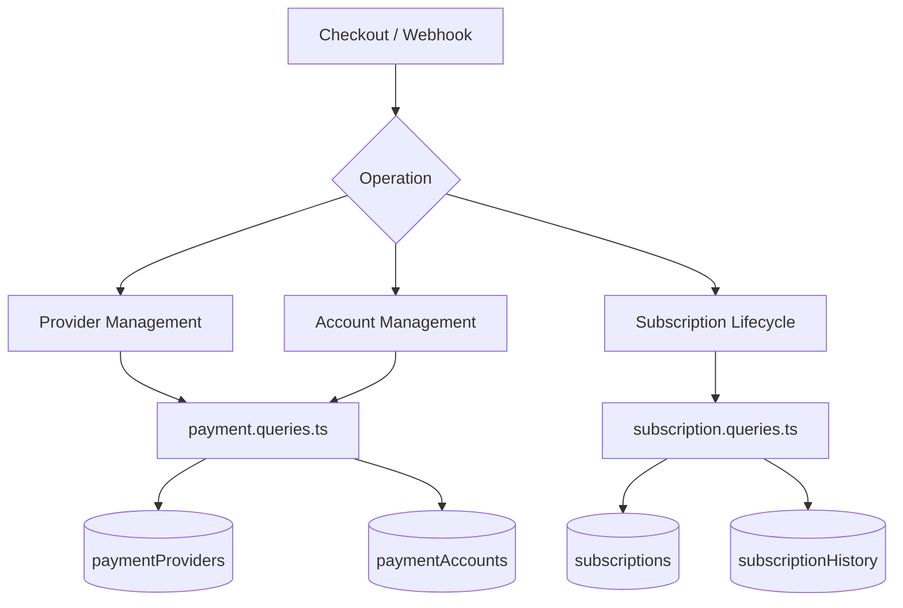
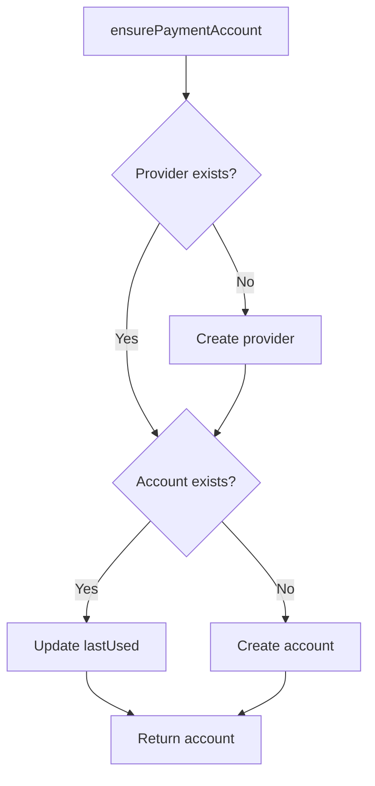
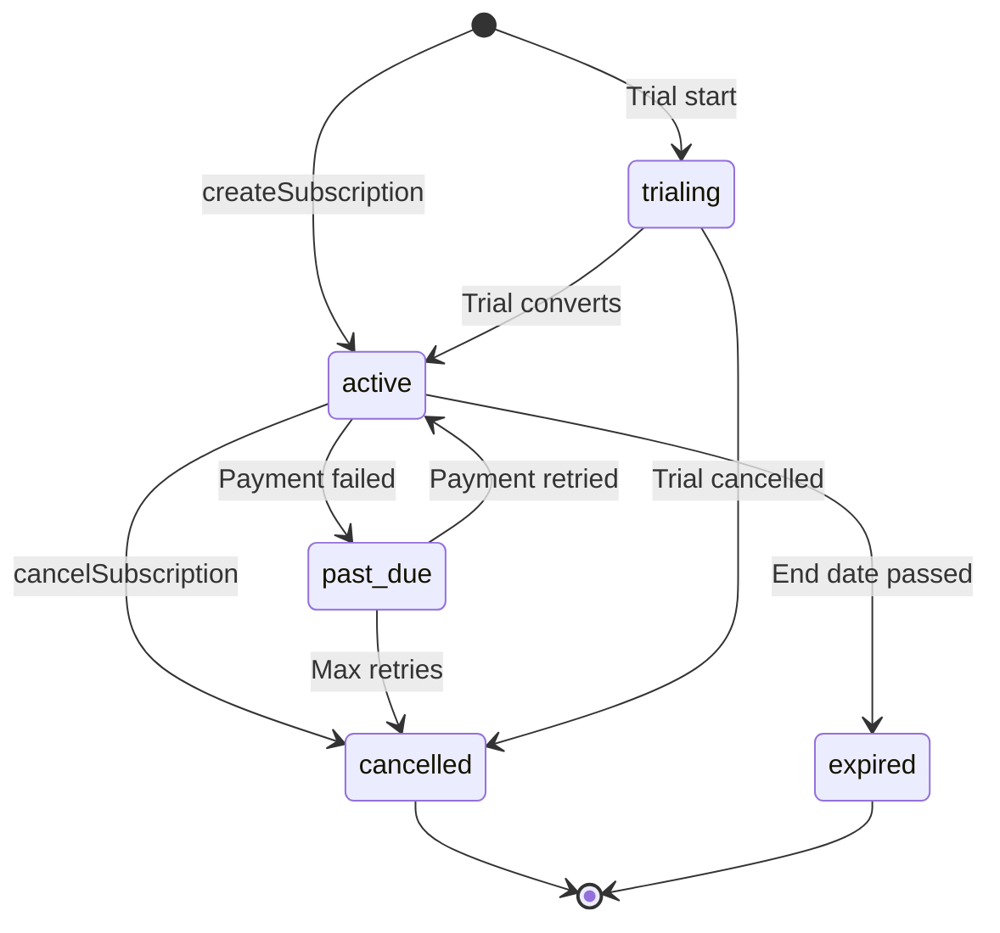

# Consultas de pagamento e assinatura

As consultas de pagamento gerenciam o registro do provedor, as contas de pagamento dos usuários e o ciclo de vida completo da assinatura. Os módulos relevantes são `payment.queries.ts` e `subscription.queries.ts`.

## Arquitetura do sistema de pagamento



## Consultas ao provedor de pagamento (`payment.queries.ts`)

### CRUD do provedor

|Função|Descrição|
|----------|-------------|
|`getPaymentProvider(id)`|Obter provedor por ID|
|`getPaymentProviderByName(name)`|Obtenha o provedor pelo nome (por exemplo, `'stripe'`)|
|`getActivePaymentProviders()`|Liste todos os provedores ativos, ordenados por nome|
|`createPaymentProvider(data)`|Crie um novo registro de provedor|
|`updatePaymentProvider(id, data)`|Atualização parcial dos campos do provedor|
|`deactivatePaymentProvider(id)`|Definir `isActive = false`|

Nomes de provedores suportados: `stripe`, `lemonsqueezy`, `polar`, `solidgate`.

### Consultas sobre contas de pagamento

As contas de pagamento vinculam um usuário a um ID de cliente específico do provedor:

|Função|Descrição|
|----------|-------------|
|`getPaymentAccountByUserId(userId, providerId)`|Obtenha uma conta com verificação de provedor ativo|
|`getPaymentAccountByCustomerId(customerId, providerId)`|Pesquisa reversa por ID do cliente|
|`createPaymentAccount(data)`|Crie uma conta com carimbo de data/hora `lastUsed`|
|`updatePaymentAccountLastUsed(accountId)`|Toque em `lastUsed` carimbo de data/hora|
|`getUserPaymentAccountByProvider(userId, providerName)`|Pesquisa por nome do provedor (resolve o provedor primeiro)|

### Validação de provedor ativo

`getPaymentAccountByUserId` executa uma junção interna tripla para garantir que o provedor e o usuário sejam válidos:

```typescript
export async function getPaymentAccountByUserId(
  userId: string,
  providerId: string
): Promise<PaymentAccount | null> {
  const result = await db
    .select({ /* payment account fields */ })
    .from(paymentAccounts)
    .innerJoin(paymentProviders, eq(paymentAccounts.providerId, paymentProviders.id))
    .innerJoin(users, eq(paymentAccounts.userId, users.id))
    .where(and(
      eq(paymentAccounts.userId, userId),
      eq(paymentAccounts.providerId, providerId),
      eq(paymentProviders.isActive, true)
    ))
    .limit(1);
  return result[0] || null;
}
```

### Garantir conta de pagamento

`ensurePaymentAccount` implementa um padrão de upsert idempotente para contas de pagamento:



```typescript
export async function ensurePaymentAccount(
  providerName: string,
  userId: string,
  customerId: string,
  accountId?: string
): Promise<PaymentAccount>
```

### Configurar conta de pagamento do usuário

`setupUserPaymentAccount` estende o padrão de garantia com detecção de alteração de ID do cliente:

```typescript
if (existingAccount.customerId !== customerId) {
  await db
    .update(paymentAccounts)
    .set({
      customerId,
      accountId: accountId || existingAccount.accountId,
      lastUsed: new Date(),
      updatedAt: new Date()
    })
    .where(eq(paymentAccounts.id, existingAccount.id));
}
```

### Aliases de conveniência

- `getOrCreatePaymentAccount` -- apelido para `ensurePaymentAccount`
- `createOrGetPaymentAccount` -- apelido para `setupUserPaymentAccount`

## Consultas de assinatura (`subscription.queries.ts`)

### Pesquisa de assinatura

|Função|Parâmetros|Devoluções|
|----------|-----------|---------|
|`getUserActiveSubscription(userId)`|ID do usuário|Assinatura ativa ou nula|
|`getUserSubscriptions(userId)`|ID do usuário|Todas as assinaturas (ordenadas por data)|
|`getSubscriptionByProviderSubscriptionId(provider, subId)`|Provedor + subID|Assinatura ou nulo|
|`getSubscriptionByUserIdAndSubscriptionId(userId, subId)`|Usuário + subID|Assinatura ou nulo|
|`getSubscriptionWithUser(subId)`|ID da assinatura|Assinatura com adesão de usuário|
|`hasActiveSubscription(userId)`|ID do usuário|Booleano|

### Ciclo de vida da assinatura

#### Criar

```typescript
export async function createSubscription(data: NewSubscription): Promise<Subscription> {
  const result = await db
    .insert(subscriptions)
    .values({ ...data, createdAt: new Date(), updatedAt: new Date() })
    .returning();
  return result[0];
}
```

#### Atualizar status

As alterações de status são definidas automaticamente `cancelledAt` e `cancelReason` ao fazer a transição para `CANCELLED`:

```typescript
export async function updateSubscriptionStatus(
  subscriptionId: string,
  status: string,
  reason?: string
): Promise<Subscription | null>
```

#### Cancelar

Suporta cancelamento imediato e cancelamento de final de período:

```typescript
export async function cancelSubscription(
  subscriptionId: string,
  reason?: string,
  cancelAtPeriodEnd: boolean = false
): Promise<Subscription | null>
```

Quando `cancelAtPeriodEnd = true`, o status permanece `ACTIVE`, mas `cancelledAt` e `cancelAtPeriodEnd` são definidos.

### Fluxo de status da assinatura



### Resolução do Plano

`getUserPlan` verifica a expiração da assinatura e volta para o plano gratuito:

```typescript
export async function getUserPlan(userId: string): Promise<string> {
  const subscription = await getUserActiveSubscription(userId);
  if (!subscription) return PaymentPlan.FREE;
  return getEffectivePlan(subscription.planId, subscription.endDate, subscription.status);
}
```

`getUserPlanWithExpiration` retorna detalhes completos de expiração:

```typescript
{
  planId: string;         // Stored plan
  effectivePlan: string;  // Actual plan after expiration check
  isExpired: boolean;
  expiresAt: Date | null;
  status: string | null;
  subscriptionId: string | null;
}
```

### Expiração e Renovação

|Função|Descrição|
|----------|-------------|
|`getSubscriptionsExpiringSoon(days)`|Assinaturas ativas expiram em N dias|
|`getExpiredSubscriptions()`|Assinaturas com data de término vencida|
|`getSubscriptionsForRenewalReminder(days)`|Assinaturas que precisam de avisos de renovação|

### Histórico de assinaturas

As alterações são registradas na tabela `subscriptionHistory`:

```typescript
export async function logSubscriptionHistory(data: NewSubscriptionHistory)
export async function getSubscriptionHistory(subscriptionId: string)
```

### Estatísticas de assinatura

`getSubscriptionStats` retorna contagens agregadas:

```typescript
{
  total: number;
  active: number;
  cancelled: number;
  expired: number;
  pastDue: number;
  trialing: number;
}
```

## Constantes de esquema

```typescript
// lib/db/schema.ts
export const SubscriptionStatus = {
  ACTIVE: 'active',
  CANCELLED: 'cancelled',
  EXPIRED: 'expired',
  PAST_DUE: 'past_due',
  TRIALING: 'trialing',
} as const;

// lib/constants/payment.ts
export const PaymentPlan = {
  FREE: 'free',
  STANDARD: 'standard',
  PREMIUM: 'premium',
} as const;

export const PaymentProvider = {
  STRIPE: 'stripe',
  LEMONSQUEEZY: 'lemonsqueezy',
  POLAR: 'polar',
  SOLIDGATE: 'solidgate',
} as const;
```
