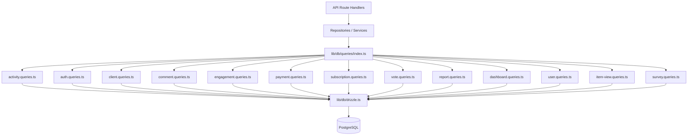

# Sistema de padrão de consulta

O modelo organiza todas as consultas de banco de dados em módulos específicos de domínio em `lib/db/queries/`. Cada módulo segue o Princípio da Responsabilidade Única (SRP), agrupando as operações relacionadas. Uma exportação barril em `index.ts` fornece um único ponto de entrada para todas as funções de consulta.

## Visão geral da arquitetura



## Módulos de consulta

|Módulo|Arquivo|Objetivo|
|--------|------|---------|
|Atividade|`activity.queries.ts`|Registro de atividades e trilha de auditoria|
|Autenticação|`auth.queries.ts`|Tokens de redefinição de senha, tokens de verificação|
|Cliente|`client.queries.ts`|Perfil do cliente CRUD, pesquisa, estatísticas|
|Comentário|`comment.queries.ts`|Comente CRUD com junções de usuários|
|Empresa|`company.queries.ts`|Gestão da empresa e vinculação item-empresa|
|Painel|`dashboard.queries.ts`|Estatísticas do painel e gráficos de engajamento|
|Engajamento|`engagement.queries.ts`|Métricas de engajamento agregadas (visualizações, votos, favoritos, comentários)|
|Mapeamento de Integração|`integration-mapping.queries.ts`|Mapeamentos de integração de CRM|
|Artigo|`item.queries.ts`|Normalização e validação de slug de item|
|Auditoria de itens|`item-audit.queries.ts`|Histórico de alterações de itens|
|Visualização de itens|`item-view.queries.ts`|Ver rastreamento com desduplicação|
|Índice de localização|`location-index.queries.ts`|Indexação de itens geoespaciais|
|Moderação|`moderation.queries.ts`|Ações de moderação de conteúdo|
|Boletim informativo|`newsletter.queries.ts`|Gerenciamento de assinantes de newsletter|
|Pagamento|`payment.queries.ts`|Provedor de pagamento e gerenciamento de contas|
|Relatório|`report.queries.ts`|Relatórios de conteúdo com filtragem|
|Assinatura|`subscription.queries.ts`|Gerenciamento do ciclo de vida da assinatura|
|Pesquisa|`survey.queries.ts`|Respostas e análises de pesquisas|
|Usuário|`user.queries.ts`|CRUD do usuário principal e verificações administrativas|
|Votar|`vote.queries.ts`|Vote CRUD e cálculo de pontuação líquida|

## Padrões Comuns

### 1. Padrão de paginação

Todas as consultas de lista seguem um padrão de paginação consistente usando `limit` e `offset`:

```typescript
export async function getClientProfiles(params: {
  page?: number;
  limit?: number;
  search?: string;
  status?: string;
}): Promise<{
  profiles: ClientProfileWithAuth[];
  total: number;
  page: number;
  totalPages: number;
  limit: number;
}> {
  const { page = 1, limit = 10, search, status } = params;
  const offset = (page - 1) * limit;

  // 1. Build WHERE conditions dynamically
  const whereConditions: SQL[] = [];
  if (search) { /* add ILIKE condition */ }
  if (status) { whereConditions.push(eq(clientProfiles.status, status)); }
  const whereClause = whereConditions.length > 0
    ? and(...whereConditions)
    : undefined;

  // 2. Count query for total
  const countResult = await db
    .select({ count: sql<number>`count(distinct ${clientProfiles.id})` })
    .from(clientProfiles)
    .where(whereClause);
  const total = Number(countResult[0]?.count || 0);

  // 3. Data query with limit/offset
  const profiles = await db
    .select({ /* fields */ })
    .from(clientProfiles)
    .where(whereClause)
    .orderBy(desc(clientProfiles.createdAt))
    .limit(limit)
    .offset(offset);

  return {
    profiles,
    total,
    page,
    totalPages: Math.ceil(total / limit),
    limit,
  };
}
```

### 2. Padrão de filtragem dinâmica

Os filtros são acumulados como uma matriz de condições SQL e compostos com `and()`:

```typescript
const whereConditions: SQL[] = [];

if (search) {
  const escapedSearch = search
    .replace(/\\/g, '\\\\')
    .replace(/[%_]/g, '\\$&');
  whereConditions.push(
    sql`(${clientProfiles.name} ILIKE ${`%${escapedSearch}%`} OR
         ${clientProfiles.email} ILIKE ${`%${escapedSearch}%`})`
  );
}

if (status) {
  whereConditions.push(eq(clientProfiles.status, status));
}

if (provider) {
  whereConditions.push(
    sql`exists (
      select 1 from ${accounts}
      where ${accounts.userId} = ${clientProfiles.userId}
        and ${accounts.provider} = ${provider}
    )`
  );
}

const whereClause = whereConditions.length > 0
  ? and(...whereConditions)
  : undefined;
```

### 3. Padrão de união

A base de código usa `innerJoin`/`leftJoin` e subconsultas explícitas para lidar com dados relacionados:

**Junção interna para relações necessárias:**

```typescript
const result = await db
  .select({
    id: comments.id,
    content: comments.content,
    user: {
      id: clientProfiles.id,
      name: clientProfiles.name,
      email: clientProfiles.email,
      image: clientProfiles.avatar,
    },
  })
  .from(comments)
  .innerJoin(clientProfiles, eq(comments.userId, clientProfiles.id))
  .where(and(eq(comments.itemId, itemId), isNull(comments.deletedAt)))
  .orderBy(desc(comments.createdAt));
```

**Subconsulta para evitar linhas duplicadas de múltiplas junções:**

```typescript
const profiles = await db
  .select({
    id: clientProfiles.id,
    // ... other fields
    accountProvider: sql<string>`coalesce(
      (SELECT provider FROM ${accounts}
       WHERE ${accounts.userId} = ${clientProfiles.userId}
       LIMIT 1),
      'unknown'
    )`,
  })
  .from(clientProfiles);
```

### 4. Padrão de agregação

Funções agregadas como `count`, `SUM` e `AVG` são usadas com `groupBy`:

```typescript
// Net vote score using conditional SUM
const voteCounts = await db
  .select({
    itemId: votes.itemId,
    netScore: sql<number>`
      SUM(CASE
        WHEN vote_type = 'upvote' THEN 1
        WHEN vote_type = 'downvote' THEN -1
        ELSE 0
      END)
    `.as('netScore'),
  })
  .from(votes)
  .where(inArray(votes.itemId, itemSlugs))
  .groupBy(votes.itemId);
```

### 5. Padrão de consulta paralela

Quando múltiplas agregações independentes são necessárias, as consultas são executadas em paralelo com `Promise.all`:

```typescript
const [viewsData, votesData, favoritesData, commentsData] =
  await Promise.all([
    db.select({ itemId: itemViews.itemId, count: count() })
      .from(itemViews)
      .where(inArray(itemViews.itemId, itemSlugs))
      .groupBy(itemViews.itemId),

    db.select({ itemId: votes.itemId, netScore: sql`...` })
      .from(votes)
      .where(inArray(votes.itemId, itemSlugs))
      .groupBy(votes.itemId),

    db.select({ itemSlug: favorites.itemSlug, count: count() })
      .from(favorites)
      .where(inArray(favorites.itemSlug, itemSlugs))
      .groupBy(favorites.itemSlug),

    db.select({ itemId: comments.itemId, count: count(), avgRating: sql`...` })
      .from(comments)
      .where(and(inArray(comments.itemId, itemSlugs), isNull(comments.deletedAt)))
      .groupBy(comments.itemId),
  ]);
```

### 6. Padrão de Upsert/Resolução de Conflitos

Usado para desduplicação, especialmente no rastreamento de visualizações:

```typescript
export async function recordItemView(
  view: Pick<NewItemView, 'itemId' | 'viewerId' | 'viewedDateUtc'>
): Promise<boolean> {
  const result = await db
    .insert(itemViews)
    .values(view)
    .onConflictDoNothing()
    .returning({ id: itemViews.id });

  return result.length > 0;
}
```

### 7. Padrão de exclusão suave

Os registros são marcados como excluídos em vez de serem removidos fisicamente:

```typescript
export async function deleteComment(id: string) {
  const [comment] = await db
    .update(comments)
    .set({ deletedAt: new Date() })
    .where(eq(comments.id, id))
    .returning();
  return comment;
}

// Querying always filters out soft-deleted records
.where(and(eq(comments.itemId, itemId), isNull(comments.deletedAt)))
```

### 8. Padrão de normalização de resultados

Os resultados da consulta são frequentemente mapeados por meio de objetos de pesquisa `Map` para acesso O(1) eficiente:

```typescript
const viewsMap = new Map<string, number>(
  viewsData.map(v => [v.itemId, Number(v.count)])
);
const votesMap = new Map<string, number>(
  votesData.map(v => [v.itemId, Number(v.netScore ?? 0)])
);

// Combine into final metrics
for (const slug of itemSlugs) {
  metricsMap.set(slug, {
    views: viewsMap.get(slug) ?? 0,
    votes: votesMap.get(slug) ?? 0,
  });
}
```

## Utilitários Compartilhados

### `lib/db/queries/utils.ts`

Fornece funções auxiliares compartilhadas entre módulos de consulta:

- **`extractUsernameFromEmail(email)`** -- Extrai e limpa um nome de usuário de um endereço de e-mail
- **`ensureUniqueUsername(baseUsername)`** -- Gera um nome de usuário exclusivo anexando sufixos numéricos, se necessário

### `lib/db/queries/types.ts`

Define os tipos compartilhados usados nos módulos de consulta:

- **`ClientProfileWithAuth`** -- Perfil do cliente combinado com dados do provedor de autenticação
- **`ClientStatus`** / **`ClientPlan`** / **`ClientAccountType`** -- Tipos de enumeração para filtragem
- **`CommentWithUser`** -- Dados de comentários enriquecidos com informações do usuário

## Convenção de Importação

Todas as consultas são importadas através da exportação barril:

```typescript
import {
  getClientProfiles,
  createVote,
  getEngagementMetricsPerItem,
  getUserActiveSubscription,
} from '@/lib/db/queries';
```
