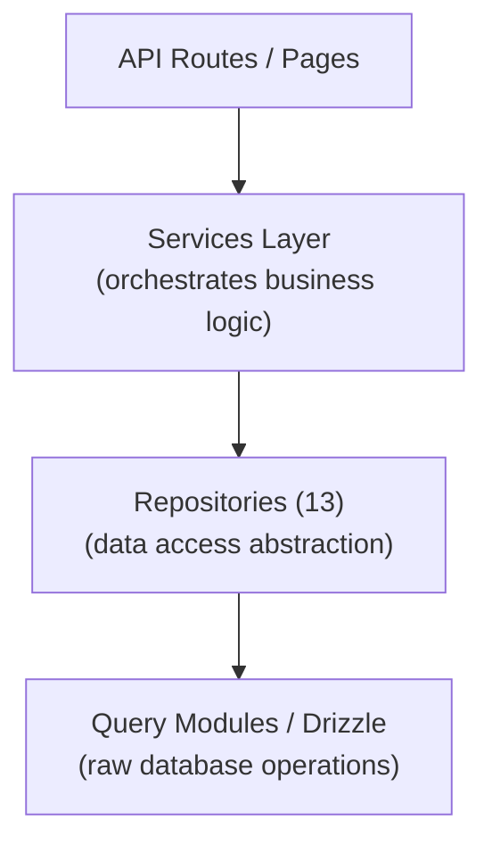

# Padrão de repositório

O modelo Ever Works implementa um padrão de repositório por meio de 13 classes de repositório especializadas em `lib/repositories/`. Os repositórios fornecem uma abstração de nível superior sobre consultas brutas de banco de dados, encapsulando lógica de consulta complexa, regras de negócios e transformação de dados.

## Arquitetura



## Lista de repositórios

|Repositório|Arquivo|Domínio|
|------------|------|--------|
|Análise administrativa (otimizada)|`admin-analytics-optimized.repository.ts`|Análise administrativa com otimização de desempenho|
|Estatísticas de administrador|`admin-stats.repository.ts`|Estatísticas do painel de administração|
|Categoria|`category.repository.ts`|Gerenciamento de categorias|
|Painel do cliente|`client-dashboard.repository.ts`|Operações do painel do cliente|
|Item do cliente|`client-item.repository.ts`|Envios de itens do cliente|
|Coleção|`collection.repository.ts`|Gerenciamento de coleção|
|Mapeamento de Integração|`integration-mapping.repository.ts`|Mapeamentos de integração de CRM|
|Artigo|`item.repository.ts`|Operações de itens|
|Função|`role.repository.ts`|Gerenciamento de funções|
|Anúncio do patrocinador|`sponsor-ad.repository.ts`|Gerenciamento de anúncios patrocinados|
|Etiqueta|`tag.repository.ts`|Gerenciamento de tags|
|Vinte configurações de CRM|`twenty-crm-config.repository.ts`|Configuração de CRM|
|Usuário|`user.repository.ts`|Gerenciamento de usuários|

## Repositório de conteúdo baseado em Git (`lib/repository.ts`)

Além dos repositórios de banco de dados, o modelo inclui um repositório de conteúdo baseado em Git em `lib/repository.ts`. Isso lida com as operações do Git CMS:

- Clonar repositório de conteúdo de `DATA_REPOSITORY` URL
- Sincronize conteúdo com upstream (pull/push com detecção de conflito)
- Acompanhe as alterações locais e confirme-as
- Proteção de tempo limite para operações Git (tempo limite de 120 segundos)

Isso é diferente dos repositórios de banco de dados e gerencia o diretório `.content/` usado pela camada de conteúdo.

## Detalhes do repositório

### admin-analytics-optimized.repository.ts

Repositório analítico com desempenho otimizado para o painel de administração. Usa consultas em lote e estratégias de cache para minimizar a carga do banco de dados ao gerar visualizações analíticas.

Principais capacidades:
- Estatísticas de visualização agregadas
- Tendências de crescimento de usuários
- Resumos de engajamento de conteúdo
- Análise de receita

### admin-stats.repositório.ts

Fornece estatísticas do painel de administração.

Principais capacidades:
- Contagem total de usuários
- Contagens de assinaturas ativas
- Estatísticas de conteúdo (itens, comentários, relatórios)
- Resumos de atividades recentes

### categoria.repositório.ts

Gerencia dados de categoria com operações CRUD e tratamento de relacionamento.

Principais capacidades:
- Listagem de categorias com contagem de itens
- Percurso da árvore de categorias (pai/filho)
- Pesquisa e filtragem de categorias
- Ordenação de categoria

### painel do cliente.repositório.ts

O maior repositório (28 KB), que gerencia todos os dados do painel do cliente.

Principais capacidades:
- Gerenciamento de envio de clientes
- Análise de envio (visualizações, votos, comentários por item)
- Histórico de atividades do cliente
- Estatísticas resumidas do painel
- Listagem de itens paginados com filtros

### item-cliente.repositório.ts

Gerencia itens da perspectiva do cliente (remetente).

Principais capacidades:
- Criação e atualizações de envio de itens
- Acompanhamento do status do item
- Histórico de envio
- Filtragem de itens específicos do cliente

### coleção.repositório.ts

Gerenciamento de coleção para grupos de itens selecionados.

Principais capacidades:
- Operações CRUD de coleta
- Associações de coleção de itens
- Ordem e status da coleção
- Listagem de coleção paginada

### mapeamento de integração.repository.ts

Persistência de mapeamento de integração de CRM.

Principais capacidades:
- Criar e atualizar mapeamentos entre IDs internos e IDs de CRM
- Operações de upsert em massa
- Pesquisa por ID interno ou ID de CRM
- Sincronizar rastreamento de carimbo de data/hora
- Gerenciamento de hash de versão para detecção de alterações

### item.repositório.ts

Operações de dados de itens principais (para metadados armazenados no banco de dados, não para conteúdo Git).

Principais capacidades:
- Gerenciamento de metadados de itens
- Pesquisa de itens com vários filtros
- Agregação de dados de engajamento de item
- Gerenciamento de itens em destaque

### role.repositório.ts

Gerenciamento de funções para o sistema RBAC.

Principais capacidades:
- Operações CRUD de função
- Associações de permissão de função
- Atribuições de função de usuário
- Validação de função

### patrocinador-ad.repository.ts

Gerenciamento do ciclo de vida de anúncios patrocinados.

Principais capacidades:
- Criação e gerenciamento de anúncios de patrocinadores
- Transições de status (pendente, ativo, expirado)
- Filtragem de anúncios por status, usuário ou item
- Dados de integração de pagamento
- Tratamento de expiração

### tag.repositório.ts

Gerenciamento de tags com associações de itens.

Principais capacidades:
- Marcar operações CRUD
- Pesquisa de tags e preenchimento automático
- Estatísticas de uso de tags
- Associações de tags de item

### vinte-crm-config.repository.ts

Vinte gerenciamento de configuração singleton de CRM.

Principais capacidades:
- Obter/atualizar configuração do CRM
- Ativar/desativar integração CRM
- Gerenciamento do modo de sincronização
- Gerenciamento de chaves de API

### usuário.repositório.ts

Gerenciamento de conta de usuário.

Principais capacidades:
- Operações de perfil de usuário
- Pesquisa e filtragem de usuários
- Gerenciamento de status da conta
- Exclusão de usuário (exclusão reversível)

## Padrão de uso

Os repositórios são importados e usados diretamente em rotas de API, serviços e componentes de servidor:

```typescript
import { clientDashboardRepository } from '@/lib/repositories/client-dashboard.repository';

// In an API route
export async function GET(request: NextRequest) {
  const session = await auth();
  const dashboard = await clientDashboardRepository.getDashboardStats(session.user.id);
  return NextResponse.json({ success: true, data: dashboard });
}
```

```typescript
import { itemRepository } from '@/lib/repositories/item.repository';

// In a server component
export default async function ItemPage({ params }) {
  const item = await itemRepository.findBySlug(params.slug);
  return <ItemDetail item={item} />;
}
```

## Repositório vs Módulos de Consulta

|Aspecto|Módulos de consulta (`lib/db/queries/`)|Repositórios (`lib/repositories/`)|
|--------|-----------------------------------|-------------------------------------|
|Complexidade|Consultas simples e focadas|Operações complexas de múltiplas tabelas|
|Lógica de negócios|Nenhum (puro acesso a dados)|Inclui validação e regras de negócios|
|Transformação de dados|Resultados brutos do banco de dados|Dados transformados/enriquecidos|
|Caso de uso|Operações diretas de banco de dados|Acesso a dados em nível de recurso|
|Consumidor típico|Outros módulos de consulta, rotas simples|Serviços, rotas de API, componentes de servidor|

Ambas as camadas usam Drizzle ORM e importam a conexão do banco de dados de `lib/db/drizzle.ts`. A escolha entre eles depende da complexidade da operação: leituras simples utilizam módulos de consulta diretamente, enquanto recursos complexos passam por repositórios.
