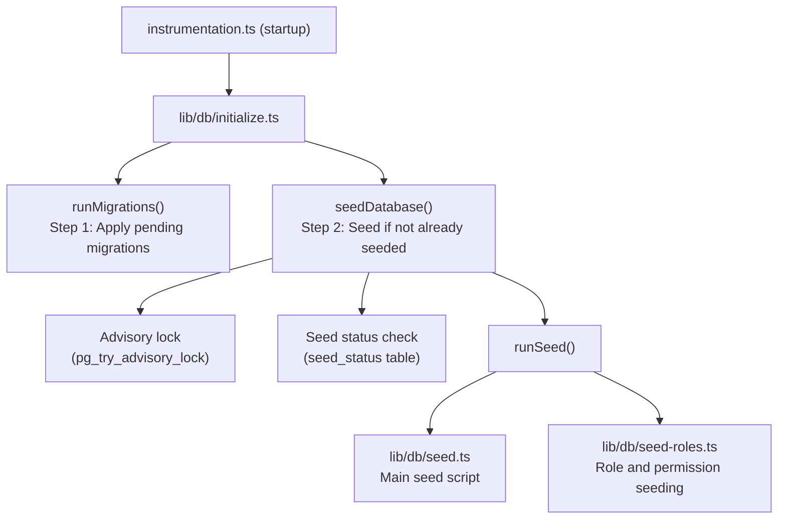

# Sementeira de banco de dados

O modelo Ever Works inclui um sistema abrangente de propagação de banco de dados que inicializa dados essenciais (funções, permissões, provedores de pagamento) e, opcionalmente, gera dados de demonstração para desenvolvimento e teste.

## Arquitetura Semente



## Scripts de sementes

### Script de semente principal (`lib/db/seed.ts`)

O script inicial primário lida com toda a inicialização do banco de dados. Opera em dois modos:

**Modo de Produção**: Semeia apenas os dados essenciais necessários para o funcionamento do aplicativo:
- Funções de administrador e cliente
- Permissões do sistema
- Provedores de pagamento padrão
- Registros de sistema necessários

**Modo de demonstração**: além disso, semeia dados de teste abrangentes para desenvolvimento:
- Exemplos de usuários com funções diferentes
- Exemplos de perfis de clientes
- Exemplo de assinaturas
- Comentários de demonstração, votos e favoritos
- Notificações de teste
- Entradas do registro de atividades

O modo de demonstração é ativado quando a variável de ambiente `DEMO_MODE` é definida.

Características principais:
- **Idempotência por tabela**: Cada tabela é verificada antes da propagação; apenas tabelas vazias são preenchidas
- **Verificações de existência de tabela**: verifica a existência de tabelas antes de tentar inserir
- **Usa `drizzle-seed`**: aproveita a biblioteca oficial de propagação do Drizzle para geração de dados estruturados
- **Seguro para reexecuções**: pode ser chamado várias vezes sem duplicar dados

```typescript
// Simplified seed flow
export async function runSeed(): Promise<void> {
  await ensureDb();
  const isDemo = isDemoMode();

  if (isDemo) {
    // Seed comprehensive test data
  } else {
    // Seed minimal essential data only
  }

  // Seed roles (always)
  if (await isTableEmpty('roles', roles)) {
    await seedRoles();
  }

  // Seed permissions (always)
  if (await isTableEmpty('permissions', permissions)) {
    await seedPermissions();
  }

  // Seed payment providers (always)
  if (await isTableEmpty('paymentProviders', paymentProviders)) {
    await seedPaymentProviders();
  }

  // Demo-only: seed users, profiles, subscriptions, etc.
  if (isDemo) {
    await seedDemoData();
  }
}
```

### Propagação de função (`lib/db/seed-roles.ts`)

Um script dedicado para semear o sistema RBAC, que também pode ser executado de forma independente.

**`seedPermissions()`** cria o conjunto de permissões inicial:

|Chave de permissão|Descrição|
|---------------|-------------|
|`read:own`|Pode ler os próprios dados|
|`write:own`|Pode escrever seus próprios dados|
|`admin:all`|Acesso administrativo total|
|`client:manage`|Pode gerenciar operações específicas do cliente|
|`user:read`|Pode ler dados do usuário|
|`user:write`|Pode gravar dados do usuário|

Usa `onConflictDoUpdate` para atualizar com segurança as permissões existentes sem falhar em novas execuções.

**`linkRolesToPermissions()`** cria associações de permissão de função:

- **Função de administrador**: obtém TODAS as permissões
- **Função do cliente**: Obtém `read:own`, `write:own` e `client:manage`

A função valida se as funções necessárias (administrador, cliente) existem e estão ativas antes de criar associações.

**`seedRolesAndPermissions()`** orquestra ambas as operações em uma transação de banco de dados:

```typescript
export async function seedRolesAndPermissions() {
  await db.transaction(async () => {
    await seedPermissions();
    await linkRolesToPermissions();
  });
}
```

Pode ser executado de forma independente:
```bash
# Run directly (if configured as a script)
npx tsx lib/db/seed-roles.ts
```

## Sistema de inicialização (`lib/db/initialize.ts`)

O sistema de inicialização gerencia toda a sequência de inicialização com proteção de simultaneidade.

### Acompanhamento do status da semente

Uma tabela `seed_status` rastreia o estado de propagação:

|Estado|Significado|
|--------|---------|
|`seeding`|Operação de sementes em andamento|
|`completed`|Semente concluída com sucesso|
|`failed`|Seed falhou (erro armazenado)|

### Proteção de simultaneidade

Em implantações de vários processos (por exemplo, múltiplas funções sem servidor Vercel iniciando simultaneamente), o sistema evita propagação duplicada usando:

1. **Bloqueios de aviso do PostgreSQL**: `pg_try_advisory_lock(12345)` fornece um bloqueio sem bloqueio. Apenas um processo pode adquiri-lo.
2. **Tabela de status de sementes**: Outros processos verificam a tabela `seed_status` e aguardam a conclusão.
3. **Detecção de obsoleto**: se um status `seeding` tiver mais de 5 minutos, ele será tratado como obsoleto e limpo.
4. **Tempo limite de espera**: os processos que aguardam a conclusão de outra instância atingirão o tempo limite após 60 segundos.

### Fluxo de inicialização

```
initializeDatabase()
│
├── DATABASE_URL not set? → Silent skip (DB is optional)
│
├── Step 1: Run migrations (always, idempotent)
│   └── Failure? → Error in production, warning in dev/preview
│
├── Step 2: Check if already seeded
│   └── seed_status = 'completed'? → Done
│
├── Step 3: Handle edge cases
│   ├── Previous seed failed? → Delete failed status, retry
│   ├── Stale seeding (>5min)? → Clean up, retry
│   └── Another instance seeding? → Wait for completion
│
├── Step 4: Acquire advisory lock
│   └── Lock not available? → Wait for other instance
│
├── Step 5: Double-check (another instance may have finished)
│
├── Step 6: Run seed
│   ├── Create seed_status record ('seeding')
│   ├── Execute runSeed()
│   └── Update seed_status ('completed' or 'failed')
│
└── Step 7: Release advisory lock (always, in finally block)
```

## Executando sementes manualmente

### Semente Padrão

```bash
pnpm db:seed
```

### Scripts de sementes individuais

```bash
# Seed roles and permissions only
npx tsx lib/db/seed-roles.ts
```

### Modo de demonstração

Para propagar dados de demonstração, defina a variável de ambiente `DEMO_MODE`:

```bash
DEMO_MODE=true pnpm db:seed
```

## Variáveis de ambiente

|Variável|Padrão|Descrição|
|----------|---------|-------------|
|`DATABASE_URL`| - |String de conexão do PostgreSQL (necessária para propagação)|
|`DEMO_MODE`|`false`|Ativar propagação de dados de demonstração|

## Resumo dos dados iniciais

### Sempre Semeado (Modo de Produção)

|Mesa|Dados|
|-------|------|
|`roles`|Funções de administrador e cliente|
|`permissions`|Definições de permissão do sistema|
|`rolePermissions`|Associações de permissão de função|
|`paymentProviders`|Listra, LemonSqueezy, Polar, Solidgate|

### Apenas modo de demonstração

|Mesa|Dados|
|-------|------|
|`users`|Exemplos de usuários administradores e clientes|
|`accounts`|Contas de autenticação para usuários de exemplo|
|`clientProfiles`|Perfis de clientes com status variados|
|`subscriptions`|Exemplos de assinaturas em vários planos|
|`comments`|Comentários de itens de exemplo|
|`votes`|Exemplos de votos|
|`favorites`|Exemplos de favoritos|
|`notifications`|Exemplos de notificações administrativas|
|`activityLogs`|Exemplo de histórico de atividades|

## Melhores práticas

1. **Nunca execute seed em produção com DEMO_MODE**: os dados de demonstração só devem ser usados em desenvolvimento e preparação
2. **Verifique o status da propagação antes da nova propagação manual**: consulte a tabela `seed_status` para entender o estado atual
3. **Usar transações**: a propagação de função usa transações para garantir consistência
4. **Design idempotente**: sempre verifique se existem dados antes de inseri-los para suportar novas execuções seguras
5. **Bloqueios de aviso**: o sistema de bloqueio de aviso evita problemas em ambientes sem servidor, onde várias instâncias podem ser iniciadas simultaneamente
