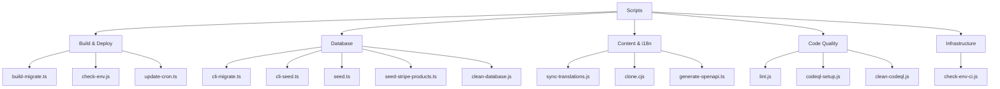
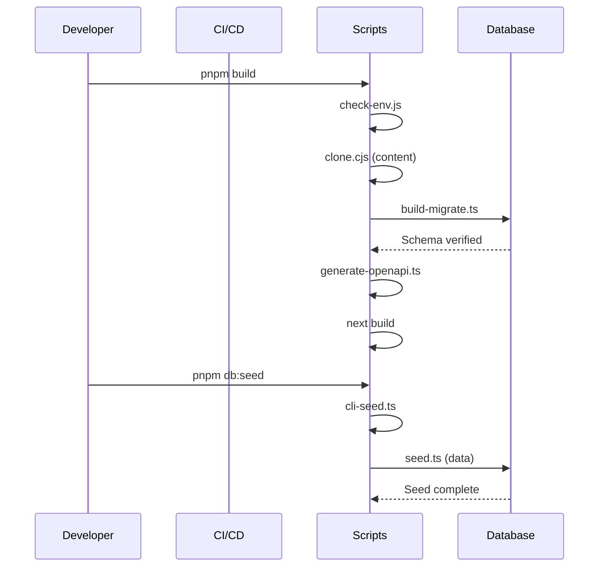

# Visão Geral dos Scripts

O diretório `scripts/` contém scripts de automação que gerenciam o pipeline de build, o ciclo de vida do banco de dados, a sincronização de conteúdo, a qualidade do código e a infraestrutura de implantação. Cada script é construído para uma fase específica do fluxo de trabalho de desenvolvimento ou implantação.

## Estrutura de Diretórios

```
scripts/
├── build-migrate.ts          # Migrações de banco de dados em tempo de build
├── check-env.js              # Validação de variáveis de ambiente
├── check-env-ci.js           # Validação de env específica para CI
├── clean-database.js         # Utilitário de reset de banco de dados
├── cli-migrate.ts            # CLI de migração manual
├── cli-seed.ts               # CLI de seeding manual
├── clone.cjs                 # Clonagem de conteúdo do CMS baseado em Git
├── codeql-setup.js           # Configuração de análise de segurança CodeQL
├── clean-codeql.js           # Utilitário de limpeza do CodeQL
├── generate-openapi.ts       # Geração de especificação OpenAPI
├── lint.js                   # Script wrapper do ESLint
├── seed.ts                   # Seeder completo do banco de dados
├── seed-stripe-products.ts   # Seeder de produtos/preços do Stripe
├── sync-translations.js      # Sincronização de traduções i18n
├── update-cron.ts            # Gerenciamento de tarefas cron do Vercel
└── tsconfig.json             # Configuração TypeScript para scripts
```

## Categorias de Scripts



## Scripts de Build e Deploy

### build-migrate.ts

Executa migrações de banco de dados durante o processo de build do Vercel. Garante consistência do schema antes da implantação entrar em produção.

```bash
tsx scripts/build-migrate.ts
```

| Funcionalidade       | Comportamento                                                      |
|----------------------|--------------------------------------------------------------------|
| Detecção de CI       | Ignora migrações no GitHub Actions (não-Vercel)                    |
| Flag de skip         | Defina `SKIP_BUILD_MIGRATIONS=true` para ignorar                   |
| Verificação do schema| Valida se colunas críticas existem após migração                   |
| Segurança em produção| Falha o build se migrações em produção falharem                    |
| Tolerância preview   | Permite erros de conexão em implantações de preview                |

### check-env.js

Valida variáveis de ambiente antes da inicialização do aplicativo. Categoriza dinamicamente as variáveis por prefixo e verifica a completude.

```bash
node scripts/check-env.js [--silent] [--quick]
```

| Flag          | Descrição                                          |
|---------------|----------------------------------------------------|
| `--silent`, `-s` | Suprime saída não crítica                       |
| `--quick`, `-q`  | Ignora verificações detalhadas, saída mínima    |

Categorias detectadas automaticamente: `core`, `database`, `auth`, `supabase`, `content`, `email`, `payment`, `analytics`, `storage`, `api`, `security`, `background-jobs`.

### update-cron.ts

Gerencia agendamentos de tarefas cron do Vercel via API do Vercel. Ajusta a frequência de sincronização com base no plano do projeto.

```bash
tsx scripts/update-cron.ts
```

| Variável de Ambiente  | Finalidade                                            |
|-----------------------|-------------------------------------------------------|
| `VERCEL_TOKEN`        | Token de autenticação da API                          |
| `VERCEL_PROJECT_ID`   | Identificador do projeto alvo                         |
| `VERCEL_TEAM_SCOPE`   | Escopo da equipe para chamadas de API                 |
| `VERCEL_DEPLOYMENT_ID`| Deployment para aguardar antes de atualizar           |
| `CRON_FREQUENCY`      | Defina como `5min` para sincronização de alta frequência |

Padrões de agendamento: Plano gratuito usa `0 3 * * *` (diário às 3h), Plano Pro usa `*/5 * * * *` (a cada 5 minutos).

## Scripts de Banco de Dados

### seed.ts

Popula o banco de dados com dados de teste realistas incluindo usuários, perfis, papéis, permissões, logs de atividade, comentários e votos.

```bash
DATABASE_URL=postgres://... pnpm seed
```

Dados inseridos (20 usuários por padrão):

| Entidade           | Quantidade | Detalhes                                    |
|--------------------|------------|---------------------------------------------|
| Papéis             | 2          | `admin` e `user`                            |
| Permissões         | Todas       | Das definições `getAllPermissions()`         |
| Usuários           | 20         | Com endereços de e-mail sequenciais          |
| Perfis de cliente  | 20         | Planos mistos: gratuito, padrão, premium     |
| Papéis de usuário  | 20         | Primeiro usuário é admin                    |
| Assinaturas boletim| ~7         | A cada 3º usuário                           |
| Logs de atividade  | 30         | Ações SIGN_UP, SIGN_IN, COMMENT, VOTE       |
| Comentários        | 15         | Comentários de exemplo com avaliações       |
| Votos              | 25         | Mix de votos positivos e negativos          |

### seed-stripe-products.ts

Cria produtos e preços do Stripe correspondentes aos níveis de faturamento do template.

```bash
npx tsx scripts/seed-stripe-products.ts
```

Produtos criados:

| Produto                   | Mensal    | Anual              | Tipo          |
|---------------------------|-----------|--------------------|---------------|
| Gratuito                  | $0        | $0                 | Assinatura    |
| Padrão                    | $10/mês   | $96/ano (20% off)  | Assinatura    |
| Premium                   | $20/mês   | $180/ano (25% off) | Assinatura    |
| Anúncio Patrocinado - Semanal  | $100 | --            | Pagamento único |
| Anúncio Patrocinado - Mensal   | $300 | --            | Pagamento único |

### clean-database.js

Remove todas as tabelas no schema `public` e o schema de rastreamento de migração `drizzle`. Use com cautela.

```bash
node scripts/clean-database.js
```

**Aviso:** Esta é uma operação destrutiva. Remove todos os dados e definições de schema.

## Scripts de Conteúdo e i18n

### clone.cjs

Clona o repositório de conteúdo CMS baseado em Git em `.content/` com base na variável de ambiente `DATA_REPOSITORY`. Chamado automaticamente durante o build.

### sync-translations.js

Sincroniza arquivos de tradução com a referência em inglês. Garante que todos os arquivos de locale tenham todas as chaves presentes em `en.json`.

```bash
node scripts/sync-translations.js
```

Locales suportados atualmente: `ar`, `bg`, `de`, `es`, `fr`, `he`, `hi`, `id`, `it`, `ja`, `ko`, `nl`, `pl`, `pt`, `ru`, `th`, `tr`, `uk`, `vi`.

### generate-openapi.ts

Escaneia anotações JSDoc `@swagger` nos arquivos de rota e mescla-as com a especificação `public/openapi.json` existente.

```bash
tsx scripts/generate-openapi.ts [--silent]
```

## Scripts de Qualidade de Código

### lint.js

Envolve o ESLint com o formato de configuração flat, contornando problemas de compatibilidade do lint do Next.js.

```bash
node scripts/lint.js
```

Executa `npx eslint . --max-warnings=55` internamente.

## Mapeamentos de Scripts do Package.json

| Script npm          | Comando Subjacente             | Finalidade                   |
|---------------------|-------------------------------|------------------------------|
| `pnpm dev`          | `next dev`                    | Servidor de desenvolvimento  |
| `pnpm build`        | Pipeline de build com migrações | Build de produção            |
| `pnpm lint`         | `node scripts/lint.js`        | Linting de código            |
| `pnpm db:generate`  | `drizzle-kit generate`        | Gerar arquivos de migração   |
| `pnpm db:migrate`   | `tsx scripts/build-migrate.ts`| Executar migrações           |
| `pnpm db:migrate:cli`| `tsx scripts/cli-migrate.ts` | CLI de migração manual       |
| `pnpm db:seed`      | `tsx scripts/cli-seed.ts`     | Seeding do banco de dados    |
| `pnpm db:studio`    | `drizzle-kit studio`          | GUI do banco de dados        |

## Fluxo de Execução



## Adicionando Novos Scripts

Ao adicionar um novo script:

1. Coloque-o no diretório `scripts/`
2. Use TypeScript (`.ts`) para novos scripts quando possível
3. Carregue variáveis de ambiente via `dotenv` no topo
4. Adicione cabeçalhos JSDoc adequados com instruções de uso
5. Registre-o em scripts do `package.json` se deve ser visível ao usuário
6. Trate erros de forma adequada com códigos de saída significativos
