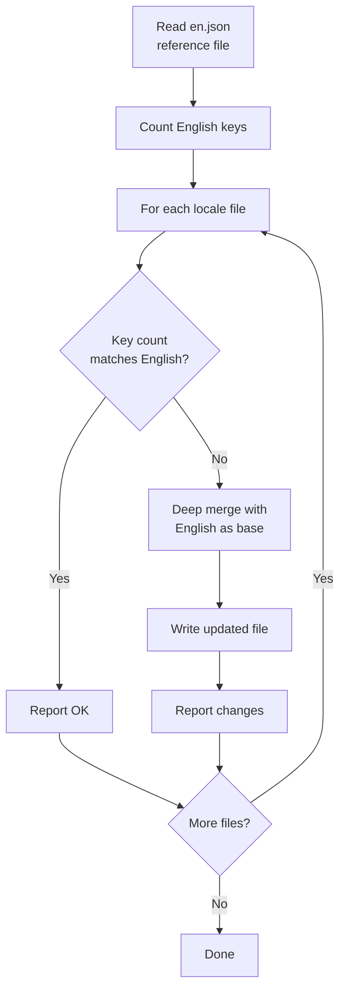
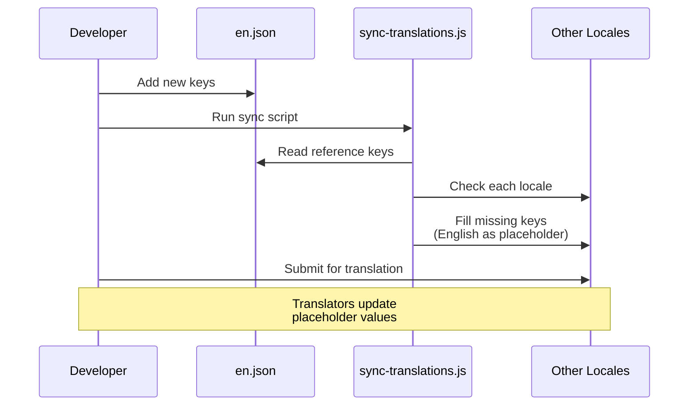

# Fluxo de Trabalho de Tradução

O template usa `next-intl` para internacionalização (i18n) com arquivos de mensagens baseados em JSON. O fluxo de trabalho de tradução garante que todos os locales suportados permaneçam sincronizados com o arquivo de referência em inglês através de um script de sincronização automatizado.

## Locales Suportados

O template é fornecido com 20 idiomas suportados:

| Código | Idioma             | Código | Idioma       |
|--------|--------------------|--------|--------------|
| `en`   | Inglês (referência)| `ko`   | Coreano      |
| `ar`   | Árabe              | `nl`   | Holandês     |
| `bg`   | Búlgaro            | `pl`   | Polonês      |
| `de`   | Alemão             | `pt`   | Português    |
| `es`   | Espanhol           | `ru`   | Russo        |
| `fr`   | Francês            | `th`   | Tailandês    |
| `he`   | Hebraico           | `tr`   | Turco        |
| `hi`   | Hindi              | `uk`   | Ucraniano    |
| `id`   | Indonésio          | `vi`   | Vietnamita   |
| `it`   | Italiano           | `ja`   | Japonês      |

## Estrutura de Arquivos

```
messages/
├── en.json          # Inglês (referência - fonte da verdade)
├── ar.json          # Árabe
├── bg.json          # Búlgaro
├── de.json          # Alemão
├── es.json          # Espanhol
├── fr.json          # Francês
├── he.json          # Hebraico
├── hi.json          # Hindi
├── id.json          # Indonésio
├── it.json          # Italiano
├── ja.json          # Japonês
├── ko.json          # Coreano
├── nl.json          # Holandês
├── pl.json          # Polonês
├── pt.json          # Português
├── ru.json          # Russo
├── th.json          # Tailandês
├── tr.json          # Turco
├── uk.json          # Ucraniano
└── vi.json          # Vietnamita
```

## Script de Sincronização de Traduções

O script `scripts/sync-translations.js` garante que todos os arquivos de locale tenham todas as chaves definidas em `en.json`.

### Executando a Sincronização

```bash
node scripts/sync-translations.js
```

### Como Funciona



### Estratégia de Mesclagem

A sincronização usa uma mesclagem profunda onde as traduções existentes têm prioridade:

```javascript
function deepMerge(target, source) {
  const result = { ...source };  // Start with English (source)
  for (const key in target) {
    if (typeof target[key] === 'object' && !Array.isArray(target[key])) {
      result[key] = deepMerge(target[key], source[key] || {});
    } else {
      result[key] = target[key]; // Existing translation wins
    }
  }
  return result;
}
```

**Comportamento principal:**

- Chaves ausentes são preenchidas com valores em inglês como espaços reservados
- Traduções existentes nunca são sobrescritas
- Estruturas aninhadas são tratadas recursivamente
- Arrays são tratados como valores folha (não mesclados)

### Saída de Exemplo

```
English file has 342 translation keys

ar.json: 340/342 keys (missing 2)
  -> Updated ar.json with missing keys from English

bg.json: 342/342 keys - OK
de.json: 342/342 keys - OK
es.json: 338/342 keys (missing 4)
  -> Updated es.json with missing keys from English

Done!
```

## Formato de Arquivo de Mensagens

Os arquivos de tradução usam JSON aninhado com acesso de chave por notação de ponto:

```json
{
  "common": {
    "loading": "Loading...",
    "error": "An error occurred",
    "save": "Save",
    "cancel": "Cancel"
  },
  "auth": {
    "signIn": "Sign In",
    "signOut": "Sign Out",
    "email": "Email Address",
    "password": "Password"
  },
  "navigation": {
    "home": "Home",
    "about": "About",
    "contact": "Contact"
  }
}
```

## Usando Traduções no Código

### Componentes Cliente

```tsx
'use client';
import { useTranslations } from 'next-intl';

export function LoginButton() {
  const t = useTranslations('auth');
  return <button>{t('signIn')}</button>;
}
```

### Componentes Servidor

```tsx
import { getTranslations } from 'next-intl/server';

export default async function Page() {
  const t = await getTranslations('common');
  return <h1>{t('loading')}</h1>;
}
```

### Com Variáveis

```json
{
  "greeting": "Hello, {name}!",
  "itemCount": "You have {count, plural, =0 {no items} one {1 item} other {# items}}"
}
```

```tsx
const t = useTranslations('dashboard');
t('greeting', { name: 'John' });     // "Hello, John!"
t('itemCount', { count: 5 });         // "You have 5 items"
```

## Adicionando um Novo Idioma

Siga estes passos para adicionar um novo locale:

### Passo 1: Criar o Arquivo de Mensagens

```bash
# Copie o arquivo inglês como ponto de partida
cp messages/en.json messages/NEW_LOCALE.json
```

### Passo 2: Registrar o Locale

Adicione o locale à configuração i18n:

```typescript
// i18n/config.ts (ou equivalente)
export const locales = ['en', 'ar', 'de', ..., 'NEW_LOCALE'];
```

### Passo 3: Traduzir o Conteúdo

Edite `messages/NEW_LOCALE.json` e substitua as strings em inglês por valores traduzidos.

### Passo 4: Executar a Sincronização para Verificar

```bash
node scripts/sync-translations.js
```

Se seu arquivo tiver todas as chaves, reportará "OK". Quaisquer chaves faltantes serão preenchidas com espaços reservados em inglês.

## Adicionando Novas Chaves de Tradução

Ao adicionar novos recursos que requerem texto voltado ao usuário:

### Passo 1: Adicionar à Referência em Inglês

```json
// messages/en.json
{
  "newFeature": {
    "title": "New Feature",
    "description": "This is a new feature"
  }
}
```

### Passo 2: Executar a Sincronização

```bash
node scripts/sync-translations.js
```

Isso adiciona automaticamente as novas chaves a todos os arquivos de locale com texto em inglês como espaços reservados.

### Passo 3: Solicitar Traduções

Compartilhe as chaves recém-adicionadas com tradutores para cada locale. Eles só precisam atualizar os valores de espaço reservado em inglês.

## Contagem de Chaves

O script de sincronização conta chaves recursivamente através de objetos aninhados:

```javascript
function countKeys(obj) {
  let count = 0;
  for (const key in obj) {
    if (typeof obj[key] === 'object' && !Array.isArray(obj[key])) {
      count += countKeys(obj[key]); // Recurse into nested objects
    } else {
      count++;                      // Count leaf values
    }
  }
  return count;
}
```

Isso conta apenas strings de tradução no nível folha, não chaves de agrupamento intermediárias.

## Suporte a Idiomas RTL

O template suporta idiomas da direita para a esquerda (RTL) incluindo Árabe (`ar`) e Hebraico (`he`). O layout RTL é tratado automaticamente através da configuração de locale e do atributo CSS `dir`.

## Diagrama de Fluxo de Trabalho



## Melhores Práticas

1. **Sempre modifique `en.json` primeiro** -- É a única fonte da verdade
2. **Execute a sincronização após cada mudança em inglês** -- Mantém todos os locales alinhados
3. **Nunca adicione chaves manualmente a arquivos não ingleses** -- Use o script de sincronização
4. **Use agrupamento aninhado** -- Agrupe chaves por recurso ou página para organização
5. **Evite strings fixas** -- Sempre use `useTranslations` ou `getTranslations`
6. **Teste layouts RTL** -- Verifique a renderização em árabe e hebraico regularmente
7. **Mantenha chaves descritivas** -- Use `auth.signInButton` não `auth.btn1`
