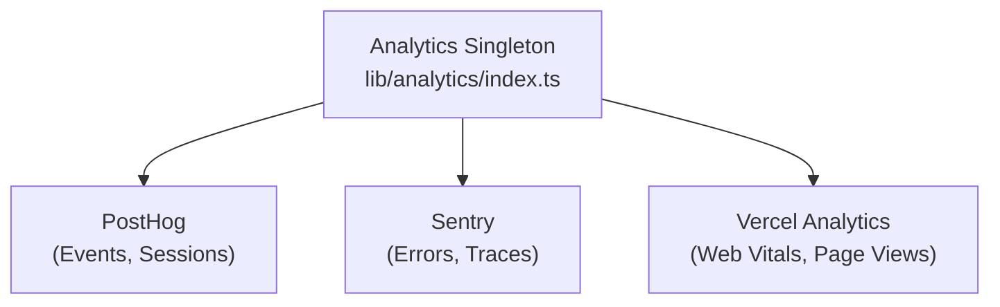

# Sistema analítico

O modelo Ever Works integra-se com **PostHog**, **Sentry** e **Vercel Analytics** para rastreamento abrangente de eventos, monitoramento de erros, gravação de sessão e análise de desempenho.

## Arquitetura



## Aula de análise

A classe principal `Analytics` em `lib/analytics/index.ts` é um singleton que gerencia a inicialização e o envio de eventos entre provedores:

```typescript
class Analytics {
  private static instance: Analytics;
  private initialized: boolean;
  private exceptionTrackingProvider: ExceptionTrackingProvider;

  static getInstance(): Analytics;
  init(): void;
  trackEvent(name: string, properties?: EventProperties): void;
  trackPageView(url: string): void;
  identify(userId: string, properties?: UserProperties): void;
  reset(): void;
}
```

### Resolução do Provedor de Rastreamento de Exceções

O sistema suporta configuração flexível de rastreamento de exceções:

```typescript
type ExceptionTrackingProvider = 'sentry' | 'posthog' | 'both' | 'none';
```

O provedor é determinado verificando a disponibilidade:
1. Leia o valor de configuração `EXCEPTION_TRACKING_PROVIDER` 2. Valide se o provedor escolhido está habilitado
3. Volte para a alternativa disponível se o primário não estiver configurado

## Integração PostHog

### Configuração

```bash
NEXT_PUBLIC_POSTHOG_KEY=phc_xxx
NEXT_PUBLIC_POSTHOG_HOST=https://us.i.posthog.com

# Optional
NEXT_PUBLIC_POSTHOG_DEBUG=false
NEXT_PUBLIC_POSTHOG_SESSION_RECORDING=true
NEXT_PUBLIC_POSTHOG_AUTO_CAPTURE=true
NEXT_PUBLIC_POSTHOG_SAMPLE_RATE=1.0
NEXT_PUBLIC_POSTHOG_SESSION_RECORDING_SAMPLE_RATE=0.1
NEXT_PUBLIC_POSTHOG_EXCEPTION_TRACKING=true
```

### Serviço de API PostHog

Localizado em `lib/services/posthog-api.service.ts` , o serviço do lado do servidor fornece dados analíticos administrativos:

```typescript
class PostHogApiService {
  constructor(); // Reads from analyticsConfig

  isConfigured(): boolean;
  async getTotalPageViews(days?: number): Promise<number>;
  async getTopPages(days?: number): Promise<PageData[]>;
  async getEventCounts(eventName: string, days?: number): Promise<number>;
}
```

**Obrigatório para acesso à API do lado do servidor:**
```bash
POSTHOG_PERSONAL_API_KEY=phx_xxx
POSTHOG_PROJECT_ID=12345
```

### Gancho do lado do cliente

```typescript
import { useAnalytics } from '@/hooks/use-analytics';

const {
  trackEvent,      // (name: string, properties?: object) => void
  trackPageView,   // (url: string) => void
  identify,        // (userId: string, properties?: object) => void
} = useAnalytics();
```

### Gancho de análise geográfica

```typescript
import { useGeoAnalytics } from '@/hooks/use-geo-analytics';

const {
  geoData,         // Geographic analytics data
  isLoading,
} = useGeoAnalytics();
```

## Integração Sentinela

### Configuração

```bash
NEXT_PUBLIC_SENTRY_DSN=https://xxx@sentry.io/xxx
SENTRY_AUTH_TOKEN=sntrys_xxx
SENTRY_ORG=your-org
SENTRY_PROJECT=your-project
NEXT_PUBLIC_SENTRY_EXCEPTION_TRACKING=true
```

Sentinela fornece:
- **Rastreamento de erros** -- Captura automática de exceções não tratadas
- **Monitoramento de desempenho** -- Rastreamento de transações para rotas de API e carregamentos de páginas
- **Repetição da sessão** - Gravação de sessão opcional

##Vercel Analytics

O Vercel Analytics está automaticamente disponível quando implantado no Vercel:

```bash
# Enabled by default on Vercel deployments
NEXT_PUBLIC_VERCEL_ANALYTICS=true
```

Fornece:
- **Web Vitals** -- Monitoramento Core Web Vitals (LCP, FID, CLS)
- **Visualizações de página** -- Rastreamento automático de visualizações de página
- **Insights do público** -- Análise geográfica e de dispositivos

## Painel de análise administrativa

O painel de administração fornece análises agregadas por meio do gancho `useAdminStats` :

```typescript
import { useAdminStats } from '@/hooks/use-admin-stats';

const {
  stats,           // Dashboard statistics
  isLoading,
} = useAdminStats();
```

O gancho `useDashboardStats` fornece métricas mais detalhadas:

```typescript
import { useDashboardStats } from '@/hooks/use-dashboard-stats';

const {
  stats,           // { items, users, revenue, pageViews, ... }
  isLoading,
  refetch,
} = useDashboardStats();
```

## Desativando o Analytics

Os provedores de análise são desabilitados quando sua configuração está faltando. Nenhum código de rastreamento será carregado se as variáveis ​​de ambiente correspondentes não estiverem definidas. Isso permite que o modelo funcione sem qualquer análise em desenvolvimento.
