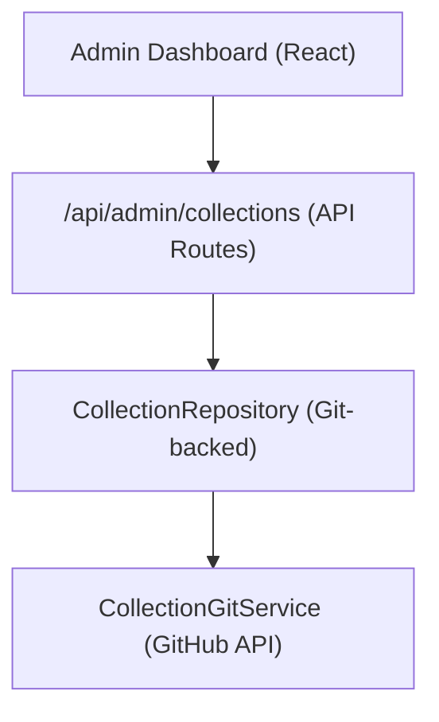

# Sistema de cobrança

As coleções permitem que os administradores selecionem grupos de itens para exibição no site. O sistema armazena dados de coleta no repositório CMS baseado em Git e fornece operações CRUD por meio do painel de administração.

## Arquitetura



As coleções são armazenadas como arquivos no repositório CMS baseado em Git (configurado via `DATA_REPOSITORY` ), usando `CollectionGitService` para operações de leitura/gravação através da API GitHub.

## Modelo de dados

```typescript
interface Collection {
  id: string;
  name: string;
  slug: string;
  description?: string;
  isActive: boolean;
  items: string[];          // Array of item slugs
  item_count: number;       // Computed from items array
  displayOrder?: number;
  created_at: string;
  updated_at: string;
}
```

## ColeçãoRepositório

Localizado em `lib/repositories/collection.repository.ts` , o repositório fornece:

```typescript
class CollectionRepository {
  async findAll(options?: CollectionListOptions): Promise<Collection[]>;
  async findById(id: string): Promise<Collection | null>;
  async findBySlug(slug: string): Promise<Collection | null>;
  async create(data: CreateCollectionRequest): Promise<Collection>;
  async update(id: string, data: UpdateCollectionRequest): Promise<Collection>;
  async delete(id: string): Promise<void>;
  async assignItems(id: string, itemSlugs: string[]): Promise<void>;
}
```

### Opções de lista

```typescript
interface CollectionListOptions {
  search?: string;           // Filter by name
  includeInactive?: boolean; // Include inactive collections
  sortBy?: 'name' | 'item_count' | 'created_at';
  sortOrder?: 'asc' | 'desc';
  page?: number;
  limit?: number;
}
```

## Gancho de administrador

```typescript
import { useAdminCollections } from '@/hooks/use-admin-collections';

const {
  collections,        // Collection[]
  total, page, totalPages, limit,
  isLoading, isSubmitting,
  createCollection,   // (data: CreateCollectionRequest) => Promise<boolean>
  updateCollection,   // (id: string, data: UpdateCollectionRequest) => Promise<boolean>
  deleteCollection,   // (id: string) => Promise<boolean>
  assignItems,        // (id: string, itemSlugs: string[]) => Promise<boolean>
  fetchAssignedItems, // (id: string) => Promise<Item[]>
  refetch, refreshData,
} = useAdminCollections({ page: 1, limit: 10, search: '' });
```

## Terminais de API

| Método | Ponto final | Descrição |
|--------|----------|------------|
| OBTER | `/api/admin/collections` | Listar coleções (paginadas) |
| POSTAR | `/api/admin/collections` | Crie uma nova coleção |
| COLOCAR | `/api/admin/collections/:id` | Atualizar uma coleção |
| EXCLUIR | `/api/admin/collections/:id` | Excluir uma coleção |
| OBTER | `/api/admin/collections/:id/items` | Obtenha itens atribuídos |
| POSTAR | `/api/admin/collections/:id/items` | Atribuir itens à coleção |

## Exibição do lado do cliente

O gancho `useCollectionsExists` verifica se existe alguma coleção ativa, usada para renderização condicional:

```typescript
import { useCollectionsExists } from '@/hooks/use-collections-exists';
const { exists, isLoading } = useCollectionsExists();
```

## Configuração

As coleções exigem as seguintes variáveis de ambiente:

```bash
DATA_REPOSITORY=https://github.com/owner/repo   # Git CMS repository
GH_TOKEN=ghp_xxx                                  # GitHub API token
GITHUB_BRANCH=main                                # Branch for collection data
```

O `CollectionRepository` analisa a URL `DATA_REPOSITORY` para extrair o proprietário e o repositório do GitHub e, em seguida, usa o token para autenticação da API.
