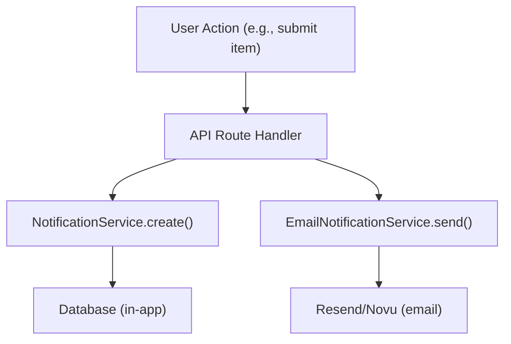

# Sistema de Notificação

O modelo Ever Works fornece notificações no aplicativo (armazenadas no banco de dados) e notificações por e-mail (via Reenviar ou Novu). As notificações são acionadas por eventos do sistema, como envios de itens, relatórios de conteúdo e falhas de pagamento.

## Notificações no aplicativo

###Serviço de Notificação

Localizado em `lib/services/notification.service.ts` , o serviço gerencia notificações baseadas em banco de dados:

```typescript
class NotificationService {
  // Create a generic notification
  static async create(data: CreateNotificationData);

  // Convenience methods for specific events
  static async createItemSubmissionNotification(adminUserId, itemId, itemName, submittedBy);
  static async createCommentReportedNotification(adminUserId, commentId, content, reportedBy);
  static async createItemReportedNotification(adminUserId, itemId, itemName, reportedBy);
  static async createUserRegisteredNotification(adminUserId, userName, userEmail);
  static async createPaymentFailedNotification(userId, subscriptionId, errorMessage);
  static async createSystemAlertNotification(adminUserId, title, message);
}
```

### Tipos de notificação

```typescript
type NotificationType =
  | "item_submission"      // New item requires admin review
  | "comment_reported"     // Comment flagged by user
  | "item_reported"        // Item flagged by user
  | "user_registered"      // New user account created
  | "payment_failed"       // Subscription payment failed
  | "system_alert";        // Generic system notification
```

### Estrutura de dados de notificação

```typescript
interface CreateNotificationData {
  userId: string;                    // Recipient user ID
  type: NotificationType;
  title: string;
  message: string;
  data?: Record<string, unknown>;    // Arbitrary metadata (actionUrl, etc.)
}
```

### Estatísticas de notificação

```typescript
interface NotificationStats {
  total: number;
  unread: number;
  byType: Record<string, number>;
}
```

### Gancho de administrador

```typescript
import { useAdminNotifications } from '@/hooks/use-admin-notifications';

const {
  notifications,     // Notification[]
  stats,             // NotificationStats
  isLoading,
  markAsRead,        // (id: string) => Promise<boolean>
  markAllAsRead,     // () => Promise<boolean>
  deleteNotification,// (id: string) => Promise<boolean>
  refetch,
} = useAdminNotifications();
```

## Notificações por e-mail

### EmailNotificationService

Localizado em `lib/services/email-notification.service.ts` , este serviço lida com a entrega de e-mails transacionais:

```typescript
class EmailNotificationService {
  // Send notification emails for various events
  static async sendItemSubmissionEmail(adminEmail, itemData);
  static async sendPaymentSuccessEmail(userEmail, paymentData);
  static async sendPaymentFailedEmail(userEmail, paymentData);
  static async sendSubscriptionCancelledEmail(userEmail, subscriptionData);
  static async sendTrialEndingEmail(userEmail, trialData);
  static async sendWelcomeEmail(userEmail, userData);
}
```

### Configuração do provedor de e-mail

O modelo oferece suporte a dois provedores de e-mail:

**Reenviar** (padrão):
```bash
RESEND_API_KEY=re_xxx
```

**Novo**:
```bash
NOVU_API_KEY=xxx
NOVU_TEMPLATE_ID=xxx        # Optional: custom template ID
NOVU_BACKEND_URL=xxx         # Optional: self-hosted Novu URL
```

A seleção do provedor é configurada na configuração do site:
```json
{
  "mail": {
    "provider": "resend",
    "default_from": "noreply@yourdomain.com"
  }
}
```

### Serviço de e-mail de pagamento

O subsistema de pagamentos possui serviço de e-mail próprio ( `lib/payment/services/payment-email.service.ts` ) com auxiliares para formatação dos dados de pagamento:

```typescript
import {
  paymentEmailService,
  extractCustomerInfo,    // Extract customer data from webhook event
  formatAmount,           // Format currency amounts
  formatPaymentMethod,    // Format card details
  formatBillingDate,      // Format billing period dates
  getPlanName,            // Map plan ID to display name
  getBillingPeriod,       // Format billing interval
} from '@/lib/payment/services/payment-email.service';
```

## Preferências de notificação

Os usuários podem gerenciar suas preferências de notificação por meio da interface de configurações. As preferências controlam quais tipos de notificação acionam a entrega de e-mail enquanto notificações no aplicativo são sempre criadas.

## Fluxo de eventos



## Documentação Relacionada

- [Relatórios e moderação de conteúdo](./reports-moderation.md) -- Notificações acionadas por relatórios
- [Webhooks de pagamento](../payment/webhooks.md) -- Notificações por e-mail relacionadas a pagamentos
