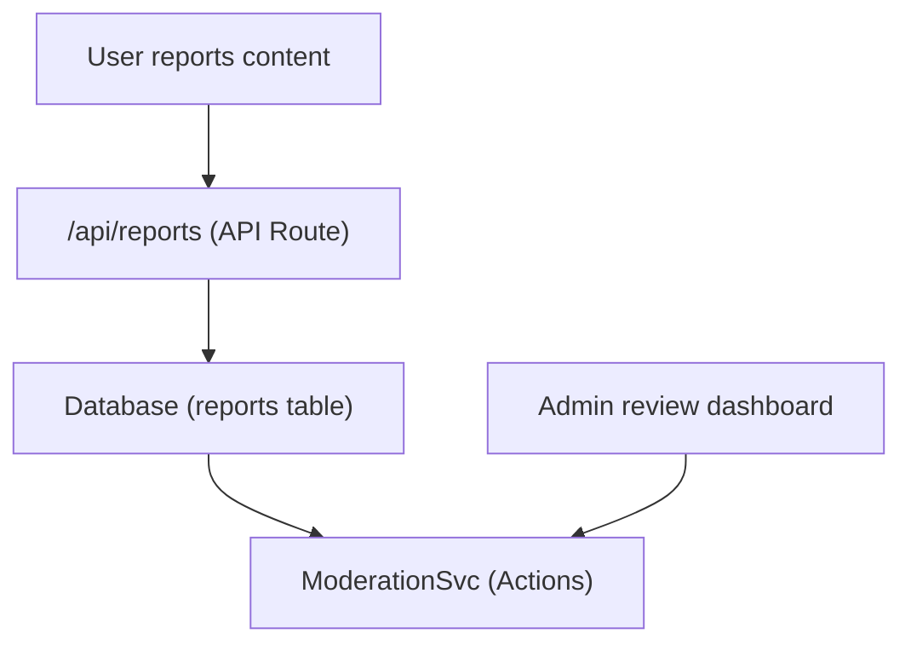

# Relatórios e moderação de conteúdo

O modelo Ever Works inclui um sistema de relatório e moderação de conteúdo que permite aos usuários sinalizar conteúdo impróprio e aos administradores tomar medidas em relação aos itens e comentários relatados.

## Arquitetura



## Tipos de conteúdo

O sistema suporta relatórios de dois tipos de conteúdo:

```typescript
enum ReportContentType {
  ITEM = 'item',
  COMMENT = 'comment',
}
```

## Serviço de Moderação

Localizado em `lib/services/moderation.service.ts` , o serviço oferece ações de moderação:

### Resolução do proprietário do conteúdo

```typescript
async function getContentOwner(
  contentType: ReportContentTypeValues,
  contentId: string
): Promise<ContentOwnerResult>;
// Returns: { success: boolean, userId?: string, error?: string }
```

Resolve o autor do conteúdo denunciado procurando comentários via `getCommentById()` ou itens via `ItemRepository.findById()` .

### Ações de moderação

| Ação | Descrição | Efeito |
|--------|-------------|--------|
| **Remover conteúdo** | Excluir o item ou comentário denunciado | Conteúdo removido, histórico registrado |
| **Avisar usuário** | Aumentar a contagem de avisos | Contador de avisos incrementado |
| **Suspender usuário** | Suspender temporariamente a conta | Acesso à conta restrito |
| **Banir usuário** | Banir conta permanentemente | Conta permanentemente restrita |
| **Dispensar relatório** | Marcar relatório como resolvido sem ação | Relatório encerrado |

### Implementação de Ação

Cada ação cria uma entrada no histórico de moderação e pode acionar notificações por e-mail:

```typescript
// Example: Remove content
async function removeContent(
  contentType: ReportContentTypeValues,
  contentId: string,
  reportId: string,
  adminId: string
): Promise<ModerationResult>;
```

O serviço delega para:
- `deleteComment()` -- Para remoção de comentários
- `ItemRepository` -- Para remoção de itens
- `createModerationHistory()` -- Para trilha de auditoria
- `incrementWarningCount()` -- Para avisos do usuário
- `suspendUserQuery()` / `banUserQuery()` -- Para ações da conta
- `EmailNotificationService` -- Para e-mails de notificação do usuário

## Gancho de administrador

```typescript
import { useAdminReports } from '@/hooks/use-admin-reports';

const {
  reports,           // Report[]
  total, page, totalPages,
  isLoading, isSubmitting,
  resolveReport,     // (id, action, reason?) => Promise<boolean>
  dismissReport,     // (id, reason?) => Promise<boolean>
  deleteReport,      // (id) => Promise<boolean>
  refetch, refreshData,
} = useAdminReports({ page: 1, limit: 10 });
```

## Fluxo de trabalho de moderação

1. **Conteúdo dos relatórios do usuário** – seleciona um motivo e envia por meio da API de relatório
2. **Notificação do administrador** -- `NotificationService.createItemReportedNotification()` ou `createCommentReportedNotification()` alerta administradores
3. **Avaliações do administrador** – Visualiza detalhes do relatório no painel do administrador
4. **O administrador toma medidas** -- Escolha entre: remover conteúdo, avisar o usuário, suspender, banir ou dispensar
5. **Histórico registrado** -- `createModerationHistory()` registra a ação com ID do administrador, carimbo de data/hora e motivo
6. **Usuário notificado** – Notificação por e-mail enviada ao proprietário do conteúdo sobre a ação realizada

## Enum de ações de moderação

```typescript
enum ModerationAction {
  REMOVE_CONTENT = 'remove_content',
  WARN_USER = 'warn_user',
  SUSPEND_USER = 'suspend_user',
  BAN_USER = 'ban_user',
  DISMISS = 'dismiss',
}
```

## Terminais de API

| Método | Ponto final | Descrição |
|--------|----------|------------|
| POSTAR | `/api/reports` | Envie um novo relatório |
| OBTER | `/api/admin/reports` | Listar relatórios (admin, paginado) |
| POSTAR | `/api/admin/reports/:id/resolve` | Resolva um relatório com ação |
| POSTAR | `/api/admin/reports/:id/dismiss` | Ignorar um relatório |
| EXCLUIR | `/api/admin/reports/:id` | Excluir um relatório |

## Documentação Relacionada

- [Sistema de Notificação](./notifications.md) -- Como as notificações de relatórios são entregues
- [Votação e comentários](./voting-comments.md) - Sistema de comentários que pode ser relatado
