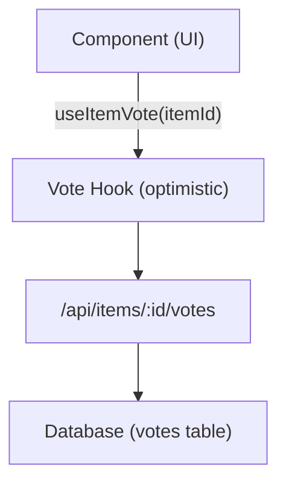

# Sistema de votação e comentários

O modelo Ever Works inclui um sistema completo de votação e comentários que permite aos usuários votar positivamente ou negativamente em itens, deixar comentários com classificações de estrelas e interagir com o conteúdo. Ambos os sistemas usam atualizações otimistas para feedback instantâneo da IU.

## Sistema de votação

### Arquitetura

O sistema de votação usa um modelo de votação por item onde cada usuário autenticado pode dar um voto (para cima ou para baixo) por item. O sistema rastreia a contagem líquida de votos e os votos individuais dos usuários.



### useItemVote Gancho

```typescript
import { useItemVote } from '@/hooks/use-item-vote';

const {
  voteCount,       // number -- net vote count
  userVote,        // 'up' | 'down' | null
  isLoading,       // boolean
  handleVote,      // (type: 'up' | 'down') => void
  refreshVotes,    // () => void
} = useItemVote(itemId);
```

### Comportamento de votação

| Estado Atual | Ação | Resultado |
|-------------|--------|--------|
| Sem votação | Clique para cima | Voto positivo (+1) |
| Sem votação | Clique para baixo | Voto negativo (-1) |
| Votado | Clique para cima | Remover voto (alternar) |
| Votado | Clique para baixo | Mudar para voto negativo (-2 líquido) |
| Votado negativamente | Clique para baixo | Remover voto (alternar) |
| Votado negativamente | Clique para cima | Mudar para voto positivo (+2 líquidos) |

### Atualizações otimistas

O gancho de votação implementa atualizações otimistas com reversão:

1. **onMutate** – Cancela consultas de saída, tira um instantâneo do estado atual, aplica atualização otimista
2. **onSuccess** – Substitua dados otimistas por resposta do servidor
3. **onError** -- Reverter para instantâneo, mostrar brinde de erro

### Autenticação

Usuários não autenticados que tentam votar veem um modal de login via `useLoginModal` :

```typescript
if (!user) {
  loginModal.onOpen('Please sign in to vote on this item');
  throw new Error('Authentication required');
}
```

### Gerenciamento de Cache

O gancho do utilitário `useVoteCache` fornece operações de cache entre componentes:

```typescript
import { useVoteCache } from '@/hooks/use-item-vote';

const {
  invalidateAllVotes,     // () => void
  invalidateItemVotes,    // (itemId: string) => void
  clearVoteCache,         // () => void
  prefetchItemVotes,      // (itemId: string) => Promise<void>
} = useVoteCache();
```

## Sistema de comentários

### Arquitetura

Os comentários suportam operações CRUD completas com classificação por estrelas, moderação e atualizações em tempo real.

### useComments Gancho

```typescript
import { useComments } from '@/hooks/use-comments';

const {
  comments,              // CommentWithUser[]
  isPending,
  createComment,         // ({ content, itemId, rating }) => Promise
  isCreating,
  updateComment,         // ({ commentId, content?, rating? }) => Promise
  isUpdating,
  deleteComment,         // (commentId) => Promise
  isDeleting,
  rateComment,           // ({ commentId, rating }) => void
  isRatingComment,
  updateCommentRating,   // ({ commentId, rating }) => void
  isUpdatingRating,
  commentRating,         // number
  isLoadingRating,
} = useComments(itemId);
```

### Modelo de dados de comentários

Cada comentário inclui:
- `id` -- Identificador único
- `content` -- Texto do comentário
- `rating` -- Classificação por estrelas opcional (1-5)
- `userId` -- Referência do autor
- `itemId` -- Item associado
- `user` -- Dados do usuário preenchidos (nome, email, imagem)
- `createdAt` / `updatedAt` -- Carimbos de data e hora

### Integração de classificação

Comentários e classificações estão totalmente integrados:
- Criar um comentário com uma classificação atualiza a classificação agregada do item
- A edição da classificação de um comentário aciona um recálculo
- A consulta `["item-rating", itemId]` é buscada novamente após qualquer mutação de comentário

### Eventos entre componentes

O sistema de comentários despacha eventos DOM personalizados para coordenação entre componentes:

```typescript
const COMMENT_MUTATION_EVENT = "comment:mutated";
window.dispatchEvent(new CustomEvent(COMMENT_MUTATION_EVENT, { detail: comment }));
```

Outros componentes podem escutar alterações de comentários sem acoplamento direto do React Query.

### Moderação administrativa

O gancho `useAdminComments` fornece gerenciamento de comentários em nível de administrador:

```typescript
import { useAdminComments } from '@/hooks/use-admin-comments';

const {
  comments,         // AdminCommentItem[]
  totalComments,
  totalPages,
  isDeleting,       // string | null (ID of comment being deleted)
  deleteComment,    // (id: string) => Promise<boolean>
} = useAdminComments({ page: 1, limit: 10, search: '' });
```

### Terminais de API

| Método | Ponto final | Descrição |
|--------|----------|------------|
| OBTER | `/api/items/:id/comments` | Buscar comentários para um item |
| POSTAR | `/api/items/:id/comments` | Crie um novo comentário |
| COLOCAR | `/api/items/:id/comments/:commentId` | Atualizar um comentário |
| EXCLUIR | `/api/items/:id/comments/:commentId` | Excluir um comentário |
| POSTAR | `/api/items/:id/comments/rating` | Avalie um comentário |
| COLOCAR | `/api/items/:id/comments/rating` | Atualizar classificação de comentários |
| OBTER | `/api/items/:id/comments/rating` | Obtenha classificação agregada |

## Integração de sinalizadores de recursos

Tanto a votação quanto os comentários respeitam os sinalizadores de recursos:

```typescript
const flags = getFeatureFlags();
// flags.ratings -- Controls star rating display
// flags.comments -- Controls comment section visibility
```

Quando o banco de dados não está configurado (falta `DATABASE_URL` ), esses recursos são automaticamente desabilitados.
