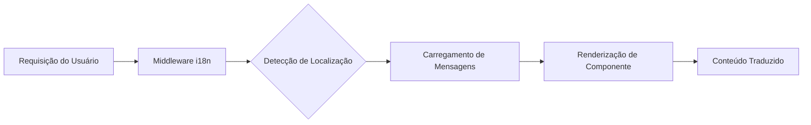

# Visão Geral da Internacionalização

O Ever Works é desenvolvido com internacionalização em mente, suportando múltiplos idiomas através do `next-intl`.

## 🌍 Idiomas Suportados

O template inclui suporte integrado para:

- 🇬🇧 **Inglês** (en) – Idioma padrão
- 🇫🇷 **Francês** (fr)
- 🇪🇸 **Espanhol** (es)
- 🇩🇪 **Alemão** (de)
- 🇨🇳 **Chinês** (zh)
- 🇸🇦 **Árabe** (ar)
- 🇧🇬 **Búlgaro** (bg)
- 🇳🇱 **Holandês** (nl)
- 🇮🇱 **Hebraico** (he)
- 🇮🇹 **Italiano** (it)
- 🇵🇱 **Polonês** (pl)
- 🇵🇹 **Português** (pt)
- 🇷🇺 **Russo** (ru)

## Como Funciona

### Localização Baseada em URL

O Ever Works usa detecção de localização baseada em URL:

```
https://yoursite.com/en/about    → Inglês
https://yoursite.com/fr/about    → Francês
https://yoursite.com/es/about    → Espanhol
```

### Detecção Automática de Idioma

O sistema detecta automaticamente:
1. O idioma do navegador do usuário
2. Redireciona para a localização adequada
3. Lembra a preferência de idioma do usuário
4. Retorna ao idioma padrão (Inglês)

## Arquitetura de Traduções



## Arquivos de Tradução

As traduções são armazenadas em arquivos JSON:

```
messages/
├── en.json    # Inglês
├── fr.json    # Francês
├── es.json    # Espanhol
├── de.json    # Alemão
├── zh.json    # Chinês
└── ar.json    # Árabe
```

## Exemplo Rápido

```typescript
import { useTranslations } from 'next-intl';

export function MyComponent() {
  const t = useTranslations('common');

  return (
    <div>
      <h1>{t('welcome')}</h1>
      <p>{t('description')}</p>
    </div>
  );
}
```

## Funcionalidades

### ✅ Cobertura Completa de Traduções
- Componentes de UI
- Rótulos de formulários e mensagens de validação
- Templates de e-mail
- Mensagens de erro
- Metadados SEO

### ✅ Suporte RTL
- Layout RTL automático para árabe e hebraico
- Elementos de UI espelhados
- Alinhamento de texto correto

### ✅ Formatação de Datas e Números
- Formatos de data específicos por localização
- Formatação de moeda
- Formatação de números

### ✅ Pluralização
- Formas plurais automáticas
- Regras específicas por idioma

## Próximos Passos

- [Guia de Tradução →](./translation-guide) – Aprenda a adicionar e gerenciar traduções
- [Primeiros Passos](/getting-started) – Configure seu projeto
- [Personalização](/guides/customization) – Personalize seu site

## Precisa de Ajuda?

Consulte nossa [página de suporte](/advanced-guide/support) para assistência com internacionalização.
