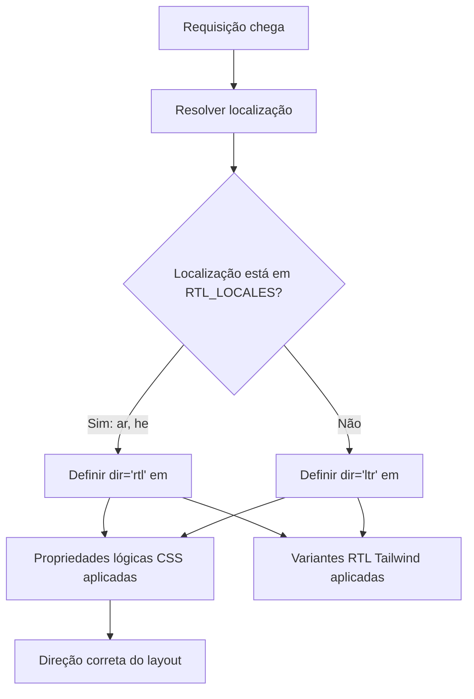

# Suporte RTL (da Direita para a Esquerda)

O template suporta totalmente idiomas da direita para a esquerda (RTL) como árabe e hebraico. Esta página documenta como a detecção RTL funciona, como a direção do layout é aplicada e como os componentes se adaptam a contextos RTL.

## Visão Geral da Arquitetura



## Arquivos de Origem

| Arquivo | Finalidade |
|------|---------|
| `lib/constants.ts` | Definição da lista de localizações RTL |
| `app/layout.tsx` | Layout raiz com atributo `dir` |
| `components/language-switcher.tsx` | Mapa de idiomas com metadados `isRTL` |

## Configuração de Localização RTL

```typescript
export const RTL_LOCALES: readonly Locale[] = ['ar', 'he'] as const;
```

## Como a Direção é Aplicada

### Detecção no Layout Raiz

```typescript
export default async function RootLayout({ children }) {
  const locale = await getLocale();
  const dir = RTL_LOCALES.includes(locale as Locale) ? 'rtl' : 'ltr';

  return (
    <html lang={locale} dir={dir} suppressHydrationWarning>
      <body className={`${getFontClassNames(locale)} antialiased`}>
        {children}
      </body>
    </html>
  );
}
```

## Estratégias CSS para RTL

### 1. Propriedades Lógicas CSS

| Propriedade Física | Propriedade Lógica | Significado LTR | Significado RTL |
|-------------------|-----------------|-------------|-------------|
| `margin-left` | `margin-inline-start` | Margem esquerda | Margem direita |
| `margin-right` | `margin-inline-end` | Margem direita | Margem esquerda |
| `padding-left` | `padding-inline-start` | Padding esquerdo | Padding direito |
| `text-align: left` | `text-align: start` | Alinhado à esquerda | Alinhado à direita |
| `left` | `inset-inline-start` | Posição esquerda | Posição direita |

### 2. Suporte RTL no Tailwind CSS

```html
<div class="ml-4 rtl:mr-4 rtl:ml-0">
  Conteúdo com margem direcional
</div>

<svg class="rtl:rotate-180">
  <path d="M1 9 4-4-4-4" />
</svg>
```

### 3. Utilitários Lógicos do Tailwind

```html
<div class="ps-4">  <!-- padding-inline-start: 1rem -->
<div class="pe-4">  <!-- padding-inline-end: 1rem -->
<div class="ms-4">  <!-- margin-inline-start: 1rem -->
<div class="me-4">  <!-- margin-inline-end: 1rem -->
```

## Problemas RTL Comuns

| Problema | Causa | Solução |
|-------|-------|-----|
| Alinhamento de texto errado | Uso de `text-left` em vez de `text-start` | Usar propriedades lógicas |
| Ícones não espelhados | `rtl:rotate-180` ausente em ícones direcionais | Adicionar variante RTL |
| Margem no lado errado | Uso de `ml-*` em vez de `ms-*` | Usar utilitários lógicos do Tailwind |

## Adicionando um Novo Idioma RTL

1. **Adicionar a localização** ao `LOCALES` em `lib/constants.ts`
2. **Adicionar ao `RTL_LOCALES`**
3. **Criar arquivo de mensagens** em `messages/ur.json`
4. **Adicionar entrada no mapa de idiomas** em `components/language-switcher.tsx`
5. **Adicionar SVG de bandeira** em `public/flags/ur.svg`
6. **Testar layout cuidadosamente** no modo RTL

## Melhores Práticas

1. **Preferir propriedades lógicas CSS** sobre as físicas
2. **Usar `dir="rtl"` em `<html>`** (já tratado pelo layout raiz)
3. **Testar com conteúdo árabe/hebraico real**, não apenas texto inglês no modo RTL
4. **Não espelhar imagens decorativas** ou logotipos de marca
