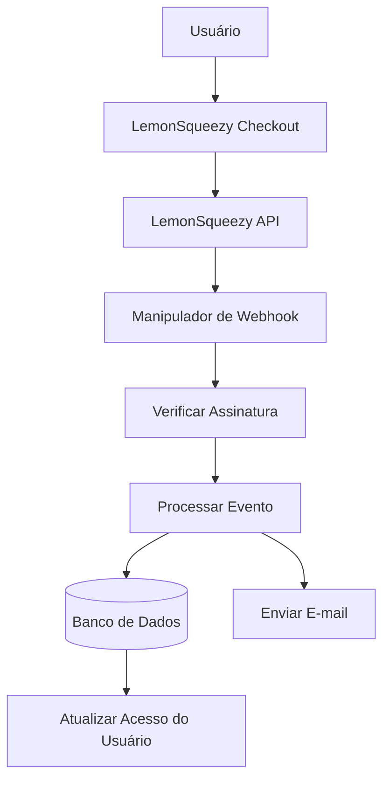

# Configuração LemonSqueezy

Este guia explica como configurar o LemonSqueezy como provedor de pagamento no seu aplicativo Ever Works.

## Visão Geral

LemonSqueezy é uma plataforma merchant of record que simplifica:

- 💰 Pagamentos globais com conformidade fiscal automática
- 🌍 Suporte para 135+ países
- 📊 Prevenção de fraudes integrada
- 🔄 Gerenciamento de assinaturas
- 💳 Múltiplos métodos de pagamento
- 📧 Recibos de e-mail automatizados

:::tip Por que LemonSqueezy?
O LemonSqueezy atua como merchant of record, gerenciando automaticamente toda a conformidade fiscal, IVA e imposto sobre vendas. Isso significa que você não precisa se registrar para impostos em diferentes países.
:::

## Variáveis de Ambiente Necessárias

Adicione estas variáveis ao seu arquivo `.env.local`:

```env
# Configuração LemonSqueezy
LEMONSQUEEZY_API_KEY=your_api_key_here
LEMONSQUEEZY_WEBHOOK_SECRET=your_webhook_secret_here
LEMONSQUEEZY_STORE_ID=your_store_id_here

# IDs de Produto/Variante (opcional)
NEXT_PUBLIC_LEMONSQUEEZY_PRO_VARIANT_ID=variant_id_here
NEXT_PUBLIC_LEMONSQUEEZY_SPONSOR_VARIANT_ID=variant_id_here
```

## Configuração do Dashboard LemonSqueezy

### Passo 1: Criar sua Loja

1. Registre-se em [LemonSqueezy](https://lemonsqueezy.com)
2. Crie uma nova loja
3. Complete as configurações da loja (nome, moeda, etc.)
4. Copie seu **ID da Loja** da URL ou configurações

### Passo 2: Criar Produtos

1. Acesse **Produtos** → **Novo Produto**
2. Crie seus níveis de preço:

| Produto | Preço | Tipo | Descrição |
|---------|-------|------|-----------|
| **Plano Pro** | R$10/mês | Assinatura | Recursos avançados |
| **Plano Patrocinador** | R$20 | Único | Suporte premium |

3. Para cada produto, crie **Variantes** com preços específicos
4. Copie o **ID da Variante** para cada opção de preço

### Passo 3: Obter Chave de API

1. Acesse **Configurações** → **API**
2. Crie uma nova chave de API
3. Copie a chave de API (começa com `ls_`)
4. Adicione-a ao seu `.env.local` como `LEMONSQUEEZY_API_KEY`

### Passo 4: Configurar Webhooks

1. Acesse **Configurações** → **Webhooks**
2. Clique em **Criar Webhook**
3. Configure o webhook:
   - **URL**: `https://seudominio.com/api/lemonsqueezy/webhook`
   - **Eventos**: Selecione todos os eventos de assinatura e pedido
   - **Segredo**: Gere uma chave secreta

4. Copie o **Segredo do Webhook** e adicione-o ao seu `.env.local`

#### Eventos Recomendados

Selecione estes eventos na sua configuração de webhook:

- ✅ `subscription_created` - Nova assinatura
- ✅ `subscription_updated` - Alterações na assinatura
- ✅ `subscription_cancelled` - Cancelamento
- ✅ `subscription_payment_success` - Pagamento bem-sucedido
- ✅ `subscription_payment_failed` - Pagamento falhou
- ✅ `subscription_trial_will_end` - Período de teste terminando
- ✅ `order_created` - Compra única
- ✅ `order_refunded` - Reembolso processado

## Endpoint do Webhook

O webhook está disponível em: `/api/lemonsqueezy/webhook`

### Mapeamento de Eventos Suportados

| Evento LemonSqueezy | Evento Interno | Descrição |
|--------------------|----------------|-----------|
| `subscription_created` | `SUBSCRIPTION_CREATED` | Nova assinatura criada |
| `subscription_updated` | `SUBSCRIPTION_UPDATED` | Assinatura atualizada |
| `subscription_cancelled` | `SUBSCRIPTION_CANCELLED` | Assinatura cancelada |
| `subscription_payment_success` | `SUBSCRIPTION_PAYMENT_SUCCEEDED` | Pagamento bem-sucedido |
| `subscription_payment_failed` | `SUBSCRIPTION_PAYMENT_FAILED` | Pagamento falhou |
| `subscription_trial_will_end` | `SUBSCRIPTION_TRIAL_ENDING` | Período de teste terminando em breve |
| `order_created` | `PAYMENT_SUCCEEDED` | Pagamento único |
| `order_refunded` | `REFUND_SUCCEEDED` | Reembolso processado |

## Implementação

### Arquitetura do Sistema de Pagamento



### Funcionalidades

#### Segurança

- ✅ Verificação de assinatura HMAC (SHA-256)
- ✅ Validação de segredo do webhook
- ✅ Tratamento abrangente de erros
- ✅ Registro de requisições

#### Funcionalidade

- ✅ Gerenciamento do ciclo de vida de assinaturas
- ✅ Processamento automático de pagamentos
- ✅ Notificações por e-mail
- ✅ Sincronização de banco de dados
- ✅ Monitoramento de erros

## Exemplo de Uso

### Criar um Checkout

```typescript
import { LemonSqueezyProvider } from '@/lib/payment/providers/lemonsqueezy-provider';

const lsProvider = new LemonSqueezyProvider({
  apiKey: process.env.LEMONSQUEEZY_API_KEY!,
  storeId: process.env.LEMONSQUEEZY_STORE_ID!,
});

// Criar sessão de checkout
const checkout = await lsProvider.createCheckout({
  variantId: 'variant_id_here',
  customerId: 'customer_id',
  redirectUrl: 'https://yoursite.com/success',
});

// Redirecionar usuário para checkout.url
```

## Testes

### Modo de Teste

1. LemonSqueezy fornece um modo de teste para desenvolvimento
2. Use chaves de API de teste (disponíveis no dashboard)
3. Teste webhooks com a ferramenta de teste de webhooks do LemonSqueezy

### Testes Locais

```bash
# Use uma ferramenta como ngrok para expor seu servidor local
ngrok http 3000

# Atualize a URL do webhook no dashboard LemonSqueezy
https://your-ngrok-url.ngrok.io/api/lemonsqueezy/webhook
```

## Monitoramento

Todos os eventos de webhook são registrados:

- ✅ **Sucesso**: `✅ LemonSqueezy [event] handled successfully`
- ❌ **Erros**: `❌ Failed to handle [event]: [error details]`

Verifique os logs da aplicação para atividade de webhook.

## Solução de Problemas

### Problemas Comuns

**Problema**: Erro "No signature provided"

- **Solução**: Certifique-se de que o LemonSqueezy está enviando o header `x-signature`
- Verifique a configuração do webhook no dashboard LemonSqueezy

**Problema**: Erro "Invalid signature"

- **Solução**: Verifique se `LEMONSQUEEZY_WEBHOOK_SECRET` corresponde ao segredo no LemonSqueezy
- Certifique-se de que a URL do webhook está corretamente configurada

**Problema**: Webhook não está recebendo eventos

- **Solução**: Verifique se a URL do webhook está acessível publicamente
- Use ngrok para testes locais
- Verifique os logs de webhook do LemonSqueezy

## Boas Práticas de Segurança

1. **Somente HTTPS**: Sempre use HTTPS para endpoints de webhook em produção
2. **Rotação de Segredos**: Rotacione segredos de webhook regularmente
3. **Monitoramento**: Monitore logs de webhook para atividades suspeitas
4. **Variáveis de Ambiente**: Nunca commit segredos para controle de versão
5. **Rate Limiting**: Implemente rate limiting para webhooks de produção
