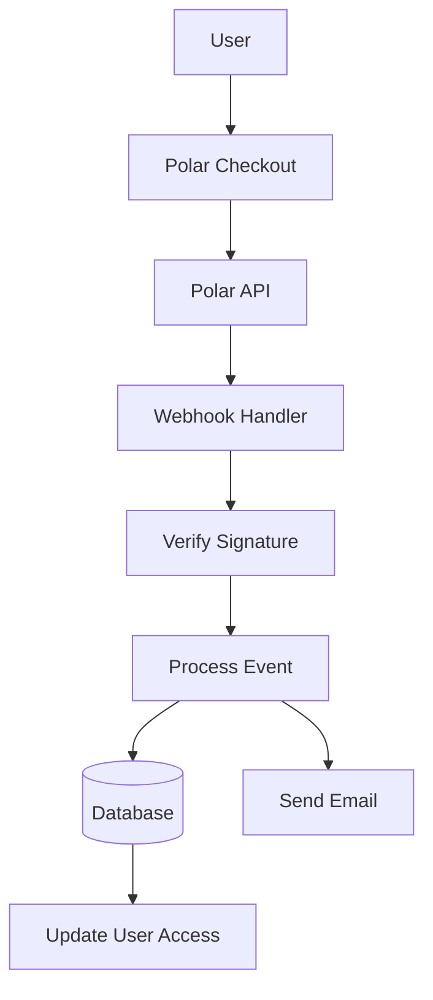

#Configuração polar

Este guia explica como configurar a Polar como provedor de pagamento em seu aplicativo Ever Works.

## Visão geral

Polar é uma plataforma de pagamento moderna projetada para desenvolvedores e criadores que oferece:

- 💻 API e documentação fáceis de desenvolver
- 🔄 Suporte para assinatura e pagamento único
- 🐙 Integração GitHub para patrocínios
- 💰 Estrutura de preços transparente
- 🔒 Processamento de pagamento seguro
- 📊 Análises e relatórios integrados

:::tip Por que Polar?
Polar foi desenvolvido especificamente para desenvolvedores e projetos de código aberto, oferecendo uma API limpa, excelente documentação e integração perfeita com GitHub para patrocínios e monetização.
:::

## Variáveis de ambiente obrigatórias

Adicione estas variáveis ao seu arquivo `.env.local` :

```env
# Polar Configuration
POLAR_API_KEY=your_polar_api_key_here
POLAR_WEBHOOK_SECRET=your_webhook_secret_here
POLAR_APP_URL=https://your-app-url.com

# Product IDs (optional)
NEXT_PUBLIC_POLAR_SUBSCRIPTION_PRODUCT_ID=product_id_here
NEXT_PUBLIC_POLAR_ONETIME_PRODUCT_ID=product_id_here
```

::: aviso
Nunca envie suas chaves secretas para controle de versão. Mantenha `.env.local` em seu arquivo `.gitignore` .
:::

## Configuração do painel Polar

### Etapa 1: Crie sua conta

1. Cadastre-se em [Polar](https://polar.sh)
2. Conclua a configuração da sua conta
3. Verifique seu endereço de e-mail

### Etapa 2: Criar produtos

1. Navegue até **Produtos** → **Novo Produto**
2. Crie seus níveis de preços:

| Produto | Preço | Tipo | Descrição |
|--------|-------|------|------------|
| **Plano Pro** | US$ 10/mês | Assinatura | Recursos avançados |
| **Plano de Patrocinador** | US$ 20 | Único | Suporte premium |

3. Defina as configurações do produto:
   - Definir preços e ciclo de faturamento
   - Adicione descrições de produtos
   - Configurar níveis de acesso
4. Copie o **ID do produto** para cada produto

### Etapa 3: Obtenha a chave da API

1. Vá para **Configurações** → **Chaves de API**
2. Crie uma nova chave API
3. Copie a chave API
4. Adicione-o ao seu `.env.local` como `POLAR_API_KEY` :::tip
A Polar fornece chaves separadas para desenvolvimento e produção. Use chaves de teste durante o desenvolvimento.
:::

### Etapa 4: configurar webhooks

1. Vá para **Configurações** → **Webhooks**
2. Clique em **Criar Webhook**
3. Configure o webhook:
   - **URL**: `https://yourdomain.com/api/polar/webhook` - **Eventos**: Selecione todos os eventos de pagamento e assinatura
   - **Segredo**: Gere uma chave secreta

4. Copie o **Webhook Secret** e adicione-o ao seu `.env.local` #### Eventos recomendados

Selecione estes eventos na configuração do seu webhook:

- ✅ `payment.succeeded` - Pagamento bem sucedido
- ✅ `payment.failed` - Falha no pagamento
- ✅ `subscription.created` - Nova assinatura
- ✅ `subscription.updated` - Alterações na assinatura
- ✅ `subscription.cancelled` - Cancelamento
- ✅ `subscription.trial_will_end` - Fim do teste
- ✅ `refund.created` - Reembolso processado

## Arquitetura do sistema de pagamento



### Provedor Polar

O provedor Polar ( `lib/payment/lib/providers/polar-provider.ts` ) implementa:

- ✅ Gestão de clientes
- ✅ Gerenciamento de produtos e preços
- ✅ Ciclo de vida da assinatura
- ✅ Processamento de pagamento
- ✅ Manipulação de webhook
- ✅ Suporte para reembolso

### Rotas de API

As seguintes rotas de API estão disponíveis:

| Rota | Método | Descrição |
|-------|--------|------------|
| `/api/polar/webhook` | POSTAR | Lidar com webhooks Polar |
| `/api/polar/subscription` | POSTAR | Criar assinatura |
| `/api/polar/subscription` | COLOCAR | Atualizar assinatura |
| `/api/polar/subscription` | EXCLUIR | Cancelar assinatura |
| `/api/polar/checkout` | POSTAR | Criar sessão de checkout |
| `/api/polar/payment` | OBTER | Verifique o status do pagamento |

### Componentes da IU

O sistema usa os componentes de checkout da Polar:

- `PolarCheckoutButton` - Componente do botão Checkout
- `PolarPaymentForm` - Formulário de pagamento com validação
- Design responsivo para dispositivos móveis e desktop
- Suporte para vários métodos de pagamento

## Exemplos de uso

### Crie uma assinatura

```typescript
import { PolarProvider } from '@/lib/payment/providers/polar-provider';

const configs = createProviderConfigs({
  apiKey: process.env.POLAR_API_KEY!,
  webhookSecret: process.env.POLAR_WEBHOOK_SECRET!,
  options: {
    appUrl: process.env.POLAR_APP_URL!
  }
});

const polarProvider = new PolarProvider(configs.polar);

const subscription = await polarProvider.createSubscription({
  customerId: 'customer_id',
  productId: 'product_id',
  paymentMethodId: 'payment_method_id',
  trialPeriodDays: 7
});
```

### Crie uma sessão de checkout

```typescript
const checkout = await polarProvider.createCheckout({
  productId: 'product_id_here',
  customerId: 'customer_id',
  successUrl: 'https://yoursite.com/success',
  cancelUrl: 'https://yoursite.com/cancel'
});

// Redirect user to checkout.url
```

### Use o componente de pagamento

```tsx
import { PolarCheckoutButton } from '@/lib/payment';

function PaymentPage() {
  return (
    <PolarCheckoutButton
      productId="product_id_here"
      amount={1000} // 10.00 USD in cents
      currency="usd"
      isSubscription={true}
      onSuccess={(paymentId) => {
        console.log('Payment succeeded:', paymentId);
        // Redirect to success page or update UI
      }}
      onError={(error) => {
        console.error('Payment error:', error);
        // Show error message to user
      }}
    />
  );
}
```

## Testando sua integração

### Modo de teste

1. **Use chaves de API de teste** (disponíveis no painel Polar)
2. **Use métodos de pagamento de teste**:
   - Cartões de teste fornecidos no painel Polar
   - Modo de teste para todos os fluxos de pagamento

3. **Teste webhooks localmente** com uma ferramenta como o ngrok:

   ```bash
   ngrok http3000
   ```

   Atualize o URL do webhook no painel Polar para o URL do ngrok.

### Teste de webhook

```bash
# Use ngrok to expose your local server
ngrok http 3000

# Update webhook URL in Polar dashboard
https://your-ngrok-url.ngrok.io/api/polar/webhook

# Trigger test events from Polar dashboard
```

## Tratamento de erros

O sistema lida automaticamente com erros comuns:

| Tipo de erro | Manuseio |
|-----------|----------|
| Pagamento recusado | Mensagem de erro amigável |
| Problemas de rede | Lógica de repetição automática |
| Falhas de webhook | Registrado para revisão manual |
| Erros de validação | Destaque de campo do formulário |
| Erros de assinatura | Limpar mensagens de erro |

## Melhores práticas de segurança

1. **Chaves de API**:
   - Nunca exponha chaves secretas no código do lado do cliente
   - Use variáveis de ambiente
   - Gire as chaves regularmente

2. **Verificação de webhook**:
   - Sempre verifique as assinaturas do webhook
   - Valide os dados do evento antes do processamento
   - Use HTTPS para todos os endpoints do webhook

3. **Dados de Pagamento**:
   - Nunca armazene detalhes de pagamento
   - Use o processamento de pagamento seguro da Polar
   - Implementar autenticação adequada

4. **Sessões de usuário**:
   - Verifique a autenticação do usuário
   - Validar permissões do usuário
   - Registrar todas as atividades de pagamento

## Integração com GitHub

Polar oferece integração perfeita com GitHub:

- **Patrocínios do GitHub**: Conecte a Polar com patrocinadores do GitHub
- **Acesso ao repositório**: conceda acesso com base em assinaturas
- **Suporte à organização**: gerenciar assinaturas de equipe
- **Acesso automatizado**: gerenciamento automático de acesso

### Configurar integração com GitHub

1. Vá para **Configurações** → **Integrações** → **GitHub**
2. Conecte sua conta GitHub
3. Configure regras de acesso ao repositório
4. Configure o gerenciamento automatizado de acesso

## Dependências

Pacotes necessários (já incluídos no Ever Works):

```json
{
  "@polar-sh/sdk": "^1.0.0"
}
```

## Solução de problemas

### Problemas comuns

**Problema**: o webhook não recebe eventos

- **Solução**: verifique se o URL do webhook está acessível publicamente
- Use o ngrok para testes locais
- Verifique se o segredo do webhook está correto

**Problema**: o pagamento falha silenciosamente

- **Solução**: verifique se há erros no console do navegador
- Verifique se as chaves da API estão corretas
- Verifique os registros do painel Polar

**Problema**: assinatura não atualizada

- **Solução**: verifique se os eventos do webhook estão configurados
- Verifique os registros do manipulador de webhook
- Certifique-se de que as atualizações do banco de dados estejam funcionando

**Problema**: a integração do GitHub não funciona

- **Solução**: verifique a conexão do GitHub no painel Polar
- Verifique as configurações de acesso ao repositório
- Certifique-se de que as permissões adequadas sejam concedidas

## Comparação: Polar vs outros provedores

| Recurso | polares | Listra | Espremedor de Limão |
|--------|-------|--------|-------------|
| **Foco no desenvolvedor** | ✅ Excelente | ⚠️ Bom | ⚠️ Bom |
| **Integração com GitHub** | ✅ Nativo | ❌ Não | ❌Não |
| **Amigável com código aberto** | ✅ Sim | ⚠️ Limitado | ⚠️ Limitado |
| **Complexidade de configuração** | ✅ Simples | ⚠️ Moderado | ✅ Simples |
| **Qualidade da API** | ✅ Excelente | ✅ Excelente | ⚠️ Bom |
| **Conformidade Fiscal** | ⚠️ Manual | ⚠️ Manual | ✅ Automático |
| **Melhor para** | Desenvolvedores, OSS | Alto volume | Vendas globais |

## Próximas etapas

- [Configuração Stripe](./stripe) - Provedor de pagamento alternativo
- [Configuração do LemonSqueezy](./lemonsqueezy) - Provedor de pagamento alternativo
- [Visão geral do pagamento](/payment) - Compare provedores de pagamento
- [Variáveis de ambiente](/deployment/environment-variables) - Configuração completa do ambiente
- [Implantação](/deployment) - Implante sua integração de pagamento

## Recursos

- [Documentação Polar](https://docs.polar.sh/)
- [Referência da API](https://docs.polar.sh/api)
- [Guia do Webhook](https://docs.polar.sh/webhooks)
- [Integração com GitHub](https://docs.polar.sh/integrations/github)

## Suporte

Precisa de ajuda com a integração Polar? Confira nossa [página de suporte](/advanced-guide/support) ou junte-se à nossa comunidade.
