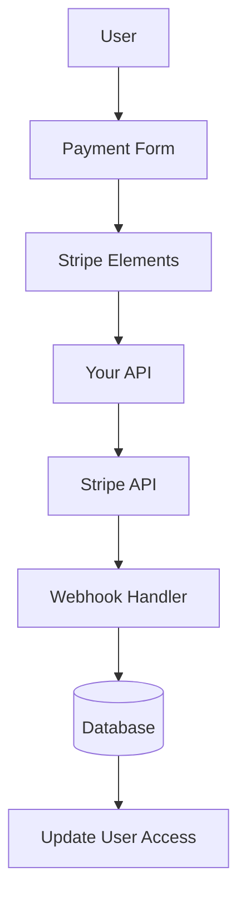

# Configuração de faixa

Este guia explica como configurar o Stripe em seu aplicativo Ever Works com um sistema completo de assinatura e pagamento.

## Visão geral

Stripe é uma plataforma de pagamento abrangente que oferece suporte a:

- 💳 Pagamentos únicos
- 🔄 Assinaturas recorrentes
- 🌍 Vários métodos de pagamento (cartões, Apple Pay, Google Pay)
- 💰 Várias moedas
- 📊 Análises e relatórios avançados

## Variáveis de ambiente obrigatórias

Adicione estas variáveis ao seu arquivo `.env.local` :

```bash
# Stripe Configuration
STRIPE_SECRET_KEY=sk_test_your_stripe_secret_key_here
STRIPE_WEBHOOK_SECRET=whsec_your_stripe_webhook_secret_here
NEXT_PUBLIC_STRIPE_PUBLISHABLE_KEY=pk_test_your_stripe_publishable_key_here

# Stripe Price IDs
NEXT_PUBLIC_STRIPE_SUBSCRIPTION_PRICE_ID=price_subscription_id_here
NEXT_PUBLIC_STRIPE_ONETIME_PRICE_ID=price_onetime_id_here
NEXT_PUBLIC_STRIPE_FREE_PRICE_ID=price_free_id_here

# Product Pricing (for display purposes)
NEXT_PUBLIC_PRODUCT_PRICE_PRO=10.00
NEXT_PUBLIC_PRODUCT_PRICE_SPONSOR=20.00
NEXT_PUBLIC_PRODUCT_PRICE_FREE=0.00
```

::: aviso
Nunca envie suas chaves secretas para controle de versão. Mantenha `.env.local` em seu arquivo `.gitignore` .
:::

## Configuração do painel Stripe

### Etapa 1: Criar produtos

No seu [Painel Stripe](https://dashboard.stripe.com/):

1. Navegue até **Produtos** → **Adicionar Produto**
2. Crie os seguintes produtos:

| Produto | Preço | Tipo | Descrição |
|--------|-------|------|------------|
| **Plano Gratuito** | US$ 0,00 | Único | Recursos básicos |
| **Plano Pro** | US$ 10,00 | Assinatura mensal | Recursos avançados |
| **Plano de Patrocinador** | US$ 20,00 | Único | Suporte premium |

3. Copie o **ID do preço** de cada produto (começa com `price_` )

### Etapa 2: configurar webhooks

Os webhooks permitem que o Stripe notifique seu aplicativo sobre eventos de pagamento.

1. Vá para **Desenvolvedores** → **Webhooks** → **Adicionar endpoint**
2. Defina o URL do terminal:
   - Desenvolvimento: `http://localhost:3000/api/stripe/webhook` - Produção: `https://your-domain.com/api/stripe/webhook` 3. Selecione eventos para ouvir:
   - `payment_intent.succeeded` - `payment_intent.payment_failed` - `customer.subscription.created` - `customer.subscription.updated` - `customer.subscription.deleted` - `customer.subscription.trial_will_end` - `invoice.payment_succeeded` - `invoice.payment_failed` 4. Copie o **Segredo de assinatura** (começa com `whsec_` )

### Etapa 3: recuperar chaves de API

No painel do Stripe:

1. **Chave secreta**: **Desenvolvedores** → **Chaves de API** → **Chave secreta** (começa com `sk_` )
2. **Chave publicável**: **Desenvolvedores** → **Chaves de API** → **Chave publicável** (começa com `pk_` )
3. **Segredo do Webhook**: **Desenvolvedores** → **Webhooks** → Selecione seu webhook → **Segredo de assinatura**

:::tip
Use as teclas **modo de teste** durante o desenvolvimento (elas começam com `sk_test_` e `pk_test_` ). Mude para as teclas do **modo ao vivo** para produção.
:::

## Arquitetura do sistema de pagamento



### Provedor de distribuição

O provedor Stripe ( `lib/payment/lib/providers/stripe-provider.ts` ) implementa:

- ✅ Gestão de clientes
- ✅ Criação de intenção de pagamento
- ✅ Gerenciamento de assinaturas
- ✅ Manipulação de webhook
- ✅ Suporte à intenção de configuração
- ✅ Reembolsos e cancelamentos

### Rotas de API

As seguintes rotas de API estão disponíveis:

| Rota | Método | Descrição |
|-------|--------|------------|
| `/api/stripe/webhook` | POSTAR | Lidar com webhooks Stripe |
| `/api/stripe/subscription` | POSTAR | Criar assinatura |
| `/api/stripe/subscription` | COLOCAR | Atualizar assinatura |
| `/api/stripe/subscription` | EXCLUIR | Cancelar assinatura |
| `/api/stripe/payment-intent` | POSTAR | Criar intenção de pagamento |
| `/api/stripe/payment-intent` | OBTER | Verifique o pagamento |
| `/api/stripe/setup-intent` | POSTAR | Configurar forma de pagamento |

### Componentes da IU

O sistema usa Stripe Elements para formas de pagamento seguras:

- `StripeElementsWrapper` - Componente principal do invólucro
- `StripePaymentForm` - Formulário de pagamento com validação
- Suporte para Apple Pay e Google Pay
- Design responsivo para dispositivos móveis e desktop

## Exemplos de uso

### Crie uma assinatura

```typescript
import { StripeProvider } from '@/lib/payment/providers/stripe-provider';

const configs = createProviderConfigs({
  apiKey: process.env.STRIPE_SECRET_KEY!,
  webhookSecret: process.env.STRIPE_WEBHOOK_SECRET!,
  options: {
    publishableKey: process.env.NEXT_PUBLIC_STRIPE_PUBLISHABLE_KEY!,
    apiVersion: '2023-10-16'
  }
});

const stripeProvider = new StripeProvider(configs.stripe);

const subscription = await stripeProvider.createSubscription({
  customerId: 'cus_customer_id',
  priceId: 'price_subscription_id',
  paymentMethodId: 'pm_payment_method_id',
  trialPeriodDays: 7
});
```

### Use o componente de pagamento

```tsx
import { PaymentForm } from '@/lib/payment';

function PaymentPage() {
  return (
    <PaymentForm
      amount={1000} // 10.00 USD in cents
      currency="usd"
      isSubscription={true}
      onSuccess={(paymentId) => {
        console.log('Payment succeeded:', paymentId);
        // Redirect to success page or update UI
      }}
      onError={(error) => {
        console.error('Payment error:', error);
        // Show error message to user
      }}
    />
  );
}
```

## Testando sua integração

### Modo de teste

1. **Use chaves de API de teste** (comece com `sk_test_` e `pk_test_` )
2. **Use números de cartão de teste**:
   - Sucesso: `4242 4242 4242 4242` - Declínio: `4000 0000 0000 0002` - 3D seguro: `4000 0025 0000 3155` 3. **Teste webhooks localmente** com Stripe CLI:

   ```bash
   stripe listen --forward-to localhost:3000/api/stripe/webhook
   ```

### Teste de webhook

```bash
# Install Stripe CLI
brew install stripe/stripe-cli/stripe

# Login to your Stripe account
stripe login

# Forward webhooks to your local server
stripe listen --forward-to localhost:3000/api/stripe/webhook

# Trigger test events
stripe trigger payment_intent.succeeded
```

## Tratamento de erros

O sistema lida automaticamente com erros comuns:

| Tipo de erro | Manuseio |
|-----------|----------|
| Cartão recusado | Mensagem de erro amigável |
| Fundos insuficientes | Tente novamente com cartão diferente |
| Problemas de rede | Lógica de repetição automática |
| Falhas de webhook | Registrado para revisão manual |
| Erros de validação | Destaque de campo do formulário |

## Melhores práticas de segurança

1. **Chaves de API**:
   - Nunca exponha chaves secretas no código do lado do cliente
   - Use variáveis de ambiente
   - Gire as chaves regularmente

2. **Verificação de webhook**:
   - Sempre verifique as assinaturas do webhook
   - Valide os dados do evento antes do processamento

3. **Dados de Pagamento**:
   - Nunca armazene números de cartão
   - Use a tokenização do Stripe
   - Implementar conformidade com PCI

4. **Sessões de usuário**:
   - Verifique a autenticação do usuário
   - Validar permissões do usuário
   - Registrar todas as atividades de pagamento

## Dependências

Pacotes necessários (já incluídos no Ever Works):

```json
{
  "@stripe/react-stripe-js": "^3.7.0",
  "@stripe/stripe-js": "^7.3.0",
  "stripe": "^18.1.0"
}
```

## Solução de problemas

### Problemas comuns

**Problema**: o webhook não recebe eventos

- **Solução**: verifique se o URL do webhook está acessível publicamente
- Use Stripe CLI para testes locais
- Verifique se o segredo do webhook está correto

**Problema**: o pagamento falha silenciosamente

- **Solução**: verifique se há erros no console do navegador
- Verifique se as chaves da API estão corretas
- Verifique os registros do painel do Stripe

**Problema**: 3D Secure não funciona

- **Solução**: verifique se você está lidando com o status `requires_action` - Implementar fluxo de redirecionamento adequado
- Teste com cartões de teste 3D Secure

## Próximas etapas

- [Configuração do LemonSqueezy](./lemonsqueezy) - Provedor de pagamento alternativo
- [Variáveis de ambiente](/deployment/environment-variables) - Configuração completa do ambiente
- [Implantação](/deployment) - Implante sua integração de pagamento

## Recursos

- [Documentação do Stripe](https://stripe.com/docs)
- [Guia de integração Next.js](https://stripe.com/docs/payments/accept-a-payment?platform=web&ui=elements)
- [Gerenciamento de assinaturas](https://stripe.com/docs/billing/subscriptions)
- [Eventos Webhook](https://stripe.com/docs/api/events/types)

## Suporte

Precisa de ajuda com a integração do Stripe? Confira nossa [página de suporte](/advanced-guide/support) ou junte-se à nossa comunidade.
