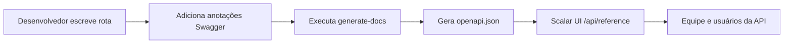

# Treinamento de Documentação API

Domine o sistema de documentação API automatizado usando anotações Swagger e a interface Scalar UI.

## 🎯 Objetivos

Ao final deste módulo, você será capaz de:

- ✅ Entender o fluxo de trabalho de documentação API
- ✅ Escrever anotações Swagger corretas
- ✅ Seguir convenções padronizadas de tags
- ✅ Gerar e validar documentação
- ✅ Solucionar problemas comuns
- ✅ Manter documentação API de alta qualidade

**Tempo estimado**: 2–3 dias

---

## Por Que Este Sistema?

### Problemas Resolvidos

- **Documentação inconsistente**: Anteriormente havia 8 tags Stripe diferentes espalhadas pelos endpoints
- **Sincronização manual**: Documentação frequentemente desatualizada em relação ao código real
- **Experiência ruim para desenvolvedores**: Swagger UI básico com funcionalidade limitada

### Benefícios Obtidos

- **Sincronização automática**: Documentação gerada diretamente das anotações no código
- **Interface moderna**: Scalar UI com testes interativos e melhor UX
- **Padrões consistentes**: Sistema de tags unificado e modelos de documentação

---

## Arquitetura do Sistema

### Componentes Principais

1. **Anotações Swagger no código**
   - Comentários JSDoc com tag `@swagger`
   - Formato de especificação OpenAPI 3.0
   - Embutido diretamente nos arquivos de rota

2. **Script generate-docs**
   - Varre todos os arquivos `app/api/**/route.ts`
   - Extrai e valida anotações Swagger
   - Gera `public/openapi.json` unificado

3. **Interface Scalar UI**
   - Interface de documentação moderna e responsiva
   - Capacidade de teste de API interativo
   - Acessível em `/api/reference`

### Fluxo de Trabalho Completo



---

## Comandos Essenciais

```bash
yarn generate-docs
yarn docs:watch
yarn docs:validate
git status public/openapi.json
```

---

## Sistema de Tags Padronizado

### Convenções de Tags

#### Operações de Administração

```yaml
"Admin - Users"        # Gestão de usuários
"Admin - Categories"   # Gestão de categorias
"Admin - Items"        # Gestão de conteúdo
"Admin - Comments"     # Moderação de comentários
```

#### Funcionalidades Principais da Aplicação

```yaml
"Authentication"       # Login, logout, redefinição de senha
"Favorites"           # Favoritos do usuário
"Items & Content"     # Navegação de conteúdo público
```

#### Sistemas de Pagamento

```yaml
"Stripe - Core"              # Checkout, Payment Intent
"Stripe - Subscriptions"     # Gerenciamento de assinaturas
"LemonSqueezy - Core"        # Todas as operações LemonSqueezy
```

---

## Melhores Práticas

### Escrevendo Descrições Eficazes

- Usar verbos de ação: "Criar", "Atualizar", "Excluir", "Recuperar"
- Ser específico: "Obter perfil do usuário" não "Obter usuário"
- Manter abaixo de 50 caracteres para legibilidade na UI

### Exemplos Realistas

```yaml
# ❌ Exemplos ruins
example: "string"

# ✅ Exemplos bons
example: "john.doe@company.com"
example: "user_123abc456def"
```

---

## Checklist do Desenvolvedor

Antes de fazer commit de mudanças na API:

- [ ] Anotação Swagger adicionada ou atualizada
- [ ] Tag correta do sistema padronizado usada
- [ ] Resumo e descrição significativos presentes
- [ ] Todos os campos do corpo da requisição documentados
- [ ] Todos os códigos de resposta documentados
- [ ] `yarn generate-docs` executado
- [ ] Documentação verificada em `/api/reference`
- [ ] `public/openapi.json` incluído no commit
