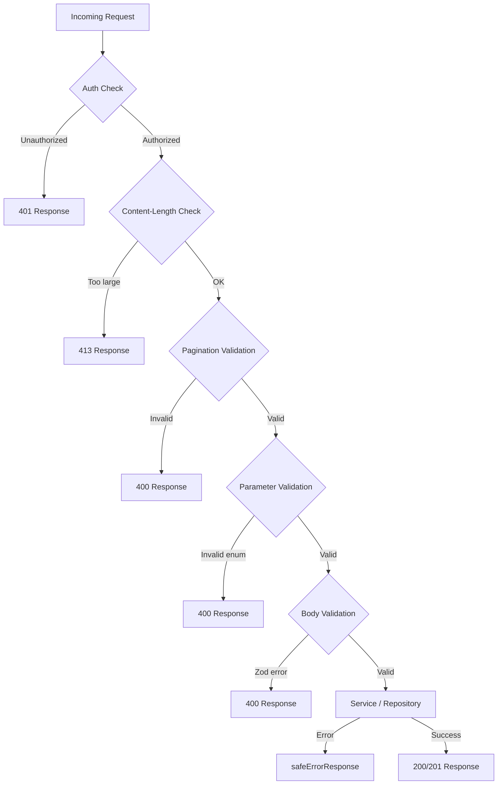

# API请求验证

该模板在多个层验证 API 请求：用于正文/查询验证的 Zod 模式、用于分页和正文大小限制的实用函数以及用于枚举参数的内联类型保护。本页记录了每种验证机制以及它们如何在 API 路由处理程序中使用。

## 验证架构



## Zod 验证模式

### 位置架构 (`lib/validations/item.ts`)

所有字段都是可选的；严格性由表单级别设置控制：

```typescript
export const locationSchema = z.object({
  address: z.string().optional(),
  city: z.string().optional(),
  state: z.string().optional(),
  country: z.string().optional(),
  postal_code: z.string().optional(),
  latitude: z.number()
    .min(-90, 'Latitude must be between -90 and 90')
    .max(90, 'Latitude must be between -90 and 90')
    .optional(),
  longitude: z.number()
    .min(-180, 'Longitude must be between -180 and 180')
    .max(180, 'Longitude must be between -180 and 180')
    .optional(),
  service_area: z.enum(['local', 'regional', 'national', 'global']).optional(),
  is_remote: z.boolean().optional(),
  geocoded_by: z.enum(['mapbox', 'google']).optional(),
}).optional();
```

### 客户端项目架构 (`lib/validations/client-item.ts`)

#### 创建项目

```typescript
export const clientCreateItemSchema = z.object({
  name: z.string()
    .min(ITEM_VALIDATION.NAME_MIN_LENGTH)
    .max(ITEM_VALIDATION.NAME_MAX_LENGTH),
  description: z.string()
    .min(ITEM_VALIDATION.DESCRIPTION_MIN_LENGTH)
    .max(ITEM_VALIDATION.DESCRIPTION_MAX_LENGTH),
  source_url: z.string().url('Invalid URL format'),
  category: z.union([
    z.string().min(1, 'Category is required'),
    z.array(z.string().min(1)).min(1),
  ]).optional().nullable(),
  tags: z.array(z.string().min(1)).optional().default([]),
  icon_url: z.string().url().optional().or(z.literal('')),
  location: locationSchema,
});
```

#### 更新项目

使用相同的字段定义，所有字段都是可选的：

```typescript
export const clientUpdateItemSchema = z.object({
  name: z.string().min(...).max(...).optional(),
  description: z.string().min(...).max(...).optional(),
  source_url: z.string().url().optional(),
  category: z.union([z.string(), z.array(z.string())]).optional(),
  tags: z.array(z.string()).optional(),
  icon_url: z.string().url().optional().or(z.literal('')),
  location: locationSchema,
});
```

#### 列出查询参数

查询参数使用 `.transform()` 将字符串输入转换为键入的值：

```typescript
export const clientItemsListQuerySchema = z.object({
  page: z.string().optional()
    .transform(val => (val ? parseInt(val, 10) : 1))
    .refine(val => !Number.isNaN(val))
    .refine(val => val >= 1),
  limit: z.string().optional()
    .transform(val => (val ? parseInt(val, 10) : 10))
    .refine(val => !Number.isNaN(val))
    .refine(val => val >= 1 && val <= 100),
  status: z.enum(['all', 'pending', 'approved', 'rejected']).optional().default('all'),
  search: z.string().max(100).optional(),
  sortBy: z.enum(['name', 'updated_at', 'status', 'submitted_at']).optional().default('updated_at'),
  sortOrder: z.enum(['asc', 'desc']).optional().default('desc'),
  deleted: z.string().optional().transform(val => val === 'true'),
});
```

### 密码架构 (`lib/validations/auth.ts`)

```typescript
export const passwordSchema = z.string()
  .min(8, "Password must be at least 8 characters")
  .regex(/[A-Z]/, "Must contain at least one uppercase letter")
  .regex(/[a-z]/, "Must contain at least one lowercase letter")
  .regex(/[0-9]/, "Must contain at least one number")
  .regex(/[^A-Za-z0-9]/, "Must contain at least one special character");
```

### 公司架构 (`lib/validations/company.ts`)

```typescript
export const createCompanySchema = z.object({
  name: z.string().min(1).max(255),
  website: z.string().url().optional().or(z.literal("")),
  domain: z.string().max(255).optional()
    .transform(val => val?.toLowerCase().trim() || undefined),
  slug: z.string().max(255).optional()
    .transform(val => val?.toLowerCase().trim() || undefined)
    .refine(val => !val || /^[a-z0-9-]+$/.test(val)),
  status: z.enum(["active", "inactive"]).default("active"),
});
```

### 推断类型

所有模式都将 Zod 推断的类型与模式一起导出：

```typescript
export type ClientUpdateItemInput = z.infer<typeof clientUpdateItemSchema>;
export type ClientCreateItemInput = z.infer<typeof clientCreateItemSchema>;
export type CreateCompanyInput = z.infer<typeof createCompanySchema>;
```

## 分页验证 (`lib/utils/pagination-validation.ts`)

用于验证 `page` 和 `limit` 查询参数的共享实用程序：

```typescript
export function validatePaginationParams(
  searchParams: URLSearchParams
): PaginationParams | PaginationError {
  const page = pageParam ? parseInt(pageParam, 10) : 1;
  const limit = limitParam ? parseInt(limitParam, 10) : 10;

  if (isNaN(page) || page < 1) {
    return { error: 'Invalid page parameter. Must be a positive integer.', status: 400 };
  }
  if (isNaN(limit) || limit < 1 || limit > 100) {
    return { error: 'Invalid limit parameter. Must be between 1 and 100.', status: 400 };
  }
  return { page, limit };
}
```

路由处理程序中的使用遵循可区分的联合模式：

```typescript
const paginationResult = validatePaginationParams(searchParams);
if ('error' in paginationResult) {
  return NextResponse.json(
    { success: false, error: paginationResult.error },
    { status: paginationResult.status }
  );
}
const { page, limit } = paginationResult;
```

## 请求正文大小限制 (`lib/utils/request-body.ts`)

### `readBodyWithLimit`

通过 `ReadableStream` 读取请求正文并进行增量大小检查：

```typescript
export async function readBodyWithLimit<T = unknown>(
  request: NextRequest,
  options: ReadBodyOptions
): Promise<ReadBodyResult<T>>
```

特点：
- 快速路径：首先检查`Content-Length`标头
- 增量：读取流块并在字节到达时检查大小
- 取消：超出限制时调用`reader.cancel()`
- JSON解析：可选，优雅地处理`SyntaxError`

```typescript
// Usage
const { data } = await readBodyWithLimit(request, { maxSize: 1024 });
```

### `validateContentLength`

未阅读正文的早期拒绝：

```typescript
export function validateContentLength(request: NextRequest, maxSize: number): boolean
```

如果 `Content-Length` 标头超出限制，则抛出 `BodySizeLimitError`。

### `BodySizeLimitError`

具有 `maxSize` 和 `actualSize` 属性的自定义错误类：

```typescript
export class BodySizeLimitError extends Error {
  constructor(
    public readonly maxSize: number,
    public readonly actualSize: number
  ) {
    super(`Request body too large. Maximum size is ${maxSize} bytes, received ${actualSize} bytes.`);
  }
}
```

## 内联参数验证

对于 Zod 架构未涵盖的枚举参数，路由处理程序使用内联类型保护：

```typescript
// Type-safe status validation
const validStatuses = ['draft', 'pending', 'approved', 'rejected'] as const;
type ItemStatus = (typeof validStatuses)[number];
const isItemStatus = (s: string): s is ItemStatus =>
  (validStatuses as readonly string[]).includes(s);

if (statusParam && !isItemStatus(statusParam)) {
  return NextResponse.json(
    { success: false, error: `Invalid status. Must be one of: ${validStatuses.join(', ')}` },
    { status: 400 }
  );
}
```

`sortBy` 和 `sortOrder` 参数重复此模式。

## 搜索输入清理

文本搜索参数被修剪和规范化：

```typescript
const searchRaw = searchParams.get('search');
const search = searchRaw?.trim() ? searchRaw.trim() : undefined;
```

CSV 参数被解析和标准化：

```typescript
const parseCsv = (value: string | null): string[] | undefined => {
  if (!value) return undefined;
  const arr = value.split(',').map(v => v.trim()).filter(Boolean);
  return arr.length ? arr : undefined;
};
```

## 分页实用程序 (`lib/paginate.ts`)

用于模板级分页的简单分页助手：

```typescript
export const PER_PAGE = 12;

export function totalPages(size: number, perPage: number = PER_PAGE) {
  return Math.ceil(size / perPage);
}

export function paginateMeta(rawPage: number | string = 1, perPage: number = PER_PAGE) {
  const page = typeof rawPage === 'string' ? parseInt(rawPage) : rawPage;
  const start = (page - 1) * perPage;
  return { page, start };
}
```

## 验证层摘要

|图层|地点|机制|目的|
|-------|----------|-----------|---------|
|授权|路线处理程序|`session?.user?.isAdmin`|基于角色的访问|
|机身尺寸|`lib/utils/request-body.ts`|流阅读器|防止负载过大|
|分页|`lib/utils/pagination-validation.ts`|URLSearchParams解析|验证页面/限制|
|枚举参数|内联路由处理程序|类型保护功能|验证状态、排序依据等。|
|身体图式|`lib/validations/*.ts`|Zod 模式|结构化输入验证|
|搜索|内联路由处理程序|修剪 + CSV 解析|输入净化|
