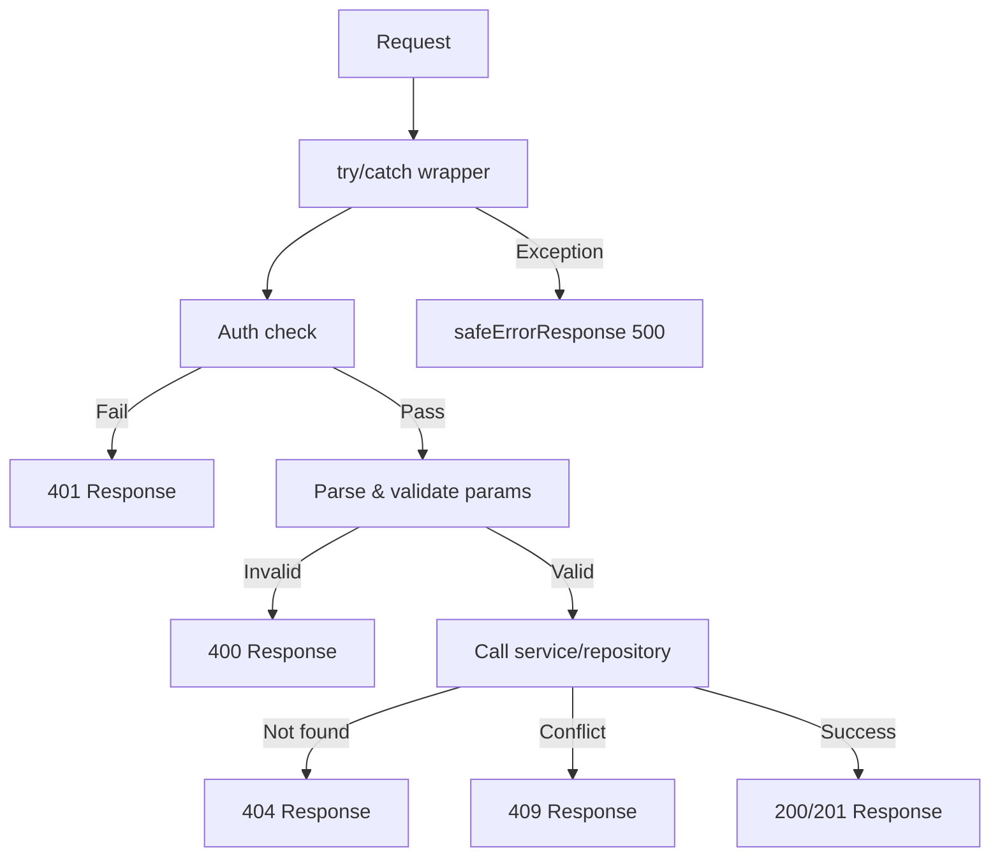

# API 响应模式

所有 API 路由都遵循一致的响应约定：成功/错误的可区分联合类型、环境感知错误消息、标准 HTTP 状态代码和 Swagger/JSDoc 文档。本页涵盖了每种模式。

## 响应类型系统

### 受歧视联盟 (`lib/api/types.ts`)

API 响应使用 `success` 布尔值作为判别式：

```typescript
export type ApiResponse<T = unknown> =
  | { success: true; data: T; total?: number; page?: number; limit?: number; totalPages?: number }
  | { success: false; error: string };
```

这允许调用者安全地缩小类型：

```typescript
const response: ApiResponse<User[]> = await fetchUsers();
if (response.success) {
  // TypeScript knows: response.data is User[]
  console.log(response.data);
} else {
  // TypeScript knows: response.error is string
  console.error(response.error);
}
```

### 分页响应

列表端点使用专用的分页包装器：

```typescript
export type PaginatedResponse<T> =
  | {
      success: true;
      data: T[];
      meta: {
        page: number;
        totalPages: number;
        total: number;
        limit: number;
      };
    }
  | { success: false; error: string };
```

### 错误类型

```typescript
export interface ApiError {
  message: string;
  status?: number;
  code?: string;
}

export interface ErrorResponse {
  success: false;
  error: string;
}
```

## 标准响应形状

### 成功回应

#### 单一资源

```typescript
return NextResponse.json({
  success: true,
  item,
  message: "Item created successfully",
}, { status: 201 });
```

#### 带分页的列表

```typescript
return NextResponse.json({
  success: true,
  items: result.items,
  total: result.total,
  page: result.page,
  limit: result.limit,
  totalPages: result.totalPages,
});
```

#### 动作确认

```typescript
return NextResponse.json({
  success: true,
  message: "Profile updated successfully",
});
```

### 错误响应

所有错误响应均包含 `success: false` 和 `error` 字符串：

```typescript
// Unauthorized
return NextResponse.json(
  { success: false, error: "Unauthorized. Admin access required." },
  { status: 401 }
);

// Validation error
return NextResponse.json(
  { success: false, error: "Invalid page parameter. Must be a positive integer." },
  { status: 400 }
);

// Conflict
return NextResponse.json(
  { success: false, error: `Item with slug '${slug}' already exists` },
  { status: 409 }
);
```

## HTTP 状态代码约定

|状态|用途|示例|
|--------|-------|---------|
| `200` |成功的 GET、PUT、PATCH、DELETE|列出项目，更新个人资料|
| `201` |成功 POST（已创建资源）|创建项目、创建评论|
| `400` |参数或正文无效|分页错误，缺少必填字段|
| `401` |需要身份验证或身份验证失败|缺少会话，非管理员用户|
| `404` |找不到资源|未找到项目，未找到配置文件|
| `409` |冲突（重复资源）|重复的项目 ID 或 slug|
| `413` |请求正文太大|身体超过 `readBodyWithLimit` 最大值|
| `500` |服务器内部错误|未处理的异常|

## 安全错误响应 (`lib/utils/api-error.ts`)

### `safeErrorResponse`

通过在生产中显示通用消息和在开发中显示详细消息来防止信息泄露：

```typescript
export function safeErrorResponse(
  error: unknown,
  fallbackMessage: string,
  status: number = 500
): NextResponse {
  const detail = error instanceof Error ? error.message : String(error);

  // Always log full details server-side
  console.error(`[API Error] ${fallbackMessage}:`, detail);

  const message = process.env.NODE_ENV === "development" ? detail : fallbackMessage;

  return NextResponse.json({ success: false, error: message }, { status });
}
```

在路由处理程序中的用法：

```typescript
export async function GET(request: NextRequest) {
  try {
    // ... handler logic
  } catch (error) {
    return safeErrorResponse(error, 'Failed to fetch items');
  }
}
```

### `safeErrorMessage`

提取安全消息字符串而不创建`NextResponse`：

```typescript
export function safeErrorMessage(error: unknown, fallbackMessage: string): string {
  if (process.env.NODE_ENV === "development") {
    return error instanceof Error ? error.message : String(error);
  }
  return fallbackMessage;
}
```

### 环境行为

|环境|错误输出|服务器日志|
|-------------|-------------|------------|
|发展|`error.message`（完整细节）|已记录完整错误|
|生产|`fallbackMessage`（通用）|已记录完整错误|

## 路由处理程序结构

所有 API 路由处理程序都遵循一致的结构：



### 规范 GET 处理程序示例

```typescript
export async function GET(request: NextRequest) {
  try {
    // 1. Auth check
    const session = await auth();
    if (!session?.user?.isAdmin) {
      return NextResponse.json(
        { success: false, error: "Unauthorized. Admin access required." },
        { status: 401 }
      );
    }

    // 2. Parse and validate parameters
    const { searchParams } = new URL(request.url);
    const paginationResult = validatePaginationParams(searchParams);
    if ('error' in paginationResult) {
      return NextResponse.json(
        { success: false, error: paginationResult.error },
        { status: paginationResult.status }
      );
    }

    // 3. Call service layer
    const result = await repository.findAll(paginationResult);

    // 4. Return structured response
    return NextResponse.json({
      success: true,
      items: result.items,
      total: result.total,
      page: result.page,
      limit: result.limit,
      totalPages: result.totalPages,
    });

  } catch (error) {
    return safeErrorResponse(error, 'Failed to fetch items');
  }
}
```

### 规范 POST 处理程序示例

```typescript
export async function POST(request: NextRequest) {
  try {
    // 1. Auth check
    const session = await auth();
    if (!session?.user?.isAdmin) {
      return NextResponse.json(
        { success: false, error: "Unauthorized." },
        { status: 401 }
      );
    }

    // 2. Parse and validate body
    const body = await request.json();
    if (!body.name || !body.description) {
      return NextResponse.json(
        { success: false, error: "Name and description are required" },
        { status: 400 }
      );
    }

    // 3. Check for conflicts
    const existing = await repository.findBySlug(body.slug);
    if (existing) {
      return NextResponse.json(
        { success: false, error: `Resource with slug '${body.slug}' already exists` },
        { status: 409 }
      );
    }

    // 4. Create resource
    const item = await repository.create(body);

    // 5. Return created resource
    return NextResponse.json({
      success: true,
      item,
      message: "Created successfully",
    }, { status: 201 });

  } catch (error) {
    return safeErrorResponse(error, 'Failed to create resource');
  }
}
```

## Swagger / JSDoc 文档

API 路由使用自动生成的 API 文档的内联 Swagger 注释进行记录：

```typescript
/**
 * @swagger
 * /api/admin/items:
 *   get:
 *     tags: ["Admin - Items"]
 *     summary: "Get paginated items list"
 *     security:
 *       - sessionAuth: []
 *     parameters:
 *       - name: "page"
 *         in: "query"
 *         schema:
 *           type: integer
 *           minimum: 1
 *           default: 1
 *     responses:
 *       200:
 *         description: "Items list retrieved successfully"
 *       400:
 *         description: "Bad request"
 *       401:
 *         description: "Unauthorized"
 *       500:
 *         description: "Internal server error"
 */
```

## 客户端 API 类型

API 客户端配置和获取选项：

```typescript
export interface ApiClientConfig extends Partial<AxiosRequestConfig> {
  baseURL?: string;
  timeout?: number;
  headers?: Record<string, string>;
  accessToken?: string;
  frontendUrl?: string;
}

export interface FetchOptions {
  method?: 'GET' | 'POST' | 'PUT' | 'PATCH' | 'DELETE';
  headers?: Record<string, string>;
  body?: unknown;
  params?: Record<string, string | number | boolean | undefined>;
}
```

## 公约概要

|公约|描述|
|------------|-------------|
|所有回复均包含`success`|类型安全的可区分联合|
|错误使用`{ success: false, error: string }`|一致的错误形状|
|`safeErrorResponse` 包装 catch 块|环境感知错误屏蔽|
|分页使用`total`、`page`、`limit`、`totalPages`|一致的元数据|
|验证检查是第一个操作|快速失败模式|
|验证失败后尽早返回|没有嵌套条件|
|所有管理路由上的 Swagger 注释|自动生成的API文档|
