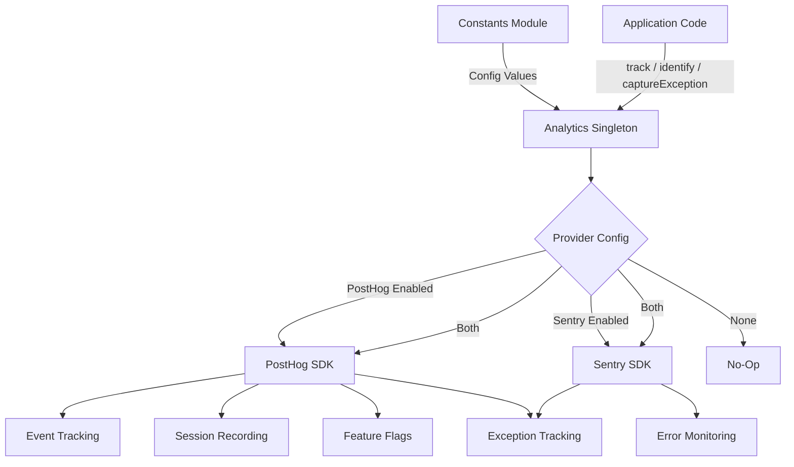
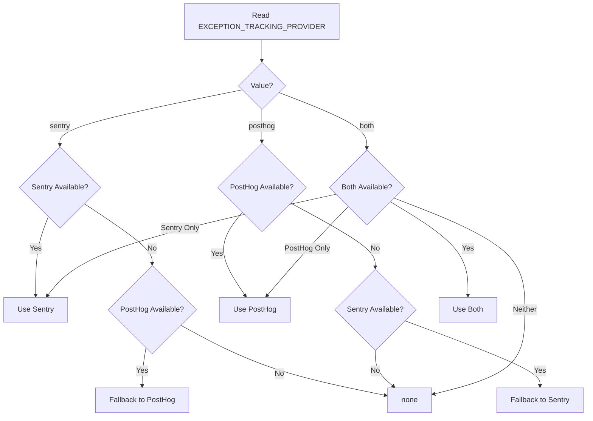

# Аналитический модуль

Модуль аналитики (`template/lib/analytics/`) предоставляет унифицированный одноэлементный класс для отслеживания событий на стороне клиента, идентификации пользователя, оценки флагов функций и отслеживания исключений. Он объединяет **PostHog** для анализа продуктов и **Sentry** для мониторинга ошибок с поддержкой использования любого поставщика по отдельности, обоих одновременно или ни одного из них.

## Обзор архитектуры



## Исходные файлы

|Файл|Описание|
|------|-------------|
|`lib/analytics/index.ts`|`Analytics` одноэлементный класс и экспорт `analytics`|

## Основной класс: `Analytics`

Класс `Analytics` — это синглтон, который обертывает PostHog и Sentry. Вызов на стороне сервера безопасен — все методы автоматически возвращаются, если `window` не определено.

### Определения типов

```typescript
type EventProperties = Properties;          // PostHog Properties type
type UserProperties = Record<string, any>;
type ExceptionTrackingProvider = 'sentry' | 'posthog' | 'both' | 'none';
```

### Синглтон-доступ

```typescript
// Get the singleton instance
const analytics = Analytics.getInstance();

// Or use the pre-created export
import { analytics } from '@/lib/analytics';
```

### `init(): void`

Инициализирует PostHog с централизованной конфигурацией и настраивает отслеживание исключений. Должен быть вызван один раз на стороне клиента (обычно в корневом макете или компоненте поставщика).

```typescript
// In your root layout or PostHog provider
'use client';
import { analytics } from '@/lib/analytics';

useEffect(() => {
  analytics.init();
}, []);
```

**Поведение:**
- Пропускает инициализацию, если она уже инициализирована или выполняется на стороне сервера.
- Считывает конфигурацию из констант (`POSTHOG_KEY`, `POSTHOG_HOST`, `POSTHOG_ENABLED` и т. д.)
- Настраивает запись сеанса с маскированием, когда `POSTHOG_SESSION_RECORDING_ENABLED` имеет значение true
- Применяет частоту дискретизации (`POSTHOG_SAMPLE_RATE`) — в производственной версии по умолчанию 10 %.
- Устанавливает глобальные обработчики `window.onerror` и `unhandledrejection`, когда включено отслеживание исключений PostHog.
- Связывает PostHog с Sentry, когда оба провайдера активны

### `identify(userId: string, properties?: UserProperties): void`

Связывает текущего анонимного пользователя с идентифицированным идентификатором пользователя. Также устанавливает пользовательский контекст Sentry, когда Sentry включен.

```typescript
analytics.identify(session.user.id, {
  email: session.user.email,
  plan: 'premium',
});
```

### `reset(): void`

Сбрасывает текущую идентификацию пользователя (например, при выходе из системы). Очищает пользовательский контекст PostHog и Sentry.

```typescript
analytics.reset();
```

### `track(eventName: string, properties?: EventProperties): void`

Перехватывает пользовательское событие в PostHog.

```typescript
analytics.track('item_submitted', {
  itemId: 'abc-123',
  category: 'SaaS Tools',
});
```

### `trackPageView(url: string, properties?: EventProperties): void`

Вручную фиксирует событие просмотра страницы. Используйте, когда `POSTHOG_AUTO_CAPTURE` отключен и вам необходимо явное отслеживание просмотров страниц.

```typescript
analytics.trackPageView(window.location.href, {
  referrer: document.referrer,
});
```

### `isFeatureEnabled(flagKey: string, defaultValue?: boolean): boolean`

Синхронно оценивает флаг функции PostHog.

```typescript
const showNewUI = analytics.isFeatureEnabled('new-dashboard-ui', false);
```

### `reloadFeatureFlags(): Promise<void>`

Принудительно выполняет повторную выборку флагов функций с сервера PostHog.

```typescript
await analytics.reloadFeatureFlags();
```

### `captureException(error: Error | string, context?: Record<string, any>): void`

Унифицированное отслеживание исключений, которое отправляется настроенным поставщикам.

```typescript
try {
  await riskyOperation();
} catch (error) {
  analytics.captureException(error, {
    component: 'PaymentForm',
    action: 'submit',
  });
}
```

**Маршрутизация поставщика:**
- `'posthog'` — отправляет событие `$exception` в PostHog с трассировкой стека.
- `'sentry'` -- Вызывает `Sentry.captureException` с дополнительным контекстом.
- `'both'` -- Отправляет обоим провайдерам
- `'none'` -- Тихо сбрасывает

### `captureError(error: Error, context?: Record<string, any>): void`

**Устарело.** Псевдоним для `captureException`. Регистрирует предупреждение об устаревании.

### `getExceptionTrackingProvider(): ExceptionTrackingProvider`

Возвращает текущего активного поставщика отслеживания исключений.

### `setUserProperties(properties: UserProperties): void`

Устанавливает постоянные свойства пользователя в профиле пользователя PostHog через `posthog.people.set()`.

```typescript
analytics.setUserProperties({
  subscription_tier: 'premium',
  company: 'Acme Corp',
});
```

### `setSuperProperties(properties: Record<string, any>): void`

Регистрирует суперсвойства, отправляемые с каждым последующим событием через `posthog.register()`.

```typescript
analytics.setSuperProperties({
  app_version: '2.1.0',
  environment: 'production',
});
```

## Константы конфигурации

Вся конфигурация аналитики управляется константами из `lib/constants.ts`:

|Константа|По умолчанию|Описание|
|----------|---------|-------------|
|`POSTHOG_KEY`|окружающая переменная|Ключ API проекта PostHog|
|`POSTHOG_HOST`|окружающая переменная|URL-адрес хоста API PostHog|
|`POSTHOG_ENABLED`|производный|Истинно, если установлены и ключ, и хост.|
|`POSTHOG_DEBUG`|окружающая переменная|Включить ведение журнала отладки PostHog|
|`POSTHOG_SESSION_RECORDING_ENABLED`|`'true'`|Включить запись сеанса|
|`POSTHOG_AUTO_CAPTURE`|`'false'`|Автоматический захват просмотров страниц|
|`POSTHOG_SAMPLE_RATE`|`0.1` (продюсер) / `1.0` (разработчик)|Частота выборки событий|
|`POSTHOG_SESSION_RECORDING_SAMPLE_RATE`|`0.1` (продюсер) / `1.0` (разработчик)|Частота дискретизации записи|
|`EXCEPTION_TRACKING_PROVIDER`|`'both'`|Какой провайдер обрабатывает исключения|
|`SENTRY_ENABLED`|производный|Истинно, если установлен DSN и env позволяет|

## Разрешение поставщика отслеживания исключений

Поставщик определяется во время создания с использованием резервной логики:



## Использование с Next.js

Типичная интеграция в проекте Next.js App Router:

```tsx
// app/providers.tsx
'use client';
import { useEffect } from 'react';
import { analytics } from '@/lib/analytics';
import { useSession } from 'next-auth/react';
import { usePathname } from 'next/navigation';

export function AnalyticsProvider({ children }: { children: React.ReactNode }) {
  const { data: session } = useSession();
  const pathname = usePathname();

  useEffect(() => {
    analytics.init();
  }, []);

  useEffect(() => {
    if (session?.user?.id) {
      analytics.identify(session.user.id, {
        email: session.user.email,
      });
    }
  }, [session]);

  useEffect(() => {
    analytics.trackPageView(pathname);
  }, [pathname]);

  return <>{children}</>;
}
```
