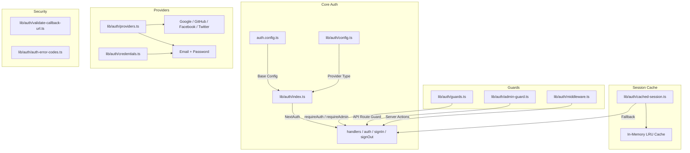
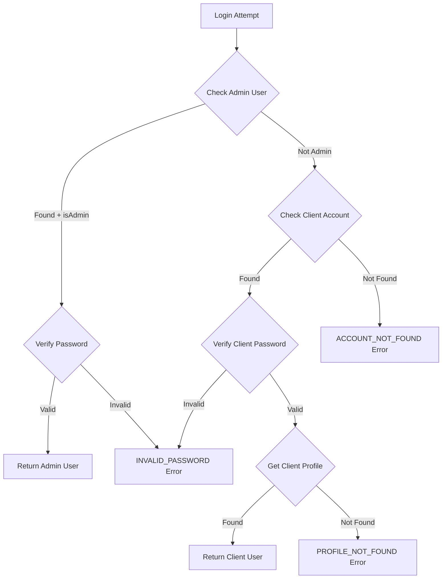

# Модуль утилит аутентификации

Модуль утилит аутентификации (`template/lib/auth/`) обеспечивает комплексный уровень аутентификации, построенный на NextAuth.js (Auth.js) с поддержкой нескольких провайдеров, кэшированием сеансов, защитой на стороне сервера, проверяемыми действиями сервера и Supabase в качестве альтернативного бэкэнда аутентификации.

## Обзор архитектуры



## Исходные файлы

|Файл|Описание|
|------|-------------|
|`lib/auth/index.ts`|Конфигурация NextAuth.js с адаптером Drizzle|
|`lib/auth/config.ts`|Конфигурация типа поставщика аутентификации|
|`lib/auth/credentials.ts`|Поставщик учетных данных электронной почты/пароля|
|`lib/auth/providers.ts`|Фабрика поставщиков OAuth|
|`lib/auth/guards.ts`|Защита страниц на стороне сервера|
|`lib/auth/admin-guard.ts`|Защита администратора маршрута API|
|`lib/auth/middleware.ts`|Проверенное промежуточное программное обеспечение для действий сервера|
|`lib/auth/cached-session.ts`|Уровень кэширования сеанса|
|`lib/auth/session-cache.ts`|Реализация кэша|
|`lib/auth/validate-callback-url.ts`|Проверка URL-адреса перенаправления|
|`lib/auth/auth-error-codes.ts`|Перечисление кодов ошибок|
|`lib/auth/supabase/`|Клиент/сервер/промежуточное программное обеспечение аутентификации Supabase|

## Конфигурация NextAuth.js (`index.ts`)

Основной экспорт предоставляет стандартный интерфейс NextAuth.js:

```typescript
import { auth, signIn, signOut, handlers, unstable_update } from '@/lib/auth';
```

### Стратегия сессии

- **Стратегия:** JWT (не сеансы базы данных)
- **Максимальный возраст:** 30 дней
- **Возраст обновления:** 24 часа (интервал обновления сеанса)

### Обратный вызов JWT

Обратный вызов JWT дополняет токены:
- `userId` -- из пользовательского объекта или токена `sub`
- `clientProfileId` — создается автоматически для пользователей OAuth при первом входе в систему.
- `isAdmin` -- определяется флагами `isClient`/`isAdmin` или значениями по умолчанию `false`
- `provider` -- имя провайдера аутентификации.

### Обратный вызов сеанса

Обратный вызов сеанса сопоставляет поля JWT с объектом сеанса:
- `session.user.id`
- `session.user.clientProfileId`
- `session.user.provider`
- `session.user.isAdmin`

### Пользовательские страницы

```typescript
pages: {
  signIn: '/auth/signin',
  signOut: '/auth/signout',
  error: '/auth/error',
  verifyRequest: '/auth/verify-request',
  newUser: '/auth/register',
}
```

### События

- **signOut** – делает недействительным кэш сеанса пользователя.
- **updateUser** — аннулирует кэш сеанса при изменении пользовательских данных.

## Конфигурация аутентификации (`config.ts`)

### `AuthProviderType`

```typescript
type AuthProviderType = 'supabase' | 'next-auth' | 'both';
```

### `AuthConfig`

```typescript
interface AuthConfig {
  provider: AuthProviderType;
  supabase?: {
    url: string;
    anonKey: string;
    redirectUrl?: string;
  };
  nextAuth?: {
    enableCredentials?: boolean;
    enableOAuth?: boolean;
    providers?: any[];
  };
}
```

### `getAuthConfig(): AuthConfig`

Разрешает конфигурацию с этим приоритетом:
1. Глобальное переопределение через `configureAuth()`
2. Обнаружение на основе среды (наличие URL-адреса/ключа Supabase)
3. По умолчанию: `next-auth` с учетными данными и включенным OAuth.

## Поставщик учетных данных (`credentials.ts`)

### Функции пароля

```typescript
async function hashPassword(password: string): Promise<string>;
// Uses bcryptjs with 10 salt rounds, loaded via dynamic import

async function comparePasswords(plainText: string, hashed: string | null): Promise<boolean>;
// Returns false if hashed is null
```

### Поток аутентификации



### `AuthProviders` Перечисление

```typescript
enum AuthProviders {
  CREDENTIALS = 'credentials',
  GOOGLE = 'google',
  FACEBOOK = 'facebook',
  GITHUB = 'github',
  TWITTER = 'twitter',
  X = 'x',
  MICROSOFT = 'microsoft',
}
```

## Поставщики OAuth (`providers.ts`)

### `createNextAuthProviders(config?): Provider[]`

Динамически создает экземпляры провайдера NextAuth на основе конфигурации:

```typescript
import { createNextAuthProviders } from '@/lib/auth/providers';

const providers = createNextAuthProviders({
  google: { enabled: true, clientId: '...', clientSecret: '...' },
  github: { enabled: true, clientId: '...', clientSecret: '...' },
  credentials: { enabled: true },
});
```

Поддерживаемые поставщики: **Google**, **GitHub**, **Facebook**, **Twitter**, **Credentials**.

## Серверная защита (`guards.ts`)

### `requireAuth(): Promise<Session>`

Требует аутентификации. Перенаправляет на `/auth/signin`, если не прошел аутентификацию.

```typescript
export default async function ProtectedPage() {
  const session = await requireAuth();
  return <div>Welcome {session.user.email}</div>;
}
```

### `requireAdmin(): Promise<Session>`

Требуется роль администратора. Перенаправляет на `/admin/auth/signin`, если не авторизован, `/unauthorized`, если не администратор.

```typescript
export default async function AdminPage() {
  const session = await requireAdmin();
  return <div>Admin Dashboard</div>;
}
```

### `getSession(): Promise<Session | null>`

Получает текущий сеанс без перенаправления. Возвращает `null` для неаутентифицированных пользователей.

### `checkIsAdmin(): Promise<boolean>`

Проверяет статус администратора без перенаправления.

## API Route Guard (`admin-guard.ts`)

### `checkAdminAuth(): Promise<NextResponse | null>`

Возвращает `null`, если авторизовано, или ошибку `NextResponse` (401/403/500), если нет:

```typescript
export async function GET() {
  const authError = await checkAdminAuth();
  if (authError) return authError;
  // ... handle authorized request
}
```

### `withAdminAuth(handler): handler`

Функция высшего порядка, которая оборачивает обработчики маршрутов API:

```typescript
import { withAdminAuth } from '@/lib/auth/admin-guard';

export const GET = withAdminAuth(async (request) => {
  // Only reached if user is authenticated admin
  return NextResponse.json({ data: await getAdminData() });
});
```

## Проверенные действия сервера (`middleware.ts`)

### `validatedAction(schema, action)`

Обертывает действие сервера проверкой Zod:

```typescript
import { validatedAction } from '@/lib/auth/middleware';
import { z } from 'zod';

const schema = z.object({ name: z.string().min(1), email: z.string().email() });

export const updateProfile = validatedAction(schema, async (data, formData) => {
  await db.update(users).set(data);
  return { success: 'Profile updated' };
});
```

### `validatedActionWithUser(schema, action)`

То же, что и выше, но также проверяет аутентификацию и вводит пользователя:

```typescript
export const submitItem = validatedActionWithUser(schema, async (data, formData, user) => {
  await db.insert(items).values({ ...data, userId: user.id });
  return { success: 'Item submitted' };
});
```

### `ActionState` Тип

```typescript
type ActionState = {
  error?: string;
  success?: string;
  redirect?: string;
  [key: string]: any;
};
```

## Кэширование сеанса (`cached-session.ts`)

Снижает затраты на аутентификацию за счет кэширования декодированных сеансов в памяти.

### `getCachedSession(request?): Promise<Session | null>`

```typescript
import { getCachedSession } from '@/lib/auth/cached-session';

// In server components
const session = await getCachedSession();

// In API routes (pass request for token extraction)
const session = await getCachedSession(request);
```

### `invalidateSessionCache(token?, userId?): Promise<void>`

Делает недействительными кэшированные сеансы по токену или идентификатору пользователя.

### `clearSessionCache(): void`

Очищает все кэшированные сеансы (для развертываний или критических обновлений).

### Извлечение токенов

Токены извлекаются из запросов в следующем порядке:
1. `next-auth.session-token` или `__Secure-next-auth.session-token` cookie
2. `Authorization: Bearer <token>` заголовок
3. `X-Session-Token` пользовательский заголовок

## Коды ошибок (`auth-error-codes.ts`)

```typescript
enum AuthErrorCode {
  ACCOUNT_NOT_FOUND = 'ACCOUNT_NOT_FOUND',
  INVALID_PASSWORD = 'INVALID_PASSWORD',
  PROFILE_NOT_FOUND = 'PROFILE_NOT_FOUND',
  GENERIC_ERROR = 'GENERIC_ERROR',
  RATE_LIMITED = 'RATE_LIMITED',
  USE_OAUTH_PROVIDER = 'USE_OAUTH_PROVIDER',
  SESSION_REFRESH_FAILED = 'SESSION_REFRESH_FAILED',
  PAGE_REFRESH_FAILED = 'PAGE_REFRESH_FAILED',
}
```

## Проверка URL обратного вызова (`validate-callback-url.ts`)

### `isValidCallbackUrl(url: string | null): boolean`

Предотвращает открытые уязвимости перенаправления:

```typescript
isValidCallbackUrl('/admin/items')       // true
isValidCallbackUrl('/client/dashboard')  // true
isValidCallbackUrl('https://evil.com')   // false
isValidCallbackUrl('//evil.com')         // false
```

### `getSafeRedirectPath(callbackUrl, fallbackPath): string`

Возвращает URL-адрес обратного вызова, если он действителен, в противном случае — резервный путь.

### `createSafeCallbackUrl(pathname, search?): string`

Создает URL-адрес обратного вызова, ограниченный 2048 символами, чтобы предотвратить загрязнение параметров.
