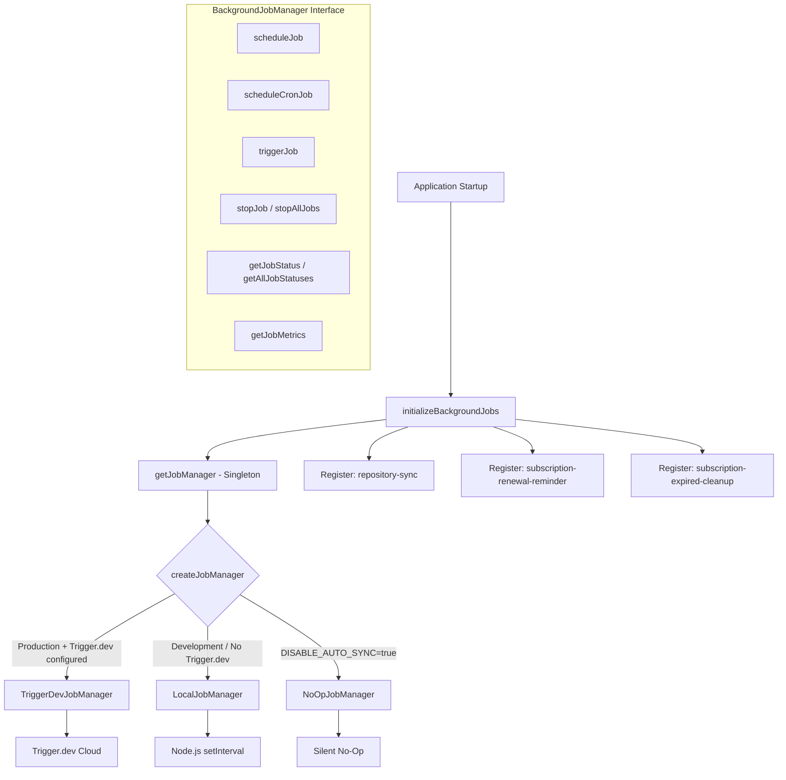
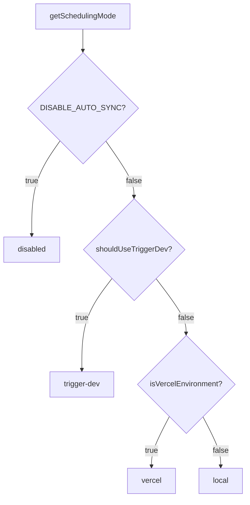

# Модуль фоновых заданий

Модуль фоновых заданий (`template/lib/background-jobs/`) предоставляет уровень абстракции для планирования и выполнения повторяющихся задач. Он поддерживает три стратегии выполнения: **Trigger.dev** для рабочей среды, **локальный `setInterval`** для разработки и режим **no-op** для полного отключения заданий, выбираемый автоматически в зависимости от конфигурации среды.

## Обзор архитектуры



## Исходные файлы

|Файл|Описание|
|------|-------------|
|`lib/background-jobs/types.ts`|Определения интерфейса и типов|
|`lib/background-jobs/config.ts`|Конфигурация Trigger.dev и определение режима планирования|
|`lib/background-jobs/job-factory.ts`|Фабричная функция и менеджер синглтонов|
|`lib/background-jobs/local-job-manager.ts`|`LocalJobManager` реализация|
|`lib/background-jobs/trigger-dev-job-manager.ts`|`TriggerDevJobManager` реализация|
|`lib/background-jobs/noop-job-manager.ts`|`NoOpJobManager` реализация|
|`lib/background-jobs/initialize-jobs.ts`|Регистрация вакансии при запуске приложения|
|`lib/background-jobs/index.ts`|Экспорт стволов|

## Определения типов

### `BackgroundJobManager` Интерфейс

```typescript
interface BackgroundJobManager {
  scheduleJob(id: string, name: string, job: () => void | Promise<void>, interval: number): void;
  scheduleCronJob(id: string, name: string, job: () => void | Promise<void>, cronExpression: string): void;
  triggerJob(id: string): Promise<void>;
  stopJob(id: string): void;
  stopAllJobs(): void;
  getJobStatus(id: string): JobStatus | undefined;
  getAllJobStatuses(): JobStatus[];
  getJobMetrics(): JobMetrics;
}
```

### `JobStatus`

```typescript
type JobStatusType = 'running' | 'completed' | 'failed' | 'scheduled' | 'stopped';

interface JobStatus {
  id: string;
  name: string;
  status: JobStatusType;
  lastRun: Date | null;
  nextRun: Date | null;
  duration: number;     // Last execution duration in ms
  error?: string;       // Error message if status is 'failed'
}
```

### `JobMetrics`

```typescript
interface JobMetrics {
  totalExecutions: number;       // Total invocations (not unique jobs)
  successfulJobs: number;
  failedJobs: number;
  averageJobDuration: number;    // Rolling average in ms
  lastCleanup: Date;
}
```

### `TriggerDevConfig`

```typescript
interface TriggerDevConfig {
  enabled: boolean;
  apiKey?: string;
  apiUrl?: string;
  environment: string;
  isFullyConfigured: boolean;
  isPartiallyConfigured: boolean;
}
```

### `SchedulingMode`

```typescript
type SchedulingMode = 'trigger-dev' | 'vercel' | 'local' | 'disabled';
```

## Функции конфигурации

### `getTriggerDevConfig(): TriggerDevConfig`

Считывает настройки Trigger.dev из ConfigService.

### `shouldUseTriggerDev(): boolean`

Возвращает `true`, когда Trigger.dev полностью настроен, включен и среда является рабочей.

### `getSchedulingMode(): SchedulingMode`

Определяет, какая система планирования должна быть активной, используя этот приоритет:



## Фабрика и Синглтон

### `createJobManager(): BackgroundJobManager`

Создает соответствующий менеджер заданий на основе среды:

```typescript
import { createJobManager } from '@/lib/background-jobs';

const manager = createJobManager();
// Returns: TriggerDevJobManager | LocalJobManager | NoOpJobManager
```

### `getJobManager(): BackgroundJobManager`

Возвращает экземпляр синглтона, создавая его при первом вызове:

```typescript
import { getJobManager } from '@/lib/background-jobs';

const manager = getJobManager();
manager.scheduleJob('my-job', 'My Job', async () => {
  await doWork();
}, 60_000);
```

### `resetJobManager(): void`

Останавливает все задания и уничтожает синглтон (полезно для тестирования):

```typescript
import { resetJobManager } from '@/lib/background-jobs';
resetJobManager();
```

## ЛокальныйJobManager

Использует Node.js `setInterval` для разработки и резервных сред.

**Основные модели поведения:**
- Пропускает выполнение, когда задание уже запущено (предотвращает перекрытие)
- Отслеживает показатели с продолжительностью скользящего среднего
- Преобразует выражения cron в интервалы посредством упрощенного сопоставления.
- Уменьшает ведение журнала консоли в режиме разработки.

### Сопоставление хрона с интервалом

|Шаблон Крон|Интервал|
|-------------|----------|
| `*/30 * * * * *` |30 секунд|
| `*/2 * * * *` |2 минуты|
| `*/5 * * * *` |5 минут|
| `*/15 * * * *` |15 минут|
| `0 * * * *` |1 час|
| `0 9 * * *` |24 часа|
|По умолчанию|1 минута|

## Триггердевджобменеджер

Регистрирует расписания с помощью API расписаний `@trigger.dev/sdk` v4. Локальные таймеры **не** выполняются — выполнением занимается рабочий процесс Trigger.dev.

**Основные модели поведения:**
- Ленивая загрузка `@trigger.dev/sdk` посредством динамического импорта
- Преобразует интервальные расписания в выражения cron.
- Отслеживает локальные метрики, когда задачи выполняются в рабочем контексте.
- `stopJob` / `stopAllJobs` только очистка локального состояния (удаленные расписания управляются Trigger.dev)

## NoOpJobManager

Все операции являются бесшумными и не требуют операций. Используется, когда `DISABLE_AUTO_SYNC=true` находится в разработке.

## Регистрация работы

Функция `initializeBackgroundJobs()` регистрирует все задания приложения при запуске:

```typescript
import { initializeBackgroundJobs } from '@/lib/background-jobs/initialize-jobs';

// Called once during app initialization
await initializeBackgroundJobs();
```

### Зарегистрированные вакансии

|Идентификатор вакансии|Расписание|Описание|
|--------|----------|-------------|
|`repository-sync`|Каждые 5 минут|Синхронизирует контент CMS на основе Git через `syncManager.performSync()`.|
|`subscription-renewal-reminder`|Ежедневно в 9:00|Отправляет напоминания о продлении подписок, срок действия которых истекает через 7 дней.|
|`subscription-expired-cleanup`|Ежедневно в полночь|Обрабатывает и истекает срок действия подписок после даты их окончания.|

**Важно!** Все обратные вызовы заданий используют динамический импорт, чтобы предотвратить объединение веб-пакетом модулей, специфичных для Node.js, во время сборки:

```typescript
manager.scheduleJob('repository-sync', 'Repository Synchronization', async () => {
  // Dynamic import prevents webpack bundling of isomorphic-git chain
  const { syncManager } = await import('@/lib/services/sync-service');
  await syncManager.performSync();
}, 5 * 60 * 1000);
```

## Примеры использования

### Планирование пользовательского задания

```typescript
import { getJobManager } from '@/lib/background-jobs';

const manager = getJobManager();

// Interval-based (every 10 minutes)
manager.scheduleJob('cleanup-temp', 'Temp File Cleanup', async () => {
  await cleanupTempFiles();
}, 10 * 60 * 1000);

// Cron-based (every hour)
manager.scheduleCronJob('hourly-report', 'Hourly Report', async () => {
  await generateReport();
}, '0 * * * *');
```

### Мониторинг заданий

```typescript
const manager = getJobManager();

// Check specific job
const status = manager.getJobStatus('repository-sync');
console.log(status?.status, status?.lastRun, status?.duration);

// List all jobs
const allStatuses = manager.getAllJobStatuses();

// Get aggregate metrics
const metrics = manager.getJobMetrics();
console.log(`Total: ${metrics.totalExecutions}, Failed: ${metrics.failedJobs}`);
```

### Ручной триггер

```typescript
const manager = getJobManager();
await manager.triggerJob('repository-sync');
```
